# [1989] 口袋伙伴：为什么 1989 年是移动/蜂窝电话终于走向大众的一年

**这是 Motorola MicroTAC 对阵 Nokia（Mobira）TalkMan 和 CityMan 的一年。**

**作者 Jesse Karjalainen**（不是会员？在你喜欢的所有社交平台关注我：[**YouTube**](https://www.youtube.com/@retrotechshow) | [**TikTok**](https://www.tiktok.com/@retrotechshow) | [**Substack**](https://substack.com/@retrotechshow) | [**Bluesky**](https://bsky.app/profile/retrotechshow.bsky.social) | [**Gumroad**](https://jessebooks.gumroad.com/)。）

…

人们是什么时候开始使用移动电话的？第一部移动电话是什么时候问世的？整个移动电话时代是什么时候开始的？这些都是合理的问题。然而，每一个问题都有不同的答案。

曾经有一部叫 Mobira "Senator" 的电话，它重 20 公斤，1982 年问世。今天，它的尺寸甚至无法满足飞机客舱手提行李的要求。尽管它被称作便携电话，并且是最早的一批移动电话之一。

接着是 Motorola DynaTAC，它经常被认为是第一部移动电话。它在 1983 年*被宣布*推出，但直到 1984 年末才真正开售。但它销量有限，因为买一辆摩托车比买一部 DynaTAC 还便宜。

相比之下，Mobira 已经推出了它的 ActionMan 系列电话，这一系列当时已降到了 4 公斤（8 磅）的重量。1983/84 年，它被重新命名为 Talkman。这些电话有两种型号，"大"号和"便携"号。它们的主要用途是作为车载电话，必要时可以拖到会议上去。

然后是"扁平型"的 Mobira TalkMan 510（1983 年）和 Talkman 520（1984 年）。它们同样是可充电的移动电话。

它们由两部分组成，并配有一根卷曲电话线，使其使用起来更实用。

Mobira 的所有这些"移动"电话都是在 DynaTAC 实际开售之前推出的。这意味着，从技术上讲，Motorola 才是商业市场上第一部一体式手持移动电话。如果你买得起的话。

## **Nokia-Mobira**

直到 1987 年，Nokia-Mobira 公司才发布了自己对标 DynaTAC 的产品。这就是 Mobira CityMan 900——一部真正的手持机。CityMan 品牌可追溯到 1983 年。

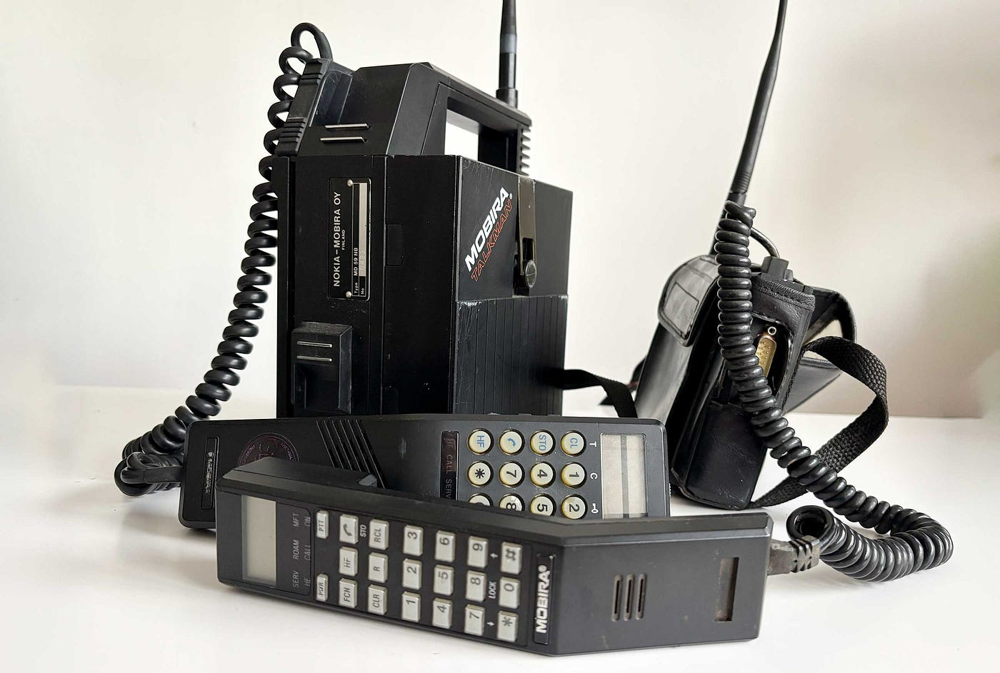
*最初的 Mobira TalkMan（左）是世界上最早的移动电话之一。图片版权 Jesse Karjalainen。*

它可以被看作是 Motorola 原版电话的山寨货，但当时的行业并非如此。没有任何公司拥有 DynaTAC 那种手持"外形规格"的权利，正如没有任何一家公司控制立式吸尘器一样。

与此同时，Mobira 持续生产其成功的 TalkMan 系列的各种版本。

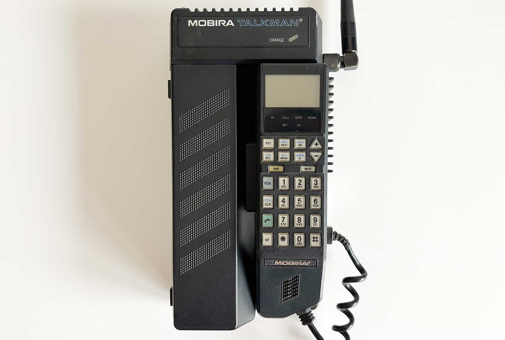
*TalkMan 为了追求额外的便携性，体积很快减半。图片版权 Jesse Karjalainen。*

扁平型 TalkMan 电话也是如此，至少持续生产到了 Talkman 610 和 620（1991 年）。

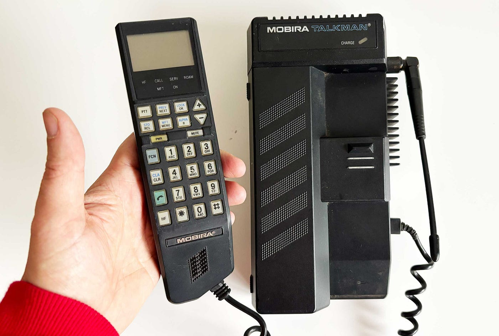
*像一部电话，但可以便携。图片版权 Jesse Karjalainen。*

"小"号 Talkman 从 1983 年的 Talkman 510 开始，每年都在变得更小。这些紧凑型号最终取代了"大"号 TalkMan 型号，后者一直生产到 1988 年。

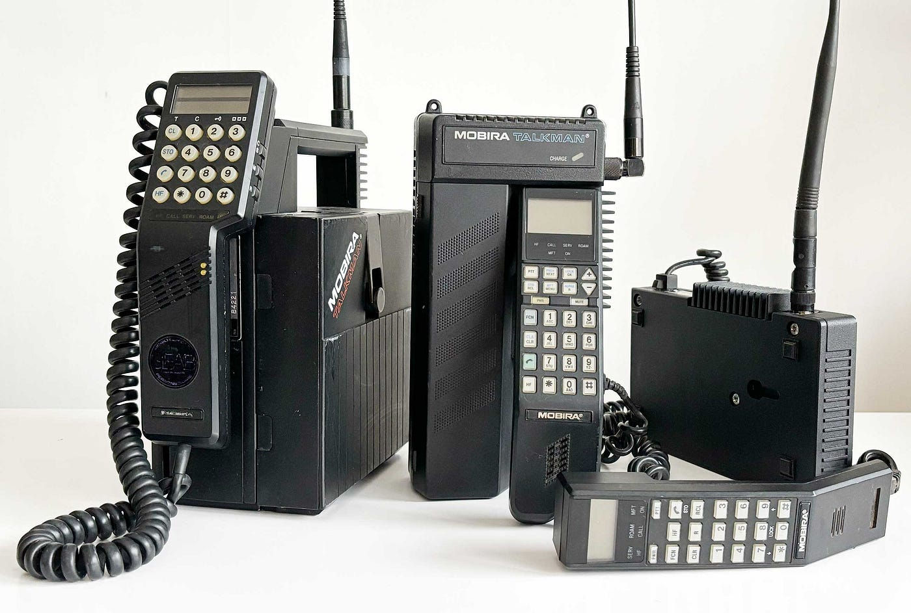
*三代 Mobira TalkMan 电话。图片版权 Jesse Karjalainen。*

我的收藏里有一部最小的型号之一。到这时它已经缩小到大约和最初 4 公斤 TalkMan 上的电池差不多大小。

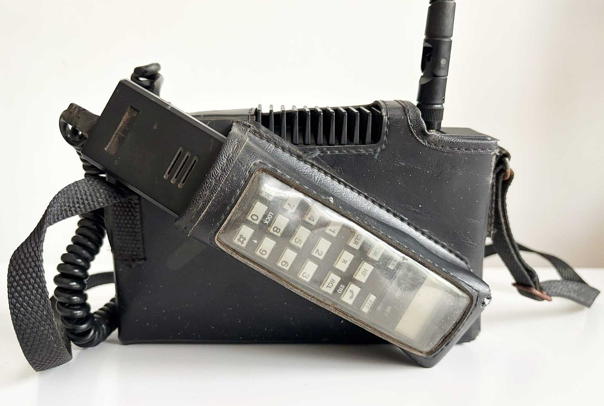
*像一只电子版的 Birkin 包。图片版权 Jesse Karjalainen。*

我搞不清楚它具体是什么型号。网上没有任何可靠的资料给出 ActionMan、TalkMan 和 CityMan 电话的正确（且完整）的时间线——更别说这个具体型号是什么了。

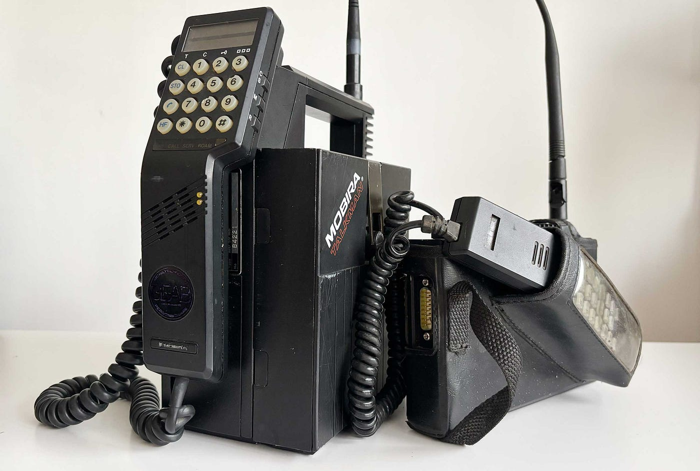
*只有最初 TalkMan 四分之一大小。图片版权 Jesse Karjalainen。*

然而，我在互联网上完全找不到关于这个型号的任何信息，所以我无法确切地告诉你这是什么。

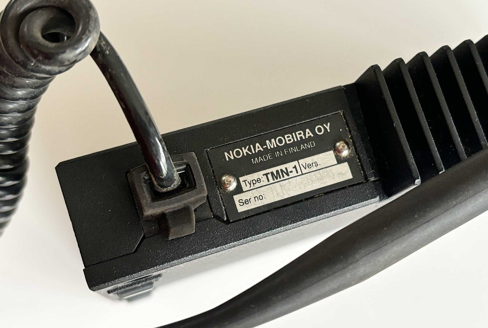
*这是什么型号？Nokia-Mobira TMN-1。图片版权 Jesse Karjalainen。*

收发器主机上的标签写着 "Type TMN-1"。当我在网上搜索这个，一家网站说它属于 1987 年的 TalkMan 620。但没有照片。

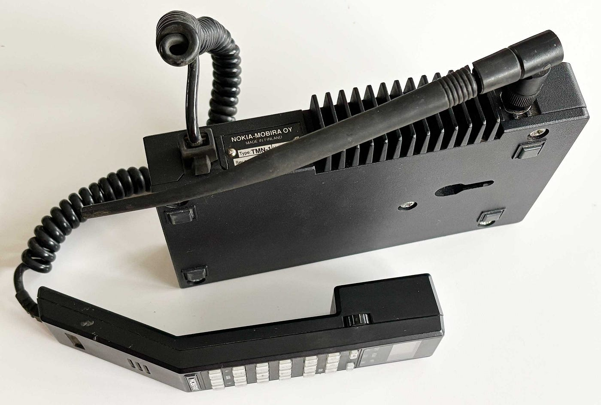
*一部未知的 Mobira 型号电话。图片版权 Jesse Karjalainen。*

当我搜索 TalkMan 620 时，得到了一堆相互矛盾的信息。（"一部 1992 年的电话"。）归根结底它是一部扁平型 Mobira——而这部电话显然不是。

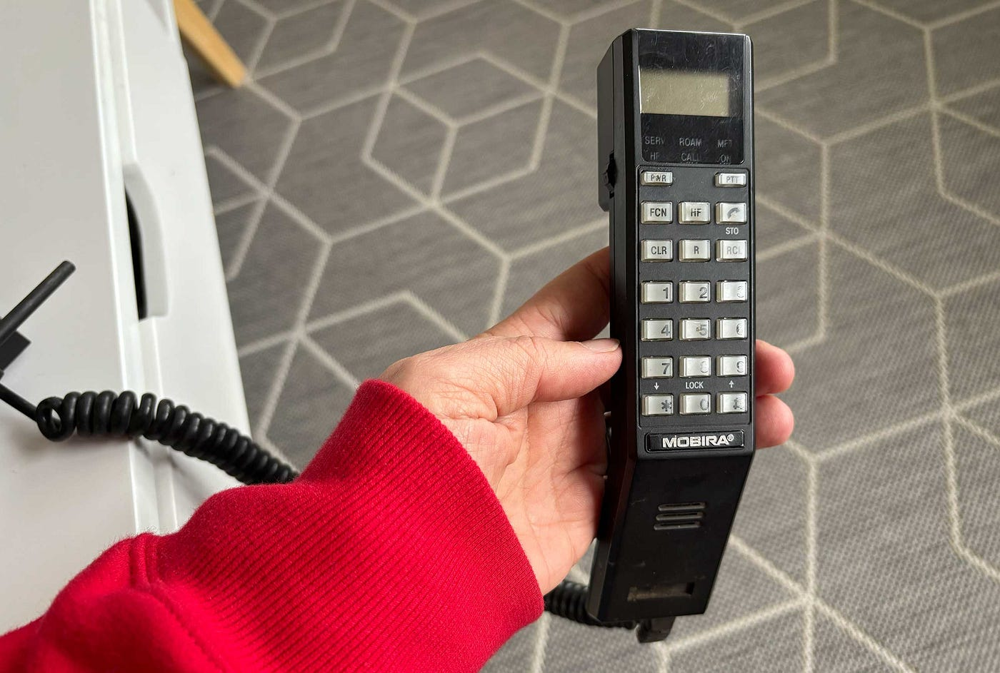
*来自芬兰的便携电话。图片版权 Jesse Karjalainen。*

同一部电话上的手柄写着："Type HSN-1XF"。当我搜索这个，被告知这是 Mobira CityMan 900 手持电话的型号标识符。这部电话也不是这个。

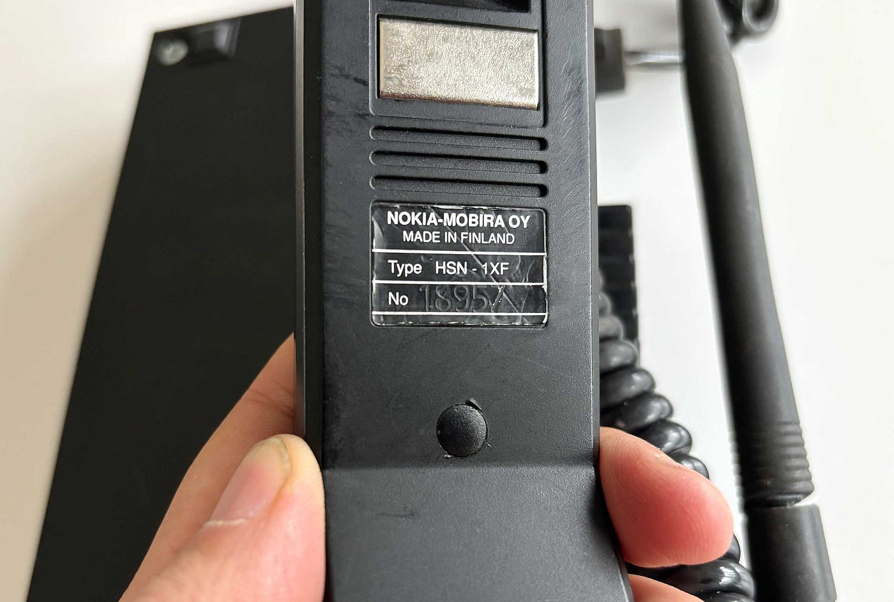
*手柄类型 Nokia-Mobira HSN-1XF。图片版权 Jesse Karjalainen。*

我不知道它是什么。算了，反正我才花了 8 美元。

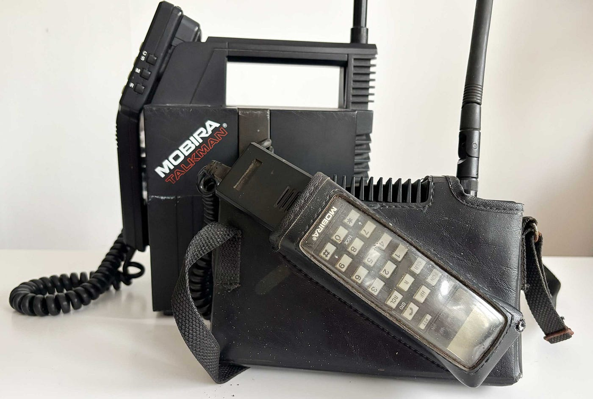
*一部神秘的 TalkMan 型号与一部原始型号并排放置。图片版权 Jesse Karjalainen。*

我要说，这部电话配有一个皮套和肩带。它的用法就像枪在枪套里一样。包牢牢地挂在你身上。然后你伸手拔出轻薄的手柄来通话。

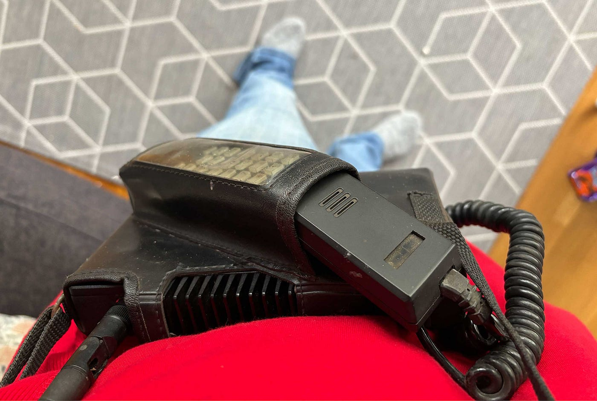
*1980 年代后期 Nokia Mobira 推出的超方便移动电话。图片版权 Jesse Karjalainen。*

当我把这四部 Mobira 电话并排摆在一起，小型化趋势就很明显了。未来是越来越小。

*三代 Mobira TalkMan 电话。图片版权 Jesse Karjalainen。*

## **1989：Motorola**

关于上面列出的所有不同型号和创新，最令人瞩目的一点是，在整个这段时间里，Motorola 没有推出任何新东西。他们一直让 DynaTAC 电话从 1985 年用到 1986 年、1987 年和 1988 年。难以置信。

直到 1989 年春天——正是 Tim Berners-Lee 写下他关于 World Wide Web 构想的那一刻——Motorola 才发布了这部已经六岁的电话的第一款继任者。他们确实拥有的一样东西是品牌知名度。

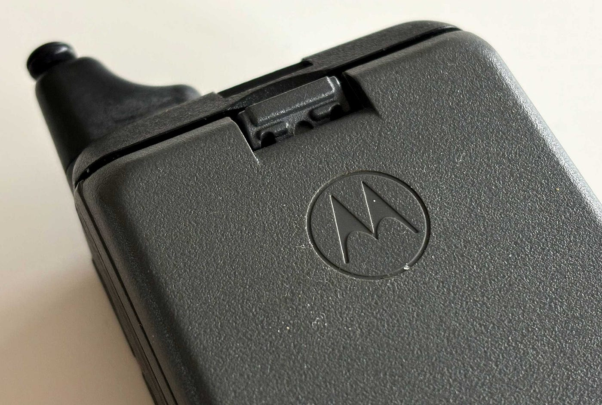
*Motorola 品牌。图片版权 Jesse Karjalainen。*

而且天哪，这是一部重磅炸弹般的电话。MicroTAC 大约只有其前任的一半大小。它不比一只栖在树上的知更鸟大。

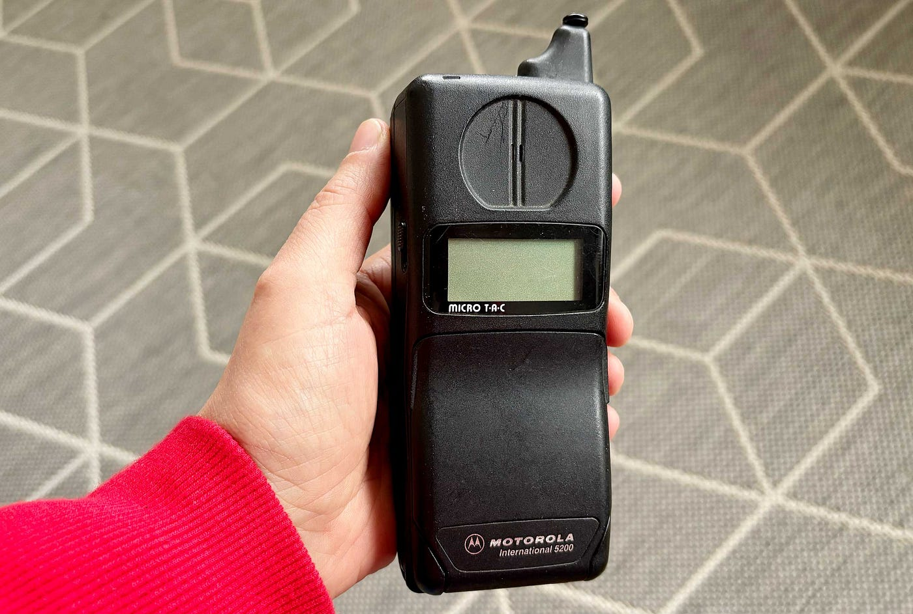
*大杀器——1989 年世界上最小的电话。图片版权 Jesse Karjalainen。*

这是 Motorola 又一项了不起的工程杰作。

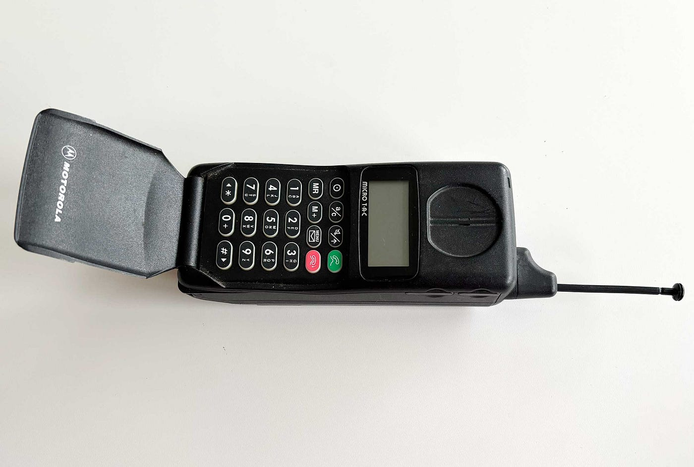
*一项工程壮举。图片版权 Jesse Karjalainen。*

DynaTAC 这个名字源自其描述，*Dynamic Total Area Coverage*。现在他们推出了 Micro TAC 电话。

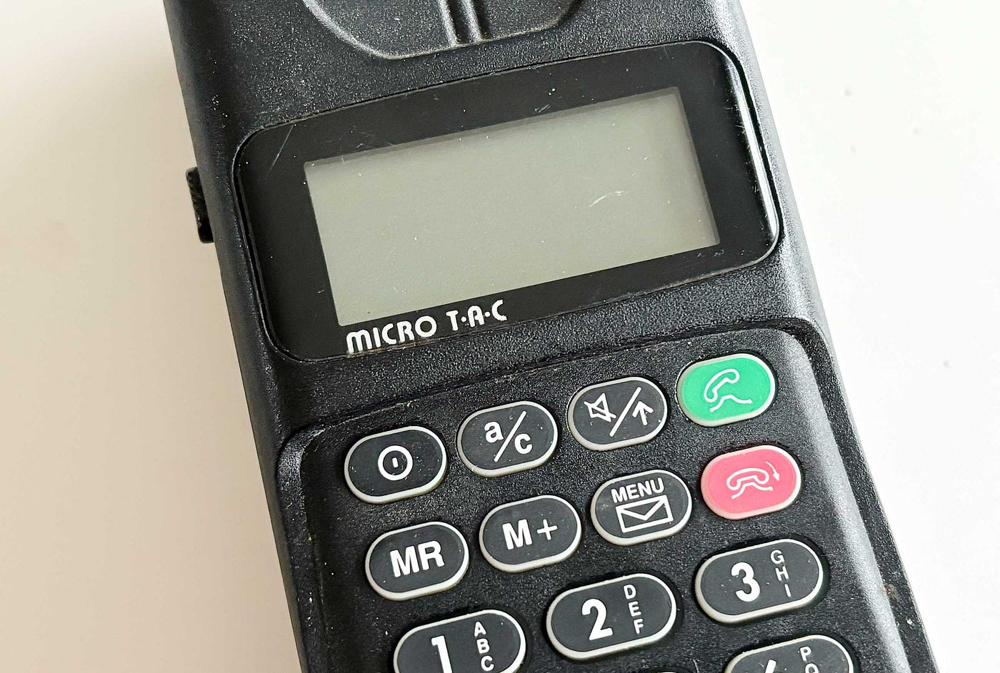
*Micro TAC 极其小巧。图片版权 Jesse Karjalainen。*

值得注意的是，这部电话太小了，工程师们加了一个可折叠的翻盖，既能盖住按键，又能延伸麦克风靠近用户的嘴。

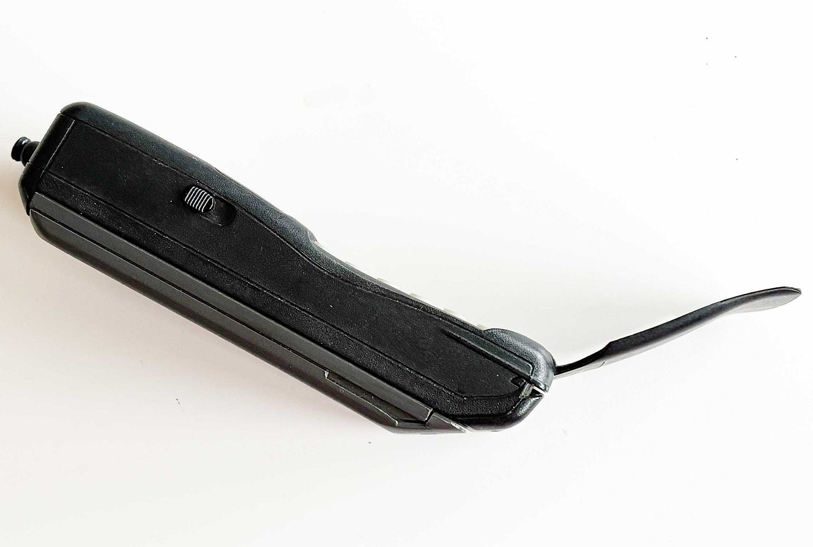
*这部小得不可思议的移动/蜂窝电话。图片版权 Jesse Karjalainen。*

这是世界上第一部"翻盖"——也叫"贝壳"——电话。（你可以把它确定为一个明确的日期。）

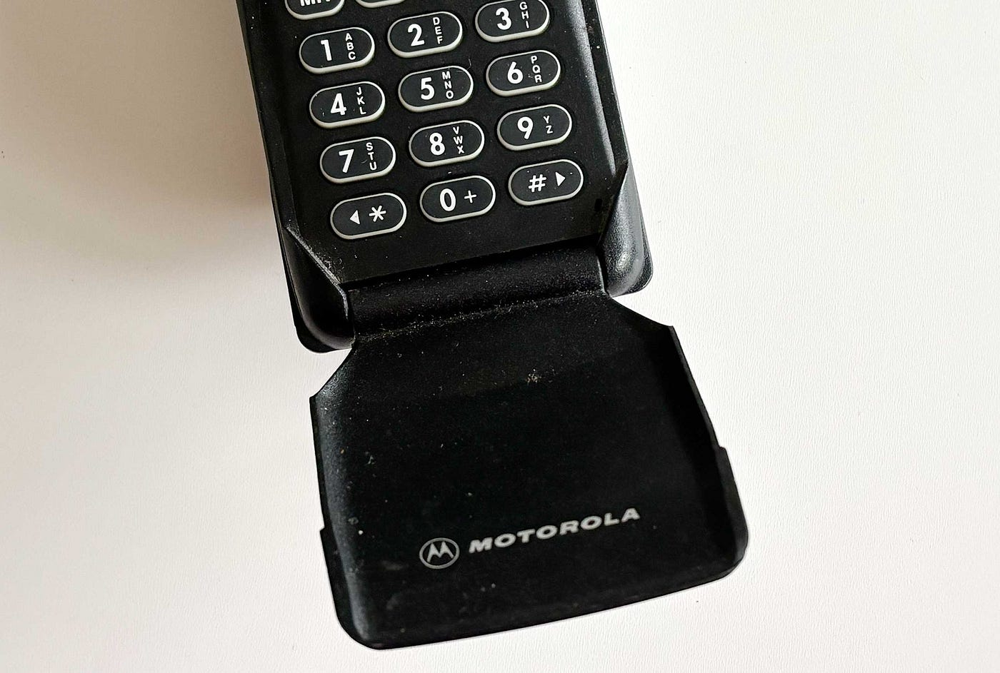
*第一部翻盖电话。图片版权 Jesse Karjalainen。*

理所当然地，MicroTAC 风靡全球。全球媒体对它的发布疯狂报道。

*LA Times* 形容它是一部真的可以"装进手提包或大衣口袋"的电话。它"差不多有一个胖钱包那么厚"。

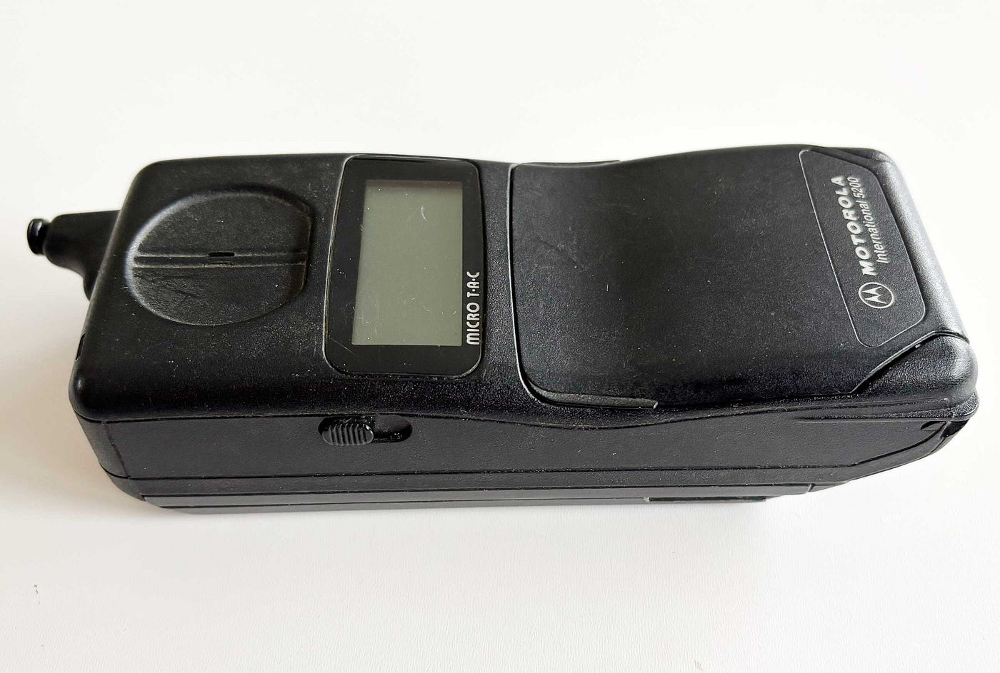
*媒体称它"像一个胖钱包那么大"。图片版权 Jesse Karjalainen。*

这家报纸确实指出了一个明显的事实：标准电池的通话时间只有 30 分钟。

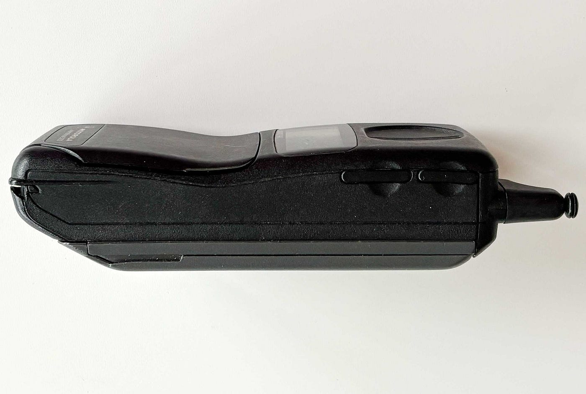
*Motorola Micro TAC 真的能装进你的口袋。图片版权 Jesse Karjalainen。*

尽管如此，Motorola 很快指出，Micro TAC 是一部个人电话。移动电话首次超越了仅仅是重要商务人士的工具的范畴。或者，用 Motorola 副总裁 Jim Bernhart 的话说，是"个人蜂窝"。

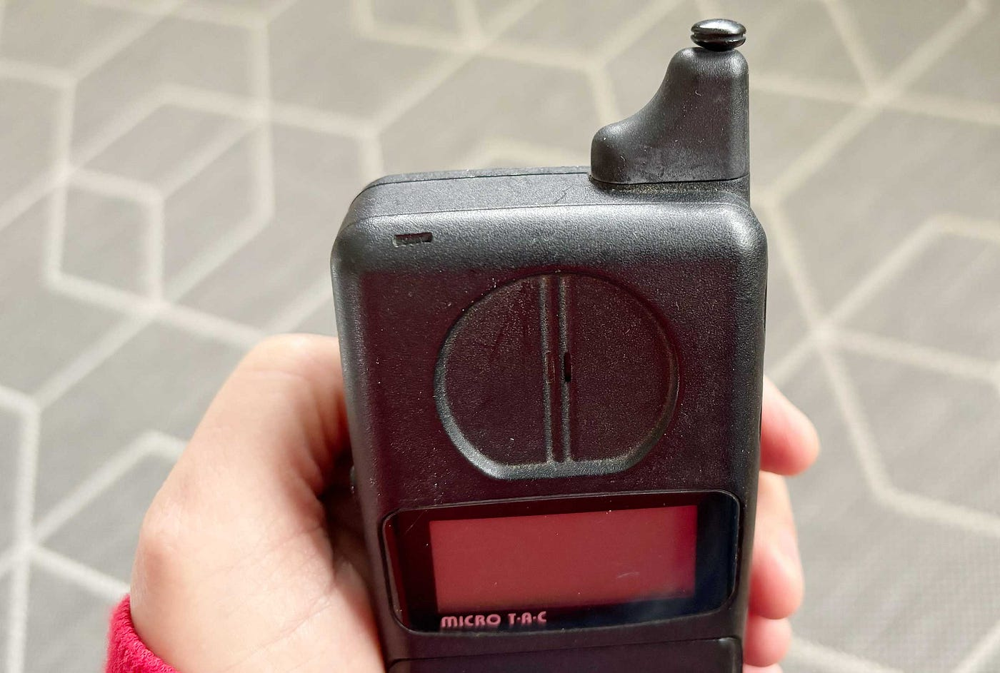
*它有一根可拉出的天线。图片版权 Jesse Karjalainen。*

据报道，Motorola 已经在其移动/蜂窝部门投资了 3.5 亿美元，现在正寻求大规模扩展市场。

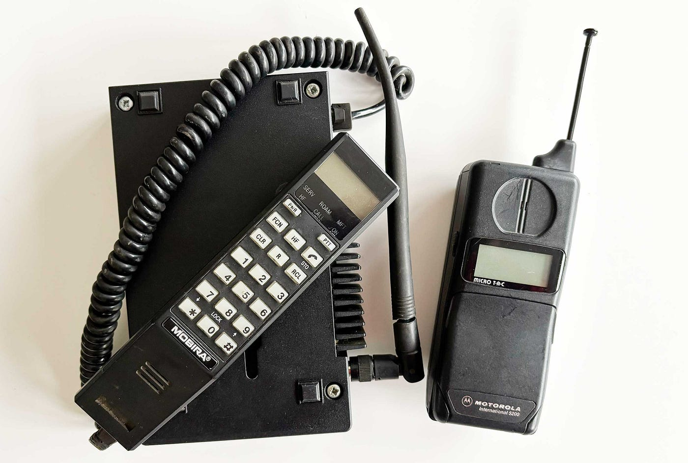
*甚至比"迷你"Mobira TalkMan 还小。图片版权 Jesse Karjalainen。*

现在，有了 MicroTAC，世界上有了第一部也是唯一一部市场上的个人电话。

## **Mobira Cityman 150**

虽然 Motorola 在 1989 年用 MicroTAC 接替了 DynaTAC，Nokia-Mobira 公司*也*在同一年推出了一部新电话来接替它的手持机 Cityman 900。

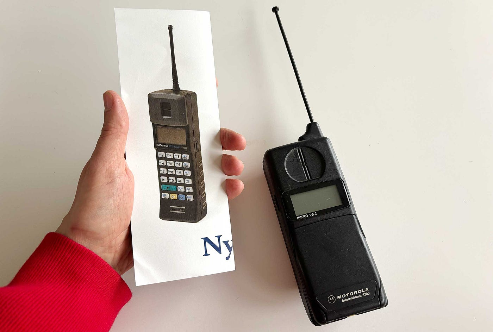
*Nokia-Mobira 在 1989 年推出了 Cityman 150。图片版权 Jesse Karjalainen。*

这就是 Cityman 150。新的 Motorola 是翻盖/贝壳设计；新的 Mobira 电话则是第一部"砖头"或"直板"移动电话。Nokia-Mobira 在创新方面正在追赶 Motorola。

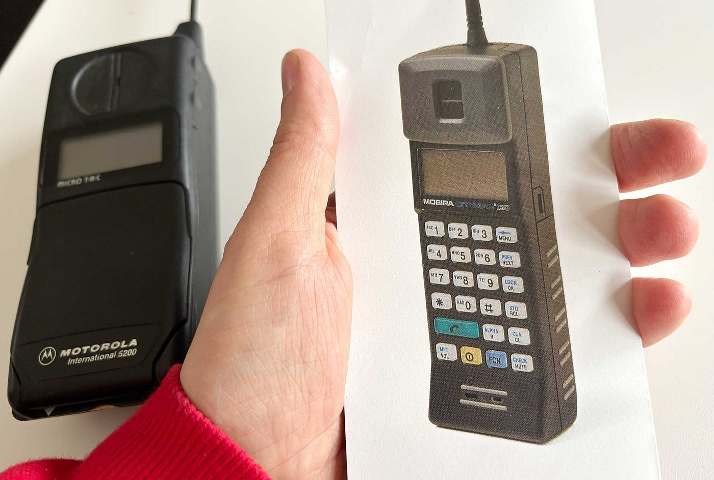
*追赶 Motorola。图片版权 Jesse Karjalainen。*

它与 MicroTAC 匹敌，重 480 到 790 克，取决于电池的选择。在写本文时，我只有 Cityman 150 的原始宣传册。

它是一部 1G 移动电话，配有一根短粗天线，而不是典型移动电话的较长天线。

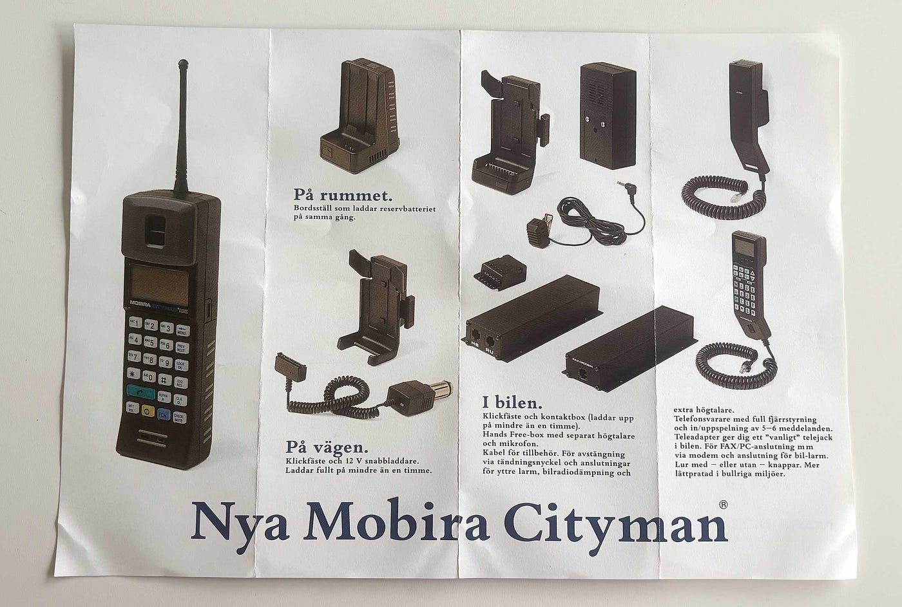
*配合配件在家、车里或任何地方都能使用。图片版权 Jesse Karjalainen。*

它同样是一项工程奇迹，在移动电话领域树立了新标准。充满电时，通话时间为 50 分钟。

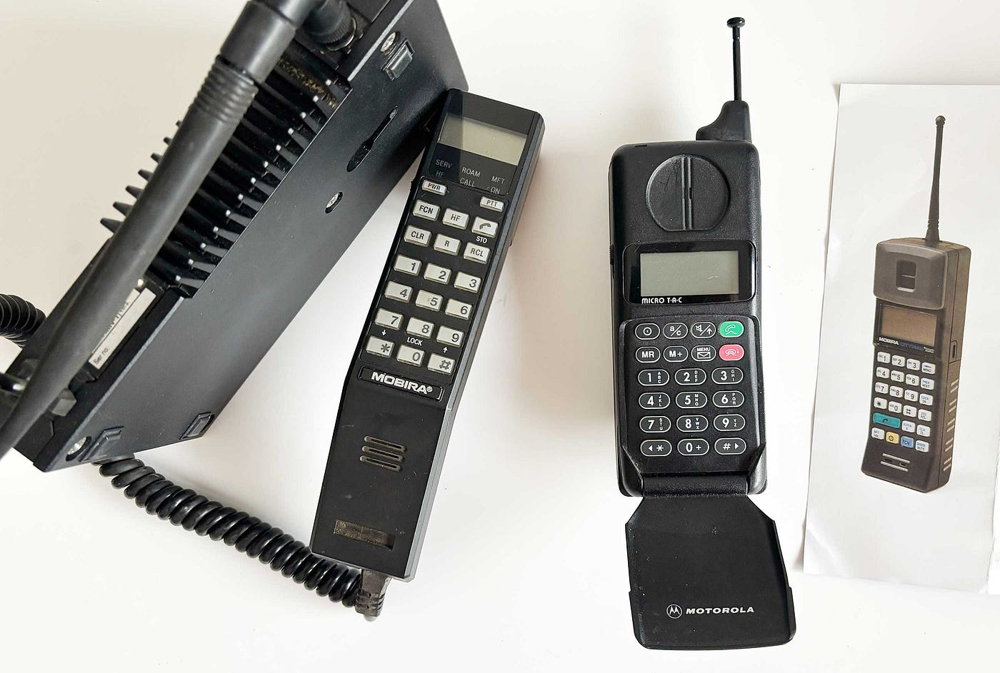
*1989 年移动电话的现状。图片版权 Jesse Karjalainen。*

## **1989：发令枪**

1989 年移动电话还是非常新奇的东西，以至于上面提到的 *LA Times* 文章不得不详细描述蜂窝电话是如何工作的、蜂窝服务是如何工作的，以及这一切是如何与本地电话系统连接的。

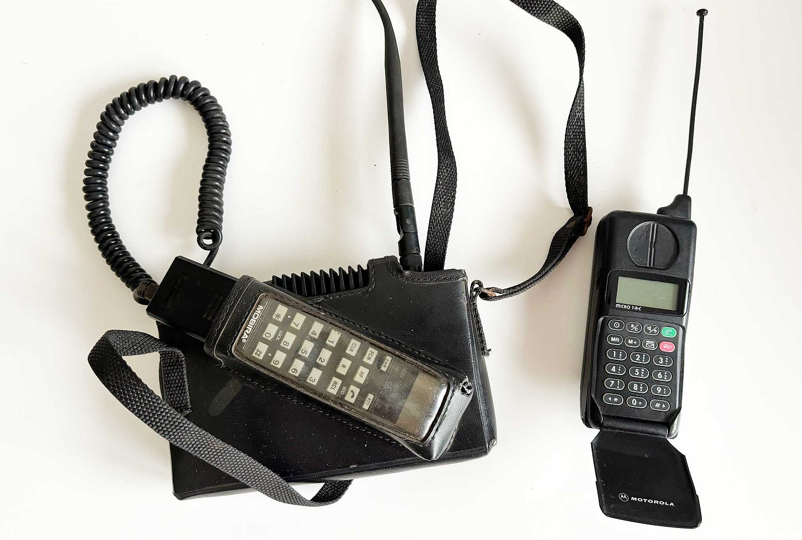
*更长的通话时间还是更小的尺寸？你来决定。图片版权 Jesse Karjalainen。*

1989 年美国人口为 2.46 亿。其中，有 200 万蜂窝用户。仅 1988 年就有约 839,00 人加入了这一行列，过去六个月的蜂窝服务收入已超过 10 亿美元。

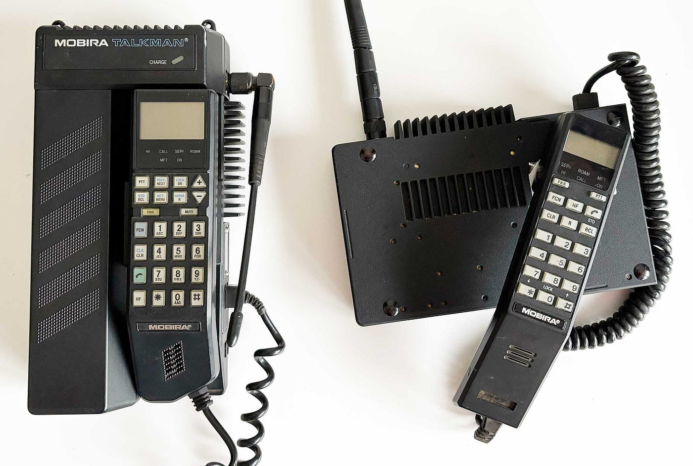
*两代 Mobira TalkMan。图片版权 Jesse Karjalainen。*

MicroTAC 发布时，美国市场渗透率低于 2%。即使一年之后的 1990 年，New York Times 报道蜂窝电话时说它是：

> *一种可能很快成为最新必需品的小工具。*

尽管有这些进步，移动/蜂窝电话时代仍然没有真正起飞，也没有成为主流的日常事物。

在其 1992 年 9 月的自家新闻稿中，Motorola 宣布了第一部重量不到六盎司（170 克）的移动电话。这*几乎*只有原版 MicroTAC 一半的重量。他们的新电话有惊人的 3 小时通话时间。

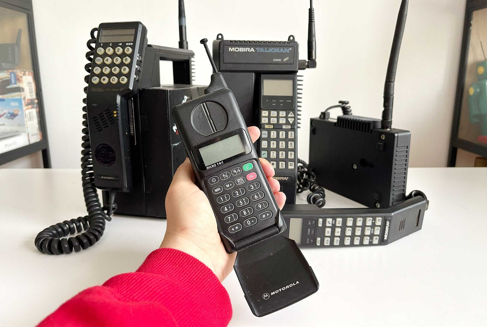
*Micro TAC 提高了赌注。图片版权 Jesse Karjalainen。*

但我们扯远了。让我们聚焦在 1989 年。那一年标志着后来发展为移动电话时代的开端的发令枪。Motorola MicroTAC 和 CityMan 150 处于那场革命的最前沿。

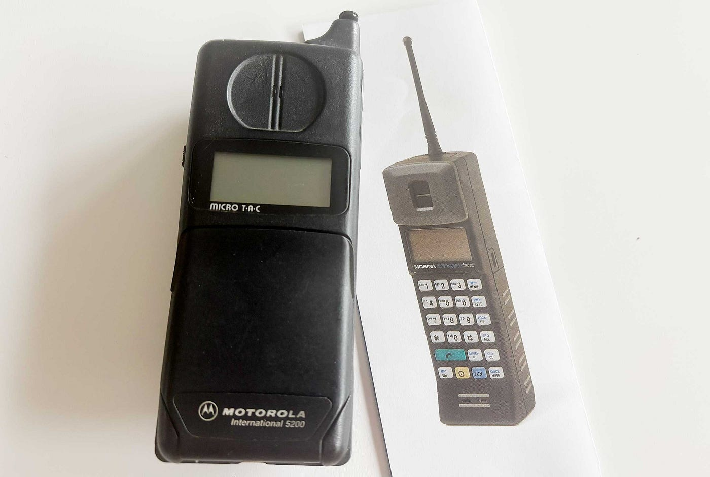
*1989 年最高科技的移动电话。图片版权 Jesse Karjalainen。*

首先，移动/蜂窝电话从商业工具变成了个人的、便携的电话。这与十年前发展计算机行业、"让每个家庭都有一台电脑"是同一套剧本。你不再需要"拖着"便携电话到处走或者把它放在车里。电话现在真的可以装进背包或手提包里了。

这就是 1989 年的突破。

1989 年最后一项重大发展是，贯穿整个 1980 年代的 Nokia-Mobira 合作关系被重组了。Nokia 公司看到了袖珍电话市场的发展方向，并买下了商业实体中 Mobira 的那一半。

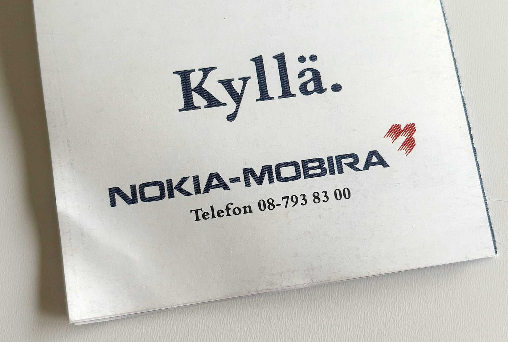
*没错，把名字改成 Nokia 吧。图片版权 Jesse Karjalainen。*

1989 年，Nokia-Mobira 业务和 Mobira 品牌被整合成 Nokia 公司旗下的一个单一业务部门。从这一刻起，这位北欧领跑者将仅以 Nokia 名义设计、制造和销售移动电话。

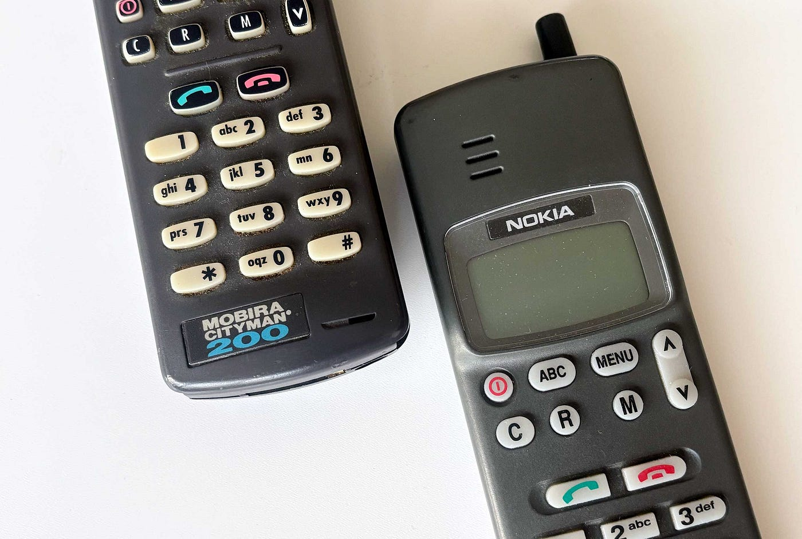
*一部 Mobira 品牌和一部 Nokia 品牌的电话并排摆放。图片版权 Jesse Karjalainen。*

从 1990 年代一开始，这家芬兰公司就将在全球移动/蜂窝电话市场上与美国 Motorola 正面对决。但是，如果你需要一个确定的时间点来说明移动电话从什么时候开始"成为一回事"，那么我会指给你 1989 年。

下次再见。

在你喜欢的所有社交平台关注我：[**YouTube**](https://www.youtube.com/@retrotechshow) | [**TikTok**](https://www.tiktok.com/@retrotechshow) | [**Substack**](https://substack.com/@retrotechshow) | [**Bluesky**](https://bsky.app/profile/retrotechshow.bsky.social) | [**Gumroad**](https://jessebooks.gumroad.com/)。

//

**Jesse 是一位作家、插画家和内容创作者，目前居住在瑞典。Retro Tech show 旨在按时间顺序记录这个世界是如何从模拟时代走向数字时代的。这是一部个人回忆录，从 1973 年开始，记录我生命中每一年遇到的每一项重大技术。**

**本系列文章中没有任何一个字是由 AI 写的。这是 100% 人类的汗水和辛劳。本内容不得用于 AI 训练，机器人请远离。**
