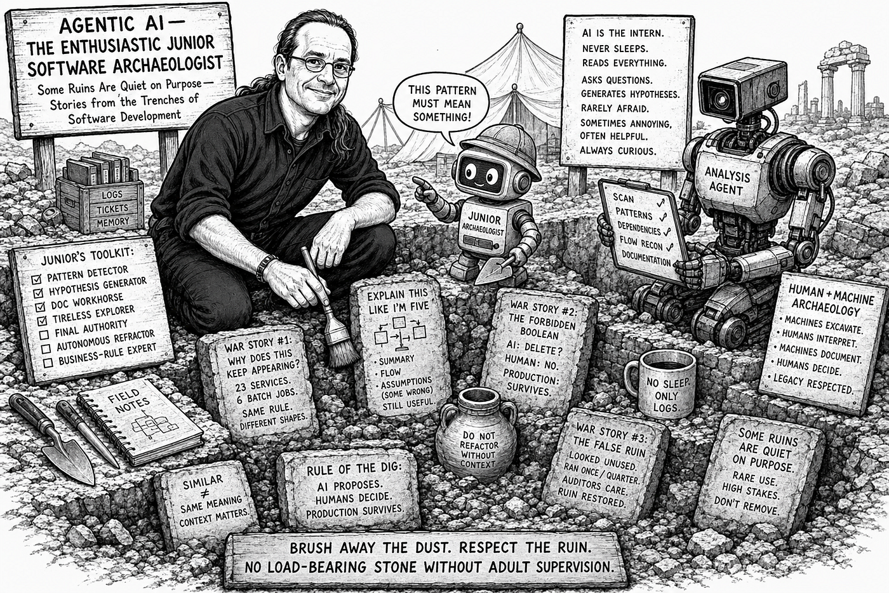

# Agentic AI —— 那个热情过头的初级软件考古学家

***有些遗迹之所以安静,是有意为之 —— 来自软件开发战壕里的故事***

*由 ChatGPT 生成*

每一次发掘都会到一个进度变慢、耐心耗尽的时刻。你已经挖得足够深,意识到这里没有任何东西是偶然的,但又还没深到能完全弄清你脚下站的是什么。这通常就是有人提议雇个帮手的时候。不是再找一位资深考古学家。那种人稀少、昂贵,而且常常带着在完全不同的遗迹里形成的强硬观点出现。你通常拿到的反而是一个初级新人:好奇、不知疲倦、稍微有点过度自信,并且深信反复出现的模式必然意味着有意为之。

> 你不是 medium 会员?这里是可以阅读完整博客的 [friend link](https://thilo-hermann.medium.com/agentic-ai-the-enthusiastic-junior-software-archaeologist-261092cac6e4?sk=b457c0a2cc3bce02d6ef95bc55595da5) ……

这正是 agentic AI 登场的地方。

## **在挖掘现场,AI 真正擅长的是什么**

在炒作把一根撑了几十年的柱子压塌之前,先把这位助手到底是什么搞清楚会有帮助。Agentic AI 不是 Indiana Jones。它是那个实习生。那个永不睡觉、把你递过去的每一件文物都读一遍、并且一直不停发问的实习生 —— 这些问题有时令人厌烦,有时有帮助,偶尔让人不舒服。

在遗留系统里,这种组合结果证明极其有用。AI 会毫无怨言地扫描数百万行代码,追踪人类多年前已经不再注意的依赖关系,并指出同一段逻辑悄悄地以略有不同的形态散布到了整个系统中。它还原那些自上一次重组以来没人敢去记录的流程。所有这些都不能取代考古学家。它只是给考古学家更好的光线、更稳的手,以及多得多的耐力。

## **战争故事 #1:“为什么这玩意儿一直出现?”**

我们曾经把一个庞大的遗留代码库喂给一个分析 agent,然后等着。它回来时,没有戏剧性,没有花哨的输出。只有一条简单的观察:一条特定的业务规则出现在二十三个服务和六个批处理作业里。房间里没人知道这件事。架构师不知道,业务方不知道,合规方也不知道。人类盯着单个碎片看了好几年。AI 横跨了各层来看。

> 用考古学的话来说,这就是你停止把各个发现当作孤立的碎片、开始把它们摆到桌面上的那一刻。突然之间,你意识到它们都来自同一只容器。没有发现新的文物,但它的形状终于变得可见了。遗址没有变。是你对它的理解变了。

这就是机器规模下的考古学:不是发掘出新东西,而是揭示同一个想法被多么频繁地悄悄重建、复制,并在地面变动时又被埋回去。

## **AI 立刻就被自己的聪明灌醉的地方**

危险就从这里开始。AI 对对称性、命名一致性和结构相似性有深沉的偏爱。遗留软件正是靠相反的东西活下来的。它充满了妥协、意外,以及那些从未进入文档的旧事故留下的疤痕。当 AI 礼貌地建议合并两个方法,因为它们看上去一模一样时,资深工程师往往不打开文件就知道答案。一个方法是给德国用的。另一个也是给德国用的,只是针对 2009 年引入的一个非常具体的特例 —— 没有人愉快地记着它,但所有人都怕它。相似的文物并不意味着共享的含义。上下文很重要,而 AI 感受不到后果,但监管者会感受到。

## **“像我五岁那样解释这个”的奇迹**

时不时地,会发生一些真正令人惊讶的事情。我们曾经让一个 agent 解释一个四百行的方法实际在做什么。返回的结果并不完美,但已经够好了:一份可读的总结、一个粗略的流程描述,以及一个该代码看上去依赖的假设清单。其中一些假设是错的。这没关系。输出给了我们一个起点。

> 这正是初级考古学家存在的意义。他们把混乱变成假设,并给经验丰富的人一些具体的东西,让他们带着热情去验证、修正或拒绝。

## **战争故事 #2:AI 与禁忌的布尔值**

每一个长期运行的系统都有一个。一个永远不准为 true 的布尔值。AI 能很快找到这些。它把它们标出来,并建议把它们移除。从纯技术角度看,这建议常常合情合理。从运维角度看,它可能是灾难性的。我们是通过惨痛的方式学到这一点的。AI 发现禁忌的速度,比它理解禁忌为什么存在的速度更快。

> 在真实的发掘现场,这就是一个新人兴奋地指着一块石头、建议把它撬出来看看会怎样的那个时刻。那块石头看起来很普通。它没有雕刻、没有装饰、不令人印象深刻。新人看不见的是,它已经承受了几十年的压力。资深考古学家很早就学到:有些石头之所以有意思,不是因为它们本身是什么,而是因为它们在挡着什么。

软件里的禁忌也是这样运作的。它们存在的原因常常已经被遗忘,但移除它们的后果是非常真实的。从那次事件中幸存下来的规则简单而顽固:AI 提议,人类决策,生产环境活下来。

## **Agentic AI 在遗留工作中的正确角色**

这就是为什么 agentic AI 在发掘现场需要一个被清晰界定的位置。它最擅长做的是:模式探测器、假设生成器、文档苦力,以及对人类多年前停止造访的那些黑暗角落不知疲倦的探索者。它绝不应该被当成最终权威、自动重构引擎,或业务规则专家。它不是远征队队长。它是那位初级考古学家:扛着工具、指着奇怪的结构、提出能触发非常必要的辩论的问题。

## **战争故事 #3:假遗迹**

某一次,一个 AI 自信地宣称一个模块未被使用,因为内部没有任何东西引用它。人类查了日志。那个模块每季度运行一次,由一个外部合作伙伴触发,产出一份除审计员之外没人碰过的监管报告。AI 把那座遗迹拆了,最后审计员注意到了。那座遗迹被小心地修复了。

> 在考古学里,并非每一座结构都是神庙或宫殿。有些是遗址边缘的、不起眼的小建筑。它们看上去被遗弃了,很少有人造访,很容易被忽视。直到你弄清:它们每年开放一次,在一个让整个聚落能与外部世界保持良好关系的仪式期间。

有些遗迹安静,是有意为之。它们不是为日常生活而设计的,而是为罕见的、高风险的时刻而设计的。把它们移除并不会立刻造成崩塌。它会在非常不方便的时机、在非常严肃的人围观之下,造成一种非常特定的麻烦。

## **美好的未来:人 + 机器考古学**

真正行得通的未来,不是关于取代。它是关于分工。机器快速地、不会疲惫地发掘。人类解读含义、权衡后果,并决定什么留下。机器不知疲倦地记录。人类决定哪些决策是可以安全地重新审视的。这种组合,终于以遗留系统靠几十年生存所赢得的尊重来对待它们。

Agentic AI 不会通过重写来拯救遗留系统。它的帮助方式是:让不可见的变得可见,把被遗忘的意图浮现出来,并把判断所需的时间还给经验丰富的人。

用考古学的话来说,机器把灰尘刷掉。人类决定那件文物意味着什么。而且没人会在没有成年人监督的情况下,把一块承重石搬走。
