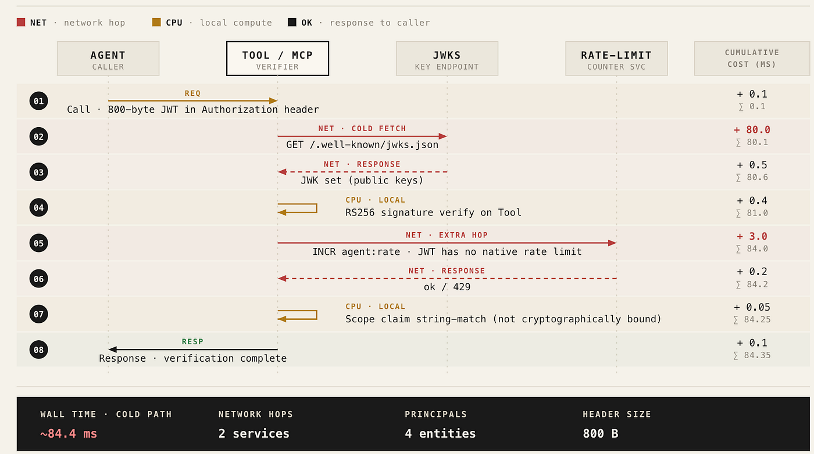
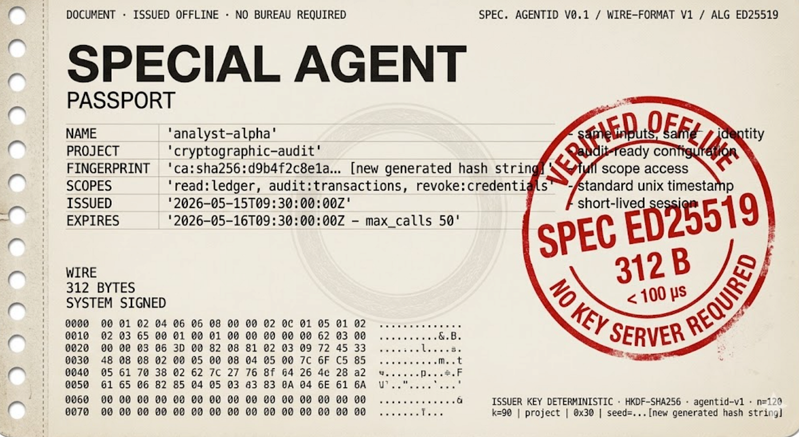
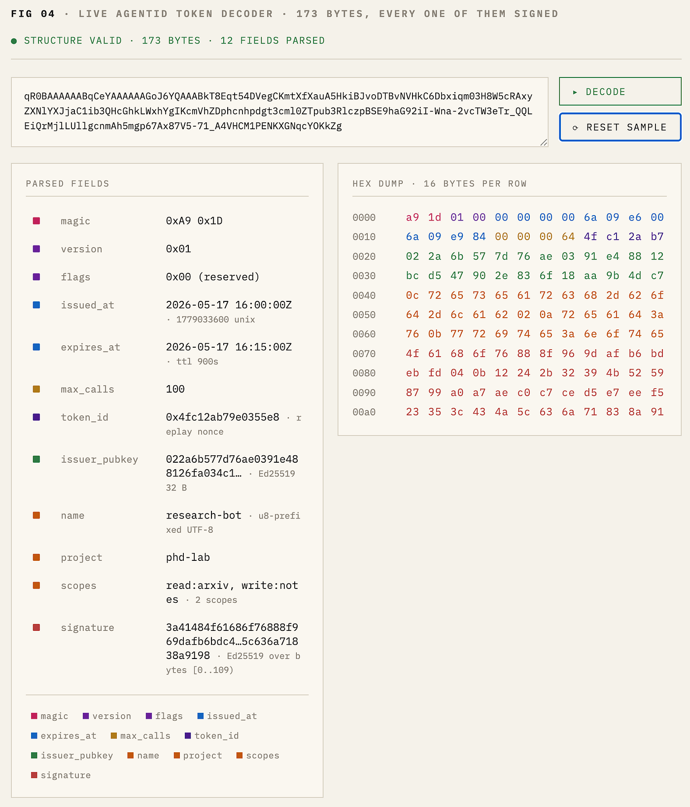
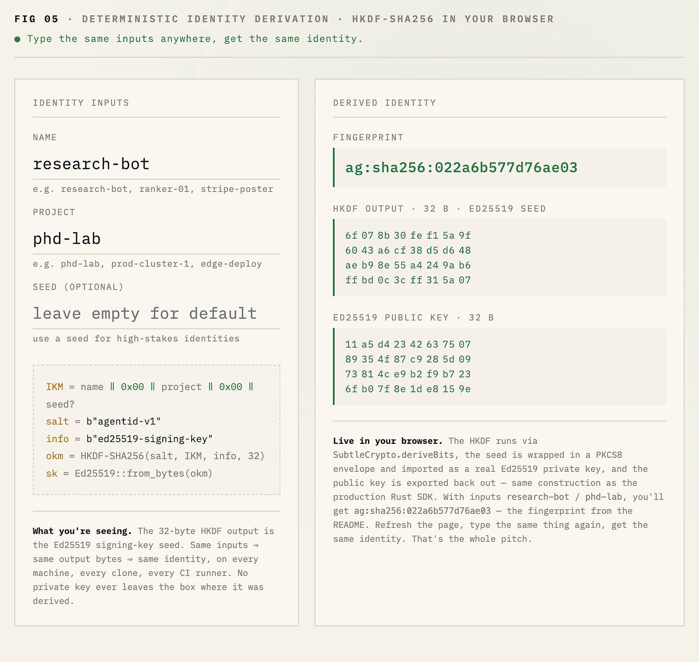
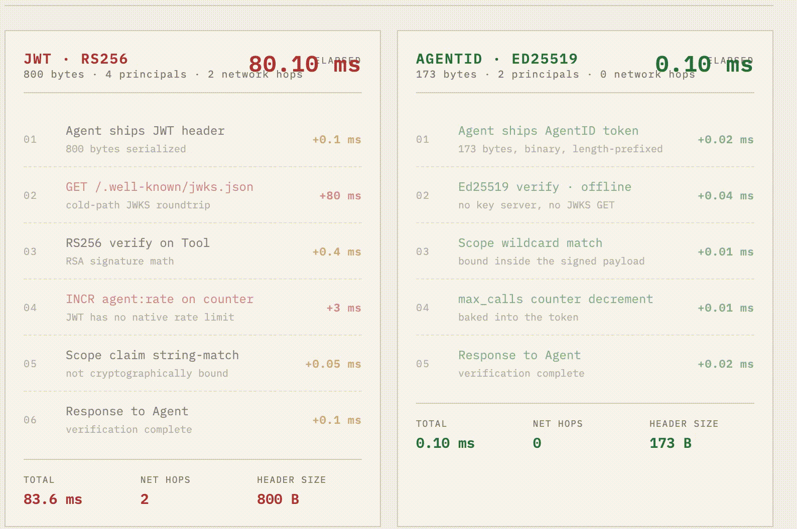

# AI Agent 不是用户；别再像对待用户那样去认证它们

## Y Combinator 正押注于自治的 B2B 蜂群，而我们却像对待 2008 年的浏览器那样在认证它们。我用 Rust 和 Python 构建了一个开源的密码学护照，能够 **验证 agent 的身份。**

你在生产环境里跑着十二个 agent。它们共用一个 API key。其中一个向错误的 Stripe endpoint 提交了一笔 4,200 美元的扣款，而你根本不知道是哪一个干的。

> **免费阅读本文** [**戳这里**](https://shekhawatsamvardhan.medium.com/ai-agents-are-not-users-stop-authenticating-them-like-they-are-a93ede6e2f0a?sk=d096f7e7473e47bec3a02897b678ab9b)

访问日志显示 `Bearer sk-...ax9k`。过去六个月里，每一条访问日志、每一个 agent 也都是这样显示的。真正发起调用的那个 agent 是不可见的，它只是你集群里 *某个* 持有这串 secret 的东西。

你无法在不让整个蜂群下线的情况下轮换这个 key。你无法只吊销那个出问题的 agent ——因为 *根本* 不存在"agent 这个概念"，只有一串被盖在每一次出站请求上的共享 secret。你甚至无法证明是哪个 agent 干的，除非把七个下游服务的时间戳全部交叉比对。

这就是 2026 年几乎所有生产级多 agent 系统的认证方式。这就是机器世界中相当于发布一个带着 `password: admin` 的 Web 应用——只不过这个 agent 每小时会这么干一万次，跨越十四个微服务，而且你没法在不停机的情况下修掉它。

**修复方案是一种当下标准生态中尚不存在的原语：per-agent 的密码学身份。** 不是一个 service account。不是你 auth0 租户签发的 JWT。而是一个真实的、小巧、迅速、可离线验证的身份：属于某一个 agent、自行过期、不能被重放，并把自己的 scopes 和 rate limits 携带在签名内部。

那就是 [AgentID](https://agent-id-web.vercel.app/) 所是的东西。我们已经构建出来、并且还在持续构建的东西。

*作者绘图：十二个 agent 全都持有同一个 sk-...ax9k。*

我相信，AI 基础设施在接下来的几个月里，会非常像 2014–2016 年那个 cloud-native 基础设施的时代：小而锋利的原语的寒武纪大爆发，早期的 CNCF 图景，etcd、Envoy 和 Prometheus 等等，最终拼装成生产堆栈。

身份是必须最先落地的那一层。其他每一个原语——rate limiting、audit、billing、delegation、capability passing——最终都会归结到那个问题：*是谁在发起这次调用？*

针对这个问题，agent-native 的答案不是 Auth0 签发的 JWT。它是 **一个 173 字节、由 Ed25519 签名的二进制 token，任何服务都能在 100 微秒内完成验证，且无需任何网络调用。**

## 1\. 假救主：为什么 JWT 不合适

下意识的答案是"直接用 JWT 不就行了"。这是错的，而其中的原因值得细究。

JWT（RFC 7519）是在 OAuth/OpenID Connect 时代为 **人类浏览器会话** 而设计的。规范里所植入的每一条假设，在面对机器对机器的 agent 流量时都会崩溃。

### 1.1. 四个具体的错配

1.  **尺寸。** 用 RS256 签名后的一个典型 JWT 约为 800 字节。在一个 40 步的 ReAct 循环里，那就是每个任务要传输 32 KB 的 header 字节。如果一天有一百万个任务，你就要为 32 GB 的 header 支付入站和出站的流量——而这些字节里，字面意义上承载的业务信息为零。
2.  **验证开销。** RS256 的签名验证在一颗现代的 x86 核心上大约要花 0.4 ms。在一次本身只需 2–5 ms 的 MCP 工具调用里，那就是每一跳上 10–20% 的税。
3.  **没有原生的 rate limits。** JWT 没有 `max_calls` 的概念。你得在其上外接一个计数器服务，这就意味着每一次请求都要多一跳网络，跑到 Redis 或者你的 rate-limit 服务。
4.  **JWK endpoint 往返。** 每个服务首次验证时，都需要从 JWKS endpoint 拉取签发方的公钥。在一个冷启动的 serverless agent 池里，每一次 fan-out 都会因此多增加 50–200 ms 的延迟。

*作者绘图：*

四个网络主体、两次网络跳跃、约 80 ms 的冷启动税，再加上一个独立的 rate-limit 服务，全部只为了验证一次机器调用。这就是把一个 agent 假装成浏览器所要付出的代价。

### 1.2. OAuth 是更大的罪

OAuth 2.x 更糟，因为它假设有一个人类同意（consent）步骤。Agent 没有浏览器、没有同意页面、没有那种能干净地映射到自治行为上的 refresh-token 流程。常见的退路——"client credentials" grant——又把 agent 身份退化回 *共享的服务身份*，这正是我们最初要解决的那个问题。

老实总结一下：OAuth/JWT 家族里没有任何东西是为这样一个网络主体设计的——它只活十五分钟、发起四十次调用、然后消失。这样的主体需要它自己的原语。

## 2\. 第一性原理：一个 agent 身份应当是什么

在介绍实现之前，让我们从零开始设计这个原语。五个不可妥协的约束：

1.  **可离线验证。** 没有 JWKS endpoint。没有 key server。验证方在网络上 *不需要* 任何东西就能验证一个 token。这才是延迟预算能跑得通的根本原因。
2.  **紧凑。** 小到即便四十次嵌套的工具调用，也不会主导带宽预算。是单数百字节量级，不是千字节级。
3.  **作用域在签名层。** Scopes（`read:arxiv`、`write:notes`）位于已签名 payload 的 *内部*，而不是位于可能被错误配置的中间件里。
4.  **rate limit 在 token 内部。** 一个 `max_calls` 计数器被烘焙进已签名的结构中。token 通过使用次数自我过期，而不仅仅靠时钟。
5.  **可确定性派生。** 同样的 `(name, project)` 元组在任何机器上都产生同样的密钥对。身份成了配置的一个函数，而不是一个需要到处复制的 secret。

这些约束强制了两项工程决策。

### 2.1. 为什么选 Ed25519，而不是 RSA 或 P-256

Ed25519 是 2026 年针对此场景的正确签名方案，差距并不接近：

-   **速度。** 在 x86–64 上，Ed25519 验证的速度约比 RSA-2048 快 4×，比 ECDSA P-256 快约 2×。单核每次验证用时低于 100µs 是现实可达的。
-   **尺寸。** 32 字节公钥，64 字节签名。对比 RSA 的 256 字节公钥再加 256 字节签名。没有它，你就根本不可能压到 173 字节的 token。
-   **没有 nonce 的脚枪。** Ed25519 签名按其构造就是确定性的——不需要每次签名的随机数。ECDSA 则需要 RFC 6979 或者一个强 RNG，而历史上那些被搞砸的 ECDSA 实现（PlayStation 3，有人记得吗？）所组成的俱乐部，你不会想加入。
-   **生态对齐。** SSH、age、WireGuard、Tor、Sigstore、每一家云 KMS——它们全都收敛到了 Ed25519。选它毫无争议，而且面向未来。

*作者绘图：使用 nano banana pro 生成。*

### 2.2. 为什么选二进制 wire format，而不是 JSON

JSON 是给人看的。Token 验证则是热路径上的机器码，每个服务每天要执行数百万次。

一个带有定长偏移字段的二进制格式意味着：

-   验证路径上没有 `serde_json` 的分配开销。
-   除显式的字符串字段（name、project、scopes）外，不进行 UTF-8 校验。
-   一次缓存友好的 pass 就能完整解析并验证整个结构。

目标的 173 字节并非随意。它是这样一个最小尺寸：刚好放得下一个 magic header、一个 version byte、两个时间戳、一个调用计数器、一个抗重放 nonce、一个 32 字节的公钥、长度前缀的 name/project/scopes，以及一个 64 字节的 Ed25519 签名。每一个字节都落在已签名的区域之内。

布局我们待会儿就看。

## 3\. AgentID 实现：我们构建了什么

### 3.1 仓库拓扑

代码库是一个 Cargo + Bun 的 monorepo，包含一个 Rust 的密码学内核以及薄薄的语言绑定：

agentid/  
├── core/                        
│   ├── identity.rs              
│   ├── token.rs                 
│   ├── vault.rs                 
│   ├── server.rs                
│   └── napi\_bindings.rs         
├── sdk/  
│   ├── python/                  
│   └── typescript/              
└── cli/                       

架构选择很简单：**密码学只活在一个地方**——Rust。语言 SDK 是薄薄的 N-API 或 PyO3 shim。TypeScript 里没有 Ed25519 的重复实现。没有"现在再用 Python 验证一遍"的维护负担。这是项目里最重要的一项架构决策，而它从外面看是不可见的。

### 3.2. 那 173 字节的 wire format，带注释

*作者绘图。*

README 没有讲清楚的三件事：

-   **version byte 与 flags 都位于已签名区域之内。** 降级攻击（"骗验证方使用 v0 解析规则"）变成签名失败，而不是解析器歧义。
-   `**token_id**` **就是抗重放的 nonce。** 无状态的验证方会忽略它。有状态的验证方——那些在意严格抗重放保护的——会把见过的 ID 维护在一个布隆过滤器或 Redis `SET` 中，其作用域限定在 TTL 窗口内，并拒绝重复项。这种 token 格式两种模式都支持；权衡由你来选。
-   **变长字段以长度前缀方式编码，而不是以 null 终止。** 没有 `strlen` 的歧义。没有截断攻击。没有"那如果 name 里有一个 null byte 怎么办"之类的边界情形。

### 3.3. 可确定性派生的密钥

IKM   = name ‖ 0x00 ‖ project ‖ 0x00 ‖ seed?  
salt  = b"agentid-v1"  
info  = b"ed25519-signing-key"  
okm   = HKDF-SHA256(salt, IKM, info, len=32)  
sk    = Ed25519::SigningKey::from\_bytes(okm)

这一构造的运营特性，正是让 AgentID 与你用过的任何其他 key 系统感觉都不一样的那个东西：

> ***没有任何私钥需要离开开发者的机器，但每一个 CI runner、每一个 Kubernetes pod、每一台开发用笔记本，都能从同一个*** `***(name, project)***` ***元组重新派生出同一个 agent 身份。***

身份成了配置的一个函数，而不是一个需要到处复制的 secret。你把带有 `name = "research-bot"` 和 `project = "phd-lab"` 的 `agent.toml` 提交进你的仓库。任何人 clone 这个仓库并运行 `agentid keys add` 都会得到同一个公钥。CI 里没有什么可泄露的，没有需要作为 GitHub Action secret 注入的东西，承包商离职时也没有什么需要轮换的。

如果你曾经试过在一个团队里共享签名密钥，结果最后是一个标题为"有谁把新的 prod key 导到 vault 了吗？"的 Slack 帖子，你就明白这一点为什么重要。

可选的 `seed` 参数是为那些高风险身份准备的，对这些身份而言，仅靠 `(name, project)` 元组不足以引导出公钥。大多数用户永远都不会用到它。

*作者绘图：刷新页面、输入相同的输入、得到相同的指纹。"哦，这是可复现的"这一瞬间立刻就降临。可作为静态 HTML gist 嵌入。*

### 3.4. 本地 vault

私钥位于 `~/.agentid/keys/<fingerprint>.key`：

-   **KDF：** PBKDF2-HMAC-SHA256，200,000 次迭代。
-   **Cipher：** AES-256-GCM，每个文件配新的 nonce 与认证 tag。
-   **文件权限：** `0o600`（仅用户可读写）。
-   **Index：** `~/.agentid/index.json` 是 **未加密** 的——它只包含公开元数据：names、projects、fingerprints 以及 public keys。可以放心提交到团队的 wiki。被加密的只有私钥材料本身。

威胁模型值得说清楚：AgentID **不是** 一个 HSM 级别 KMS 的替代品。如果你的威胁模型里包括了开发者机器上的特权攻击者，那你应该把这些秘密材料放到一个由硬件支撑的飞地里（Apple Secure Enclave、TPM、YubiKey、云 KMS）。roadmap 里包含正是为了这一点的可插拔后端。默认的 vault 是给"我希望我的 agent 身份能在一次 `rm -rf node_modules` 之后仍然存活，并且不要出现在 Bash 历史里"准备的。

### 3.5. 开发者体验：相同的操作，三种语言

这一部分对采用度至关重要。把 *同一个* 操作在三个 SDK 里并排展示出来，对称性本身就说明了一切。

**Rust：**

use agentid\_core::{AgentIdentity, TokenBuilder, verify\_token};

let identity = AgentIdentity::derive("research-bot", "phd-lab", None)?;let token = TokenBuilder::new(&identity)  
    .scopes(\["read:arxiv", "write:notes"\])  
    .ttl\_seconds(900)  
    .max\_calls(100)  
    .build()?;let claims = verify\_token(&token, Some(&identity.public\_key()))?;  
assert!(claims.permits("read:arxiv"));

**TypeScript / Bun：**

import { AgentIdentity, verifyToken } from "agentid";

const id = AgentIdentity.derive("research-bot", "phd-lab");const token = id.mintToken({  
  scopes: \["read:arxiv", "write:notes"\],  
  ttlSeconds: 900,  
  maxCalls: 100,  
});const claims = verifyToken(token, id.publicKey);  
console.log(claims.fingerprint); // ag:sha256:022a6b577d76ae03

**Python：**

from agentid import AgentIdentity, verify\_token

identity = AgentIdentity.derive("research-bot", "phd-lab")token = identity.mint\_token(  
    scopes=\["read:arxiv", "write:notes"\],  
    ttl\_seconds=900,  
    max\_calls=100,  
)claims = verify\_token(token, identity.public\_key)  
assert claims.permits("read:arxiv")

这三段代码不仅风格上相似——它们在底层调用的是 **同一个 Rust 函数**。TypeScript 路径走的是 N-API；Python 路径走的是 PyO3。SDK 里没有 JavaScript 的 Ed25519 实现。也没有 Python 的 `cryptography` 库在做并行的工作。一个 verify 函数，三种 SDK 表面，按位完全一致的行为。

*作者绘图：使用 typescript 制作。*

那 0.10ms 的验证不是一个合成的 benchmark，它是原生 Rust `ed25519-dalek` 验证（0.04 ms）加上零分配的二进制解析（0.02 ms）的实际开销。一个纯 JavaScript 的实现，光是 V8 的开销就会把这整个延迟预算烧光。

与此同时，老旧的 JWT 流程正在血崩般地耗时：0.4 ms 用在更慢的 RS256 数学上，残酷的 80 ms 冷启动网络跳跃用来拉取 JWKS endpoint，再加上 3 ms 的 Redis 跳跃，只因为 JWT 缺少原生的 rate limits。

因为 Python 和 TS 的 SDK 只是 Rust 之上的薄薄 FFI shim，你机队里的每一个 agent 都能拿到完全一致的、亚 100 微秒的离线验证。零网络跳跃。线上 173 字节。

## 4\. 真正重要的数字

Metric JWT (RS256) AgentID At 10M tool calls / day Token size ~800 B **173 B** **6.27 GB/day saved in headers** Verify time ~0.4 ms **<0.1 ms** **~50 CPU-minutes/day saved** Network hops to verify 1+ (JWKS) **0** **10M fewer JWKS GETs** Cold-start tax 50–200 ms **0 ms** **Removed from p99** Rate limits Bolt-on service **Inside token** **Zero extra hops** Scope enforcement String claim **Cryptographically bound** **Misconfiguration impossible**

### 4.1. 为什么这对 MCP 而言尤其重要

Model Context Protocol 把每一个 tool 都变成了一次网络调用。一个稍微复杂一点的 agent 任务要发起 20–60 次 MCP 调用。

在 RS256 验证开销下，光是签名数学本身，每个任务就要消耗 **8–24 ms** 的纯开销——而这还是在任何真正的工具工作发生之前。换成 Ed25519 加离线验证，同一个任务总共支付 **<6 ms**，并且这笔开销支付在 *被调用方* 那一侧，处于 agent 的关键路径之外。

现在把它叠起来。Agent A 委派给 agent B、C、D。其中每一个都会重新验证。然后它们每一个再继续往下委派。在一个有十个叶子的三层 fan-out 中，RS256 的累计签名数学大致要花掉你 24 ms；Ed25519 则不到 4 ms。再乘以调用速率。延迟优势不是线性的——它随着调用树的深度而扩大。

### 4.2. 针对边缘 agent 的带宽论证

这就是设备端 agent 登场的地方——那种 Apple Intelligence 风格的本地工具使用、Cloudflare Workers AI，以及 2026 年开始出现在浏览器中常驻的 agent。

*作者绘图：使用 typescript 制作。*

边缘运行时受带宽约束。每次调用节省六百二十七字节，乘以每个会话 N 次调用，再乘以一个移动信号上同时进行的会话数——这是那种能把"在蜂窝网络上可行"和"抱歉，只能用 wifi"区分开来的优化。

## 5\. 更大的赌注：分阶段蓝图

-   **v0.1（今天）：** 原语。Identity、token、vault、gRPC。那把刀。
-   **v0.2：** 框架中间件（LangGraph、CrewAI），吊销列表，密钥轮换。集成层面。
-   **v0.3：** AgentID Cloud——托管的密钥管理、审计日志、团队仪表盘。商业层。

结构性要点：**开源原语先发布，而且永远保持有用，即便云这一层从不存在。** 不存在先甜后骗。仅本地的路径是大多数用户 *被预期* 的部署方式。云产品是给那些已经超出本地 vault 阶段、需要集中化审计和轮换的团队准备的。两者跑在同一个 wire format 上。两者使用同一个 Rust 内核。两者都不依赖对方。

> **我需要你来试它、来攻破它，然后告诉我我错在哪儿。**

这是一次积极尝试，旨在解决一个巨大的基础设施空白，我希望得到早期反馈。如果你觉得 wire format 不对，告诉我。如果你觉得 2026 年选 Ed25519 是错的，告诉我。如果你做过 agent 基础设施的发布、而你觉得我的威胁模型存在缺口，*尤其* 要告诉我。仓库在 [这里](http://github.com/samvardhan03/agentid)。crate 在 crates.io 上叫 `agentid-core`。TypeScript SDK 在 npm 上叫 `agentid`。Python 包在 PyPI 上叫 agentidentity-auth。

如果你以构建 agent 基础设施为生，本文有任何部分让你产生共鸣，或任何部分让你来气——请开一个 issue。我宁愿现在就把这场争论吵清楚，也不愿等到 v1.0 锁定之后再吵。

> 它就是一个原语，只有一项工作：*在 173 字节里，证明这个 agent 就是它所声称的那个、带有这些 scopes、有效期为这么长。*

这就是整个推介。其他一切都是 roadmap 上的事项。

这只是构建开源 agent 基础设施栈的第一阶段。如果你觉得这次的架构拆解有用，关注我，下一篇我们会处理持久化的 agent memory。我所有的社交账号都可以在我的 [wesbite](https://samvardhan.vercel.app/) 上找到，你想联系我或了解更多我正在构建的东西都可以去那里。

如果你做 agent 基础设施，并想要帮忙验证这个原语，或者你只是欣赏一段干净的 Rust，给这个 [repo](https://github.com/samvardhan03/agentid) 点个 star，并在 [这里](https://agent-id-web.vercel.app/) 看看那个 pypi 包和 Rust crate！
