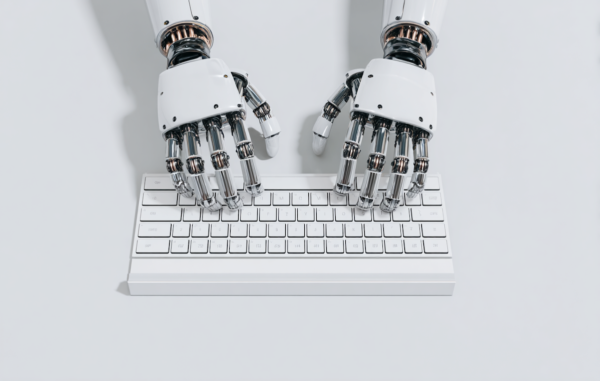
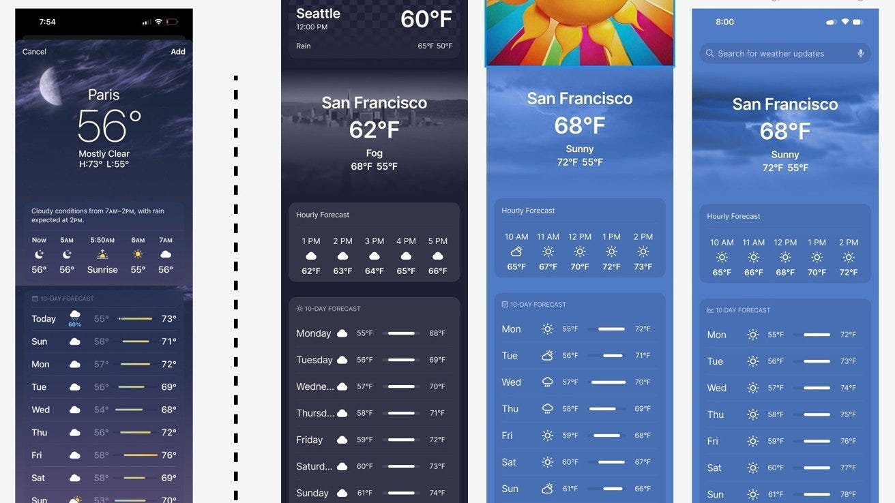
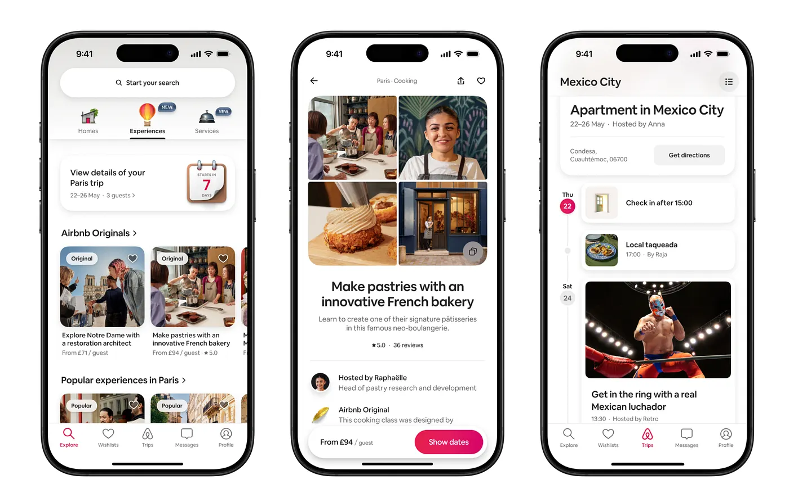
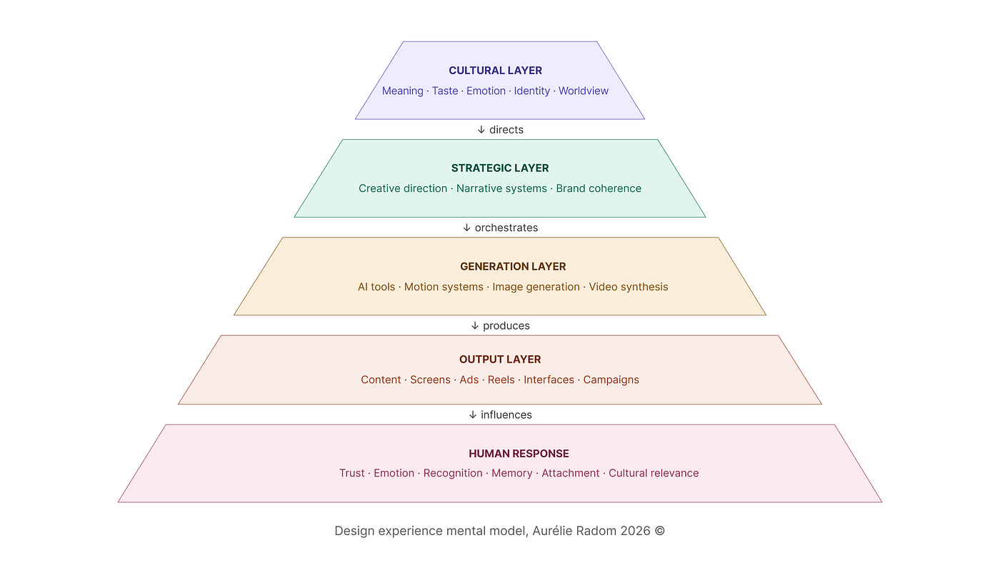

# AI 让每个人都成了创作者，而不是设计师

## **为什么在 AI 时代，设计品味成了真正的约束。**

*机器人之手在键盘上，lummi.ai ©。*

## **界面同质化的问题**

打开今天几乎任何一款新的 SaaS 产品，界面在产品本身变清晰之前就已经让人感觉熟悉。圆角卡片、中性的无衬线字体、柔和的渐变、宽松的版式，以及一个永远蹲在角落的 AI 助手，已经成了现代数字产品的默认语法。

跨行业地看，这些模式都在重复：

-   以聊天为先的版式正在取代结构化导航
-   嵌入界面右下角的 AI 助手
-   降低的仪表盘信息密度与更多的留白
-   渐变的英雄区，宣告自己是"AI 原生"的身份
-   为快速激活而优化的简化新手引导流程

这些产品也许在解决完全不同的问题，可它们看上去越来越像同一套界面系统的不同变体。这种趋同并不仅仅是潮流上的模仿。[它反映的是产品构建方式上更深层次的结构性变化。](https://hbr.org/2025/09/ai-generated-workslop-is-destroying-productivity)

## **生成已经变得过剩**

过去几年里，生成式 AI 戏剧性地压缩了意图与执行之间的距离。像 [v0](https://v0.app/)、[Cursor](https://cursor.com/)、[Claude Code](https://claude.com/product/claude-code)、[Runway](https://runwayml.com/) 和 [Midjourney](https://www.midjourney.com/home) 这样的工具，可以在几秒钟之内产出界面、原型、动效概念甚至早期的产品方向。曾经需要长时间探索的工作，现在几乎可以从一句 prompt 立刻浮现出来。这改变了设计的经济结构。约束不再是产出物的能力。屏幕、版式、视觉变体都很容易生成。生产不再是稀缺资源。AI 并没有把设计判断民主化。[它民主化的是产出](https://www.theatlantic.com/technology/2025/12/people-outsourcing-their-thinking-ai/685093/)。

## **把设计等同于产出的幻觉**

它们存在于决策与决策之间的连续性中、存在于一个状态如何过渡到另一个状态、存在于交互在边缘条件下的行为方式、以及体验如何随时间保持整体性。信任不是从单个屏幕里形成的。[它是从跨时刻的一致性中形成的](https://www.nngroup.com/articles/consistency-and-standards/)。

强大的产品依赖于：

-   跨状态的稳定行为
-   清晰且可预测的交互逻辑
-   深思熟虑的升级路径
-   一致的语气和反馈
-   视觉身份与真实体验之间的对齐

生成式系统可以产出光鲜的快照。而产品作为不断演化的环境运行。当产出物的创造变得毫不费力，价值就向上迁移。位于生成之上的战略层比以往任何时候都更重要。核心问题也变了：

> 不再是 *"我们能做出这个吗？"*
> 而是 *"这个东西应不应该存在于我们的系统里？"*

这一转变标志着产出和作者意志之间的差别。

## **概率性趋同的证据：Apple 天气模式**

这种张力在整个创业生态里已经显而易见。浏览足够多的 AI 生成落地页或通过生成式工作流拼装出的界面，一种模式就清晰起来：单个屏幕可能看上去很精致，但整体体验常常让人觉得它们彼此可以互换。问题很少是技术能力。是概念上的归属权。在巨大的现有界面分布上训练出来的生成式系统，倾向于向那些被统计上反复强化的"好 UI"版本去优化。因为它们从编码了被广泛接受的设计模式的大型数据集中学习，它们的产出会被吸向那些看起来最有可能、最熟悉、最易用的东西。

AI 生成移动界面的早期实验，频繁产出与高被引参考产品相像的版式，比如[Apple 的天气 app](https://appleinsider.com/articles/24/07/19/figmas-ai-duplication-of-apple-designs-due-to-a-lack-of-vetting?utm_source=chatgpt.com)。这并不是有意的模仿。这是围绕在训练数据里占比强、且被广泛公认有效的模式所发生的趋同。

天气 app 反映了许多在可用性基准里占主导地位的品质：

-   干净的、基于状态的结构
-   最低限度的视觉噪音
-   清晰的层级
-   定义良好的信息架构
-   减少的认知负荷

*Figma Make 生成的与 Apple 天气 app 设计相似的"Weather app"屏幕，Malcom Owens ©。*

这些特质在设计系统、案例研究和界面库里反复出现。结果是，它们成了被统计上强化的质量信号。生成模型在为整体性与可用性做优化时，往往会再现相似的结构性逻辑。这在意图上并不是抄袭。这是在概率空间里的趋同。当很多团队都依赖于在重叠数据集上训练出来的相似生成式工具，可能的产出范围就变窄。界面开始相互相似，并不是因为设计师能力不足，而是因为底层的概率分布偏向于熟悉的配置。[能力变得普遍。区分度变得更难。](https://youtu.be/fn_O6WjLgcs?si=-7OmTJkZeRgjvstu)

## **"原型设计已死"这种错误观念**

这是当下关于 AI 与产品设计的对话中容易走偏的地方。在以 AI 为先的产品团队里流传着一个常见的说法：原型设计正在变得过时，因为 AI 已经能够即时生成完整成形的界面。这个结论只有当原型设计被简化为屏幕产出时才说得通——而它从来都不是那样。原型设计一向不是关于产出光鲜的视觉，而是关于在一个系统硬化为产品现实之前，把它内部的不确定性暴露出来。它是在面对模糊性时检验交互模型的地方、是行为矛盾浮现的地方、是团队发现一段体验能否在一个理想化的单一状态之外保持整体性的地方。

AI 移除的并不是原型设计本身，而是过去为做出"看起来已完成"的产出物所必需的摩擦。这个区分至关重要，因为今天许多所谓的"原型"已经不再是探索性工具，而是孤立状态的光鲜快照。它们传达的是"已解决"，却不一定包含底层体验能在复杂性、规模或时间面前存活下来的证据。结果是，原型设计并没有消失，而是向上迁移了。重心从屏幕产出转向了[系统定义](https://m3.material.io/)。

## **原型设计已经搬进了设计品味里**

这就是当前这波 AI 浪潮之下正在展开的更深一层结构性转变。当生成变得近乎无穷，设计的价值就从执行迁移到了判断。不是纯粹审美意义上的判断，而是作为治理的判断：在一段体验中定义哪些东西必须保持一致、哪些可以在不破坏整体性的前提下变化、以及哪些哪怕局部看起来有吸引力也根本不该存在。换句话说，设计品味不再那么关于视觉偏好，而更多地关于在极端生成过剩的条件下维持系统完整性。

这之所以重要，是因为生成式系统天然倾向于向熟悉收敛。当 AI 模型在相似的数据集上训练、并围绕相似的可用性与现代感启发式做优化时，输出空间就被压缩。相同的交互结构、字体系统、新手引导模式与构图逻辑，开始在彼此无关的产品和行业之间重复。这种趋同在 AI 生成的 SaaS 设计的大部分领域中已经显而易见：很多产品越来越共享相同的视觉语法，无论品牌、受众或目的为何。问题并不是这些界面被设计得很糟。在很多情况下它们都相当称职。问题是，仅凭称职已经不再制造区分度。

这也是为什么一种反向运动正在当代设计实践中悄悄出现。许多设计师不再追求进一步的视觉精炼，而是有意地把不规则、肌理、不对称、编辑式的密度与摩擦感重新引入数字体验里。这并不是对前数字时代美学的怀旧。这是一种尝试，在视觉流畅性已被自动化的环境里恢复作者意志。当生成式系统把光鲜标准化，差异化就越来越依赖于可见的意图性。

## **以约束为策略：Airbnb**

一些公司正在通过强化系统层面的作者意志、而不是依赖生成式的同质化来回应这种局面。

[Airbnb](https://www.wsj.com/style/airbnb-services-experiences-founder-brian-chesky-341005e4) 展示了约束如何作为策略发挥作用。Airbnb 的系统并没有把视觉设计当作表面化的样式处理，而是把字体、动效、摄影、插画、新手引导流程和分类结构整合进一套整体的叙事逻辑。重大更新，包括基于品类的探索和[界面重设计](https://medium.com/@chukreiev/airbnb-design-system-how-an-industry-standard-exists-even-if-no-one-has-ever-seen-it-2fa9da2829cb)，并不是作为孤立的功能变更被推出，而是作为一个更宏大体验框架的延伸。结果就是行为层面上的可识别性。Airbnb 的差异化并不依赖于单个屏幕上的新颖，而是依赖于在整个系统里维持整体性。这种整体性反映的是有意的约束、一种被一贯应用的强烈设计观点。

*Airbnb© 跨流程的设计体验，2025。*

## **当产出优化破坏整体性时：Klarna**

"[AI slop](https://en.wikipedia.org/wiki/AI_slop)"这个说法常被随意用来描述低质量的生成式产出，但在实践中它指向的是某种更结构性的东西：把因情境而异的决策塌缩成统计上安全的默认值。生成式系统向熟悉收敛，是因为熟悉在概率上是可靠的。中性的字体、柔和的渐变、圆角的容器、宽松的版式、标准化的英雄区、可预测的行动召唤结构，本身并不是有缺陷的选择。它们只是在被无数次跨越彼此无关的情境重复之后变得可以互换。到那一刻，光鲜不再传达意图性，反而开始预示着观点的缺失。

这种模式远不止于界面设计。

在 2024 年，Klarna 公开强调它的 [OpenAI 驱动的助手](https://openai.com/index/klarna/)处理的工作量相当于数百名客户支持坐席。这个系统带来了令人印象深刻的效率提升、更快的响应、更低的运营成本以及更高的自动化覆盖率。然而，[公司后来调整了它的做法](https://www.techspot.com/news/107881-klarna-hiring-humans-again-ai-replacements-fail-deliver.html?)，因为它意识到了质量上的取舍。

在高度优化的生成式系统里，可能会崩坏的东西包括：

-   跨交互的语气一致性
-   常见场景之外的边缘情况处理
-   面对复杂情境的升级逻辑
-   情感敏感语境中的信任感知

自动化可以优化响应速度。但用户是从整体上评估体验的。

信任依赖于整体性，而不仅仅是产出表现。当系统对升级与语气缺乏强治理时，单靠效率并不能保证满意度。

> **这强化了一个更宏观的原则：生成是强大的，但若没有设计品味来引导约束，产出并不会自动转化为耐久的体验质量。**

## **系统性问题：设计存在于生成之上**

这就是为什么设计的未来角色正在发生根本性的改变。在历史上，数字产品设计的很大一部分都围绕着降低生产摩擦展开。设计师把战略翻译成屏幕、系统和交互模型，因为产出这些产出物需要专门的劳动。AI 大幅降低了这种生产壁垒。但一旦执行变得过剩，稀缺就向上迁移。新的约束不再是产出可能性的能力。而是在它们之中进行选择、施加约束、并维持整体性的能力。

栈的底层坐着生成：能够快速且大规模产出无限变体的模型、工具与自动化系统。在它之上坐着设计品味：定义约束、强制整体性、并就什么该存在、什么不该存在做出决策的那一层。再之上坐着文化：在任何界面被创造出来之前，塑造身份、意义与方向的叙事层。大多数生成式系统几乎完全运作在生成层。这就是为什么它们让人感觉如此强大，同时又在产出越来越彼此相似的东西。这项技术压缩了生产。它并不会自动创造作者意志。

*设计体验心智模型，Aurélie Radom 2026 ©*

## **为什么设计品味成为真正的约束**

AI 系统是为扩张而优化的。设计则是通过选择来运作的。每一款强大的产品最终都同样由它拒绝成为什么所定义，正如由它包含什么所定义。这就是生成式系统并不会自动解决的那一层，因为统计意义上的优化并不能独立产出作者意志、叙事方向或耐久身份。这些品质来自约束。它们来自决定哪些模式值得被持久保留、哪些哪怕表面上看起来有效也应该被拒绝。

当生成变得近乎无穷，执行本身就失去战略价值。当任何人都可以即时生成光鲜的界面，光鲜就不再起到差异化的作用。竞争优势向上迁移到系统治理：在产品跨平台、跨情境、跨时间演化时维持一致观点的能力。在这种环境里，设计品味不再那么关于审美，而更多地关于在过剩条件下保留概念完整性。

## **UX 正在悄悄变成叙事结构**

随着产品越来越自适应、越来越被 AI 驱动，界面不再是发布后保持固定的静态构图。它们越来越像演化中的系统，被行为、情境、记忆和个性化随时间塑造。在那些条件下，UX 设计开始更像叙事结构，而不是静态的视觉构图。核心问题不再是某个单一界面状态在孤立中看起来是否光鲜，而是当系统在变化时它是否仍然让人觉得整体一致。这需要治理。这需要连续性。这需要设计品味跨时间地运作，而不仅仅是跨屏幕地运作。

因此，未来的设计师很可能更少地扮演屏幕制造者的角色，而更多地像系统编辑者：负责定义逻辑、边界、记忆与行为一致性，以让自适应产品在演化过程中保持可被理解。在 AI 时代，挑战不再是生产界面。而是在能够生成无穷变体的系统之上维持意义。

## **一个反方观点：AI 可以扩展探索**

值得承认有一个合理的反方观点。使用 AI 的优秀团队也许能比以前更快地行动、探索更多的设计方向。生成式工具可以扩展创造可能性，让快速迭代与更广泛的实验成为可能。这是真的。但是，仅有探索并不创造身份。如果没有强有力的设计品味来引导选择与约束，更多的产出仍然可能导致趋同。差异化的关键不在于生成了多少，而在于哪些被选中、被精炼、并随时间被维持。

## **通过整体性来差异化**

AI 让创造变得过剩。这种过剩改变了什么会变得有价值。当任何人都能即时生成光鲜的界面，光鲜本身就不再起到差异化作用。整体性成为差异化。约束成为差异化。观点成为差异化。

> 设计品味成为真正的约束。

未来的优势可能越来越依赖于：不是生成更多可能性的能力，而是在使用能产出近乎无穷变体的工具的同时，定义强有力的约束、维持叙事连续性、并保留系统完整性的能力。

在 AI 时代，价值可能更少地存在于产出体量中，更多地存在于作者意志中。
