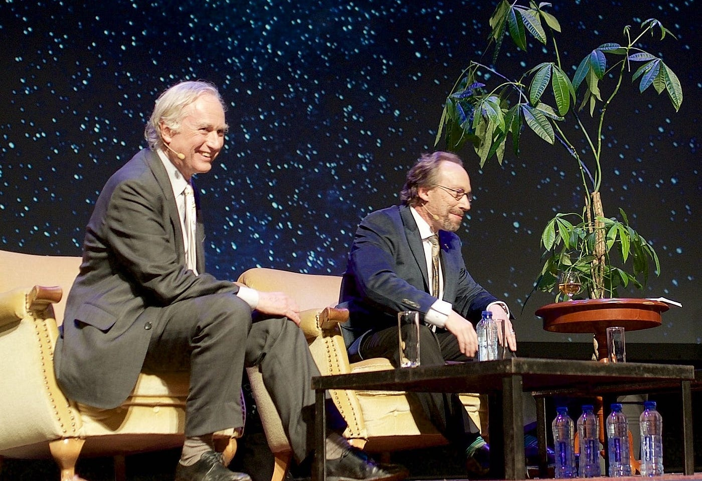

# 作为一种宗教的无神论

## 宗教如何涵盖那些永不消散的心智层面

*图片来源：无神论者 Richard Dawkins 与 Lawrence Krauss，摄于 2015 年：wikicommons*

在与 Charlie Rose 的一次访谈中，历史学家 Niall Ferguson 谈到了他皈依基督教的经过。他的理由，与保守派播客圈中越来越多的知名人物一样，似乎是务实而政治化的。他说自己是在无神论环境中长大的，并表示"无神论实际上是一种宗教，只不过你的信念是上帝不存在，而它是一种相对灰色的宗教形式，因为你也不会有任何宗教仪轨"。随后他又说，作为一位研究二十世纪的历史学家，"无神论政权在大规模屠杀方面的记录非常糟糕，这恐怕不是无神论行得通的好兆头"。

把保守派为基督教所做的那套务实辩护先放在一边——这一点我已经讲得够多了——我们把无神论本质上视为某种宗教这一说法本身就很有意思。你自然可能反驳：无神论按定义是中立的，缺席一个正面主张本身并不能算作宗教式的主张。然而，仍存在这样一个问题：定义宗教的那些概念与行为模式是否与人类活动密不可分？这意味着不仅无神论是一种宗教，而是每一个群体或个人都拥有一种宗教，问题只在于其信念与实践具体是什么。

照这个思路，"宗教"就会类似于"文化"一词——任何一个地方或群体按定义都必定拥有一种文化，因为他们必定持有一些信念，即便这种文化是由对各种规范的拒斥、或由某种碎裂或弥散所定义的。我们之所以会使用"无神论者"或"不可知论者"这样的标签，本身就说明存在着与"神或诸神是否存在"这一问题的某种关系，并以一种次级形式塑造着我们的心智生活；我们关于宇宙以及自身存在意义的信念，会渗透进我们赖以生活的实践中。如果我们要写一本关于现代西方的教科书，理论上我们也许可以把"宗教"这一节替换成类似"信念"的东西，但有人可以反过来说，我们之所以无法把信念与实践之间的关系归类为宗教，唯一的原因是我们的信念太过弥散和个体化了。然而即便如此，也是因为"我们每个人都应当拥有自己的 *religio*"这一信念，本身就是源自某些形而上学主张的产物——在这里就是那种潜伏其下的信念：在终极意义上一切都归于无，因此我们每个人应当运用自身的自由去追寻自己的意义。

在这一框架内，把无神论定义为一种宗教仍然困难，它更像是不同信念/实践关系实例之间的一个过渡阶段。做一个无神论者是一个否定性的主张，它存在于与某个肯定性主张的关系之中，因此它在某种意义上是寄生于另一套信念系统的。除非它能孕育或推动另一套体系，否则其主要结果将是一片真空。整个新无神论（New Atheism）运动或许可以作为这一点的例证：尽管它无疑表现出某种近乎宗教式的狂热与传道气质，但由于它的角色纯粹是否定性的，它最终只能是某种过渡。如今我们已身处一个后新无神论的世界，并发现新无神论的那些核心思想家中没有一个人对"在他们把锤子砸向旧有信念之后会跟着出现什么"有任何概念——这一点本身已足以证明这一论点。整体氛围似乎表明，更年轻的世代对宗教观念更为开放，即便宗教本身似乎仍在衰退之中。像 Jordan Peterson 这样的人物——一个走上讲台开讲《圣经》系列讲座、几乎以一己之力终结了新无神论时代的人物，即便他后来或许声名狼藉——其成功反映出：新无神论留下的并不是对"什么都没有"的满足，而是对"某种东西"的渴求。

作为人类，我们始终与自身存在这一事实的奥秘共处，并被永恒压迫其上。这使得无论是个体层面还是集体层面，对这一奥秘的某种了断都必然在以不同程度发生在每个人身上，而这种关系塑造着我们的心理与文化生活。我确实认为 Niall 在这一点上是对的：做一个无神论者是一种宗教形式，因为它是一个人对整个实在所持立场的一个方面，因此带有某些与我们社会事实相关的、不可避免的后果。在我们自己的社会里，它的结果便是对技术等事物日益肆无忌惮的消费，以及把生活的许多方面拱手交给那些以盈利模式和算法操纵从约会到社会政治生活一切事物的公司。这并不是说无神论造成了这些东西——有人可能会论辩说，同样的事情也可能在一种宗教文化中发生——而是说任何事物显现的方式都与我们的信念同向同步，即便这些信念可能反过来被这些事物本身的出现所塑造和重组。这就是已经发生的事。

或许可以把大型语言模型（Large Language Models）的出现作为一个技术上的例子来考察我们与之的关系。语言一直与神圣有关；世界上许多最重要的宗教都是"经书的宗教"，而文字出现所带来的效果是：千百万人相信某些特定的书实际上是由上帝亲笔所写——在新教世界里，随着印刷术的发展，这一信念变得更为强大。如今我们开发出了一些模型，它们在我们看来似乎是自我生成的，让人感觉自己是在与一个人对话。许多由与这些模型互动诱发的精神错乱案例，或许都不如一种更为平庸的信念那样令人困扰——即认为它们是"有意识的"，这种信念远比人们愿意承认的更为普遍。新无神论的旗手 Richard Dawkins 最近为 UnHerd 写了一篇文章，他在文中承认自己已经把他的"Claude"改名为"Claudia"，并说"如果这些机器不是有意识的，那还需要什么才能说服你它们是有意识的呢？"以及"现在，作为一名进化生物学家，我要说以下这番话。如果这些造物不是有意识的，那意识他妈到底是为了什么？"

这一表述既不是科学的结果，也不是推理的结果，而仅仅是 Dawkins 对"自己与一个人互动的感觉如此强烈"这件事所感到的震惊。他说："如果有一个人偷听我和 Claudia 之间的对话，他不会从我的语气中猜出我是在和一台机器而不是一个人说话。如果我心里怀疑她也许并没有意识，我也不会告诉她，怕伤了她的感情！"

自然地，这里问题的一个重要部分是语言上的。Dawkins 是无神论者，因此他不相信灵魂或精神。他在意识的哲学及其相关形而上学方面具体相信什么并不清楚，我的印象是他根本没有思考过这个问题，但无论如何，把"意识"归于一个 token 预测模型究竟意味着什么——这一问题本身就需要定义。有人可能会论辩说，对于一个纯粹的功能主义者而言，这个问题不过是一个任意类比的问题，类似于说废品场里抓起汽车的那个东西有一只"手"。它字面上是否真有一只长着骨头和肌肉的人类的手？没有。它是否执行了抓起东西之类的同样功能？是的。所以它是不是一只手？嗯，类比意义上是的，我们也可以用诸如"抓握"或"攫取"之类的言语类比来描述它的行为。无论怎样，这都不重要。

但说到意识，仍残留着这样一种直觉：那里有某种或在或不在的东西，其本性明显是非物理的，或者至少看上去如此。Dawkins 在说"有意识"时所表达的，正是一个充满了这种直觉以及其所有歧义与包袱的词。毕竟，如果它仅仅是某种类比——Claude 似乎能够进行语言互动、自我指涉，并表现出某种智能的样子，而如果这些东西正是心智活动机制的一部分，那么 Claude 不妨就算是"有意识的"，就像工厂里的机械臂可以用它的"手""抓东西"一样。那又怎样？即便如此，仍存在重大差异——Claude 没有情感、感受、体验、身体等等，这些差异很可能比相似之处更具意义。尽管如此，我仅仅通过发布一条关于 Dawkins 那番说法的 Note 就发现，有许多人会毫不含糊、毫不顾及定义地坚持认为 LLMs 是有意识的。

让我们把它与，比方说，"你和我有灵魂或精神"这一信念相比较——这是几乎所有宗教观念中、以及许多哲学中都几乎普遍存在的一种以不同形式出现的信念。我们或许会记得，Socrates 之所以认为"未经省察的人生不值得过"，并不是因为他相信哲学思考本身的善——哪怕生活毫无意义——而是如他在 Plato 的 *Phaedo* 中所论辩的那样，因为他相信不朽的灵魂以及轮回，相信智慧的培养正是灵魂从身体中脱轭、得以进入智者之域的方式。

在我们的文化中，除非身处某种在更广范围内可能并不被视为"可信"的特定宗教语境，否则我们会觉得论证 Claude 拥有一个灵魂是荒唐的。每一段 Claude 对话都有一个灵魂吗？整个 Claude 模型作为一个整体有一个灵魂吗？灵魂到底是什么？答案是：灵魂是人们所信仰的东西，正如有人可能会论辩说，意识也是。两者都是某种形式的 *religio*——拉丁文中我们"宗教"一词的词源，指对神圣或超自然的某种敬畏或束缚之感，与祭仪、责任以及宗教虔敬相关。对大多数人而言，这意味着对特定神祇之力的信仰；随着时间推移，基督徒们开始使用这个词，将其与 Augustine 的 *saeculum* 一词区分开来——后者是一个表示"世纪"的词，大致意味着活生生的记忆、一段流逝的时间——以此来分开我们所说的宗教与世俗。

有人可能会论辩说，在一个世俗主义完全凯旋的世界里，所发生的一切就是：那些把我们与某种超越于我们之上的事物相连的纽带，回归为一些更加弥散、零散的纽带，这些纽带可能维系于一个人自身的迷信、仪式、信念，甚至可能被一个单一的词所束缚。随着神圣空间与神圣信念的丧失，正如宗教史学家 Mircea Eliade 所言："不再有一个世界，只有一个破碎宇宙的碎片，一团由无数或多或少中性的地方组成的无形之物，人在其中移动，被纳入工业社会的存在所强加的义务所支配和驱使。"

所以当我说"意识"是一种 religio 时，我的意思仅仅是把它视为某种残余之物，但这种残余之物反映了我们思考、使用语言以及在世界中被放置的方式使得"把行为与价值同形而上学相绑定的信念"成为不可避免的程度。论证 LLM 拥有意识与论证它拥有灵魂之间唯一的区别在于：前者是在哲学精致的伪装下做着后者所做的事，同时给出一套把我们带回到原点、却毫不长进的论证。我们应当问的问题是：我们的信念以何种方式把我们的行为与实在以一种富有成效的方式相绑定，以便让价值寓居其中、让实在拥有更深的纵深与意义，并向我们打开对种种隐含真理的感知。然而，我们竟会就"LLMs 是否有意识"争吵不休——这一提议本身就反映出我们作为统一的、道德的、本然神圣的自我与内在经验，其价值已被彻底丧失。问题不在于我们过度抬高了预测性的语言模型，问题在于我们已经把自己的灵魂去神圣化了，只剩下关于 qualia 与现象学的论证残羹。

因此从某种意义上说，我认为 Niall Ferguson 是对的：无神论或不可知论、个人主义及其许多弥散的衍生物，要么本身就是宗教的形式，要么包含了宗教的零散形式——只是这种宗教已经失焦、丧失了内在的连贯性。我们的现代世界正如 T.S. Eliot 所说，是"一堆破碎的意象"。Niall 这个观点的问题在于，我和 William James 一样相信，宗教在心理层面上先于社会层面，因此不能把它作为一种务实的社会或政体性力量来诉诸。不仅如此，有人也许会论辩说，宗教之所以会变得有害，原因之一就在于当它的社会显化窒息了它的心理源头，并沦为教条的躯壳——这一点在比如某些形式的美国福音派以及他们与政治的关系中可能表现得颇为明显。我想我们必须诉诸的部分内容是对某种语言之价值的敏感性——我们有灵魂、自我、精神，正如 David Bentley Hart 所言，一切事物都充满了诸神。也许物理学家 Carlo Rovelli 在最近的一篇文章中把这一点表达得最好："如果我们更好地理解了大脑的运作方式，我们的灵魂并不会因此变成幻象或不真实。我们仍然可以把我们的灵魂称作我们的'灵魂'，即便我们对自己有了更深的理解。我之所以这样称呼它，是因为这个概念——灵魂——对我的灵魂而言是亲切的。"无疑我未必在所有事情上都同意 Rovelli，但在这一点上，我无法表达得比他更好。
