# Back Propagation Through Time：RNN 的数学基础

本文配有一个 youtube 视频，通过动画直观地演示并讲解其中的数学。[点击此处观看 youtube 视频。](https://www.youtube.com/watch?v=4w22I9f8j5Y)

股票数据、半句没说完的话和一段音频片段，三者有什么共同点？

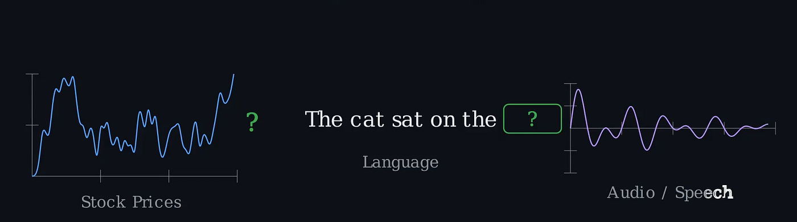

它们都是 sequential data，而在每一种情形下，我们都想预测接下来会是什么。无论那是下一天的股价、句子里的下一个/缺失的词，还是下一个 phoneme。让这件事变难的地方在于：答案不存在于任何单个值里；它存在于这些值随时间展开的 pattern 里。

那么这里有个有趣的问题：如果我告诉你存在一种带记忆的机器学习模型呢？不是那种通常意义上的硬盘式记忆——存进去再读出来——而是更像你记一本书里故事的方式，在书的任何一处，你都拥有一份对此前发生之事的、被压缩过的、滚动更新的概要，每读到一个新词就更新一次。这就是 recurrent neural network 所做的事情，而它通过一种巧妙的方法来维护和更新 hidden state，也就是模型对目前为止整段序列的"压缩概要"。

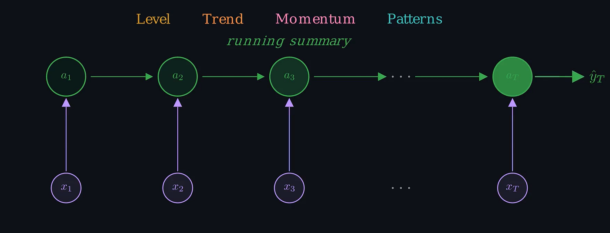

由于 hidden state 是模型对目前为止整段序列的滚动概要，模型会随着每个新输入的到来更新这份概要/hidden state，并把它带到下一步。等我们走到末尾时，hidden state 就是一份对整段序列中模型认为相关的一切内容的压缩表示。重要的是要注意，模型自己学会什么是值得记住的，我们并不告诉它/工程化地让它去追踪趋势、动量或语法；它会自行琢磨出过去的哪些特征对做出预测有用。其次，由于在每一步都应用同样的更新规则（模型权重在每个节点/步骤上保持一致），这种模型架构可以处理任意长度的序列，无论那是一个 10 个值的序列还是一个 500 个值的序列。

在本文剩下的部分，我们会把 hidden state 的这种更新到底是怎么发生的数学一步一步走一遍，推导出训练它所需的 gradients（"Backpropagation Through Time"——给一个算法起这个名字是不是酷得不行？！），最后在 Python 里从零实现这整套东西。

**理解 RNNs：数学描述**

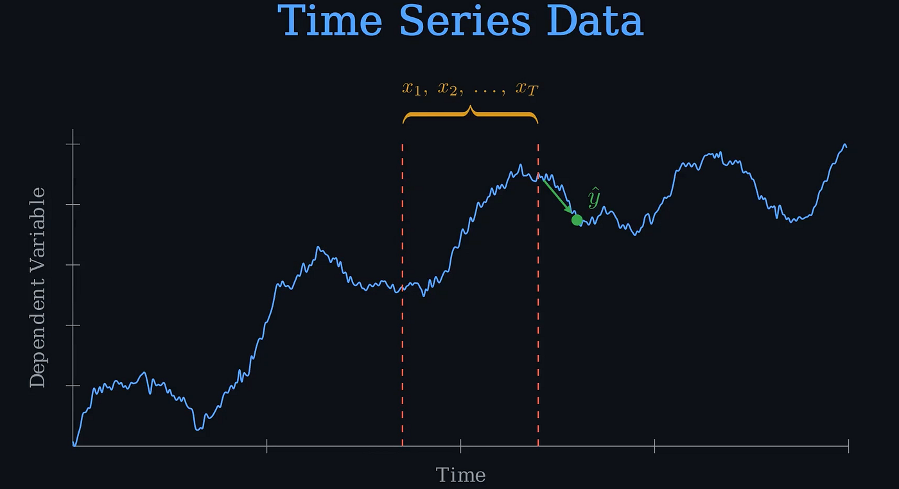

考虑用黑色箭头标出的那个点 y，以及 y 之前（红色虚线之间）的那些点，记为 *X = {x\_1 , x\_2 , ….x\_t …..x\_T}*，其中 T 是时间步的总数。RNN 处理输入序列 (X) 的方式是：把每个输入通过一个 hidden state（有时也叫做 memory state），并输出 y。这些 hidden states 让模型能够捕捉并记住序列中更早位置的 patterns。

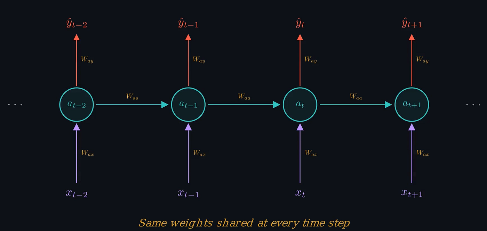
*一张 RNN 模型的示意图，展示了输入、hidden states 和输出*

现在我们来看 RNN 模型内部的数学运算，首先考虑 forward pass；模型优化的事我们稍后再操心。

**Forward Pass**

在每一个时间步，我们把上一步的 hidden state 与新的输入组合起来，通过 tanh 把它压扁，得到一个更新后的 hidden state，然后基于这个新的 hidden state 做出预测

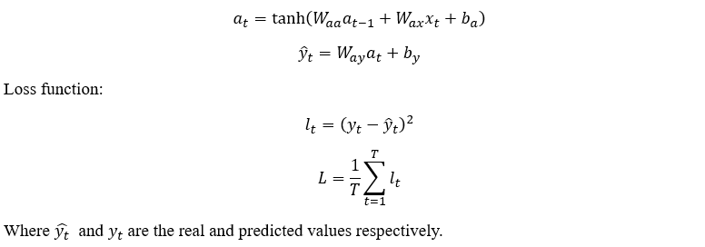

**Backpropagation Through Time**

在机器学习里，优化（变量更新）是用 gradient descent 方法完成的：

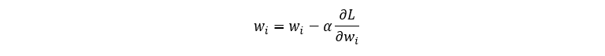

因此，训练期间所有需要更新的参数都需要它们各自的偏导数。这里我们将推导 loss function 对 forward pass 方程中所包含的每个变量的偏导数：


注意 forward pass 方程和 Figure 2 中的网络示意图，我们可以看到在时间 T 时，L 只通过 y\_T 依赖于 a\_T，即

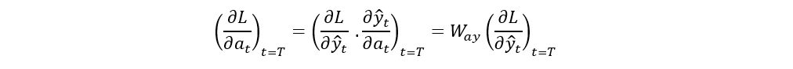

然而，对于 t < T，L 通过 y\_t 依赖于 a\_t，但也间接地依赖，因为 a\_t 影响 a\_(t+1)，后者又影响 a\_(t+2)，依此类推一直到 a\_T，所以我们对两者都用链式法则：

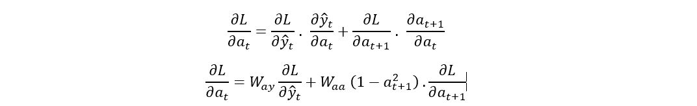

这个方程表明，导数 ∂L/(∂a\_t ) 是递归的，需要按递归方式求解。在写出通用公式之前，先展开一个小例子来把各项可视化会比较有帮助。考虑一个 T=4 的例子，即我们建立了一个时间序列问题，只考虑最后 4 个时间步来预测下一个时间步。从最后一个时间步开始、递归地向前推进，得到：

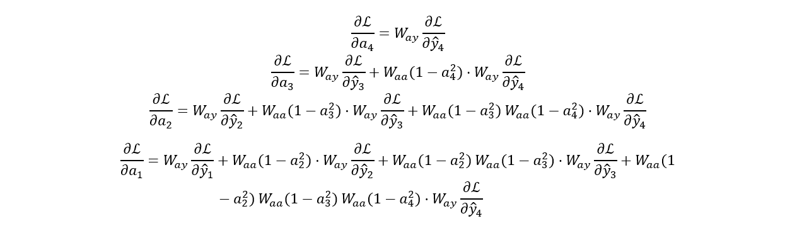

我们可以用一种更紧凑的记号写出 ∂L/(∂a\_t ) 的方程：

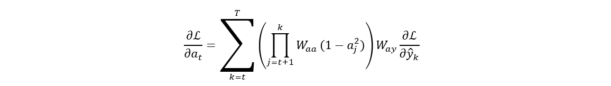

我们其实并不需要这个来定义其余参数的偏导数，但这个方程揭示了一个重要的洞见。如果你看 W\_ay · ∂L/∂y\_k 的系数：每往时间上多回退一步，乘积里就多一个 W\_aa 因子。如果 |W\_aa| < 1，这些因子会向零方向复合，早期步骤的 gradient 就会消失。如果 |W\_aa| > 1，它们就会炸开。无论哪种情况，长序列都难以训练；这就是 RNN 上非常常见的经典 vanishing/exploding gradient 问题。

我们可以继续写出其余参数的偏导数：

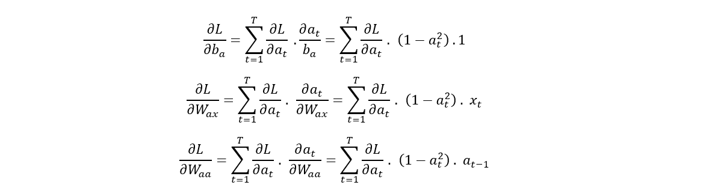

现在我们有了 loss function 对 forward pass 方程中所有参数的 gradient 方程。这个算法就叫 Backpropagation Through Time。需要说明的是，对于时间序列数据，通常只有最后一个值对 Loss function 有贡献，即所有其他输出都被忽略，它们对 loss function 的贡献被置为 0。数学描述与已呈现的相同。现在我们用 Python 把这些方程编码出来，并应用到一个示例数据集上。

**代码实现**

在我们能实现上面那些方程之前，需要先导入必要的数据集、做预处理并为模型训练做好准备。所有这些工作在任何时间序列分析里都是非常标准的。

```python
import numpy as np
import pandas as pd
import matplotlib.pyplot as plt
import plotly.graph_objs as go
from plotly.offline import iplot
import yfinance as yf
import datetime as dt
import math
start_date = dt.datetime(2020,4,1)
end_date = dt.datetime(2023,4,1)

data = yf.download("GOOGL",start_date, end_date)
pd.set_option('display.max_rows', 4)
pd.set_option('display.max_columns',5)
display(data)
training_data_len = math.ceil(len(data) * .8)
train_data = data[:training_data_len].iloc[:,:1]
test_data = data[training_data_len:].iloc[:,:1]
dataset_train = train_data.Open.values

dataset_train = np.reshape(dataset_train, (-1,1))
dataset_train.shape
scaler = MinMaxScaler(feature_range=(0,1))

scaled_train = scaler.fit_transform(dataset_train)
dataset_test = test_data.Open.values
dataset_test = np.reshape(dataset_test, (-1,1))
scaled_test = scaler.fit_transform(dataset_test)X_train = []
y_train = []
for i in range(50, len(scaled_train)):
    X_train.append(scaled_train[i-50:i, 0])
    y_train.append(scaled_train[i, 0])
X_test = []
y_test = []
for i in range(50, len(scaled_test)):
    X_test.append(scaled_test[i-50:i, 0])
    y_test.append(scaled_test[i, 0])

X_train, y_train = np.array(X_train), np.array(y_train)

X_train = np.reshape(X_train, (X_train.shape[0], X_train.shape[1],1))
y_train = np.reshape(y_train, (y_train.shape[0],1))
print("X_train :",X_train.shape,"y_train :",y_train.shape)

X_test, y_test = np.array(X_test), np.array(y_test)

X_test = np.reshape(X_test, (X_test.shape[0], X_test.shape[1],1))
y_test = np.reshape(y_test, (y_test.shape[0],1))
```

**模型  
**现在我们来实现那些数学方程。强烈建议把代码读一遍，留意所有变量及其对应导数的维度，给自己对这些方程一个更好的理解。

```python
class SimpleRNN:
    def __init__(self,input_dim,output_dim, hidden_dim):
        self.input_dim = input_dim
        self.output_dim = output_dim
        self.hidden_dim = hidden_dim
        self.Waa = np.random.randn(hidden_dim, hidden_dim) * 0.01 
        self.Wax = np.random.randn(hidden_dim, input_dim) * 0.01
        self.Way = np.random.randn(output_dim, hidden_dim) * 0.01
        self.ba = np.zeros((hidden_dim, 1))
        self.by = 0     def FeedForward(self, x):
        
        a = [np.zeros((self.hidden_dim,1))]
        y = []
        for ii in range(len(x)):
            a_next = np.tanh(np.dot(self.Waa, a[ii])+np.dot(self.Wax,x[ii].reshape(-1,1))+self.ba)
            a.append(a_next)
            y_local = np.dot(self.Way,a_next)+self.by
            y.append(np.dot(self.Way,a_next)+self.by)
        
        
        return y, a        def ComputeLossFunction(self, y_pred, y_actual):
        
        
        
        loss = (y_pred[-1] - y_actual) ** 2
        return loss        def ComputeGradients(self, a, x, y_pred, y_actual):
        
        dLdy = []
        dLdby = np.zeros((self.output_dim, 1))
        dLdWay = np.random.randn(self.output_dim, self.hidden_dim)/5.0
        dLdWax = np.random.randn(self.hidden_dim, self.input_dim)/5.0
        dLdWaa = np.zeros((self.hidden_dim, self.hidden_dim))
        dLda = np.zeros_like(a)
        dLdba = np.zeros((self.hidden_dim, 1))                for t in range(self.hidden_dim-1, 0, -1):
            if t == self.hidden_dim-1:
                dldy = 2*(y_pred[t] - y_actual)
            else:
                dldy = 0
            dLdy.append(dldy)
            dLdby += dldy
            dLdWay += np.dot(np.array(dldy).reshape(-1,1), a[t].T)                        
            if t == self.hidden_dim-1:
                dlda_t= np.dot(self.Way.T, np.array(dldy).reshape(-1,1))
            else:
                dlda_t = np.dot(self.Way.T, np.array(dldy).reshape(-1,1)) + np.dot(self.Waa, dLda[t+1]) * (1 - a[t]**2)
            dLda[t] = dlda_t                        rec_term = (1-a[t]*a[t])                         dLdWax += np.dot(dlda_t, x[t].reshape(-1,1))*rec_term
            dLdWaa += np.dot(dlda_t, a[t-1].T)*rec_term
            dLdba += dlda_t*rec_term                return dLdy[::-1], dLdby[::-1], dLdWay, dLdWax, dLdWaa, dLdba        def UpdateParameters(self,dLdby, dLdWay, dLdWax, dLdWaa, dLdba,learning_rate):
        self.Waa -= learning_rate * dLdWaa
        self.Wax -= learning_rate * dLdWax
        self.Way -= learning_rate * dLdWay
        self.ba -= learning_rate * dLdba
        self.by -= learning_rate * dLdby            def predict(self, x, n, a_training):
        
        a_future = a_training
        y_predict = []
        
        for ii in range(n):
            a_next = np.tanh(np.dot(self.Waa, a_future[-1]) + np.dot(self.Wax, x[ii]) + self.ba)
            a.append(a_next)
            y_predict.append(np.dot(self.Way, a_next) + self.by)
        return y_predict
```

训练并测试模型

```
input_dim = 1
output_dim = 1
hidden_dim = 50learning_rate = 1e-3

rnn_model = SimpleRNN(input_dim, output_dim, hidden_dim)

for epoch in range(200):
    for ii in range(len(X_train)):
        y_pred, a = rnn_model.FeedForward(X_train[ii])
        loss = rnn_model.ComputeLossFunction(y_pred, y_train[ii])
        dLdy, dLdby, dLdWay, dLdWax, dLdWaa, dLdba = rnn_model.ComputeGradients(a, X_train[ii], y_pred, y_train[ii])
        rnn_model.UpdateParameters(dLdby, dLdWay, dLdWax, dLdWaa, dLdba, learning_rate)
        print(f'Loss: {loss}')y_test_predicted = []
for jj in range(len(X_test)):
    forecasted_values, _ = rnn_model.FeedForward(X_test[jj])
    y_test_predicted.append(forecasted_values[-1])
y_test_predicted_flat = np.array([val[0, 0] for val in y_test_predicted])
trace1 = go.Scatter(y = y_test.ravel(), mode ="lines", name = "original data")
trace2 = go.Scatter(y=y_test_predicted_flat, mode = "lines", name = "RNN output")
layout = go.Layout(title='Testing data Fit', xaxis=dict(title='X-Axis'), yaxis=dict(title='Dependent Variable'))
figure = go.Figure(data = [trace1,trace2], layout = layout)
iplot(figure)
```

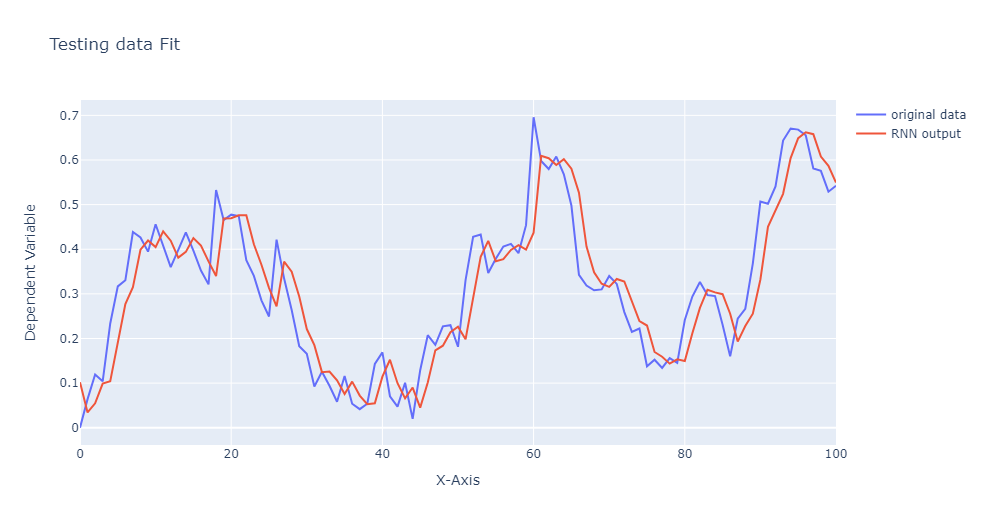

到这里这次演示就结束了，但希望这只是你进一步阅读这些强大模型的起点。你可能会觉得用一个不同的 activation function 来做 forward pass、以此检验自己的理解，会很有帮助。或者进一步阅读像 LSTM 和 transformers 这样的 sequential models，它们是非常强悍的工具，尤其是在语言相关的任务上。探索这些模型可以加深你对处理时间依赖关系的更精巧机制的理解。最后，谢谢你花时间读这篇文章。希望它对你理解 RNNs 或它们背后的数学有所帮助。

*除非另有说明，所有图片均由作者绘制*
