# 用初等微积分为神经网络中的梯度下降建立扎实直觉

## **手工学梯度：误差 × 影响，一次一步**

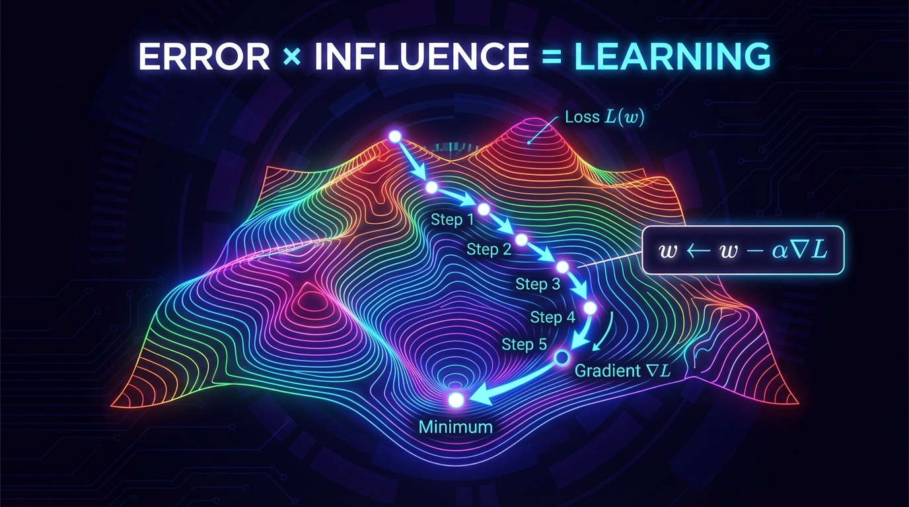

梯度下降是支撑现代神经网络与机器学习的基础优化算法。然而，数学形式化表达常常掩盖了这一强大技术背后那份惊人地简单的直觉。大多数教科书通过矩阵微积分和向量导数来介绍梯度下降，这会让人感到抽象与望而生畏。本文中，我们只用初等微积分和基本代换，通过具体示例来建立直觉。通过手工求解特定矩阵维度——2×3、3×2 和 3×3——的问题，我们可以发展出对梯度下降实际运作方式的深入、直观的理解。

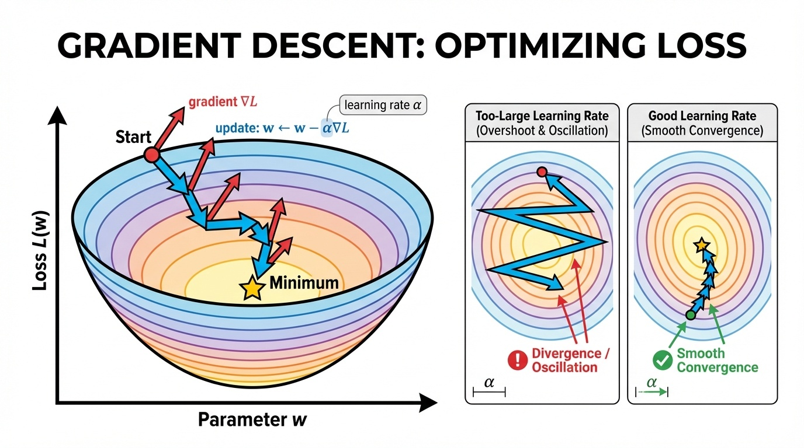

## 理解问题：线性变换

让我们从一个简单但重要的运算开始：用一个 2×3 矩阵 **A** 把一个 3 维向量变换为一个 2 维向量。这正是神经网络中一层所发生的事情，我们把输入通过线性变换产出输出。

考虑这个矩阵：

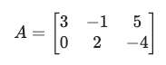

当我们将它与一个 3 维输入向量相乘：

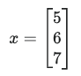

我们得到一个 2 维输出：

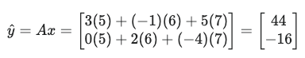

这个变换是神经网络中的核心运算。矩阵 **A** 包含学习到的参数（权重），**x** 是我们的输入，*y*^​ 是我们的预测。问题来了：如果我们的预测与实际期望的输出不匹配，我们应该如何调整 **A** 的各个元素来改进预测？

## 矩阵微积分方法（紧凑，但抽象）

我们将损失函数定义为均方误差：

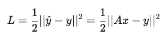

要最小化这个损失，我们需要 **L** 关于 **A** 的梯度。紧凑的矩阵结果是：

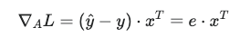

其中 **e** 是误差向量。

这很简洁，但如果你还没有把矩阵导数内化于心，它会感觉像"魔法"。

## 初等微积分方法：建立真正的直觉

## 从标量例子开始

在处理矩阵之前，考虑一个简单的标量函数：

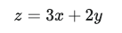

假设我们想要的实际值是 *za*​。定义误差：​

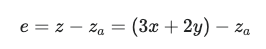

以及平方误差损失：

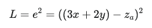

用链式法则求导：

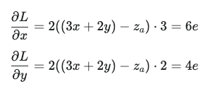

**关键模式：** 每个梯度等于**误差**乘以该变量在原表达式中所带的**系数**（再乘以由平方带来的 2）。这只是简单的代换 + 链式法则。

**梯度下降的反直觉视角**

梯度下降在概念上最棘手的一点，是对传统数学视角的根本性反转。在经典代数里，我们把系数视为固定常数，把变量视为我们要操作的对象——在 *y*\=3*x*+2 中，数字 3 和 2 是参数，而 *x* 是变量。然而，在训练神经网络时，这种关系完全颠倒过来。训练数据 (*x*,*y*,*z*) 成为固定常数，而模型参数 (*a*,*b*) 成为我们要优化的变量。当我们计算损失函数 *L*\=(*ax*+*by*−*z*)^2 的梯度时，我们计算 ∂*L/*∂*a*​ 和 ∂*L/*∂*b*​，把数据当作常数处理——恰恰与我们普通的代数直觉相反。正是这种反转使学习成为可能：我们调整系数去拟合观测到的数据，而不是反过来。理解梯度是相对于参数而不是相对于输入流动的，这对于把握神经网络究竟是如何学习的至关重要。

## 链式法则：反向传播背后的唯一思想

这正是可以扩展到神经网络的思想：网络是函数的复合，梯度通过反复应用链式法则向后流动。

### 把链式法则视为流水线（前向 vs 反向）

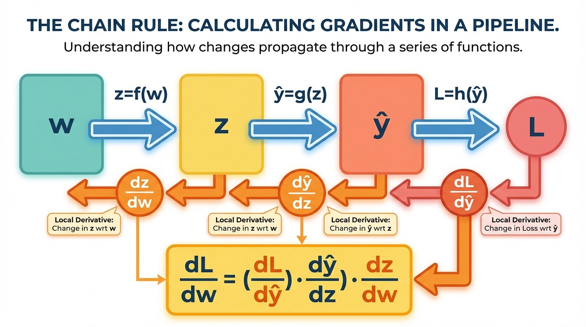

## 接到矩阵情形（无需矩阵微积分）

现在通过写出标量形式，把同样的逻辑应用到矩阵问题上。

对于第一个输出：

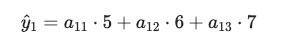

如果 *y*1​=40 且 *y*^​1​=44，那么：

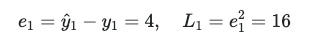

现在求导（完全和标量例子一样）：

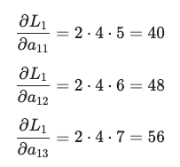

**解读：**

-   如果某个输入值很大，那个权重对输出的影响就强 → 梯度更大 → 更新更大。
-   如果误差很大，所有东西都会更激进地更新。

## 外积梯度（紧凑公式真正在说什么）

紧凑的梯度表达式：

∇*A*​*L*\=*e*⋅*xT*

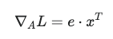

只是**一次性写出所有那些标量导数**的方式。

### 把外积梯度看作形状感知的热力图

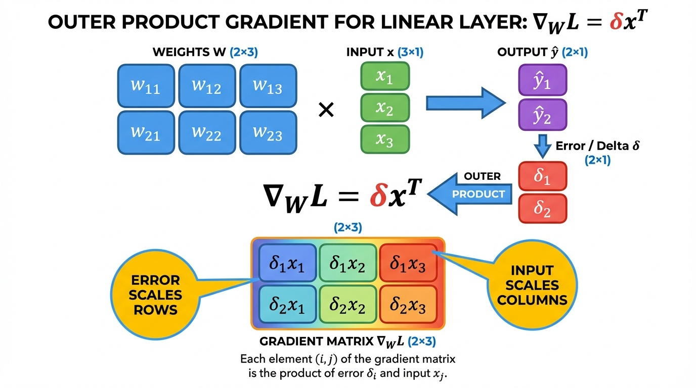

## 学习率与梯度下降更新

一旦有了梯度，更新规则是：

*A\_new*​=*A\_old*​−*α*⋅∇*A*​*L*

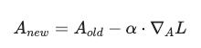

学习率 *α* 控制步长大小：

-   太大：会过冲、振荡甚至发散
-   太小：稳定但缓慢

（这正是你在文章顶部那张损失地形图里看到的。）

## 实践题：通过反复练习建立直觉

内化这些概念的最好方法是动手实践。下面是三道不同矩阵维度的题目，每道执行两次梯度下降迭代。

## 实践题 1：2×3 矩阵（3D → 2D 变换）

**初始设定：**

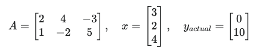

学习率：*α*\=0.1

**迭代 1：**

预测：

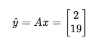

误差：

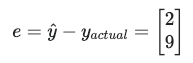

损失（参考）：

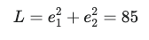

梯度（外积）：

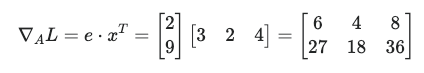

更新：

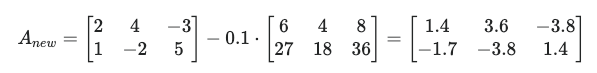

**迭代 2：**

预测：

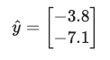

误差：

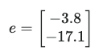

损失增大：

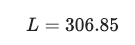

梯度：

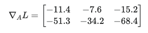

更新：

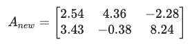

## 实践题 2：3×2 矩阵（2D → 3D 变换）

**初始设定：**

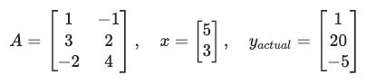

学习率：*α*\=0.1

**迭代 1：**

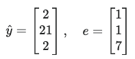

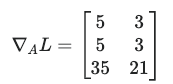

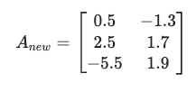

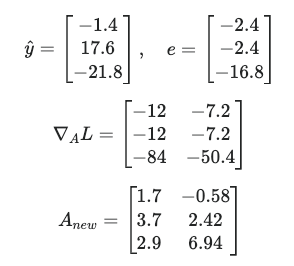

## 实践题 3：3×3 矩阵（3D → 3D 变换）

**初始设定：**

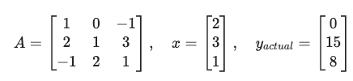

学习率：*α*\=0.1

**迭代 1：**

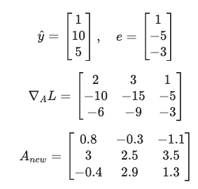

**迭代 2：**

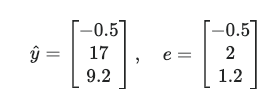

## 从线性变换到神经网络

迄今为止所有内容都是线性的：*y*\=*Ax*。但堆叠线性层会塌缩：

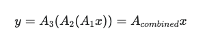

所以纯线性网络无法学习复杂的非线性模式。解决办法是加入非线性激活函数：

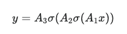

常见的激活函数包括：

-   **ReLU**：*σ*(*z*)=max(0,*z*)
-   **Sigmoid**：*σ*(*z*)=1+*e*−*z*1​
-   **Tanh**：*σ*(*z*)=tanh(*z*)

反向传播无非是同一套链式法则的思想被反复地应用到这些层上。

### 单个神经元的前向 + 反向（反向传播就是链式法则）

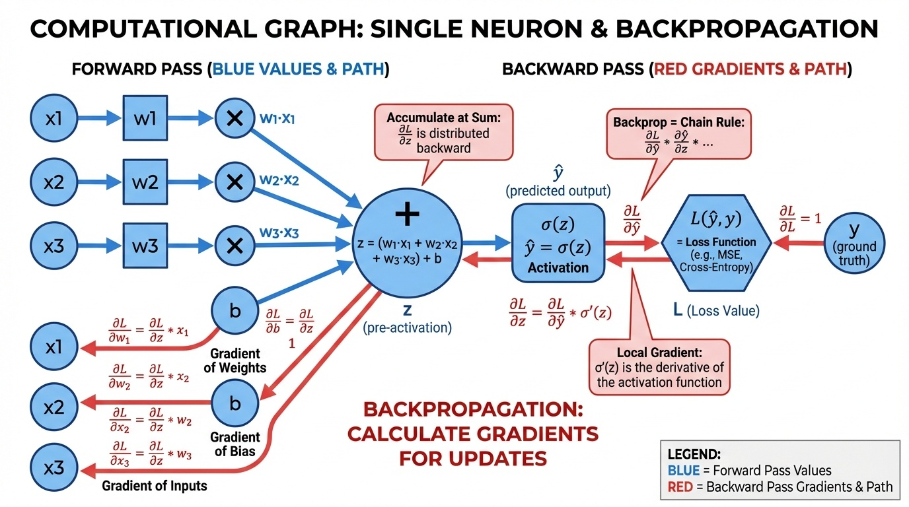

### 通过 2 层网络的反向传播（梯度如何流向 W2 再到 W1）

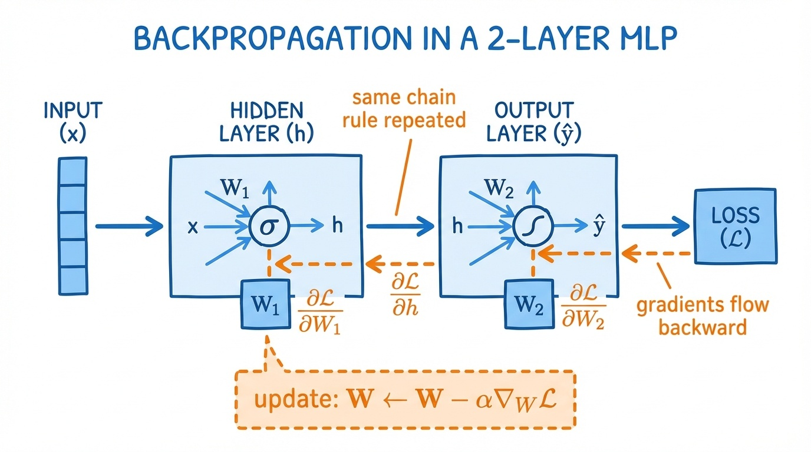

## 结论

剥离掉符号之后，梯度下降本质上是简单的：

1.  计算预测和误差
2.  使用链式法则求导（误差乘以系数/影响）
3.  把所有那些标量导数收集成一个整洁的矩阵形式：∇*A*​*L*\=*ex^T*
4.  通过沿梯度反方向走一步来更新参数：*A*←*A*−*α*∇*A*​*L*

通过手工完成具体的小矩阵示例，你能建立起可以直接迁移到深层网络中反向传播的直觉：它只是带着仔细记账的、反复应用的链式法则。

\*AI 生成图片
