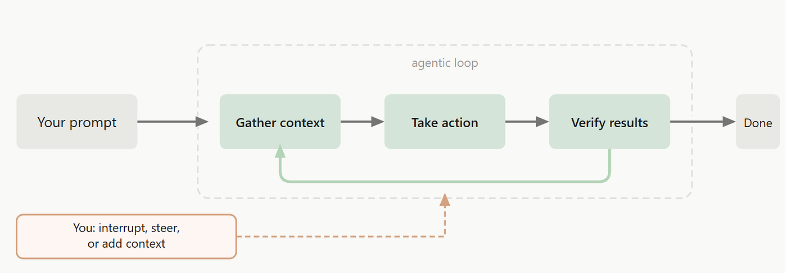
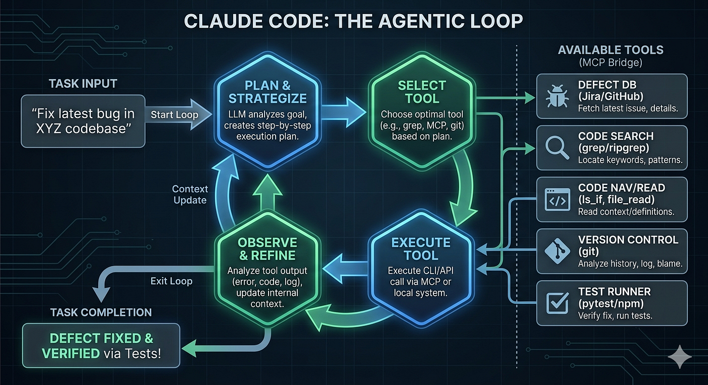

# Claude Code 大陆探险记

## 深入剖析掌握 Anthropic 编码 Agent 所需的架构与组件

> 要把 Anthropic 的 Claude Code 用到极致,需要理解它的核心设计、设计哲学,以及它提供的一整片广阔的工具版图。这篇文章是一份流畅、白话的入门,介绍关键的基础概念。我们会深入挖掘 Claude 的各个组件,例如 Skills、Commands、Agents、Hooks 与 SDK。阅读本文没有任何前置门槛。和我其他文章一样,这一篇也是 100% 人类写的,辅以从实战中提炼出来的最佳实践。

### 什么是 Claude Code

Claude Code 是一个 **tool**,最初是作为一个“*side project*”开发的,用来帮助 Anthropic 自己的程序员更高效地使用 AI。结果它太受欢迎了,于是他们决定把它发布给公众。Claude Code 是:

-   **一个 Coding 工具**:是的,可以帮你生成代码,但远不止如此……
-   **AI 驱动的**:连接到 Claude AI 模型来获得智能
-   **基于终端的**:它最初的形态是一个简单的 **C**ommand **L**ine **I**nterface (CLI),不过现在也支持各种 IDE。也许正是这种 CLI 上的简洁让它流行起来。CLI 至今仍是最受欢迎的界面
-   **Agentic 的**:在今天这个时代它怎么可能不是 :) Claude Code 自带一组精巧的工具,使它能够 *autonomously* 执行用户请求的任务。但它也有“*deterministic triggers*”,确保具备一定的可预测性与更高的安全性。我们后面会研究这些。

### 灵感来自“酷程序员”的工作方式

你可能注意到,优秀的程序员经常使用 *Terminal commands*。这些指令被敲进 CLI(比如 mac 上的 Terminal 或 Windows 上的 CMD),让我们能够直接和操作系统打交道。把若干简单的 Terminal 命令串起来就能完成很多事。Boris Cherny 和团队大概是在琢磨,如何把 Terminal 命令的威力和 LLM 的智能结合起来。他们写了包装层,让 Claude LLM 能用上每天伟大程序员都在用的同一套工具!

他们没有用抽象的 API 包装,而是让 Claude 能直接、轻松地使用 **tools**,例如 Terminal、文件系统、GIT 命令、bash 命令(*grep*、*tail 等*),*用法和程序员日常用法一样原汁原味*。这个简单的设计决定带来了巨大的差别。为什么?你看,Claude Code 并没有把 AI 当成主力,它主要依赖上述这些工具(*就像程序员那样*)来收集关于任务的大量上下文,然后再按需调用 AI。由于这些工具是 **deterministic 的**(*即它们会执行所请求的动作,并返回预期的输出*),这意味着更少的 AI tokens、更少的幻觉等等。当然,Boris 和团队为构建安全机制和管控、确保这些强大的工具不被滥用,投入了大量工作。

考虑一下分析一个庞大代码库的任务。依赖 AI 和 *semantic searches* 的工具,在面对复杂查询时可能反而不如传统工具和 *regular text searches* 好用。这正是 Claude Code 大放光彩的地方。***它在理解代码库这件事上异常出色。*** 一个体验 Claude Code 大陆的好方法,就是把它指向一个代码库,然后问一些刁钻的问题。你会被回答的精细程度震惊。因为它有工具能访问 GIT history 和 commit logs,它真的能在一瞬间 *看见* 代码库是如何随时间演变的,而且能回答相当哲学的问题(*唉,这个函数是怎么变成现在这副样子的?*)。

***Tip:*** *虽然它以编程闻名,Claude Code 在别的任务上意外地擅长,尤其是创意类任务。所以它其实是一个通用 agent!* ***我发现它在生成创新性 presentation 上出乎意料地有效。***

### Claude Code 背后的 AI

Claude Code 本身只是一个跑在你桌面上的程序,用户界面是 CLI。智能来自它所连接的 Anthropic 的 LLM。我们可以在 **Opus**(*聪明的那位*)、**Sonnet**(*均衡的那位*)和 **Haiku**(*敏捷的那位*)之间选择。初学时用 Haiku,做正经工作时切到 Sonnet。Opus 留给规划这一环就好。Sonnet 用 Opus 五分之一的成本提供了约 98% 的性能。我儿子用 Opus 作为模型给自己的“Hello World”程序烧掉了我们一个月的 tokens 额度,被我臭骂了一顿。

这些 LLM 支持 200K **context window**,不过最新的 Opus 可以到一百万。**context window** 就是除了实际任务之外,喂给 LLM 的 *task specific information*。它应包含有助于 LLM 执行所请求任务的信息。Context 可以包含我们希望 LLM 在生成新代码前先分析的自定义代码或库,也可以包含自定义指令、我们希望它遵循的公司专属编码规范、公开渠道找不到的领域专属数据,或你的应用的用户手册,或者正在进行的对话的细节(*因为 LLM 是无状态的,下一次调用必须包含过去所有的对话历史*),以及任何能让 LLM 更好地完成你的任务的东西。200K 大约相当于 500 页文本。

那是 *一大堆* 上下文!LLM 利用它们的 *general reasoning power* 去解读上下文(*其中包含领域专属信息*),从而完成所请求的任务。所以你现在拿到了全貌。Claude Code 从用户那里接到任务,收集执行任务所需的全部信息,并把它传给 Claude LLM。它利用 LLM 的智能把活干完,然后把结果反馈给用户。我们稍后会研究著名的“*agent loop*”。

当 context 变得臃肿时,Claude 有一个自动“压缩”它的特性。它会停下来,做摘要,使用“**compact**” *command* 来压实所有可用信息并保存。然后它清空自己的 **context window**,一个全新的 Claude Code 实例读取保存下来的信息并无缝继续。

Claude 使用的 LLM 基于常见的 transformer 架构。它们大体上是按常规方式训练的。除了 RLHF,Anthropic 还使用了一种叫 **Constitutional AI** 的方法(*一套像宪法一样的规则*),用来让模型与人类价值观对齐。他们的做法是:让模型对各种提示生成回应,包括 *toxic* 的提示。然后 Claude 会基于自己宪法中的某条原则对自己的回答进行自我批评并重写它们。模型再用这些改进后的回答进行微调。

### Claude Code 也有非 CLI 的界面!

除了 CLI 界面,Claude 还有一个桌面 App 形态,带一个精致的 GUI,适合对 Terminal 有恐惧症的用户。还有一个网页界面 claude.ai,我们可以通过普通浏览器使用 Claude Code。然后是 IDE 扩展 —— VS Code 与 JetBrains。甚至还有 Claude Cowork,这是一种适合日常(非软件相关)任务的 agentic 工具。最后,还有面向手机的 Claude app。选择真不少!

截至目前,Claude code 既不开源也不免费。它按月订阅 $17 提供(如按年计费)。可以用 Ollama 通过 Claude Code CLI 调用本地托管的开源 LLM(*经由环境变量 ANTHROPIC\_BASE\_URL*)。这样成本为零。然而,这种用法可能没有官方支持。

### 2026 年 3 月 31 日夜里发生的一件怪事

Claude Code 用 Typescript 编写,通常以编译后版本发布供用户安装。2026 年 3 月 31 日发生了一件有意思的事。由于人为疏忽,一个 Source-map 文件随 Claude Code 安装包被“*发布*”了出去。Source-maps 包含源代码信息,通常用于(内部)调试目的,本不该被发布。

这份 source-map 显然引用了一个可公开访问的 ZIP 压缩包,*让任何人都能下载 Claude code 的整套 TypeScript 源码*。有人用那份代码做了一次 **clean-room** 重写:基本上就是“受”泄露架构与功能“启发”后,从零干净地重新写一个新版本。当然,这次重写是用 AI 完成的,只用了几个小时。这个仓库名为 Claw-Code,被托管到了 Github 上,并在 2 小时内积累了 50K stars。这是自 Github 诞生以来从未有人达到过的纪录。

不幸的是(对 Anthropic 而言),这份源码包含了相当多极其有意思的关于如何驾驭 Claude Code 这类 AI 的模式与技巧。出乎意料的是,Anthropic 对这一切看上去毫不受影响,几周之后,他们 *没* 发布 Mythos。你没看错,*他们没有发布* Mythos(他们的下一代 AI 模型),因为它太强大了,以至于能够在这颗星球上一些最坚固的软件中找到漏洞。他们觉得唯一合理的做法,是把它发布给少数科技公司和机构,让世界能研究这种智能将带来的影响,并共同为之做好准备。

还有重要的一点。在 Source-map 泄漏之后的整场歇斯底里中,一个重要的方面似乎被低估了。在我看来,这次事件唯一的核心要点是:***AI 被用来在一夜之间、以最少的人为监督成功迁移了一个庞大的代码库。***

### Claude code 设计概览

Claude Code 是围绕一个 LLM 构建的“*Agentic harness*”。它提供工具、上下文管理、执行环境与安全机制,把一个普通的 LLM 转化为 Agent 所需要的一切。我们讨论过它的核心 —— **Agentic loop**,它是一个 ***while(true) loop***,是主线程,大致是这样:(1) 收集上下文并推理 (2) 采取行动 (3) 验证结果。重复!Claude Code 启动这个 Agentic loop 来执行你的任务。

*Claude Code Agentic loop: https://code.claude.com/docs/en/how-claude-code-works*

**Agentic loop** 会根据当前任务自我适配。有些任务可能只需要收集上下文(*例如对代码库的一次简单查询*),其他任务可能需要在上述循环中跑很多轮,直到生成合适的回应。

Claude Code 中的 Agentic loop 是单线程的,尽管它可以并发执行一些只读工具。Claude Code 优先考虑简单性,因此避免复杂的多 agent 群体协作。但 Claude 中有办法 spawn *sub-agents*,我们稍后会研究。Agentic loop 持续运行(*在一个 async 循环里,这让系统在等待长时间运行的操作时仍能保持响应*),直到任务完成、达到上限,或者 Claude 判定无法继续。基本上,它每次推进 *一“****turn****”* 的循环:Gather Context & Reason —— Act —— Observe。它在当前工具调用的结果返回之前不会启动新的一轮。

如前所述,Claude code 内置了若干 *in-built tools*,用于读取文件系统、编辑文件、做正则处理、使用 GIT、运行 bash 命令等。所有这些工具都是暴露出来的,如果你愿意,可以直接在你自己的应用里使用。还有一个可选的 *Code intelligence* 插件,它使用 **L**anguage **S**erver **P**rotocol (LSP) 连接,让 Claude 能在代码中跳转,识别代码定义、查找引用,并在代码编辑后立刻看到类型错误。它对于在 *不* 运行编译器的情况下捕捉缺失的 import / 语法问题也非常有用(*在此过程中节省了 AI tokens*)。

更进一步,单次“*go to definition*”调用替代了原本可能需要的 **grep** 加上 **读取**多个候选文件的过程。正是这些小细节让 Claude Code 节俭而高效!这些插件还捆绑了 MCP servers,这样你就可以连接到 Jira/Slack 等外部服务。

### 副驾驶位上的视角

给定一个任务,例如:“*修复 XYZ 代码库中最新的 bug*”,Claude code 可能会:

-   连接到缺陷数据库(*通过配置好的 MCP*),搜索最新的缺陷并获取错误细节
-   用“*grep*”在源代码中按错误里出现的关键字搜索。读所有相关文件。再做更多搜索,从一段代码导航到另一段代码,寻找正确的上下文集合,就像程序员会做的那样。用(尽量少的)AI 来全程把关。
-   使用 *git log* 看可能导致此 bug 的改动
-   修 bug(用带上下文的 AI 调用)
-   运行受影响的测试(改动前后都跑)以验证缺陷已修复
-   第一次可能修不好。如果是这样,它会重复上述步骤中的若干步

*修复一个缺陷。图由 Claude Design 架构 [https://www.anthropic.com/news/claude-design-anthropic-labs],并通过 Google Nano Banana [https://gemini.google/overview/image-generation/] 引擎渲染。*

*<有趣的事实:在审阅这篇文章时,Google search AI 问它是否可以生成这张图来增强我的文章。我通常更倾向把 AI 排除在我的写作流程之外,严格限制其使用到“审阅”阶段。但我被这种主动帮助打动了,决定把它包含进来。不过我们就如何正确地为它署名,确实进行了一场冗长的来回讨论>*

那么,Claude 与我们至今为止使用的那些 AI 工具相比有什么不同:

-   它不需要冗长的提示模板和库!Claude 会做出合理的假设(像任何程序员那样),并悄悄地把活干了。你的工作只是给它简洁的英文指令,并为它提供针对你的环境的特别工具。
-   因为 Claude 看得到你整个项目,所以它可以跨整个项目工作。只要把代码库路径指给它看就行。它 *不* 依赖 RAG。但它可以与 RAG 结合使用,以帮助节省 token、提升效率、缩短响应时间、增强可解释性等。
-   实际上,在大多数用例下,它更依赖用 bash 工具如 *grep* 的 *regular search*,而非 *semantic search*。熟悉构建 RAG 流水线的人可能会想起来:Semantic search(*匹配的是含义而非确切文本*)通常更受偏爱,因为它更强大。Claude Code 似乎把这个理论翻了个底朝天\*。

*\* 实际上,它采取的是一种混合方式,先用 Grep 找到位置,再借助 LLM 的推理能力去把握它所找到内容的含义,然后迭代。*

### 使用 Claude Code

Claude code 在文件夹层面工作。只需在 Terminal 中导航到你代码的根目录,然后输入 **Claude** 来打开一个 Claude 会话。开始用纯英文给它布置任务。无需任何其他设置。即使你对 Terminal 还很陌生,你也会发现这个界面非常直观、易懂。

为了与 Claude 进行更有结构的交互,你可以创建一个 CLAUDE.md 文件。里面该写什么?简单的纯英文指令,以及关于该文件夹的信息。例如,你可以给出项目是什么、面向谁,以及主要目标的高层描述。你可以突出技术栈、架构、编码规范、构建和测试项目的命令等。Claude 大概率可以自己发现所有这些东西,但创建这个文件有 2 个好处:

-   它是持久的。下次打开 Claude 会话时,Claude 可以参考这个文件,而不必再次自己从头发现一切
-   你可以随着你与 Claude 跨会话的交互,沿途添加有用的信息。例如,也许 Claude 漏掉了一条你的某位架构师手动捕捉到的代码评审意见,或者你在本次会话中又敲入了和上次一样的澄清。所有这些都是进入 CLAUDE.md 的首选候选。

为什么不干脆让 Claude 自己给你创建初始的 CLAUDE.md 文件呢?只需运行 **/init** 命令。Claude 会分析你的代码库,并在根目录下创建一个不错的 CLAUDE.md 文件。然后你可以根据需要去扩充它。

CLAUDE.md 需要简洁紧凑,原因有 2 个。第一,它默认会随每次提示加载进 context window,因而消耗 token。第二,过多的指令会让模型困惑。推荐目标是控制在 200 行以内。怎么让 CLAUDE.md 保持简洁与相关?一般原则是 **progressive disclosure** —— 仅在需要时才加载额外信息,把核心信息留在 CLAUDE.md 中。一种做法是把详细指令放在独立文件里,只在主文件里保留对它们的引用。

于是我们把指令分组成逻辑明确、命名得体的类别(*例如 code-checklist.md、security-checklist.md 等*),并创建独立文件。Claude 仅凭文件名就能理解其内容,并在需要时自主参考。或者更保险地,我们可以在 CLAUDE.md 中用 markdown 链接引用这些外部文件,并对每个文件给出一行描述,像“Table of contents”那样,并通用地指示 Claude 在需要时使用相关文件。注意,我们不必以僵化的“*if X, read Y*”格式显式指示 Claude 去读某个文件。相反,我们只是提供细节,信任 Claude 的推理能力去判断它何时需要访问什么。

稍后我们会读到关于构建 **Skills** 的内容,它把这个概念又往前推了一步。**Skills** 同样基于 **progressive disclosure**。我们在单独的一节中讨论 Skills,但也许在此阶段就指出区别是重要的。Skills 用于复杂的、自动化的、执行特定任务的工作流(*例如,一个在代码生成后对其进行安全测试的 skill*)。另一方面,Claude.md 中的 **.md 文件引用** 则用于提供一般性的指令与指引。糊涂了?

如果你想告诉 Claude “*每当我要求你做* ***X*** *任务时,请执行这 3 个具体步骤*”,就用 **Skills**。如果你想告诉 Claude “*如果你将来需要了解关于* ***X*** *任务的细节,请去看这个文件*”,就在 Claude.md 中用一个 **.md 文件引用**。

然后,我们在 CLAUDE.md 中还有 `@path/to/import` 语法,它充当一种“强制指令”,要求读取该文件的内容,并把那份内容当作就粘贴在 CLAUDE.md 文件中本身一样对待。所以这种语法保留了维持简洁、整洁、易读指令的优点,**但** 没有 **progressive disclosure** 这个概念。由于这些文件在每次会话开始时都会随 Claude.md 一起加载,它们会立即消耗 token。这与 **.md 文件引用** 不同 —— 在那种方式下,Claude “选择” 在它想要时去读那个文件。

**小结:** 我们讨论了 Claude.md 文件,它就像 Claude 的持久记忆,为它提供指引和信息。我们谈到了 2 种为该文件减负的方式。**1)** 把逻辑独立的信息段移到独立文件,并在这里提供一个像 TOC 的文件引用。*这让 Claude 在需要时去读取这些额外文件。* **2)** 把逻辑独立的信息段移到独立文件,并在这里提供 @import 指令。*这会强制 Claude 去读那些文件,并在与 LLM 交互时把这些信息合并到主 Claude.md 内容中。* 最后,我们没讨论 **Skills**,只是提到这些用于执行需要特定步骤序列的、重复性的、复杂的任务。

一个好习惯是,每次会话结束时来一句“*Surgically update CLAUDE.md with key new findings*”。当然,你可能想审阅一下建议的改动,因为你不希望 CLAUDE.md 无谓地膨胀。

## 引擎盖下:关键的 Claude 组件

严格地说,使用 Claude code *并不需要除了能自然地与人对话之外的任何能力*。然而,理解 Claude 的关键组件将决定你能从中榨取多少额外价值。有 Commands、sub-Agents、Tools、Skills、Hooks 以及一些 Misc 的东西。语义在快速演变,这部分容易让人糊涂。

### 1\. Commands (/command)

它们执行一个快速动作,或者运行一个简单的工作流。我们之前谈到过 ***compact*** *Command*。Claude 中已经内置了很多这样的命令。只要敲“/”,你就能看到它们。当用户调用 Claude Commands 时,必须带上“**/**”前缀。

我们也可以创建 ***custom Commands***。怎么做?我们只需在一个 Markdown 文件里定义这个 Command 应该做什么。文件名就成为该 Command。就这样。所以 **do\_epic\_stuff.md** 可以用 ***/do\_epic\_stuff*** 调用。这个文件里写什么?不写代码或 Python 之类的东西。它只需要包含自然语言指令,准确告诉运行该命令时该采取什么步骤。例如:“*Review the current changes for code quality. Focus on potential security vulnerabilities and performance issues*”。

你可以把你自己的一组个人 Commands 放在 *~/.claude/commands/*,它们将在你所有项目中可用;或者你可以推行 project Commands(放在 *.claude/commands/*),在团队范围内强制使用。

注意 **commands**(Claude code 预捆绑的,例如 *compact*,Claude code 会在必要时自主调用它)、**slash-commands**(同一批命令,但现在是用户用斜杠显式调用,例如 */compact*)与 **custom-commands**(对,*epic-shit* 之类的)之间的细微差别。让人更晕的是,像 `grep` 或 `ls` 这样的简单动作技术上被称为 **Tools**,并不在 *.claude/commands/* 文件夹里。

### 2\. Agents(其实是 sub-Agents)

**Sub-agent** 是 Anthropic 文档中使用的术语。一个 Agent(噢,**sub-agent**)的定义方式和上面的 **command** 一模一样,即在一个 *.md* 文件中用自然语言指令定义该 agent 的角色、能力与方法。*那么它与* ***command*** *有什么不同?*

一个 *Command*(比如 `/compact`)通常是用户手动触发的。一个 *Sub-agent* 则被集成进了 Claude 的工具腰带中,作为一种自主能力。你看,当 Claude 处理一个任务时,它会评估所有可用的 *sub-agent* 描述。如果这些描述中有任何一个与当前需求匹配,Claude 就可以主动地把工作委派给那个 sub-agent。或者,我们也可以显式地要求 Claude 使用某个特定的 sub-agent。

***Note:*** *Claude 也可以自主触发* ***Commands***。 *例如,如果 context 大小变得过大,它可以自己触发一次* `/compact`。 *事实上,我们之前就讨论过,Claude 也可以自主触发用户创建的* ***任何 custom command***。 *是的,上面一段* ***并不能*** *反映* ***Command*** *与* ***sub-agent*** *之间的真正区别,尽管这种说法在互联网上挺流行。*

那么关键的差别是什么?Sub-agents 是单独 spawn 出来的,***工作在一个隔离的 context window 中***,只把一个简洁的结果带回主对话中,从而保持主工作区干净、主 context window 精简。Sub-agents ***可以*** 也 ***并行运行***(由 Claude 决定)。这是一个巨大的优势!

还有一些次要差别,例如所有 *sub-agents* 都存在 *claude/agents/* 文件夹中,而 *Commands* 放在 *claude/commands/* —— 不过这里我们有点抠字眼了。哦,还要注意:我们可以让我们创建的每个 sub-agent 按需使用一组 *commands*。最后,sub-agents 默认 *不会* 自动相互协调;它们向“父”节点汇报。如果你需要它们之间相互交接工作,你必须显式地给它们权限和指令去这么做。

让我们看一下经典的 *Orchestrator-Worker pattern*。这里,Opus(*聪明的那位*)可以制定一个计划并启动该计划的执行。它可以把更简单的任务交给 sub-agents,这些 sub-agents 在自己的 context 中运行,使用 Sonnet/Haiku 去做某些具体的事,并把结果分享回给 Opus。

sub-agent 的 *.md* 文件还可以指定一些信息,比如要使用的模型、effort、MCP servers(*这些 MCP 不必对主代码可访问*)等等。我们甚至可以直接启动一个 sub-agent,而不是启动 Claude。例如 ***Claude — agent=reviewer***,它直接启动 ***reviewer.md*** sub-agent。

**Trivia:** Claude Code 包含若干内置的 subagents,比如 *Explore*、*Plan* 等。在两次会话之间,Claude Code 会 spawn 一个有趣的 sub-agent,它唯一的工作是“记忆整合”。这个 subagent 读取项目的 memory 目录,审阅最近的日志,识别值得持久化的信息,并将 memory 文件重写得更整洁、更准确。这个 sub-agent 的 system prompt 大致是这样的:“*You are performing a dream, a reflective pass over your memory files. Synthesize what you have learned recently into durable, well-organized memories so that future sessions can orient quickly.*”

***Tip:*** *Sub-agents 拥有自己的 context,并可以并行工作。这些是很有用的性质。我们即便没有定义任何 sub-agent* ***.md*** *文件,也能利用它们。怎么用?比如说,我们正在与 Claude 对话,要求它准备一份 presentation。比如说有 3 个不同来源的信息要进入这份 presentation。我们可以(用纯英语)请求主 Claude 线程去调用 sub-agents 来收集这些数据,而我们继续与它讨论如何组织这份 presentation 的结构。*

最近,Claude 在实验性基础上引入了 **Agent-Teams**。在这种模式下,一组 sub-agents 可以相互通信以达成更多目标(*这在上面的设置中是不可能的,因为 sub-agents 当时只能与母 Agent 通信*)。实际上不仅仅是通信,它们还能做任务管理与控制。Agent-teams 最适合那些并行探索 *与协作* 都很重要的任务……比如研究、评审等。但是,它们带来了协调开销,并且使用多得多的 tokens,因为 **每个队友都是一个独立的 Claude 实例!**

如何创建 Agent-teams?只需在配置中启用该设置,并用自然语言描述你想要的任务和团队结构!Claude 会创建这个团队,spawn 队友,并基于该 prompt 协调工作。

***示例 prompt****: Create an agent team to explore this code base from different angles: one teammate on UX, one on technical architecture, one playing devil’s advocate.*

Team-lead 的控制台会列出所有队友以及他们正在做什么。使用 Shift+Down 在队友间循环切换,并直接给他们发消息。在最后一位队友之后,Shift+Down 会回卷到 lead。更多有意思的 tips 在: [https://code.claude.com/docs/en/agent-teams](https://code.claude.com/docs/en/agent-teams)

### 3\. Claude Tools

接下来,是 **Tools**。这个很直白,与我们谈论 Agents 时使用的一般 **Tools** 定义一致。本质上,它们是可执行的函数,允许 Claude 与外部系统交互。我们已经讨论过 Claude 内置了许多内部工具,如 *Bash*、*Read*(文件)、*Edit* 与 *Grep* 等。这些 Tools 直接在我们当前的对话和 context 中运行。它们在性质上很大程度上是确定性的。

Claude 或其 sub-agents 会自主地使用这些工具来完成手头的任务。我们也可以编写一个 **custom tool**。猜猜那会是什么?对,一个 MCP tool。MCP 是一种协议,允许 AI 连接到外部系统读写数据。编写自定义 MCP tool 并不像写一组自然语言指令那样简单。我们需要定义一个 JSON Schema 对象,描述 Claude 必须提供给该工具的参数。代码实现也需要写,等等。

希望你正在理解每个组件的差别和具体用途。我们还剩 2 个要讲。

### 4\. Claude Skills

它本质上是一个 *packaged prompt*,包含指令、脚本和资源,用来教 Claude 一项新的 *procedure*。把它想成一份训练手册,里面所有的指令都可以一瞬间被加载进 Claude 的记忆中,使它能够执行某个流程 —— 这个流程会把 Claude 朝着完成用户给的任务又推进一步。

> **Trinity:** I need a download to hotwire a motorcycle.  
> **Link:** Not a problem, one crash course in motorcycle…
> 
> *The Matrix Reloaded —— 就在 Trinity 骑上 Ducati 996 之前的那一幕……*

在会话开始时,Claude 会拿到所有可用 Skills 的名称和描述。在被给予一个任务时,Claude 会自主决定是否要调用某个特定的 skill 来解决手头任务。或者,用户也可以显式要求 Claude 使用某个特定的 skill。Sub-agents 也可以(*像主 Claude 线程一样*)发现并使用 skills。在其最简形态下,一个 skill 可以只是一个 *SKILL.md* 文件,顶部带一些元数据,加上关于该 skill 的自然语言指令,以及相关的引用资料(*例如 Official Ducati Owner’s Manual、Ducati Service Manual、Parts Catalog 等*)。

Skills 可以在 skill 目录里捆绑额外的 *.md* 文件,并在原始的 *SKILL\_Name.md* 文件中按名字引用它们。这些 sub-skills 是第三层细节(*再一次的 progressive disclosure*)。例如,*Yoga.md* 可以是主 skill,包含对 *Asana.md*、*Bandhas.md*、*Mudras.md* 等的引用。

Skills 可以包含对代码的调用以执行确定性的动作。它们也可以使用 MCPs 来连接外部数据源。把 *disable-model-invocation* 参数设为 *True*,会阻止 Claude 自主使用某个 Skill —— 这对涉及安全等敏感事项的 skill 来说是个好主意。

现在到了关键点。最近一段时间,*Skills* 和 *Commands* 在底层是以相同方式工作的。两者都用自然语言指令写成,都可以被用户或 Claude 调用。但有几个关键差别。*Commands* 用于快速且立即的动作(*做了就完事*)。*Skills* 最适合需要领域知识与技能的复杂多步工作流(*正如我们看到的,骑 Ducati 或掌握 Yoga*)。一个 *Command* 通常是一个单独的 *.md* 文件。一个 skill 通常是一个目录,包括支撑文件、参考资料、可执行脚本等。Skills 可以引用额外的 skills(progressive disclosure),而 commands 不行。

还有其他次要差别。例如,Skills 更高效,因为会话开始时只加载它们的描述,完整指令在实际需要时才“*lazy-loaded*”进 context。Command 内容在调用时会被完整加载进 context。***Note:*** *与 Sub-agent(它运行在一个新的 context 中)不同,Skills 与 Commands 都会被加载进 Claude 的主 context 中。*

如果 *skill* 与 *command* 之间的差别仍然不清楚,这个由 AI 生成的代码安全检测场景似乎是个不错的例子。

**场景 A**:使用一个 Custom Command(假设是 **/scan**)

-   *Behavior:* 你敲 ***/scan***,Claude 运行与该 Command 关联的指令。(假设)“*Look at this file and find SQL injection security bugs.*”
-   *Limitation:* 扫描完成后,Claude 就回到“normal”模式。如果你接着问“How do I fix line 10?”,Claude 可能给你一个忽略了刚才建立的高安全上下文的、通用的修复建议。

**场景 B**:定义一个 Security Skill(创建带指令的 Security-Audit)

-   **Behavior:** 敲 */Security-Audit* 加载一个专门化的环境。
-   **Difference**: **(1)** *Continuous Context:* Claude 持续保持在“Security Auditor”模式。你之后每一个跟进问题都会经过那层安全视角过滤,而不需要你不断重复说明。 **(2)** *Tool Access:* 该 skill 可以给 Claude 提供特定工具(*例如一个静态分析脚本或一个正则扫描器*),这些工具在标准聊天中是没有的。 **(3)** *Autonomy:* 如果你没敲斜杠,而是突然粘贴了一段敏感的 API keys,该 Skill 的元数据(“*I am an expert in security*”)会自主触发并警告你;而一个 Command 只会傻等着你去敲 **/scan**。

**Skill** 和 **sub-agent** 又有什么不同?幸好这个更容易理解。Skills 就像 **Manual/Guide**,而 Sub-agent 是 **Worker**。我们也讨论过 Sub-agents 在后台、在自己隔离的 context window 中运行。事实上,Sub-agents 实际上是可以自主使用一个 Skill(基于其 skill 描述)来完成自己工作的。是的,它们确实有一些共同点 —— 都是用 Markdown 文件定义的,都包含自然语言指令,用以指导 Claude 在特定任务下应如何表现。共性也就到此为止了。

Skills 与 Claude.md 文件中的 ***.md 文件引用*** 又有何不同?我们之前已经详细讨论过了。

### 5\. Claude Hooks:为 AI 带来确定性与可预测性

Hooks 是“事件监听器”。它们本质上是用户定义的 shell 命令,在 Claude Code 生命周期的特定节点执行。它们提供了对 Claude Code 行为的确定性控制,确保某些动作在某些时刻一定会发生。你可以在这些 Hooks 中放“Verifiers”和其他“检查与制衡”,确保 AI 所采取的动作是 OK 的。

也存在基于提示的 hooks,或基于 agent 的 hooks,它们使用一个 Claude 模型来评估条件。这些是需要判断、而非确定性规则的决策。

自定义 hooks 可以在 Claude 看到数据之前对其进行预处理。例如,与其让 Claude 读一份 10,000 行的日志文件去找错误,不如让一个 hook 去 grep ERROR 并只返回匹配的行,从而显著减少 context。

Hooks 也很适合自动化“side effects”,比如每次编辑后自动跑一次 linter。

### 6\. 杂项 Claude 组件

首先是 *.claude/rules/* 目录,它包含若干 Markdown 文件,内容是团队范围的编码规则、评审清单等。该目录中的所有 Markdown 文件都会在每次会话开始时自动加载进 Claude Code 的 context 中(*与 [@imports](http://twitter.com/imports) 不同,后者必须在 Claude.md 文件中明确提及*)。此外,通过在顶部加一个 YAML 块,我们可以让规则只在 Claude 处理相关内容(需要该规则)时才加载。这使得加载是动态的,在节省“tokens”的同时,也防止 Claude 被无关规则搞糊涂。所以它相对 [@import](http://twitter.com/import) 有某些优势。

我们还有一个 *docs/Directory*,可以把项目的实际文档都塞进去。它不是像 *.claude/* 那样的“特殊”内部 Claude 文件夹,不是强制的,但作为 Claude 可以挖掘的丰富上下文来源,是推荐的。Claude 会在它觉得需要时去查阅它。它与 ***.md 文件引用*** 不同,因为这里并没有一份写下来的文件位置列表/描述。这是一个 Claude 可以使用其 **ls** 或 **grep** 工具去探索的物理位置。如果你在 CLAUDE.md 中没提到 *docs/* 中的某个文件,Claude 可能只有在它显式决定去搜索文档时才能找到它。作为一种混合做法,我们可以把所有文档都搬到这里,并把重要的文件以文件引用的形式提及在 Claude.md 中。

最后,**Plugins** 是我们目前为止讨论过的所有组件的 *shareable bundles*。虽然我们可以在 `.claude/` 目录中独立配置一个 Skill 或一个 Command,但 plugin 让我们能把所有那些特性打包进一个单独的、可版本化的单元中,在不同项目之间分享。

我们覆盖了一大堆组件!每一个都以不同的方式工作。仅仅因为 Claude 提供了所有这些特性,并不意味着我们在一个项目中就必须把它们都用上。我们可以挑选我们需要的。

## Claude Agent SDK

虽然 Claude Code 是为与人类交互而设计的,但也存在 *无人类* 接口的选项。例如,我们可能希望 Claude Code 对一个事件做出反应,并执行一系列动作(*不需要人类介入*)。**Claude Agent SDK**,2025 年 9 月发布,允许我们做到这一点。它就是 Claude Code 背后的整套基础设施,作为一个库暴露出来。我们拿到了完整的现成的 *agent loop*,以及全部内置工具、context 管理及其他一切。**Claude Agent SDK** 是 2025 年 6 月发布的 *Claude Code SDK* 的新名字。

该 SDK 是一个开源的 Python 库。然而它只原生支持 Claude LLM。前面讨论过的所有组件,例如 skills、sub-agents、tools、commands 等,在 SDK 中也都有。Sub-agents 可以以编程方式定义。Skills 与 Commands 必须作为文件系统工件创建,它们没有编程 API。Custom Tools 通过 `@tool` 装饰器以标准 Python 函数的形式定义。

有意思的是,Claude CLI 本身可以在 headless 模式下运行,用于非交互式任务。只需使用 **\-p** 选项。例如:***claude -p “Summarize changes in this directory” > summary.txt***。对于需要更精细控制的复杂任务,Agent SDK 更好。它允许我们直接访问 **Messages** 数组。Messages 是 Claude Code 与 LLM 通信所使用的核心数据结构。借助 Agent SDK,我们可以检查、编辑、截断 messages 等。

***Tip:*** *在 headless 模式下,加上* `*--bare*` *可以减少启动时间,因为会跳过对 hooks、skills、plugins、MCP servers、auto memory 与 CLAUDE.md 的自动发现。*

还有一个独立的 Anthropic SDK Python,如果你想直接与 Anthropic API 交互,可以使用它。它提供对 Claude Code 内部使用的所有 API 的直接访问,但它不提供默认的 *Agentic loop*、context 处理等等,需要我们手工编排所有这些(有点像从零造一个 Claude Code)。

与标准的无状态 API 调用不同,Agent SDK 作为一个长时间运行的进程运作。这意味着我们不必每次都把历史发给模型。我们也可以通过提供 `session_id` 引用,稍后停止并重启 agents。我们还有用于确定性控制的生命周期 Hooks。

## Claude Code 最佳实践

-   在任何大动作之前,先在 Plan Mode 下开始。按 Shift+Tab 切换到这种模式。创建/审阅计划,然后再切到 Execute Mode。规划用 Opus,执行用 Sonnet/Haiku。
-   Claude 在能验证自己输出时表现最佳。所以测试(*或任何让 Claude 验证其输出准确性的方法*)很重要。特别是,Anthropic 的 Chrome integration 就是为这种反馈循环显式设计的。它可以读取控制台错误、检查 DOM 状态、测试用户流,并不断迭代直到行为与你要求的一致。
-   通过在提示中提到 *Ultrathink*,可以强制 Claude 深度思考。它会把草稿板拉满,消耗大量推理 token,但在特别棘手的场景下可能值得。
-   如果 sub-agents 并行修改同一个文件,可能会冲突。这里一个好的选项是 *Git worktrees*。它让你能有多个工作目录,关联到同一个 repo。
-   在代码生成方面,要明智地选语言。例如,生成 TypeScript 而不是 JavaScript。为什么?TypeScript 增加了 agent 可以拿来核对的结构化规则。类型检查器会即时提供关于接口不匹配、缺失属性和类型错误的反馈。这些错误能被早期捕获,从而节省 tokens。
-   如果 Claude 在使用一个 skill 完成任务时跑偏了,让它对哪里出错做一次自我反思。这个过程会帮助你发现 Claude 实际需要什么样的上下文,而不是试图提前预判一切。事实上,一个好的实践是:在代表性任务上跑你的 agents,观察它们在哪里挣扎或需要额外的上下文,以此识别你的 agents 能力上的缺口。然后增量地构建 skills 来补齐这些短板。有一个开源的 [library of skills](https://github.com/obra/superpowers?tab=readme-ov-file)。但要意识到:一个 skill 可以很轻易地被嵌入的、隐藏的 prompt inject 劫持,所以一定要只使用 100% 可信的 skills。
-   在生成机器可读文档(JSON 格式)与生成人类可读文档(Markdown 文件)之间有一个权衡。后者易于阅读/调试/解释,并在有人在 loop 中时帮助很大。但 LLM 解析 Markdown 是概率性的,解析 JSON 则是确定性的。把两者平衡一下。否则,采用“*Reason in Markdown, Extract to JSON*”模式,确保两全其美。
-   有些(Reddit 帖子)主张:与其信任 *auto-compaction*,不如通过在 CLAUDE.md 中添加一节“Compact Instructions”,更好地控制 compaction 期间保留什么。由于 auto-compact 是在当前 context window 之外的一次 API 调用中完成压缩的,它不一定做得好。一个更好的选项是让 Claude 自己(在其当前 context 中)“*generate a machine-readable handoff document to ensure a new instance to seamlessly resume this work*”。
-   就其本质而言,Claude 在需要时会通过 MCP 自主连接外部系统。***因此,MCP 定义随每次请求一起被提供。*** 哪怕只是少量几个 MCP servers,也可能在你刚开始之前就消耗掉相当多的 context。所以要慎用它们。如果你只是想读个文件或读个 DB,就用直接的 API 调用。也可以配置“*Lazy Tool Loading*”和“*Tool Search/Filtering*”来解决 MCP 带来的 context 膨胀问题。在 *Lazy loading* 中,最初只加载定义,其余的在需要时再加载。*Tool Search* 是启用 lazy loading 的机制。
-   在命令前加“**!**”会触发 Bash Mode。可以直接运行 shell 命令,而无需走到 AI 模型那里浪费 tokens。命令的输出会被自动加入到 context 和 history 中。

### 其他一些杂项 tips:

-   运行 */context* 查看什么在占空间。在切换到无关工作时,用 */clear* 重新开始。
-   把 *max-Turns* 设到一个合理的数字。一个 **turn** 是 agent loop 中一次工具调用的一个完整往返。太少可能根本跑不通。太多则可能只是浪费 tokens。这需要调优。
-   如果你不想再打字了,可以用 Accessibility interface 与 Claude 对话。
-   Claude 会在你工作时自动把值得保留的东西保存到一个名为 MEMORY.md 的文件里。MEMORY.md 的前 200 行会在每次新会话开始时被加载。你可以编辑它,把你希望 Claude 参考的重要笔记放在这里。不要堆得太乱,也不要重复 Claude.md 里已经有的内容。
-   偶尔运行 */insights*,从会话中识别模式并添加规则
-   (传闻)对关键规则使用 IMPORTANT 或 YOU MUST 前缀,可以提高遵循度。用全大写来强调重要事项。
-   探索一下这些有趣的预加载 skills/commands。它们极其有用。 */batch、/cost、/simplify、/security-review、/voice* 等等。
-   *Extended thinking* 是默认启用的,因为它能显著提升在复杂任务上的表现。 *Thinking tokens* 按 *output tokens* 计费,且会陡然累积。对于简单任务,可以通过 */effort* 降低 effort 级别、在 */config* 中禁用 thinking,或者降低 MAX\_THINKING\_TOKENS 设置来降低成本。
-   [Effort levels](https://platform.claude.com/docs/en/build-with-claude/effort) 控制自适应推理,它让模型基于任务复杂度自行决定每一步是否思考以及思考多少。Lower effort 更快、更便宜,higher effort 提供更深的推理。在 Opus 4.7 中,`xhigh` 是默认的 effort 设置。它的位置在 ‘high’ 与 ‘max’ 之间。按需调整。

## 在生产环境中部署 Claude Agents

当 agents 完成一个任务需要超过约 10 秒时,一种典型做法是 Queue + Worker Pattern,它将请求接收与执行解耦。Worker 可以是 Docker containers 或 micro VMs。用户要么轮询,要么在任务完成时通过 webhooks 收到通知。

Worker 只是一个程序,蹲在一个 loop 里等活干。由于它们是自主的,有理由给它们装上紧紧的眼罩,并尽最大程度地隔离它们。Docker 是把 agents 打包进容器的标准方式。然后我们可以直接利用 K8s,或借助一个像 AWS Fargate 这样的封装,来按情况/队列大小扩缩这些容器的部署。我们可以限制 Docker 的网络( — network none)、启用只读挂载等。

一个更严格的选项是像 Firecracker/gVisor 这样的 MicroVM,适用于 agent 可能运行任意代码(*比如用户输入的代码*)的场景。和上面是同一个思路,只不过不是 container,而是每个任务获得一台微小但完整的虚拟机,在毫秒内启动,运行你的 agent,然后消失。这提供了强得多的隔离。配合 **Modal** 库,你只需写一个普通的 Python 函数并装饰它。**Modal** 处理其他一切。只要定义一个函数,Modal 负责 VM 生命周期。

其他安全措施包括把 agent 流量通过一个像 LiteLLM Proxy 这样的代理来路由。这个代理坐在你 Claude API 调用的前面,启用路由、可观测性、限流、缓存等能力。该代理还保管 keys,并在外发请求中注入它们。

[Hosting the Agent SDK](https://code.claude.com/docs/en/agent-sdk/hosting) 有更多细节。

## 底线

冒着重复自己的风险,我要说,使用 Claude code *并不需要除了能自然地与人对话之外的任何能力*。这就是为什么这篇文章没有 cheat-sheets、神奇的提示词或其他 Claude.md 模板等让你瞬间 10X 更高效的东西。另一方面,理解 Claude Code 的核心设计,以及了解每个关键组件的角色,帮助我把思路组织起来,并以结构化的方式向 Claude 下达指令。这帮助它表现得更好。本文反映了这种理解的一部分。

不过我还是想引用一个特别珍贵的模板。今年早些时候,关注度最高的程序员之一 Andrej Karpathy 发表了他与 Claude 协作的经验。Jiayuan Zhang 把 Karpathy 的帖子里的知识提炼出来,做了一份 4 点版的 [Claude.MD file](https://github.com/forrestchang/andrej-karpathy-skills/blob/main/CLAUDE.md),*这份文件在 Github 上拿到了 60K stars*。读者可能会从查看那份文件并从中挑出一些东西中受益。虽然几个月已经过去、Opus 4.7 也已发布,但 Karpathy 分享的信息仍然成立。

以下是我另外几篇用简单、直观且有趣的方式解释 AI 的文章。

1.  [PPO & Reinforcement Learning for absolute beginners](https://medium.com/@allohvk/ppo-explained-beginners-guide-to-proximal-policy-optimization-48b4addf923c) — *Fun in RL land*
2.  [Advanced RAG: Techniques & Concepts](https://medium.com/@allohvk/advanced-rag-techniques-concepts-e0b67366c5cf) — *Summary of a 1000 papers*
3.  [Rise of the EBMs](https://medium.com/p/fc5447910a8f): *Why Energy Based Models may replace the current LLMs*
4.  [MCMC & the magical art of Sampling without Sampling](https://medium.com/data-science-collective/mcmc-the-art-of-sampling-without-sampling-7272697e5744) *— Story, Intuition & the gentle Math behind the greatest algorithm of the 20th century*
5.  [Secrets of the VAE](https://medium.com/data-science-collective/secrets-of-the-variational-autoencoder-vae-appreciation-without-the-apprehension-9389095d461c) — *Appreciation without the apprehension*
6.  [The Enchanting world of GNNs](https://medium.com/data-science-collective/gnn-graph-neural-net-explained-intuition-concepts-applications-7825eea73362) ***—*** *MPNNs, GCN, GAT, GTN, GraphSAGE*
7.  [Understanding LLM Agents](https://pub.towardsai.net/understanding-llm-agents-concepts-patterns-frameworks-8c57661f3ff1): *Concepts, Patterns & Frameworks*
8.  [Anatomy of a GPU](https://medium.com/towards-artificial-intelligence/gpu-architecture-working-intuitively-explained-2acce00f2fec) — *A peek into the hardware fuelling LLM operations*
9.  我的最爱: [Cosine Distance vs Dot Product vs Euclidean in vector similarity search](https://medium.com/data-science-collective/cosine-distance-vs-dot-product-vs-euclidean-in-vector-similarity-search-227a6db32edb) — Why my webpages will never be ranked at the top of a search engine result *(嗯,看起来 Google 的人最后笑了。这是我所有文章里唯一一篇有还算不错的搜索排名的!)*
