# 开始上手 Foundry Hosted Agents


## 一份基于 Microsoft Agent Framework 的入门介绍

在 [Part 1](https://medium.com/@valentinaalto/deploying-ai-agents-at-scale-c6caf90adc46) 中，我们探讨了承载 AI agents 的三种运行时路径——**Prompt Agent**、**Hosted Agent** 和 **Self-Hosted**——以及每种路径各自的取舍。我们还实操过一个用 Microsoft Agent Framework (MAF) 构建的多 agent 旅行社案例，展示了同一份编排代码如何可以在任意路径下运行。

本文聚焦在 **Path B — Hosted Agents** 上——它正好落在完全自控和完全托管之间的甜蜜点。我们会把 Part 1 里的旅行社端到端部署一遍：从本地开发，到一个跑在 Foundry Agent Service 上的生产 endpoint。

如果想要一份分步教程，可以参考官方文档：[Deploy a hosted agent — Microsoft Foundry | Microsoft Learn](https://learn.microsoft.com/en-us/azure/foundry/agents/how-to/deploy-hosted-agent)。

要克隆本文实现的代码，仓库在这里：[Valentina-Alto/Foundry-Hosted-Agents-MAF](https://github.com/Valentina-Alto/Foundry-Hosted-Agents-MAF)

### 我们要构建什么？

和上一篇文章类似，我们要构建一个 AI 旅行社，其中有 3 个主要角色：一个负责和客户对话的 **Concierge**、一个懂航班的 **Flight specialist**，以及一个懂酒店的 **Hotel specialist**——全部由 Microsoft Agent Framework 驱动和编排。

不过这次我们会采用一种稍有不同的做法。在 Part 1 里，我们把它们串成了一个 *handoff workflow*，会话的控制权会从一个 agent 跳到另一个 agent。这里我们要探索一种替代做法：**agents as tools**。用户实际对话的对象只有一个 agent——Concierge——那些专家则作为普通的 function tools 暴露给它。Concierge 决定何时（以及是否）去调用它们，方式和它决定调用任何其他 tool 是一样的。

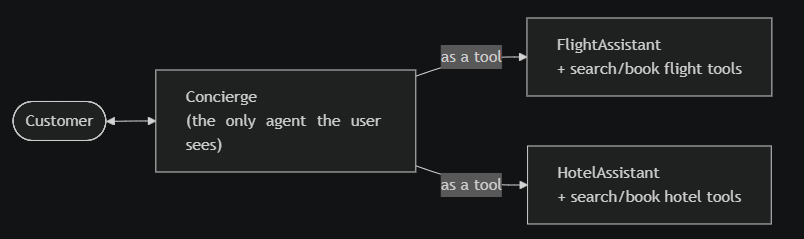

这种模式有三个不错的属性。会话保持单一一致的口吻。没有需要终止的循环。而且因为每次对专家的"tool call"在底层仍然是一次真实的模型调用，trace 仍然能精确告诉你哪个子 agent 干了什么——你并没有因为压平拓扑而损失任何可观测性。

在 MAF 里这基本上就是一行代码：每个专家是一个 `Agent`，`agent.as_tool()` 把它包装成一个 function tool，可以和任何其他 tool 一起交给 Concierge。脚手架代码长这样：

```
flight_assistant = Agent(
    flight_client,
    name="FlightAssistant",
    description="Specialist that searches and books flights.",
    instructions=(
        "You are a flight specialist. Use search_flights to find options and "
        "book_flight to make a booking. Reply with concise results."
    ),
    tools=[search_flights, book_flight],
)hotel_assistant = Agent(
    hotel_client,
    name="HotelAssistant",
    description="Specialist that searches and books hotels.",
    instructions=(
        "You are a hotel specialist. Use search_hotels to find options and "
        "book_hotel to make a reservation. Reply with concise results."
    ),
    tools=[search_hotels, book_hotel],
)concierge = Agent(
    concierge_client,
    name="Concierge",
    description="Travel agency concierge that orchestrates flight and hotel specialists.",
    instructions=(
        "You are the Concierge of a travel agency. Greet the customer, understand their needs, "
        "and use your specialist tools (FlightAssistant, HotelAssistant) to help them. "
        "Pass along whatever the customer has told you; the specialists will ask if anything is missing. "
        "After getting results, summarize them in a friendly tone."
    ),
    tools=[
        flight_assistant.as_tool(),
        hotel_assistant.as_tool(),
    ],
)
```

现在我们来看看把这个 agent 托管到 Foundry 所需要的所有步骤。

### Step 1 — 搭出一个 hosted agent 的本地形态

一个 hosted agent 不是什么特殊的框架或特殊的 class。它就是一个普通的 agent，外加一样额外的东西：一个微小的 **hosting adapter**，通过 OpenAI Responses 协议把它暴露在 HTTP 上（**注意**：这与 agent 内部使用的模型无关，内部模型可以是来自任何 provider 的任何 LLM），监听在 8088 端口。

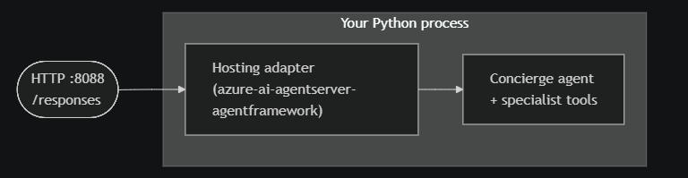

这个 adapter 是 *你的代码* 和 *Foundry 的运行时* 之间的契约。只要你的容器在 8088 上说 Responses 协议，Foundry 就不关心里面是什么——MAF、LangGraph、纯 LLM API 调用，什么都行。这就是让 Hosted Agents 可移植的原因。

包装你的 agent 的脚手架代码看起来是这样：

```
async with create_concierge_agent() as agent:
    await from_agent_framework(agent).run_async()
```

这就是让你的 agent 在 Foundry 中"可托管"的关键——其余一切保持不变。

### Step 2 — 在本地测试 Agent

在把 agent 部署到 Foundry 之前，你可能会想先在本地测试它。如果你用 VS Code 作为 IDE，一个快捷做法是启动一个 debugging 会话。另外，如果你用了 [Microsoft Foundry VS Code extension](https://code.visualstudio.com/docs/intelligentapps/overview)（强烈推荐！），你将立刻能够在 Agent Inspector 标签页里测试 agent。debugger 会把 agent 跑在 `http://localhost:8088`，并打开一个预先接好的 inspector 标签页。

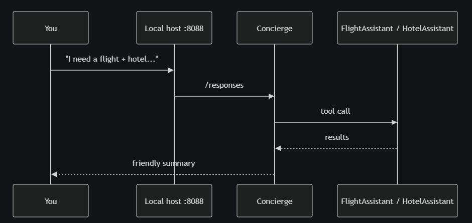

它看起来是这样：

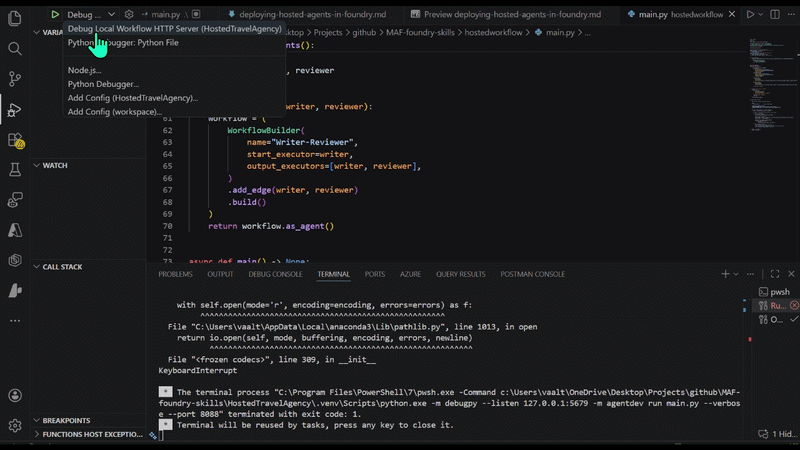

### Step 4 — 部署到 Foundry

要把你的 agent 作为 hosted agent 部署到 Foundry，你恰好需要两个 metadata 文件。

-   一个 **Dockerfile**，里面包含你的 `requirements.txt`、你的代码、`EXPOSE 8088`，以及 `python main.py`。**注意**：Foundry 期望 `linux/amd64`，所以在 Apple Silicon 上你要用 `--platform linux/amd64` 来 build。
-   一个 `**agent.yaml**`——这个 manifest 告诉 Foundry 你在交付的是哪一类东西。文件长这样：

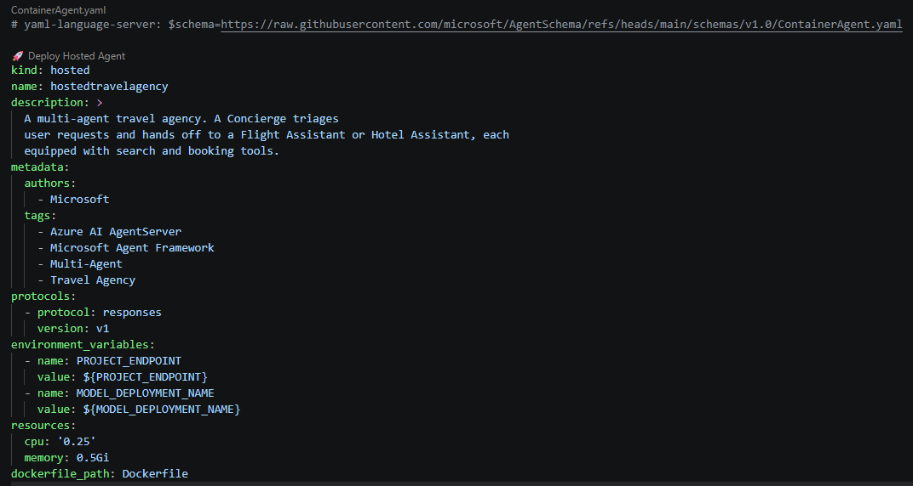

一旦所有素材就位，我们就可以部署 agent 了。注意有 2 种方式可以做到：

-   `azd`CLI——带 [agent extension](https://learn.microsoft.com/en-us/azure/developer/azure-developer-cli/extensions/azure-ai-foundry-extension) 的 Azure Developer CLI。可脚本化、对 CI/CD 友好、不需要 UI。
-   VS Code 里的 Foundry Toolkit——它把 azd cli 的同样操作包装成了用户友好的 UI 和一键选项。本文我们会走这条路径。

借助 Foundry toolkit，我们只需要点击"Deploy Hosted Agents"，选择底层托管容器的配置，剩下的事情 toolkit 会处理。

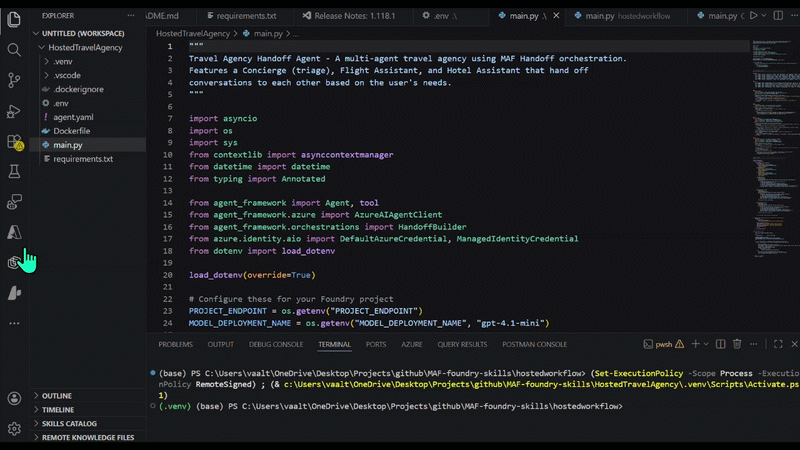

你会在本地环境中看到 Agent 部署的进度：

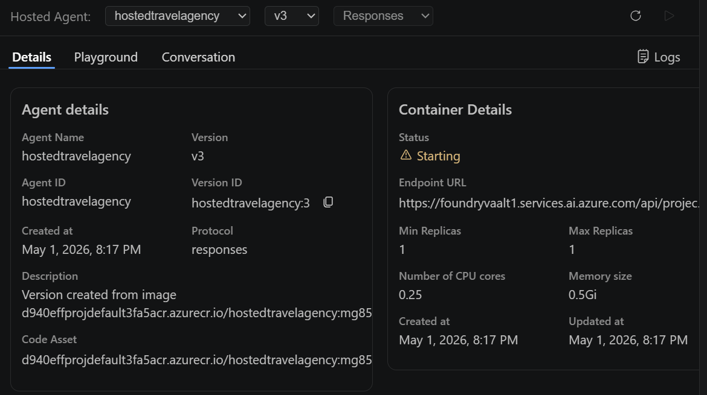

然后你就能在 Foundry UI 里直接看到并测试你的 agent：

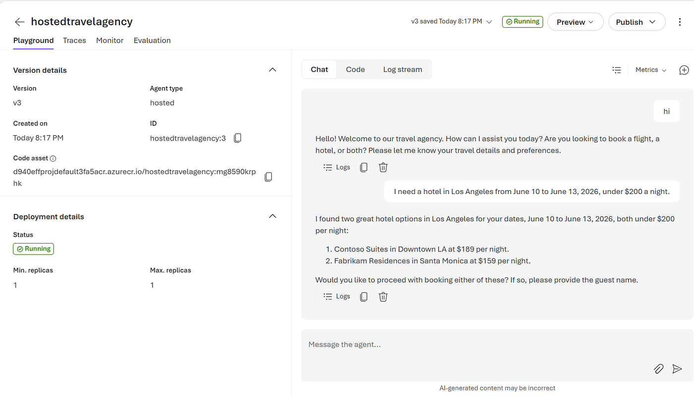

当然，作为你把 agent 托管在 Foundry 那一刻就能享受到的内建能力之一，你可以检查用户与 agent 交互的日志和 tracing，以及监控和评估 agent 的生命周期。

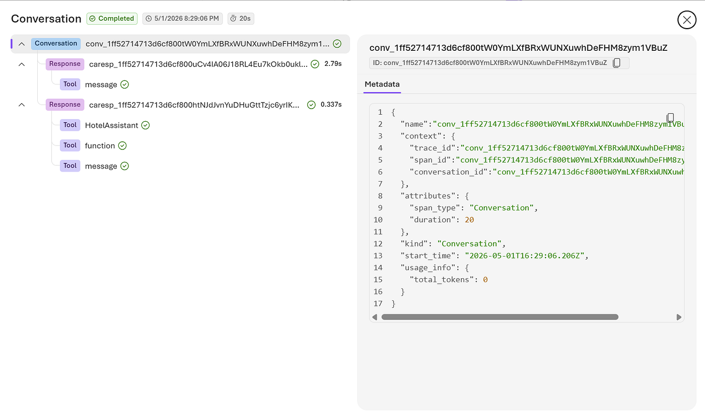

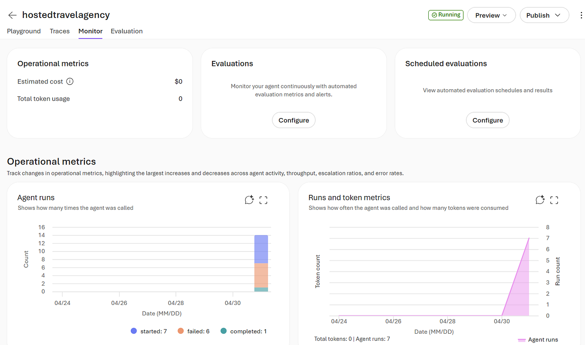

你现在拥有了一个真实的、可寻址的服务：一个 Responses endpoint，任何客户端都能调用它（OpenAI SDK、Foundry SDK、`curl`、Logic Apps、Teams），portal 里有一个供利益相关方使用的 hosted Playground，外面包裹着标准的 Azure 治理——RBAC、identity、quotas、telemetry。每次重新部署都是一个新的不可变版本，所以你可以迭代而不破坏调用方。

同样的托管模型并不局限于单个 agent：任何你用 `WorkflowBuilder` 构建的东西——pipelines、parallel fan-out、human-in-the-loop graphs——都可以用完全一样的方式部署，只要把 `kind: agent` 改成 `kind: workflow`。

### Step 5— 消费你的 Agent

一旦你对你的 Agent 满意了，下一步就是发布它并让用户去消费。这里有两个可以选择的方向：

-   **发布到一个 channel**。Foundry 可以把 agent 直接呈现到 Microsoft 365 Copilot 和 Teams 中，而你完全不用写客户端——用户在他们本来就在用的工具里就能获得对话式体验，而且 identity、合规和管理员策略都由 channel 来处理。

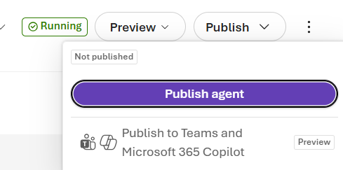

-   **构建你自己的体验。** 当你需要品牌化的 UI、定制的 workflow，或者要把 agent 嵌入到一个现有产品中时，你从自己的代码里去调用同一个 `/responses` endpoint——一个 web app、一个 mobile app、一个后端服务、一个 Logic App，任何能说 HTTP 的东西都行。

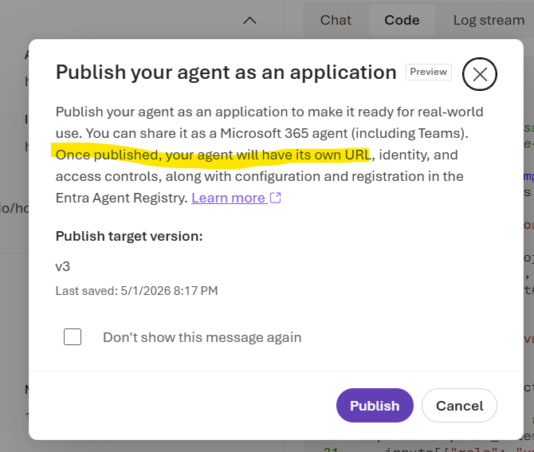

要点在于：同一个 endpoint 同时服务两边——这意味着你可以把 agent（或多 agent workflow）的后端，与你打算把 agent 发布到的 UI 或 channels 解耦开。

### 结论

Foundry Agent Service 把 agents 和 workflows 视为一等的托管资源——为你配备好预先构建的资产（比如 containers、tracing、监控和评估工具），能让你的 AI 应用具备企业级能力。

当运行时是 Foundry 时，一长串原本由你操心的事情不再是你的问题：identity 是通过 managed identity 接好的，而不是你手工轮换的 secrets；endpoint 说的是一种标准化协议，每个 SDK 和每个 Microsoft channel 都已经知道怎么调用它；telemetry 不需要你做埋点就会落到 Application Insights 里；扩缩容和可用性由平台处理；而治理——RBAC、内容过滤、网络隔离、区域 pinning、成本报告——会和你的组织已经跑在 Azure 上的其他一切组合在一起。

### References

-   [Foundry Toolkit for Visual Studio Code](https://code.visualstudio.com/docs/intelligentapps/overview)
-   [Deploy a hosted agent — Microsoft Foundry | Microsoft Learn](https://learn.microsoft.com/en-us/azure/foundry/agents/how-to/deploy-hosted-agent)
-   [Hosted agents in Foundry Agent Service (preview) — Microsoft Foundry | Microsoft Learn](https://learn.microsoft.com/en-us/azure/foundry/agents/concepts/hosted-agents)
-   [https://learn.microsoft.com/en-us/agent-framework/overview/](https://learn.microsoft.com/en-us/agent-framework/overview/)
-   [Use the Microsoft Foundry azd agent extension | Microsoft Learn](https://learn.microsoft.com/en-us/azure/developer/azure-developer-cli/extensions/azure-ai-foundry-extension)
