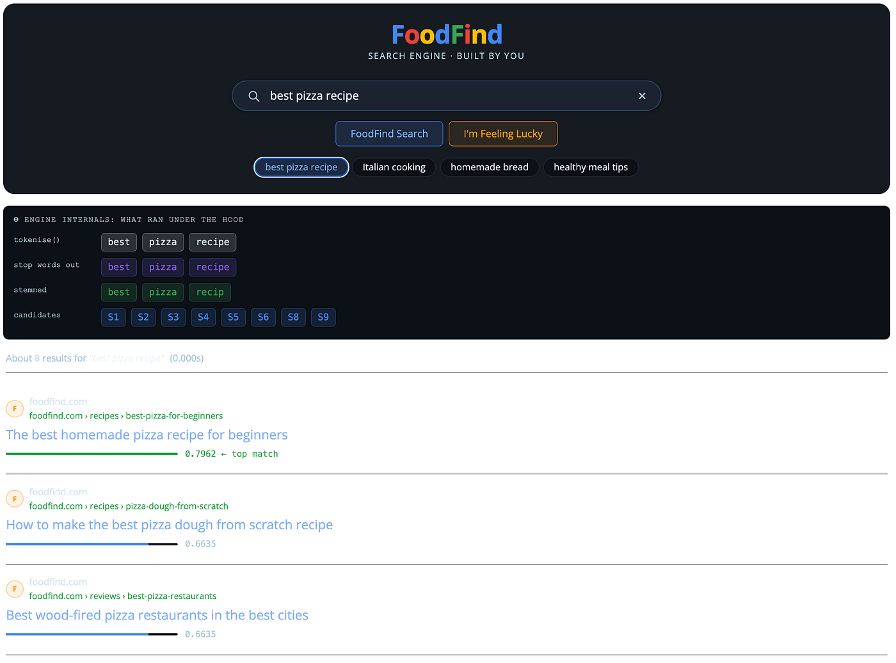
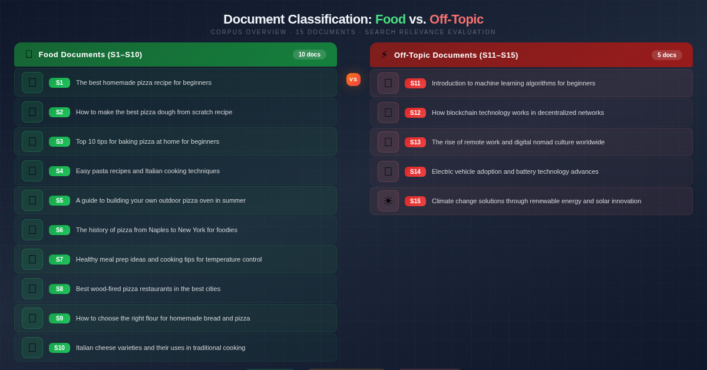
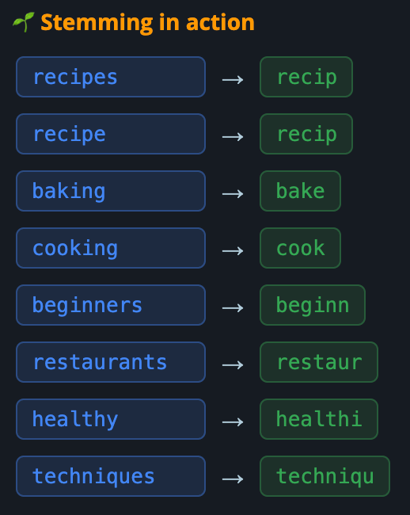
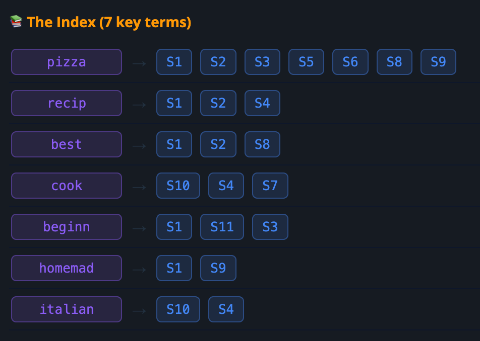
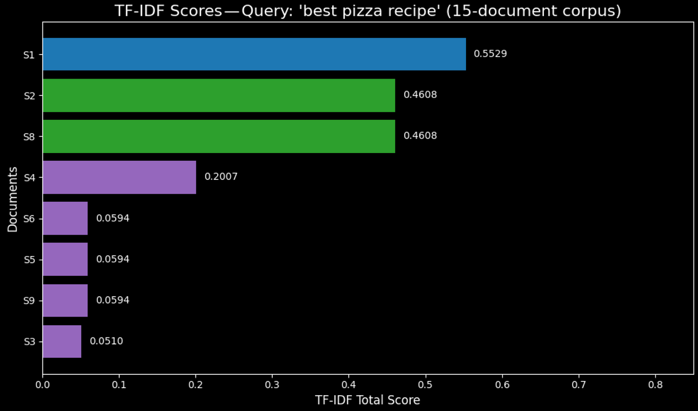

# 我如何在 30 分钟内教 100 个学生构建出 Google 的核心算法

*以及为什么每一个 AI 工程师都需要从这里开始——在 LLM 之前，在 RAG 之前，在所有这些之前*


*图片来源：Tutorial*

我从教 GenAI 起步的时候，"教 GenAI"还远没有现在这么时髦。

在我面对一个新班级的最初几次课中，有一次教室里坐了 100 个学生。背景五花八门：有些拥有多年深度学习经验，更多则是从未接触过机器学习的纯新手。在打开任何幻灯片之前，我先问了一个问题：

*"当你在 Google 里输入 'best pizza recipe'，背后到底发生了什么？"*

沉默。然后是各种猜测："AI？" "machine learning？" "某种 neural network？"

没有一个人说出：**它在数单词。只不过数得很巧妙。**

这正是正确答案。在任何 LLM 之前。在任何 transformer 之前。在任何 neural network 接触搜索查询之前，Google 的核心相关性引擎是一条叫做 TF-IDF 的公式。在那次课程结束时，所有 100 个学生都用 Python 从零把它构建了出来。

这篇文章，就是那节课，写下来的样子。读完之后，你会理解在深度学习改变一切之前，盘踞在 Google 之下的那台引擎。更重要的是，你会理解它*为什么*失效，以及为什么修复那一个缺陷，需要发明出现代 AI 的大部分东西。

## 为什么这件事比你以为的更重要

如果你在 2026 年正在学习 GenAI，你大概已经听过 "RAG" 这个词：Retrieval-Augmented Generation。它是让 LLM 基于*你的*文档来回答问题的方式，而不是去编造事实。

**但 RAG 不过是 search + generation。如果你不理解 search，你就不理解 RAG。**

TF-IDF 就是这个故事开始的地方。它快速、可解释，而最有价值的是，它有一个漂亮的缺陷——这个缺陷*恰好*解释了 neural search 这整个领域为什么会被发明出来。理解这个缺陷，比理解公式本身更重要。

那么，我们先来把公式构建出来。

## 问题：15 篇文档，一台搜索引擎

我给我的学生一个语料库。15 篇文档。10 篇与食物相关：

```yaml
S1:  "The best homemade pizza recipe for beginners"
S2:  "How to make the best pizza dough from scratch recipe"
S3:  "Top 10 tips for baking pizza at home for beginners"
S4:  "Easy pasta recipes and Italian cooking techniques"
S5:  "A guide to building your own outdoor pizza oven in summer"
...
```

另外 5 篇则完全跑题：blockchain、EV、machine learning、climate change，以及 remote work。目标是构建一个系统，对于任意食物查询都返回正确的文档，并正确忽略掉那些跑题文档。

不要 API key。除了 `collections` 和 `math`，不导入任何库。纯 Python 逻辑，从零开始。


*Food 与 off-topic 文档对照表（图片来源：claude）*

下面是我们端到端构建的管线：

```
Raw Text  →  Tokenize  →  Remove Stop Words  →  Stem  →  Inverted Index  →  TF-IDF Score  →  Ranked Results
```

五个处理步骤。我们逐一走一遍。

## Step 1: Tokenize：把文本切成单词

```python
def tokenise(text):
    return text.lower().split()
```

```
tokenise("The best homemade pizza recipe for beginners")
# → ['the', 'best', 'homemade', 'pizza', 'recipe', 'for', 'beginners']
```

全部转小写。按空格切分。就这样。一个句子得到 7 个 token。

计算机不会用句子思考。它们用 token 思考。**每一个 NLP 系统，从这一个到 GPT-4，都从这一步开始。**

## Step 2: Remove Stop Words —— 去掉噪音

"The"、"for"、"a"、"and"、"is"——这些词出现在每一篇文档里。它们不携带任何关于一篇文档*是关于什么*的信息。它们就是噪音。

```
STOP_WORDS = {'the', 'a', 'an', 'and', 'or', 'for', 'to', 'in', 'of', 'is', ...}
```

```python
def remove_stop_words(tokens):
    return [t for t in tokens if t not in STOP_WORDS]# Before: ['the', 'best', 'homemade', 'pizza', 'recipe', 'for', 'beginners']
# After:  ['best', 'homemade', 'pizza', 'recipe', 'beginners']
# Removed: 2 out of 7 tokens — 29% was noise
```

**一句平均英文句子里，有百分之二十九是填充词。**搜索引擎不需要它们。

## Step 3: Stem：合并单词变体

"recipe" 和 "recipes" 意思相同。"baking" 和 "bake" 是同一个概念。Stemming 会把单词剥到它们共有的词根，让拼写变体能够匹配到同一个 token。

```
STEM_RULES = {
    'recipes': 'recip',   'recipe': 'recip',
    'baking': 'bake',     'beginners': 'beginn',
    'cooking': 'cook',    'techniques': 'techniqu',
}
```

```python
def stem(token):
    return STEM_RULES.get(token, token)
```

经过完整管线，"The best homemade pizza recipe for beginners" 变成：

```
['best', 'homemad', 'pizza', 'recip', 'beginn']
```

读起来丑陋。用来匹配却完美。


*图片来源：Tutorial*

## Step 4: 构建倒排索引（Inverted Index）

这里开始优雅起来。

一个朴素的搜索引擎会拿过你的查询，打开每一篇文档，扫描每一个单词，并计数匹配数。对于 15 篇文档，这没问题。对于整个互联网，这慢得灾难性。

倒排索引把问题反过来。**与其问"这篇文档里有哪些单词？"，我们构建一张映射来回答"哪些文档里包含这个单词？"**

```python
from collections import defaultdict
```

```
inverted_index = defaultdict(set)
for doc_id, terms in processed.items():
    for term in terms:
        inverted_index[term].add(doc_id)# pizza  → {S1, S2, S3, S5, S6, S8, S9}
# recip  → {S1, S2, S4}
# best   → {S1, S2, S8}
```

当你搜索 "best pizza recipe" 时，引擎会立刻知道只需要去看那三个集合的并集中的文档。无需扫描。无需暴力。只是一次查表。

**这从根本上解释了 Google 为什么能在一秒内搜索数十亿个网页。**艰难的工作是在索引时做的，而不是在查询时。


*图片来源：Tutorial*

## Step 5: TF-IDF —— 相关性公式

我们已经有了候选文档。但我们如何对它们排序？

并不是每个单词都同样具有信息量。"Pizza" 出现在 15 篇文档中的 7 篇里，所以它很常见。"Homemade" 只出现在其中 2 篇里，使它具有辨别力。对于一个 "homemade pizza" 查询而言，同时包含 "pizza" *和* "homemade" 的文档，其排名应当高于只包含 "pizza" 的那篇。

TF-IDF 用两个数字精准地刻画了这种直觉。

**TF：Term Frequency（词频）：**这个单词在*这一篇特定文档*里出现的频率是多少？

```
TF("pizza", S1) = 1 occurrence / 5 total terms = 0.20
```

**IDF：Inverse Document Frequency（逆文档频率）：**这个单词在*整个语料库*里有多稀有？

```
IDF("pizza") = log(15 documents / 7 containing "pizza") = 0.76
IDF("best")  = log(15 / 3) = 1.61   ← rarer, so carries more signal
```

**TF-IDF = TF × IDF**

一个到处都常见的单词得分会低。一个在整个语料库里稀有却在*这一篇*文档里频繁出现的单词得分会高。**这条公式奖励特异性，惩罚普遍性。**

下面是查询 "best pizza recipe" 在前几个结果上的实际打分：

```
Doc   | best   | pizza  | recip  | TOTAL
------|--------|--------|--------|-------
S1   | 0.3219 | 0.1524 | 0.3219 | 0.7962  ← 
S8   | 0.5365 | 0.1270 | 0.0000 | 0.6635  ← 
S2   | 0.2682 | 0.1270 | 0.2682 | 0.6634  ← 
```

S1 胜出。"The best homemade pizza recipe for beginners."正确。

注意一个微妙的地方：S8（"Best wood-fired pizza restaurants in the best cities"）尽管在 "recip" 上得分为 0，却挤进了第 2 名。为什么？因为 "best" 这个单词在那篇文档里出现了*两次*，所以它的 TF 翻倍，把总分顶到了 S2 之上。这条公式不会被缺失的词项骗到，但它确实会奖励重复出现。

S2 掉到了第 3 名，并不是因为它不相关（它包含全部三个查询词），而是 S8 的双倍 "best" 以 0.0001 的差距把它挤了下来。**在大规模下，这些极小的差距决定了你看到的是第一页还是第二页。**


*图片来源：Notebook*

## 那个创造了现代 AI 的漂亮缺陷

这就是我每次上课都会停下来的地方。

我让学生再搜一个查询：**"automobile accident."**

任何包含 "car crash" 的文档都不会被返回，尽管它们意思完全相同。

**TF-IDF 不理解含义。它只看见字符。**

输入 "automobile"，它就会去寻找那串确切的字符：a-u-t-o-m-o-b-i-l-e。它不知道 "car" 是它的同义词。它没有*语义相似度*的概念。它纯粹是一台频率机器。

这一个局限——研究者们称之为 semantic mismatch problem（语义错配问题）——正是 word embeddings 被发明出来的原因。这是我们有 sentence transformers 的原因。这是现代 RAG 系统使用向量搜索而非关键词搜索的原因。这是 neural information retrieval 这个整个领域存在的原因。

**现代 GenAI 中的每一个重要概念，都是对这一个缺陷的直接回应。**

一旦你看到这一点，整个 AI 版图（word2vec、BERT embeddings、cosine similarity、dense retrieval、hybrid search、reranking）就不再是一堆互相脱节的流行词。它会变成一条逻辑递进的链条——人们都在试图修补同一个洞。

## 在线试试看，我搭了一个交互式 demo

我不仅在 notebook 里教这个。我在我的网站上构建了一个完全可交互的版本，让你可以实时看到它运作。

输入任意查询，看着：

-   你的句子被切分成一个个单词
-   stop words 被实时高亮并移除
-   每一个剩下的单词被 stem 到它的词根
-   inverted index 在你眼前被实时构建出来
-   TF-IDF 分数为每一篇文档计算并排序

这个 demo 跑的是与 Python notebook**完全一样的算法**，一步一步地移植到 JavaScript，让它直接在你的浏览器中运行。无需安装。无需配置。而且是的，里面还有徽章和 XP 系统，因为我的学生很有竞争心——这套机制有效。

[https://nursnaaz.github.io/tutorial/how-search-engines-work](https://nursnaaz.github.io/tutorial/how-search-engines-work)


*图片来源：Tutorial*

## 这之后是什么

TF-IDF 是我的 [zero-to-genai-engineer](https://github.com/nursnaaz/zero-to-genai-engineer) 课程的 Session 00。它之所以是最开头的一节课，原因只有一个：

**在你没有亲身体会过 TF-IDF 做不到什么之前，你无法理解 embeddings 解决了什么。**

从这里开始，课程会走过 word embeddings、sentence transformers、vector databases、RAG pipelines，最终走到 LangGraph agents 和 fine-tuned models。每一个模块的存在，都是因为前一个模块留下了一个缺口。

TF-IDF 留下了所有缺口里最大的那一个，而填上它就需要发明出现代 AI 的大部分。

如果你今天输入一个查询，Google 理解的是你*的意思*而不是你字面*输入*了什么，那就是 TF-IDF 留下的缺口。那就是我们在剩下的课程里要朝之而去构建的东西。

**从零构建这个东西的最好时机是 2012 年。第二好的时机就是今天。**

> 我是 Mohamed Noordeen，一名 GenAI trainer，正在构建 zero-to-genai-engineer 课程，把工程师从搜索引擎基础带到生产级 AI 系统。无需 GPU。不假设你具备 ML 先验知识。
> 
> 这是该课程概念系列文章中的第一篇，将覆盖从 TF-IDF 一路到 LangGraph agents 和 LoRA fine-tuning 的每一个概念。
> 
> 在 search 或 retrieval 中，哪一部分一直让你感到困惑？把它丢在评论里。我会读并回复每一条。

*这篇文章在写作时借助了 AI。所有的教学故事、个人经验和技术内容都是我自己的。*


本文发表于 [Generative AI](https://generativeai.pub/)。请在 [LinkedIn](https://www.linkedin.com/company/generative-ai-publication) 上与我们联系，并关注 [Zeniteq](https://www.zeniteq.com/)，及时获取最新的 AI 故事。

订阅我们的 [newsletter](https://www.generativeaipub.com/) 和 [YouTube](https://www.youtube.com/@generativeaipub) 频道，以获取生成式 AI 的最新新闻与更新。让我们一起塑造 AI 的未来！


