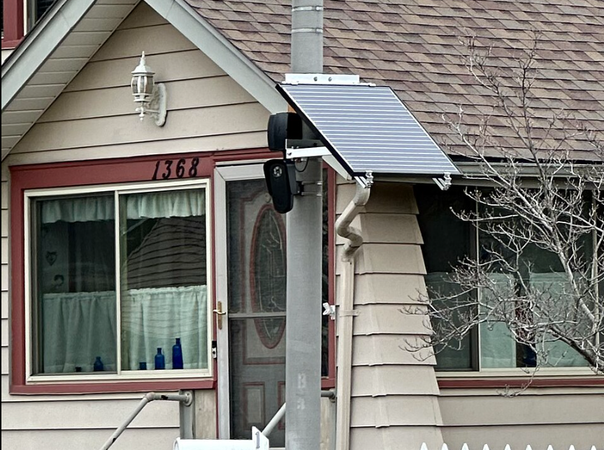
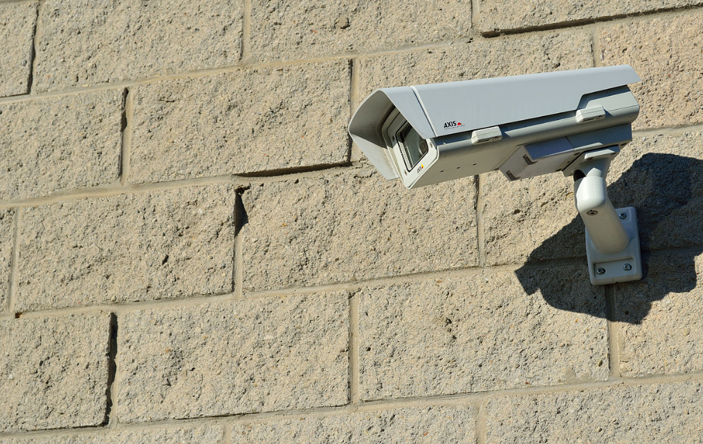
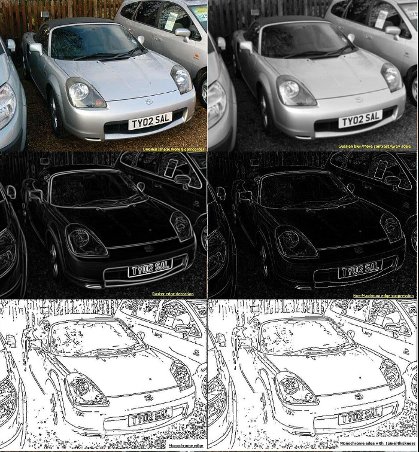
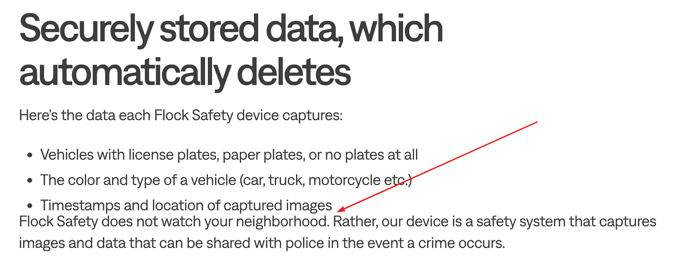
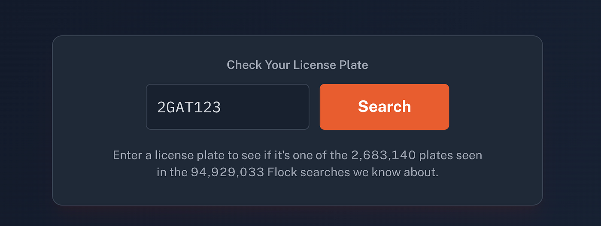
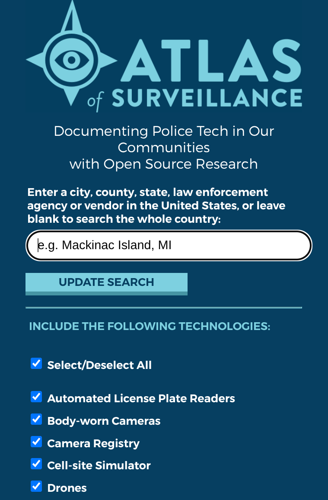

# 我用数字之眼监视你：安全摄像头

一次查询。数千台摄像头响应。我们来聊聊这件事。

*没有付费墙，没问题，在* [***Substack***](http://investigator515.substack.com/)***上阅读。***

***永远有眼睛在注视着你，有声音在包围着你。睡着或醒着，在室内或室外，在浴缸里或床上——无处可逃。除了你脑壳里那几立方厘米，没有什么是你自己的。  
— George Orwell, 1984***

在一些西方国家，监控国家的成长速度之快令人惊讶。曾经听起来像是从科幻电影里搬出来的东西，很快就会成为我们日常生活的一部分。

面部识别、移动设备追踪、元数据存储与分析。如果你足够幸运在前互联网时代长大，那么这个世界看起来就和你记忆中成长时的样子相当不同。

我们开始接受这些变化，常常用额外安全的想法来安慰自己，并接受这种观念：「如果我们没什么可隐藏的，那就没什么可担心的」。

事实是，这是一种过时的视角。监控国家是真实存在的，它现在就在这里，并且正在我们眼皮底下迅速增长。

人们早已接受知识就是力量，今天，我们要与你分享一些知识。

## 背景

来自自由之地，一个不与交通执法挂钩、却能对它看到的每个用户提供实时情报的系统，这个想法听起来相当反乌托邦，但不知怎么的，我们就在这里了。如果你是美国人，你可能已经听过很多关于这些系统的信息，但万一你错过了，这里再讲一遍。

成立于 2017 年，Flock Safety 算是一家相当年轻的公司，从各方面来看都是如此。由三位 Georgia Tech 校友创办，公司的第一套系统是在其中一位创始人的厨房桌子上搭建出来的。

随着他们早期的系统帮助警方成功识别并指控了一起抢劫案的犯罪嫌疑人，该系统的潜力被早早地实现，在早期几年获得大量投资之后，公司经历了快速成长期。这意味着新的产品，到 2024 年结束时，该公司将在全美 4,000 多个城市运营，同时雇佣了一支 900 多人的团队。

仅仅一年之后，到了 2025 年，该公司将出现在 6,000 多个美国城市，并在被发现其许多系统未经监管批准便已安装之后引发了更多争议。

尽管如此，该公司还是推进了与 Amazon 旗下 Ring 的合作。这项合作将聚焦于把 Ring 摄像头的录像提供给执法部门以协助正在进行的调查，为一个由私营主导、范围广泛且几乎没有监督的监控网络奠定了基础。

如果你担心这实际上有多反乌托邦，那么请稍候，因为一台 Flock Safety 无人机第一响应者将被部署来安慰你。不，这不是玩笑。可怕的是，这是真实存在的。

## 隐私影响

随着数万台摄像头在整个美国境内运行，一家公司有能力构建、维护并货币化一个让 1984 都自愧不如的监控网络。并且，值得一提的是，虽然这些设备通常被称为摄像头，但更准确的描述是它们是多光谱电子监控系统。

这是因为，虽然这个网络最初只专注于自动车牌识别（ANPR）系统，但它们后来扩展到了包括车辆指纹与图像识别（归档属性）、音频录制器、AI 增强的数据查询，以及模式与关系元数据。

用通俗的话说？这些摄像头可以追踪车顶行李架、车灯和其他自定义车辆属性，把这些信息交给一个机构，该机构可能输入一段模糊的描述，比如"一辆带车顶行李架、车身印有 XX 公司标识、行驶在 XX 高速公路上的蓝色 Ford SUV"，然后把那些数据连同你常去的已知地点和经常联系的车辆清单一起呈现出来。

这是一个无搜查令的、事实上的车辆追踪系统吗？绝对是。

你猜想这样一个系统会消耗并传输海量数据，这一点你猜对了。大多数系统会通过蜂窝数据连接运行，并利用 Amazon 的云计算系统来提供近实时的数据分析。

虽然这样一个系统本身就足够令人担忧，但当你意识到它不只是开放被查询信息时，情况就更糟了。可疑车辆可以被直接标记，虽然这对执法来说可能是好事，但对那些关心隐私的人来说则会带来各种后果。

为了平衡分析，值得看看 Flock 官方网站上的一段声明。

在这里，他们澄清说 Flock Safety 摄像头不会监视你的邻里。它们只是捕捉图像和数据，这些数据可以与警方共享。

不过为了犯罪预防，他们必须捕捉所有数据，所以就由你来决定这条说法到底有多自相矛盾了。

## 现实世界的影响

需要指出的是，与 1984 不同，这不是一本小说。它是一个有现实后果的真实世界项目，因为正如这个项目所展示的那样，他们并不总是把事情做对。

第一个问题来自 ANPR 系统本身。在 Ohio、Tennessee 和 California 都有已知案例，车辆被错误识别导致错误逮捕，并因此造成执法部门多次赔付。

Flock 不会公开讨论其系统的准确性。事实上，根据他们自己网站的说法，摄像头可以在所有天气、所有条件下可靠地运行，在数十米的距离上都能工作。然而正如法庭记录所显示的，情况并非如此。

法庭记录还显示，这个系统不仅有可能被人为个人利益而滥用，在某些情况下已经被滥用了。两名警察分别在 2025 年因以不同方式利用 Flock 系统而被指控。其中一人跟踪前伴侣 500 多次后才被发现，另一人则试图在离婚诉讼期间在一处私人房产外面安装一个摄像头。

虽然众所周知 Flock 提供过被用于移民执法（这本身就是一个有争议的步骤）的信息，但不太为人所知的是，Flock 系统曾被用于尝试追踪那些寻求生殖医疗的女性。

毋庸置疑，当被武器化用于情报目的时，这是一个极具侵入性的系统。

## 你能做到

如果你对此感到愤怒，那大概是有道理的，看到有些摄像头被人重新调整方向甚至被破坏的情况并不少见，这些人决定自己把事情管起来。虽然这在某种程度上是意料之中的，但现实是，随着人们动员起来应对这些问题，幕后正在发生一些相当有意思的事。

第一件事就是去注册 Flock 的「SafeList」登记链接。据说这会从他们的记录中清除你的信息，不过几乎没有确认这到底有多有效。

接下来你可以做的是访问 [**haveibeenflocked**](http://haveibeenflocked.com/)**。** 这个网站基于非常有用的 HaveiBeenPwnd 网站（旨在帮你识别你所涉及的数据泄露），它有一个查询功能，让你可以搜索你的车辆，看它何时何地被识别过。这个网站一直被 Flock 主动针对，并基于公开数据建立其记录，所以值得一看。

如果你想规划一条尽量减少暴露给安全摄像头系统的出行路线，你会发现 [**Deflock**](http://deflock.me/) 特别有用。Deflock 把 flock 摄像头映射出来并显示在 Open Street Map 上，它不仅帮你识别网络内的摄像头，还允许你更新系统，添加新安装的设备和其他信息，以确保保持及时更新。

从这里开始，剩下的都是行动主义内容了，其他人已经研读了信息、游说 FOIA 批准，并就他们所在城市和地方政府对此类系统的使用提出挑战，试图打破现状。

像往常一样，Electronic Frontier Foundation（EFF）提供了一些极佳的资源来协助你做这件事。第一个是 Atlas of Surveillance，一个旨在正面应对政府监控项目的工程。第二个是「Get The Flock Out」运动，它提供了模板资源供普通人填写并寄送给政府机构和政界人士。

## 人民的力量

人们常说通往地狱的道路是用善意铺成的，鉴于我们对 2026 年的了解，沿途大概也有一台 Flock Safety 摄像头。

从政治到运动队，有许多事情人们往往不会达成一致。然而，大规模监控是那种独特的情况之一：在某些问题上坐在桌子对立面的人们，在像这样的问题上通常会看法一致。

我在一个重视安全的行业工作过，毫无疑问，安全系统，或者更具体地说摄像头，在我们的社会中有着积极的作用。然而，在像这样的情况下，很容易看出，尽管这样一个系统的商业方面被详细探讨过，社会效益和影响似乎被探讨得远远不够深入。

我们经常被告知，在人们对抗系统的 David v Goliath 之战中，Goliath 是一个被惯性推动的庞然大物，无法被任何单独的个人阻止。

然而现实是，缓慢却有针对性、有方向的行动主义在让公众持续关注此事方面发挥了巨大作用，同时也让 Flock 经营起来困难得多得多。

综合考虑，大多数人会同意这是一件好事。

***Investigator515 探索射频频谱、网络安全以及现代间谍活动背后的隐秘技术。***

***每周关注新内容***

[**Bluesky**](https://investigator515.bsky.social/) **•** [**X**](https://twitter.com/inv515) **•** [**Substack**](http://investigator515.substack.com/)

***你可能还喜欢，*  
\-** [***Silent Wars: The Acoustic Kitty***](https://medium.com/silent-wars/silent-wars-the-acoustic-kitty-da30e87933f5)**\-** [***Spies In The Mud: The RF-111 Aardvark  
***](https://medium.com/silent-wars/spies-in-the-mud-the-rf-111-aardvark-1415c2d7a6ea)**\-** [***Finding Factories: Using Shodan To Identify SCADA Devices***](https://radiohackers.com/finding-factories-using-shodan-to-identify-scada-devices-845cd2df9163)
