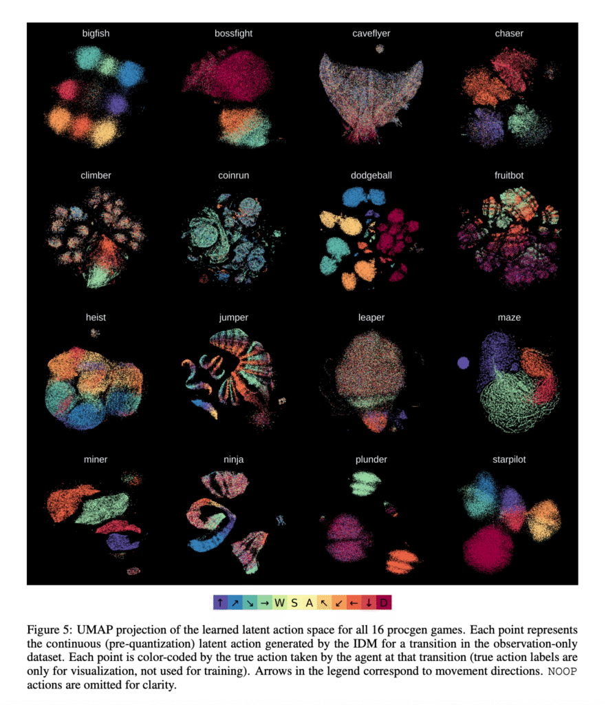
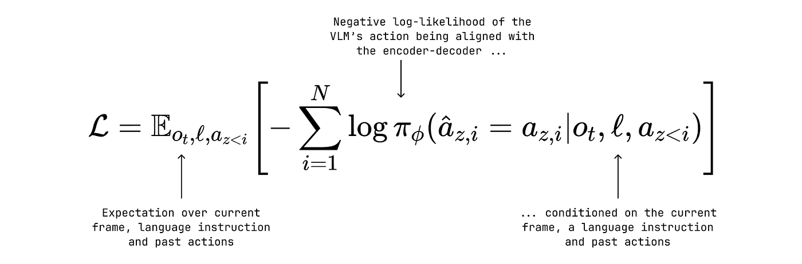
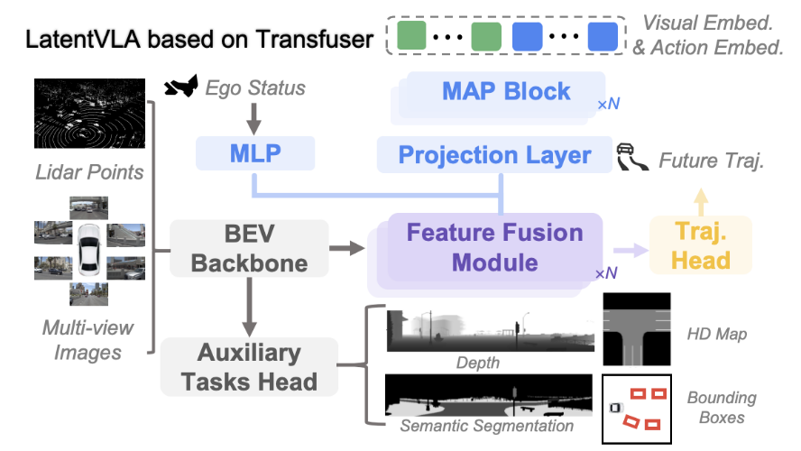
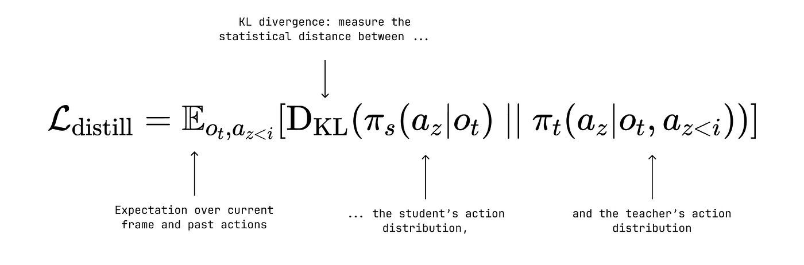
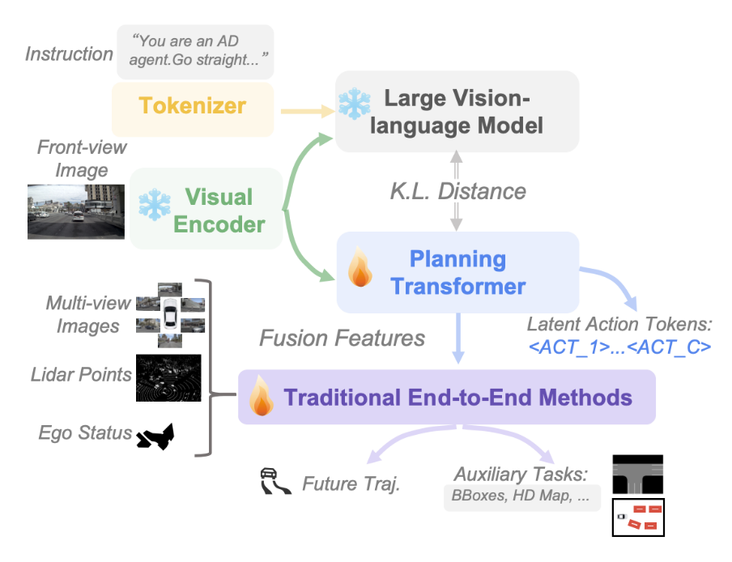
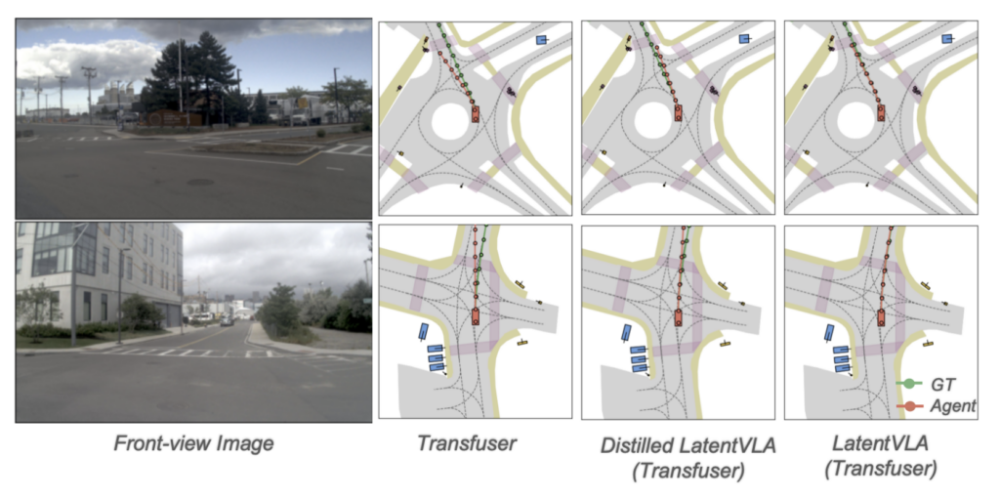
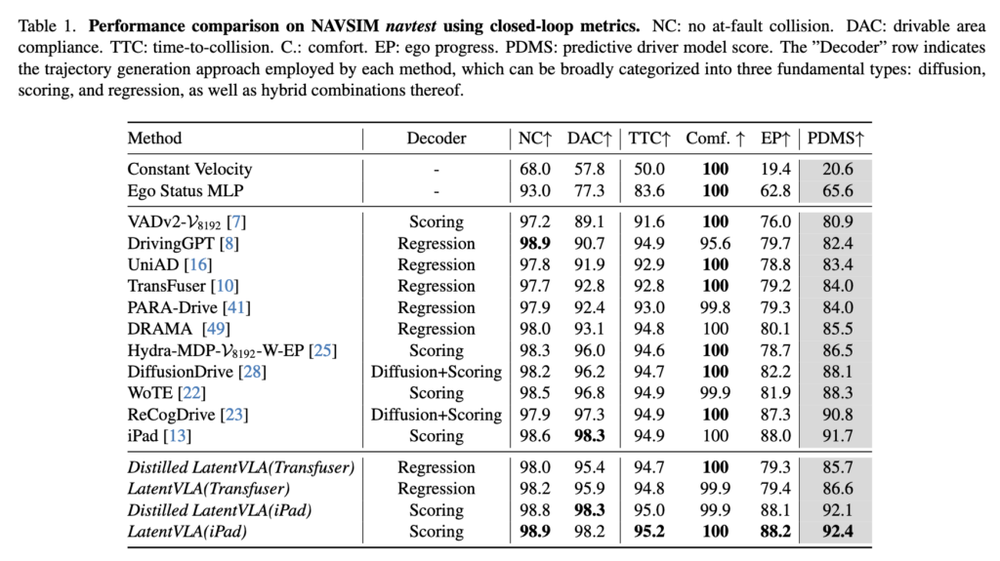

# LatentVLA：面向自动驾驶的潜在推理模型

如果自然语言并不是驾驶任务最合适的抽象方式呢？

*图片来源：Pramod Tiwari 摄于 Unsplash*

在我上一篇文章里，我们讨论了 AlpamayoR1（AR1）——一个把 VLM 作为推理骨干集成进来的自动驾驶模型。它依赖一份精心收集的因果链（chain-of-causation）数据集。在该数据集上的训练让 AR1 能够用自然语言"推理"以应对具有挑战性的驾驶场景。

但如果自然语言并不是驾驶场景中推理的最佳载体呢？毕竟，当人类驾驶员遇到需要立刻做出反应的驾驶情境时，他们通常是反射性地行动，而不是"用语言一步一步推理"。那么对驾驶模型而言，替代方案是什么？

在本文中，我们将拆解 LatentVLA 架构——一种令人信服地反对基于语言路线的方案，它**不需要任何自然语言数据集**、**在潜在空间中进行推理**，并使用**知识蒸馏**来满足实时性约束。

### Latent Action Learning

AR1 成功的一大部分来自因果链数据集，而该数据集的收集需要工业级的努力、一条精心设计的标注流水线以及大量验证。

与之相反，LatentVLA 选择了完全相反的方向：作者认为，原始驾驶数据本身就已经包含训练大模型所需的结构，而自然语言天生带有偏见，且难以与动作对齐。此外，生成自然语言推理链是低效的，因为有些 token 对推理过程并没有实质贡献（例如停用词）。

为此，他们引入了一个自监督框架，用来在一个小的潜在空间中预测*以自我为中心的潜在动作（ego-centric latent actions）*。换言之，模型用未标注的驾驶数据来预测*驾驶员当时一定采取了哪个动作*才会生成这些数据。这些潜在动作将作为潜在空间推理的基础构件。

### Representation Learning

为了从未标注数据中预测潜在动作，作者使用了一种让人想起 **LAPO**（learning to act without actions）\[2\] 的方法。这种方法依赖一个编码器-解码器结构，其中编码器（也叫"逆动力学模型"，IDM）使用两帧连续画面来预测一个连续动作向量，而解码器（被称为"前向动力学模型"，FDM）使用当前帧和预测出的动作向量来重建下一帧。

这个巧妙的结构迫使学到的动作表示去描述*一定采取了什么动作*才能在我们的数据集中观察到这些状态转移*。*然而，这种连续的动作表示仍然与我们想要使用的 VLM 不兼容。为了将其离散化，作者使用了 VQ-VAE（Vector-Quantised Variational Auto-Encoder），它以可微的方式把连续向量映射到一个已学习的*码本（codebook）*（即一个离散动作的字典）中最接近的离散向量。这就是 FDM 将用来解码下一帧的动作。

通过最小化下一帧的重建误差，我们联合训练 IDM 和 FDM 去编码一个具备预测性的离散动作表示。

*LAPO 从流行街机游戏的未标注游戏视频中学习到的连续动作表示。来源：[2]*

### Distinguishing Ego-Actions from Environmental Noise

现在你可能会想："驾驶员的动作并不是影响下一帧的唯一因素，要是有一只鸟从相机前飞过呢？这难道不会污染动作表示吗？"对此，作者的回答是会*也*不会，需要有一种机制把驾驶员动作对未来的影响与*环境动态*解耦开来。

对这个问题的优雅解法是使用一个两阶段的编码器-解码器结构：

1.  以真实轨迹、自车状态和前一帧为条件，编码器预测一个潜在动作。由于该动作已经通过轨迹和自车状态以车辆动力学为条件，它只需要建模*环境动态*就能让解码器重建下一帧。这个*"环境动作（environmental action）"*随后被量化，所用的码本在下一阶段被冻结。
2.  以前一帧和上述*环境动作*为条件，编码器再编码出另一个潜在动作。同样地，由于环境动态已经已知并作为条件提供，第二个潜在动作就被迫去编码*以自我为中心的动力学*。使用一个新的码本，这个动作被量化为一个离散的*自我动作（ego-action）*。

最后，我们把这两个动作都喂给解码器去重建下一帧。这种结构保证了自我动作与环境动态之间清晰的分离。

## VLM Training

在已学到的动作表示之上，作者训练了一个 Qwen2.5-VL 模型，让它去预测与编码器-解码器模型相同的潜在动作。具体做法是：让编码器为给定的输入帧预测一条由 12 个潜在动作组成的轨迹，并让 VLM 优化其负对数似然：

与其他使用动作码本的方法相比，LatentVLA 一个引人注目的差异是它所使用的动作 token 数量。像 AutoVLA 这样的模型使用一个包含 2048 个特殊 token 的动作码本，而 LatentVLA **只使用 16 个**。

这带来了：

1.  **更简单的学习任务：**在一个 2048 维的码本中，动作可能代表非常精确的驾驶决策，比如"以 16 度角向左打方向"。而只有 16 个 token 时，模型可能采取更高层的指令，比如"轻微加速"、"走一个窄的右转弯"，这些只需要更少的示范就能学会。
2.  **保留 VLM 的预训练知识：**它不需要学习超过 2000 个"新词"。

### Knowledge Distillation

AlpamayoR1 依靠高效的 tokenisation 和 flow-matching diffusion 来维持实时性能，而 LatentVLA 走了完全不同的一条路：知识蒸馏。为此，作者在已有的端到端架构（iPad \[4\] 和 Transfuser \[5\]）中引入了一个**fusion module**。这个 fusion module 接收来自 VLM 的视觉和动作嵌入，并在 Bird's-Eye-View（BEV）空间中输出特征。这些嵌入在与端到端模型生成的 BEV queries 做 cross-attention 时充当 keys 和 values。这样端到端模型就能整合 VLM 带来的洞见。

*LatentVLA 可以与多种端到端架构集成，为简化起见，我们只看 Transfuser 集成。来源：[1]*

然而，VLM 体量仍然过大，难以在测试期高效使用。因此，一个小型的 **50M 参数**的 **decision transformer** 被训练来模仿那个大的 **3.8B Qwen2.5-VL** **VLM**。具体做法是最小化教师分布和学生分布之间的 KL 散度：

这个框架让 LatentVLA 能够以一个非常紧凑的推理骨干运行，并提供了一种将 VLM 知识以较低成本集成进传统端到端架构的通用方法。

*带知识蒸馏的 LatentVLA 架构的可视化表示。来源：[1]*

## Evaluation

LatentVLA 在 NavSim \[6\] 上进行训练和评估，NavSim 是一个由超过 100,000 帧组成、采集自真实驾驶仿真的数据集。NavSim 还包含一个*非反应式（non-reactive）*仿真器用于评估开环规划。

换言之，模型根据输入图像预测接下来几秒的轨迹。然后，这条轨迹在一个 BEV 仿真中被执行，该仿真基于的假设是：自车的动作*不会影响*其他智能体的动作（因此称为"非反应式"）。这便于测量与规划相关的指标，比如 Predictive Driver Model Score（PDMS）：一个通过整合仿真输出来量化驾驶安全性、性能和风险的复合指标。

不过，这种评估方式有一些重要的不足，我们稍后会讨论。

*NavSim 场景（左）与一次仿真 rollout（右）的表示。来源：[1]*

在该 benchmark 上，LatentVLA 取得了 state-of-the-art 的结果，优于标准的端到端架构和基于 LLM 的架构。然而，将 VLM 知识集成进 iPad 和 Transfuser 所带来的性能提升似乎有限。聚焦于 PDMS，我们观察到 iPad baseline 取得 91.7% 的分数。蒸馏后的 LatentVLA 变体把分数提升到 92.1（+0.4%），而未蒸馏的版本达到 92.4（再 +0.3%）。

这种微小的提升让人不禁要问：更高层的推理和世界知识对驾驶来说真的至关重要吗？

在我看来，它们有潜力解锁一个新层次的驾驶性能，但这一点很难被非交互式的规划仿真器准确度量。

## The limitations of open-loop planning

近年来，人们已经普遍认同：仅在开环规划上评估驾驶模型，并不能完整反映它们真实的驾驶能力。事实上，开环规划与驾驶在本质上是不同的，可以说更容易。主要原因在于开环规划不涉及与环境的交互（仿真器最多只是*非反应式*的），它退化为模仿一位专家的轨迹。这在真实场景中带来多个问题：

1.  **与学到的轨迹的小偏差会导致级联误差：**没有与环境和其他智能体的动态交互，开环模型在面对与它学到的轨迹稍有偏离的轨迹时，就难以纠正。
2.  **轨迹本身是多模态的：**对于每一种驾驶情境，都存在多条能够导致安全驾驶结果的轨迹和加速模式。然而，在单一专家轨迹上做模仿学习会坍缩掉这种多模态性，限制模型的泛化能力。

出于这些原因，重要的是在闭环（即反应式）仿真器中彻底评估驾驶模型，这也支持了 AR1 文章里讨论过的使用 RL 后训练方法的必要性。

我会赌：在这些场景下，LatentVLA 与其非 VLM baseline 之间的差距会更大，因为推理可以帮助缓解开环训练的局限。

## Conclusion

在本文中，我们讨论了 LatentVLA——一种旨在将 VLM 知识集成进标准端到端模型、却不依赖自然语言的方法。这种方法的创新之处在于它使得从未标注数据中学习有用表示成为可能，而像 AR1 这样的竞争工作则依赖精心标注的大规模数据集来绕开自然语言的歧义。

不过，LatentVLA 仍然有待更彻底的评估，特别是在闭环设置下。

## Thank you for reading this far!

如果你觉得这篇文章有用，请考虑**分享它**；这真的能支持投入到这份工作中的时间和精力。一如既往，如果你有问题、想法或后续话题的灵感，欢迎随时[**contact me**](https://www.google.com/search?q=YOUR_LINK_HERE)。如果你愿意支持我的独立研究和写作，欢迎[**buy me a coffee**](https://buymeacoffee.com/ryanpegoud)。

下次见！

## References

1.  [LatentVLA](https://arxiv.org/pdf/2601.05611v1)
2.  [LAPO](https://arxiv.org/pdf/2312.10812)
3.  [VQ-VAE](https://arxiv.org/pdf/1711.00937)
4.  [iPad](https://arxiv.org/pdf/2505.15111)
5.  [Transfuser](https://arxiv.org/pdf/2205.15997)
