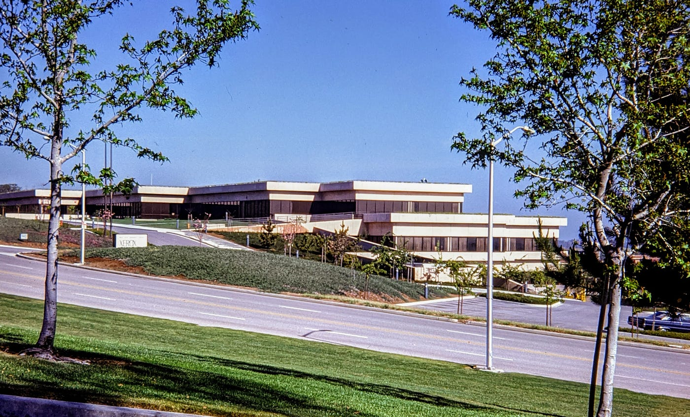
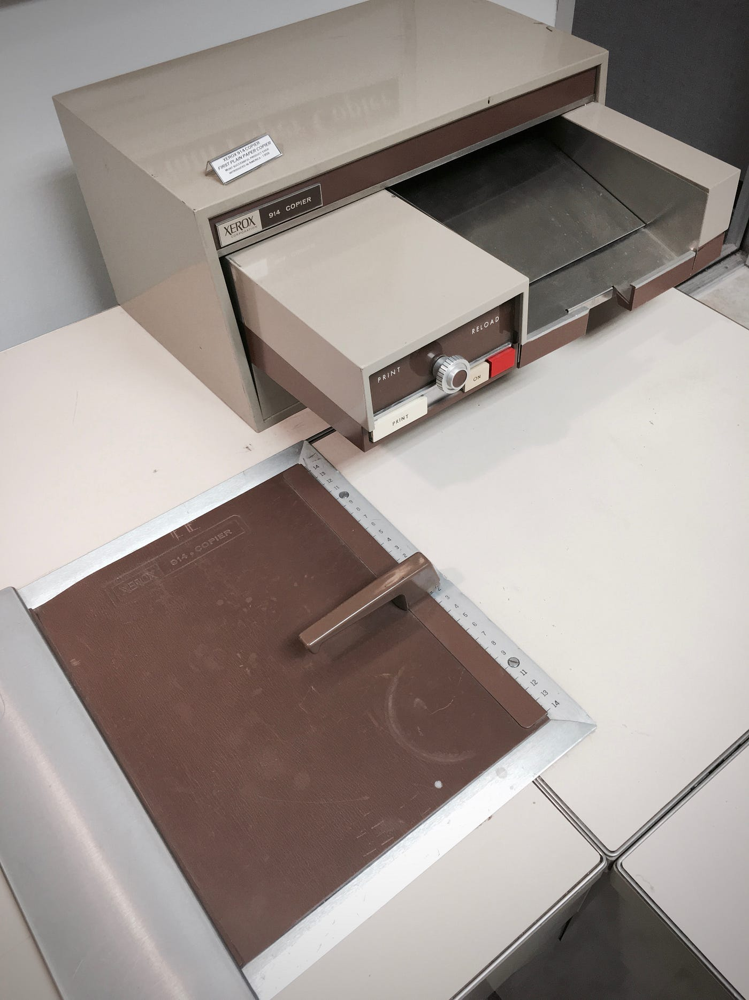
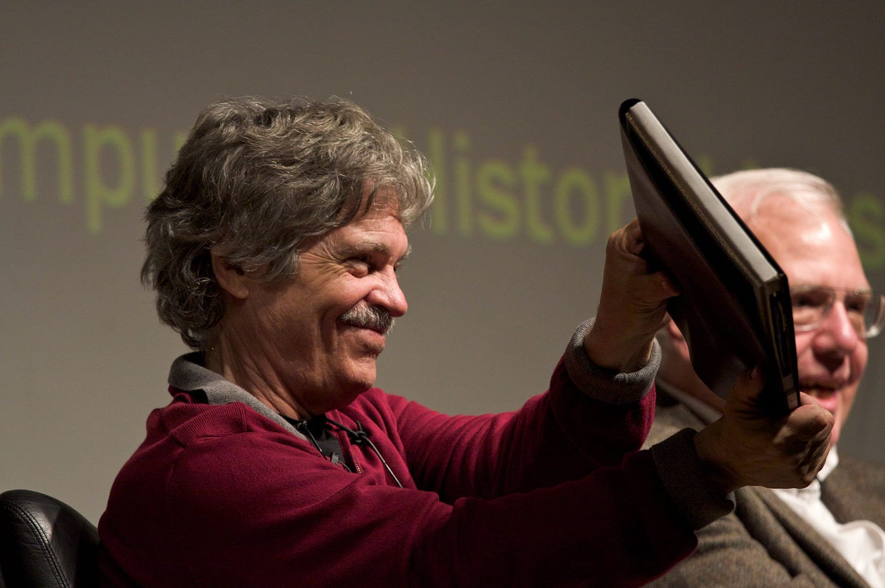
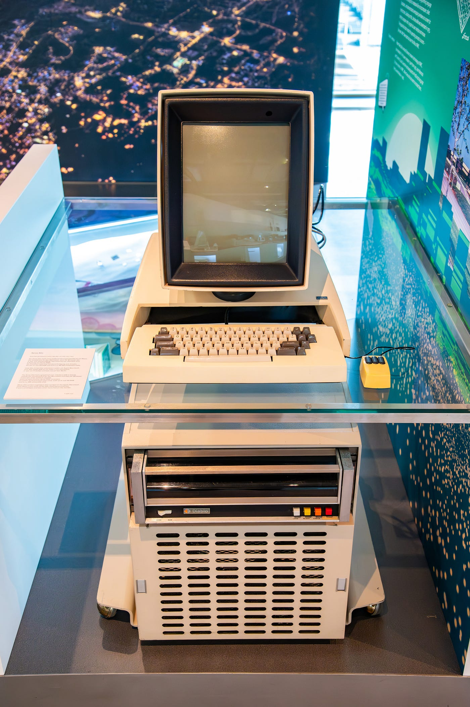
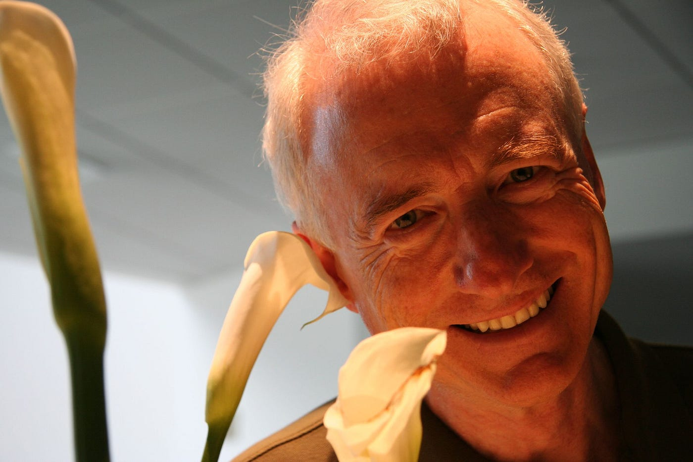
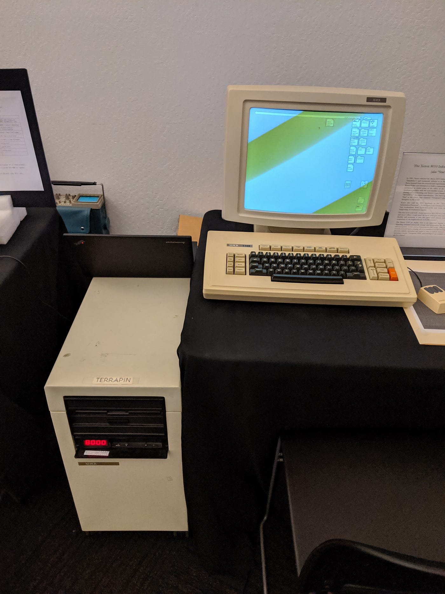
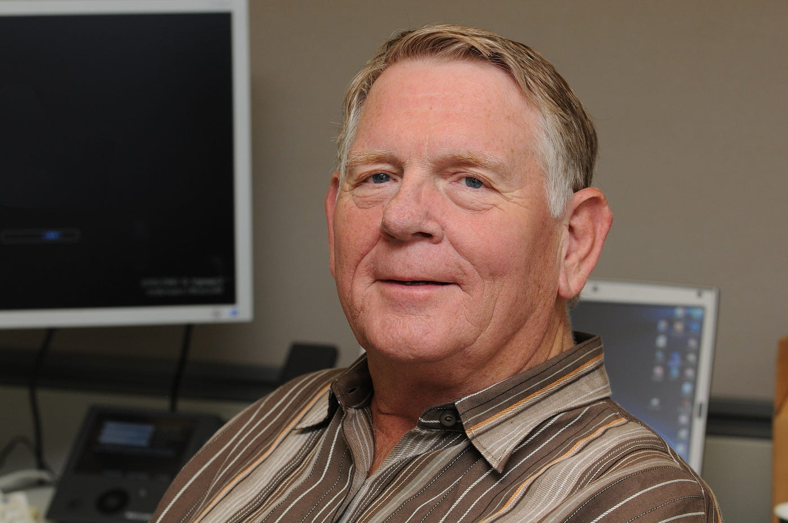
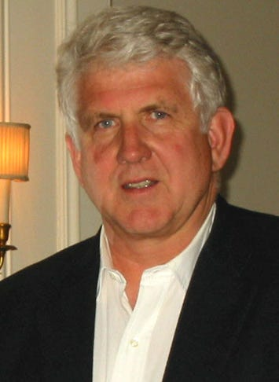

# 一个实验室发明了现代计算机，却几乎一台也没卖出去

## IT HISTORY

## *它眼睁睁看着别人靠它的发明发了财，而这居然不算失败*

*Xerox PARC，位于 Palo Alto，Coyote Hill Road 3333 号的山坡上，摄于 1977 年。(Dicklyon / Wikimedia Commons, CC BY-SA 4.0)*

在 Stanford 上方的一座山上，Palo Alto 的 Coyote Hill Road 3333 号，矗立着一栋低矮的长条形建筑。从停车场看过去，它就像一所社区大学。

如果你在 1973 年走进那栋楼，你会发现，散布在它各个处于不同装配状态的实验室里：

一台围绕图形屏幕构建的个人计算机。一只鼠标，正被改造成普通人也能用的样子。第一款编辑器，所见即所得，让你在屏幕上看到的就是打印出来的样子。一门面向对象的编程语言。窗口、图标，以及一个会跟着你的手移动的指针。

现代计算机。它的大部分。一栋楼。大约五年时间。

这家实验室就是 Xerox PARC。出钱建它的那家公司，几乎一台也没卖出去。

这是计算史上最高产的研究实验室的故事，也是关于为什么"它失败了"是错误叙述方式的故事。

### **那家公司花钱买进了错误的生意**

要理解 PARC，你得从一家有太多钱、又怀着某种安静恐惧的公司说起。

到 1960 年代末，Xerox 占领了办公室。它的 914 复印机——史上第一款普通纸张复印机——是美国公司有史以来最赚钱的产品之一。钱进账的速度比任何人合理花掉它的速度都快。

但 Xerox 的掌舵人能看到地平线上的一个轮廓。未来的办公室不会靠纸张运转，它将靠计算机运转。而 Xerox 卖的是纸张机器。

*Xerox 914——第一款普通纸复印机，也是为这一切买单的产品。(Marcin Wichary / Wikimedia Commons, CC BY 2.0)*

于是在 **1969 年**，Xerox 做了显而易见的事情。它收购了一家计算机公司——Scientific Data Systems——花了将近 **10 亿美元**，并把它改名为 Xerox Data Systems。

这是一场灾难。SDS 造的是科学计算机，它始终没能变成 Xerox 花钱买来想要的那门生意。Xerox 在 **1975 年**关掉了这个部门。它在计算机上的这场冒险最终的总账单，大约是 **13 亿美元**的亏损。

下面这一段值得慢下来读。

Xerox 花了一笔财富想成为一家计算机公司，结果失败了。但在 **1970 年**，几乎是作为同一种野心的一个脚注，Xerox 的首席科学家 Jack Goldman 说服公司出钱建一个研究中心。一位名叫 George Pake 的物理学家把它建在了距离总部 3000 英里外、Palo Alto 的那座山上。

Xerox 买错了东西。那个差点没拿到经费的东西，发明了接下来四十年的计算机。

### **计算机领域人才密度的巅峰**

PARC 在一个异常幸运的时刻开张。

越南战争让华盛顿对开放式研究心生厌倦。ARPANET 背后的机构 ARPA，被施压要求让它的资助看起来"有任务导向"，大学里那些天马行空的计算机研究的经费开始枯竭。

于是那一代领域里最好的人才突然变得可用。Xerox 在招人，用复印机赚来的钱，付得起好价钱。

他们来自 ARPA 的旧圈子、来自 Stanford 的研究所、来自 MIT、来自 University of Utah。当时身处其中的 Alan Kay 喜欢说，到 1970 年代中期，世界上一百位最优秀的计算机科学家里，大约有一半都在 PARC 工作。

这是个惊人的说法。从那栋楼里产出的工作让你很容易相信它。

*Alan Kay 在 PARC，手里拿着 Dynabook 的纸板模型——他对一台小孩也能用的个人计算机的构想。(Marcin Wichary / Wikimedia Commons, CC BY 2.0)*

实验室在一种让现代 HR 部门紧张的文化下运转。Bob Taylor，计算机科学实验室的领导者，根本不是计算机科学家。他曾在 ARPA 做研究行政。他擅长的事，是保护聪明人，并让他们把架吵好。

每周，实验室都会召开一次成员会议，叫作"The Dealer"。一位研究员站起来介绍一个想法，房间里其他人想方设法把它撕碎。

Taylor 只有一条规矩：攻击想法，永远不攻击人。他在两种分歧之间划了一条线：一种是双方连对方的立场都没法陈述出来的分歧；另一种是双方都能陈述对方立场的分歧。第一种，他立刻叫停。第二种，他让它跑下去，因为好想法就是在那里诞生的。

PARC 还有第二条规矩。你必须把东西做出来。不是幻灯片，不是 demo。是真实的系统。如果是软件，得有一百个人能用。如果是硬件，你必须造一百台。一个经不起真实硬件撞击的想法，不算数。

从这两条规矩出发，仅仅五年时间，出现了下面这些：

Xerox Alto 于 **1973 年 3 月 1 日**问世：一台为个人而非部门设计的计算机。图形用户界面：窗口、图标、一个指针：Smalltalk，Alan Kay 的面向对象语言。Bravo，第一款所见即所得编辑器，由一位名叫 Charles Simonyi 的年轻程序员写出。而在 **1973 年 5 月 22 日**，两位研究员 Robert Metcalfe 和 David Boggs 让网络在机器之间跑了起来。他们把它叫作 Ethernet。

*Xerox Alto，1973 年 3 月 1 日发布，是第一台围绕个人设计的计算机。大约造了 2000 台；Xerox 一台也没卖给公众。(Bc4040 / Wikimedia Commons, CC BY 4.0)*

他们建造了未来，并在一栋楼里每天运行它。大约造了 **2000** 台 Alto。Xerox 一台也没卖给公众。

### **1979 年 12 月**

1979 年 12 月，年轻的 Steve Jobs 走进了 PARC。

他不是靠嘴皮子混进去的。是 Xerox 邀请他来。Apple 即将上市，Xerox 的风险投资部门想要分一杯羹，于是达成了一笔交易。Xerox 可以以大约 **100 万美元**的价格买 Apple 在 IPO 前的 **10 万股**股票，作为回报，PARC 会向 Apple 的人展示它正在做的东西。

*Larry Tesler，那位为 Steve Jobs 演示 demo 的 PARC 研究员——后来从 Xerox 辞职去了 Apple。(Yahoo! / Wikimedia Commons, CC BY 2.0)*

一位名叫 Larry Tesler 的 PARC 研究员主持了那次演示。他动了一下鼠标。光标跟着动。他点击，窗口就打开又关闭。

Jobs 整个人都被震住了。多年后，他毫不掩饰地描述这件事：

> "我完全被他们给我看的第一样东西迷住了，那就是图形用户界面。我觉得那是我这辈子见过最好的东西。"

那天他在 PARC 看到了三样东西。他注意到了一样。另外两样——Smalltalk 的对象模型和 PARC 的网络——他完全没看进去，而且他承认了这一点。

Tesler 看着 Apple 的人，那神情就像你看着某人终于听到了一首你哼了多年的歌。

> "看了一个小时 demo 之后，他们对我们的技术和它意味着什么的理解，超过了任何 Xerox 高管在被我们展示多年之后所达到的理解。"

故事从这一刻开始变成一桩指控。Jobs 走进 Xerox 的实验室，看到了未来，然后带着它走了出来。四年后，Macintosh 出货了，对世界上大多数人来说，图形界面看起来像是 Apple 的主意。

盗窃。这是这个故事通常会用的词。

它错了。

### **不是盗窃。也不是失明。**

先说盗窃。根本没有什么盗窃。那是一笔交易。

Apple 让 Xerox 在 IPO 之前买它的 **10 万股**股票。作为回报，Xerox 让 Apple 的团队走进 PARC 转一圈。那次 IPO 之后一年内，这些股份的价值远远超过了 Xerox 付出的钱。Xerox 因为开了那扇门，得到了某种具体而有价值的东西，这是大多数盗窃受害者说不出口的。

而且 Apple 团队没有从 PARC 带走任何代码或硬件。他们带走的是想法，然后做了多年原创、艰苦的工作，才把一个研究系统变成普通人买得起、用得了的东西。Jobs 看到的那个 demo 没有菜单栏，没有下拉菜单，也没有一套在每个程序里都一致的语法。所有这些都是 Apple 建造的。Larry Tesler 觉得这件事重要到他从 Xerox 辞职，加入 Apple 继续做下去。

> 所以：不是盗窃。

再说另一个故事。那个让人舒服的故事：Xerox 的管理层都是傻瓜，看不到自己屁股下面坐着什么。Jobs 自己讲过这个版本：

> "Xerox 今天本可以拥有整个计算机行业。本可以成为一家比现在大十倍的公司。本可以是九十年代的 IBM。本可以是九十年代的 Microsoft。"

这是大家都在重复的版本。它也是错的。

Xerox 慷慨地给 PARC 投了十年的钱。它知道 Alto 是非凡的。而且它确实试图把未来卖出去：**1981 年**，它推出了 Xerox Star，一台带图形界面、网络和内建激光打印的商用机器。

*Xerox 8010 "Star"，1981 年——一台售价 16,595 美元的图形工作站。(vonguard / Wikimedia Commons, CC BY-SA 2.0)*

Star 不是远见的失败。它是价格、速度和封闭设计的失败。单台工作站售价 **16,595 美元**。一个像样的办公套装——工作站、服务器、打印机——大约要 **75,000 美元**。它又慢又封闭：你没法为它写自己的软件。Xerox 卖了大约 **2.5 万**台——它瞄准的那个市场转身去买了 IBM PC，价格只有十分之一。

而下面这个细节，"Xerox 是瞎子"的那个故事总是会跳过。

Xerox 唯一一项与 PARC 相关、被它出色地商业化了的技术——激光打印机——也差点没能问世。Gary Starkweather **1969 年**在 Xerox 的一个实验室里发明了激光打印，然后花了好几年和自己的管理层斗争，他们觉得让激光照射一个旋转的鼓是引发一场火灾的好办法。他不得不被悄悄调到 PARC 去把工作收尾。它后来为 Xerox 赚了数十亿美元。

*Gary Starkweather，1969 年发明激光打印的人——为了把它做完，不得不和自己的管理层斗争。(Dcoetzee / Wikimedia Commons, CC0)*

这家公司不是瞎子。它给 PARC 投了十年的钱，推出了 Star，并在它顶过自己内部的质疑之后，把激光打印机变成了它历史上最赚钱的产品之一。

那么，如果不是盗窃，也不是愚蠢，到底是什么？

### **一条只朝一个方向开口的漏斗**

答案其实和 Xerox 没什么关系。它关乎一种创新模式，那种模式大约在 1979 年前后，正悄无声息地走到尽头。

一位名叫 Henry Chesbrough 的商学学者多年后去寻找这种模式。他研究了那些从 Xerox 分出去的公司，研究了那些离开去把 Xerox 不愿意做的想法商业化的项目和人。他给那套旧办法起了个名字：closed innovation（封闭式创新）。

封闭式创新很简单，而且在二十世纪的大多数时间里，它行得通。你雇最聪明的人。你出钱让他们在内部、秘密地发明东西。你通过自家的销售渠道把这些东西卖出去。你拿到利润再倒回实验室。Bell Labs 是这么运行的。IBM 是这么运行的。Xerox 也是。

这套逻辑只有在两件事都成立时才管用：你那些聪明人留得住，而且你的渠道是通往市场的唯一道路。到 1970 年代末，在北加州，两件事都不再成立了。

三股力量打破了那个漏斗的墙。

工程师变得可以流动。他们把辛辛苦苦学来的知识直接带出大门到新雇主那里去，没有任何劳动合同能把它锁住。风险投资来了，它能在几个月之内把一位离职工程师的想法变成一家拿到融资的公司。技术周期也在变短，"我们发明了它"和"别人把它出货了"之间的时差变得致命。

PARC 的人不再需要 Xerox 的许可，也不需要 Xerox 的销售队伍。他们可以走。想法跟着他们一起走，而市场正在等着。

Chesbrough 数过。在那些从 Xerox 离开、变成独立公司的技术中，他研究了 **11** 项。等他把这些公司的价值加起来时，总额大约是 **Xerox 市值的两倍**。

再读一遍。Xerox "未能"商业化的工作，到头来比 Xerox 本身还值钱。

这不是一家未能创新的公司。这是一家通过打破刚刚被世界停用的规则来创新的公司。

### **未来，在别处被重新拼装**

看看那些人都去哪儿了。

Robert Metcalfe 带走 Ethernet，离开去创办了一家叫 3Com 的公司。Ethernet 后来变成了计算机彼此通话的方式；2022 年，Metcalfe 因此获得了 Turing Award。

*Robert Metcalfe 在 PARC 与人合作发明了 Ethernet，然后离开创办了 3Com。他在 2022 年获得了 Turing Award。(Andreu Veà, WiWiW.org / Wikimedia Commons, CC BY-SA 3.0)*

Charles Simonyi 把他那款所见即所得编辑器带到了 Seattle 一家叫 Microsoft 的小公司。它后来变成了 Word。

两位 PARC 研究员，John Warnock 和 Charles Geschke，想把一个 PARC 用来向打印机描述页面的系统商业化。Xerox 不感兴趣。他们离开，自己把它做了出来。这家公司就是 Adobe；这项技术变成了 PostScript，然后变成了 PDF。

Larry Tesler，那个给 Jobs 演示 demo 的人，加入了 Apple，花了多年把那个界面做成真的。

Alto 自己的设计者，Butler Lampson 和 Charles Thacker，会各自因为那栋楼里做出来的工作获得 Turing Award——计算机界最高的荣誉。Alan Kay 也会。

现在看看你面前的屏幕。

重叠的窗口、图标、指针：那场争论在 PARC 已经赢了。你的机器所在的网络是 Ethernet，1973 年 5 月。PDF 本身脱胎于 PostScript，从 PARC 经由 Adobe 而来。走廊那头的办公室打印机是 Starkweather 的激光打印机——就是 Xerox 差点放火烧掉的那个。

PARC 没有失去其中任何一样。它们全都还在运转。只是上面贴的是别的公司的名字。

### **没换过的那个地址**

那么回到那栋楼。

Coyote Hill Road 3333 号还在那里。Xerox 在 2002 年把 PARC 分拆成一家独立公司，并在 2023 年把它捐赠给了 SRI International。Xerox 的名字从门口拿下来了。

如果你在 1973 年走过那些走廊，你会看到现代计算机正在被一片片创造出来，由几百个被允许争论和动手的人完成。现在再走一遍，你会发现一个跟其他任何研究实验室都差不多的研究实验室。

很容易把这件事叫作悲剧。它其实并不完全是。

Xerox PARC 不是没能发明未来。它太彻底地、太超前于它的母公司地发明了未来，以至于没有任何单一一家公司能把它留住。那些发明没有死。它们扩散进了 Apple、扩散进了 Adobe、扩散进了 Microsoft、扩散进了 3Com、扩散进了你正在读这篇文章的那台机器。

那种本应把这一切都为一个所有者所拥有的模式——雇最好的人、秘密地发明、通过自家的门出货——大约就是在那时候死掉了。取代它的，是现在整个行业运转所用的那种漏的、开放的、更快的方式。

那家实验室把未来做对了。它只是没能把它留下来。

而那栋楼，那栋至今看起来仍像一所社区大学的楼，留下了它的地址。
