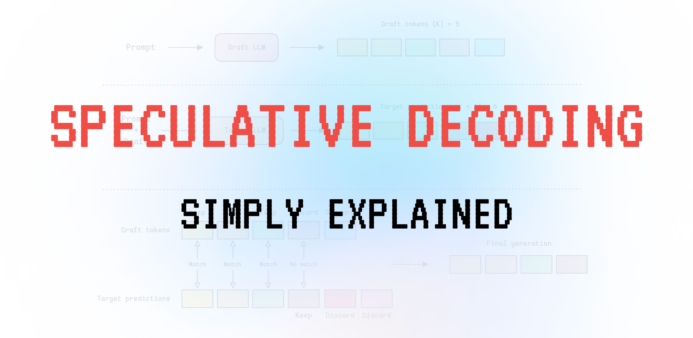
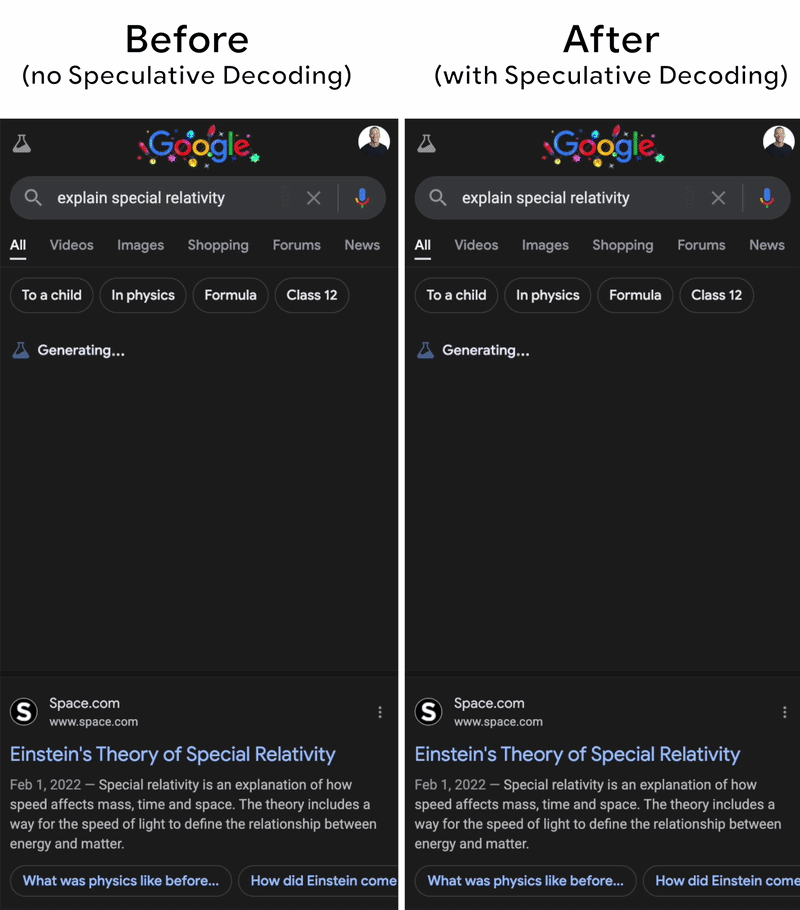
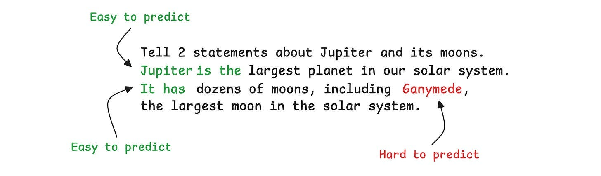
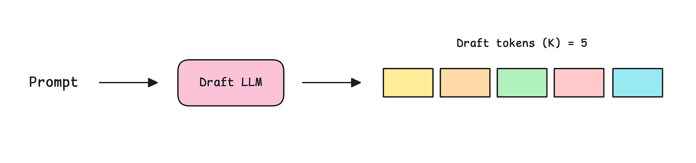
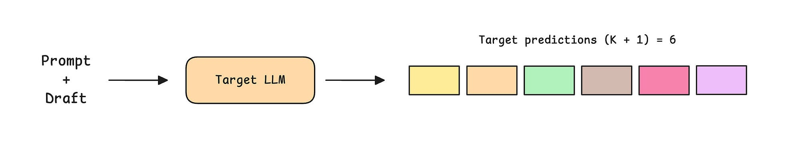
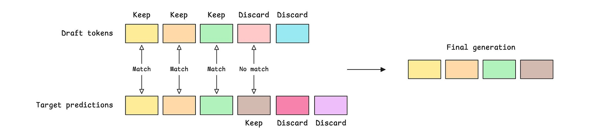

# 推测解码（Speculative Decoding）简明讲解



## 从零理解 Speculative Decoding 的原理，并将其用于你的 AI 应用，让推理更快、更便宜。

LLM 推理速度慢、占用内存大、计算开销高。

LLM 是[自回归（autoregressive）](https://en.wikipedia.org/wiki/Autoregressive_model)的，一次只产生一个 token，而如今在用的 LLM 还动辄包含数万亿个参数。这意味着，从这些模型中产生一个 token 就需要数万亿次计算！

2022 年，Google 发表了一篇研究论文《[*Fast Inference from Transformers via Speculative Decoding*](https://arxiv.org/abs/2211.17192)》，在其中提出了一种名为 **Speculative Decoding** 的推理技术。

该技术宣称可以在**不牺牲 LLM 输出质量的前提下，把推理速度提高 2–3 倍**，自那以后，它已被 Google 搜索中的 AI overviews（以及其他所有现代 LLM 应用）用来加速推理。


*图片来源*

## 究竟是什么让推理变慢？

你可能会以为，做出数万亿次计算才能生成一个 token 就是限制推理速度的原因，但这是一个**巨大**的**误解**！

如今在用的 [GPU](https://en.wikipedia.org/wiki/Graphics_processing_unit) 和 [TPU](https://en.wikipedia.org/wiki/Tensor_Processing_Unit) 都是强大的并行计算机器，每秒可以执行数百万亿次运算。这往往比通过 LLM 生成一个 token 所需的运算量高出 100 倍以上。

*那么真正的瓶颈在哪里？*

要产生一个 token，GPU 必须把模型的所有参数从高带宽内存（HBM）读到计算单元里。这个过程慢得令人痛苦，让计算单元在等待权重到达时白白闲置。

这使得这个过程是[**内存受限（memory-bound）**](https://en.wikipedia.org/wiki/Memory-bound_function)的，而不是计算受限的。

（*LLM 推理与 LLM 训练大不相同——训练时你只加载一次参数，然后在一大批训练样本上的数千次运算中反复复用它们。*）

> ***Insight 1: 这意味着我们手头有大量空闲的计算资源等着被利用。***

## 预测所有 token 真的那么难吗？

考虑下面这对 prompt 和 response：

> "Tell 2 statements about Jupiter and its moons. Jupiter is the largest planet in our solar system. It has dozens of moons, including Ganymede, the largest moon in the solar system."

在这段话里，把单词视为 token，其中一些 token，比如 "*Jupiter*"、"*is*"、"*the*"，更容易预测/生成，而另一些，比如 "*Ganymede*"，则更难预测。

这是因为 LLM 已经在它的 prompt 里见过 "*Jupiter*"，而在紧随其后的位置上，"*is*" 和 "*the*" 几乎没有什么可竞争的替代项。

而对于 "*Ganymede*"，其前文上下文 "*dozens of moons, including*" 会带出许多可能有效的补全选项。



> ***Insight 2: 我们并不总是需要一个强大的 LLM 来产生那些更容易预测的 token。***

## Speculative Decoding 如何利用这些洞见？

Speculative Decoding 正是建立在这两个洞见之上，用来加速大型 LLM 的推理。

为此，它会使用一个与较大模型来自同一家族的较小 LLM，二者共享分词器（tokenizer）和词表（vocabulary）。这个较小的 LLM 天然会推理得更快，因为它的参数比大模型少。

在这种情况下，较小的 LLM 被称为 **Draft model（草稿模型）**，较大的 LLM 被称为 **Target model（目标模型）**。

我们来看看它们是如何一起工作的。

-   对于给定的 prompt，较小的/Draft model 首先生成 `K` 个 token（一份草稿）。这是 **Speculation/Drafting（推测/起草）** 步骤。



-   这 `K` 个 token 连同原始 prompt 一起被送入较大的/Target model。

在一次前向传播中，较大模型会输出在该草稿每个位置上对下一个 token 的概率分布，再加上草稿之外一个额外位置上的分布。所以目标预测的总数是 `K + 1 = 6`。

因为推理是内存受限的，这一次前向传播花的时间几乎和从模型中生成一个 token 一样长。



-   接下来是 **Verification（验证）** 步骤。每个起草出来的 token 都要与较大的/target model 在该位置上的预测进行比对。如果它们一致（在使用[贪心解码 greedy decoding](https://www.intoai.pub/i/176405190/1-greedy-decoding) 时），或者 target model 认为它的概率足够高（在通过拒绝采样使用[概率解码 probabilistic decoding](https://www.intoai.pub/i/176405190/3-top-k-sampling) 时），该 token 就被接受。

在第一个未通过该检查的 token 处，这个 token 以及其后所有起草出来的 token 都会被丢弃，而较大模型会为该位置提供一个替换 token。

target LLM 后续产生的所有 token 也都会被丢弃，因为它们是以那个被拒绝的草稿 token 为条件生成的。

然后从这个位置重新开始起草。



由此带来的好处相当明显。

-   假设所有 `K` 个草稿 token 都被接受，我们就会在最终输出里得到 `K+1` 个 token。这是**最好情况**。
-   更常见的情况是，如果前 `i` 个草稿 token 被接受，我们就会得到 `i+1` 个 token，也就是 `i` 个草稿 token + 1 个由 target model 重新采样得到的替换 token。
-   在**最坏情况**下，如果第一个草稿 token 就被拒绝，我们就只能得到 1 个 token，即从 target model 重新采样得到的替换 token。这与从 target model 进行常规解码完全相同。

Speculative decoding 在大多数情况下都是双赢的！

## 从零实现 Speculative Decoding

让我们一步步地用 Python 构建 Speculative Decoding，来理解它是如何工作的。

思路是：用一个小（draft）模型预测 N 个 token（一份草稿），然后用一个大（target）模型在一次前向传播中验证这份草稿，保留它认可的 token，并替换掉它第一个不认可的那个，丢弃其余部分。

在下面这个简化示例中，我们将 [Greedy decoding 策略](https://www.intoai.pub/i/176405190/1-greedy-decoding) 与 Speculative decoding 一起使用，在每个解码步骤中选择模型生成的概率最高的 token。

```python
import torch
from transformers import AutoModelForCausalLM, AutoTokenizer
@torch.no_grad()
def speculative_decoding(prompt, target_llm, draft_llm, tokenizer, max_gen_tokens, max_draft_tokens):
    
    device = target_llm.device
    input_ids = tokenizer(prompt, return_tensors="pt").input_ids.to(device)    
    n_generated = 0
    n_accepted_total = 0
    n_drafted_total = 0    
    while n_generated < max_gen_tokens:
        
        draft_start = input_ids.shape[1]        
        
        draft_input = input_ids.clone()        
        draft_tokens = []                
        for _ in range(max_draft_tokens):
            
            logits = draft_llm(draft_input).logits[:, -1, :]            
            next_token = logits.argmax(dim=-1)             
            draft_tokens.append(next_token.item())                        
            draft_input = torch.cat([draft_input, next_token.unsqueeze(0)], dim=1)        
        target_logits = target_llm(draft_input).logits[0]        
        
        
        
        
        target_preds = target_logits[
            draft_start - 1 : draft_start - 1 + max_draft_tokens + 1
        ].argmax(dim=-1).tolist()        
        n_accepted = 0        for i in range(max_draft_tokens):
            
            
            if draft_tokens[i] != target_preds[i]:
                break 
            n_accepted += 1        
        new_ids = target_preds[:n_accepted + 1]        
        input_ids = torch.cat(
            [input_ids, torch.tensor([new_ids], device=device)], dim=1
        )        
        n_generated += len(new_ids)
        n_accepted_total += n_accepted
        n_drafted_total += max_draft_tokens    
    text = tokenizer.decode(input_ids[0], skip_special_tokens=True)    
    acceptance_rate = n_accepted_total / max(n_drafted_total, 1)    return text, acceptance_rate
```

接下来，我们写一个函数，在不使用 Speculative decoding 的情况下从 target LLM 中生成输出（同样，在每个解码步骤中从模型里选择概率最高的 token，即 Greedy decoding）。

```python
@torch.no_grad()
def simple_decoding(prompt, llm, tokenizer, max_gen_tokens):
    
    device = llm.device
    input_ids = tokenizer(prompt, return_tensors="pt").input_ids.to(device)    
    for _ in range(max_gen_tokens):
        
        logits = llm(input_ids).logits[:, -1, :]        
        next_id = logits.argmax(dim=-1)        
        input_ids = torch.cat([input_ids, next_id.unsqueeze(0)], dim=1)    
    return tokenizer.decode(input_ids[0], skip_special_tokens=True)
```

最后，让我们看看在共享分词器的 Qwen 3 系列模型上，Speculative decoding 究竟能让推理加速多少。

> *一条经验法则是：一个比 target 至少小 10× 的 draft model，能在 speculative decoding 中带来最好的加速效果。*

```python
import time
TARGET_LLM = "Qwen/Qwen3-8B"
DRAFT_LLM = "Qwen/Qwen3-0.6B"
device = "cuda" if torch.cuda.is_available() else "cpu"
dtype = torch.bfloat16 if device == "cuda" else torch.float32print(f"Loading models on {device} ({dtype})...")
tokenizer = AutoTokenizer.from_pretrained(TARGET_LLM)
target_llm = AutoModelForCausalLM.from_pretrained(TARGET_LLM, dtype=dtype).to(device).eval()
draft_llm = AutoModelForCausalLM.from_pretrained(DRAFT_LLM, dtype=dtype).to(device).eval()
prompt = "Mathematics is"
t0 = time.time()
simple_decoding_text = simple_decoding(prompt, target_llm, tokenizer, max_gen_tokens=64)
simple_decoding_time = time.time() - t0
t0 = time.time()
spec_decoding_text, acceptance_rate = speculative_decoding(prompt, target_llm, draft_llm, tokenizer,max_gen_tokens=64, max_draft_tokens=5)
spec_decoding_time = time.time() - t0
print("Simple decoding")
print(simple_decoding_text)
print(f"Time taken: {simple_decoding_time:.2f}s")print("\nSpeculative decoding")
print(spec_decoding_text)
print(f"Time taken: {spec_decoding_time:.2f}s")print(f"\nAcceptance rate: {acceptance_rate:.1%}")
print(f"\nSpeedup: {simple_decoding_time / spec_decoding_time:.2f}x")
if simple_decoding_text == spec_decoding_text:
    print("\nOutputs of Simple decoding and Speculative decoding match exactly.")
```

## 如何在 vLLM 中使用 Speculative Decoding？

[vLLM](https://vllm.ai/) 是一个开源库，专为快速的 LLM 推理与服务而设计。它使用 [PagedAttention](https://arxiv.org/abs/2309.06180)——一种能更高效地管理 Key-Value（KV）cache 的 attention 算法。

这是在为 LLM 提供服务时你最终会用到的、流行的推理库之一。

vLLM 内建了对高效 speculative decoding 的支持，你不需要从零重写算法就能在实践中实现它。

下面是它的使用方式。

```

uv pip install vllm
```

```python
from vllm import LLM, SamplingParams
prompts = ["Mathematics is", "Feynman was"]
sampling_params = SamplingParams(temperature=0)
llm = LLM(
    model="Qwen/Qwen3-8B",  
    tensor_parallel_size=1,
    speculative_config={
        "model": "Qwen/Qwen3-0.6B",  
        "num_speculative_tokens": 5,  
        "method": "draft_model",
    },
)
outputs = llm.generate(prompts, sampling_params)
for output in outputs:
    prompt = output.prompt
    generated_text = output.outputs[0].text
    print(f"Prompt: {prompt}, Generated text: {generated_text}")
```

就这么简单！

## 延伸阅读

-   [*Fast Inference from Transformers via Speculative Decoding*](https://arxiv.org/abs/2211.17192)
-   [*vLLM Speculation methods*](https://docs.vllm.ai/en/latest/features/speculative_decoding/)
-   [*EAGLE: Speculative Sampling Requires Rethinking Feature Uncertainty*](https://arxiv.org/abs/2401.15077)
-   [*EAGLE-2: Faster Inference of Language Models with Dynamic Draft Trees*](https://arxiv.org/abs/2406.16858)
-   [*EAGLE-3: Scaling up Inference Acceleration of Large Language Models via Training-Time Test*](https://arxiv.org/abs/2503.01840v3)
-   [*Medusa: Simple LLM Inference Acceleration Framework with Multiple Decoding Heads*](https://arxiv.org/abs/2401.10774)
-   [*Speculative Speculative Decoding*](https://arxiv.org/abs/2603.03251)

## 图片来源

除非图注中另有说明，所有插图均由作者绘制。
