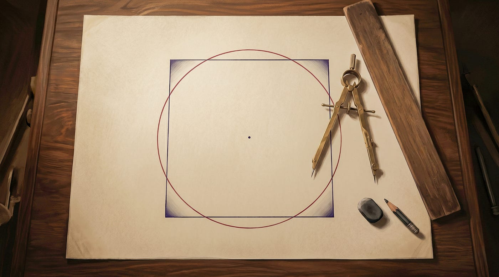
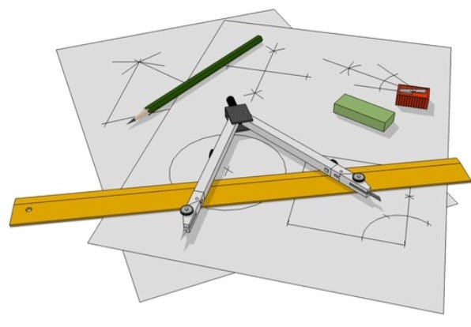
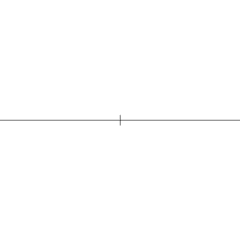
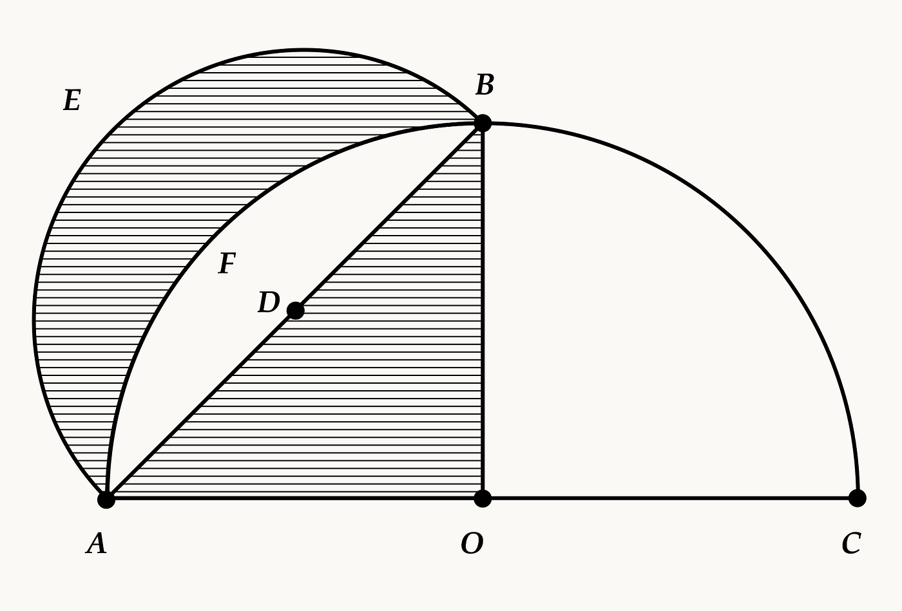
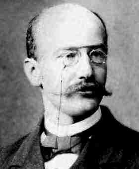
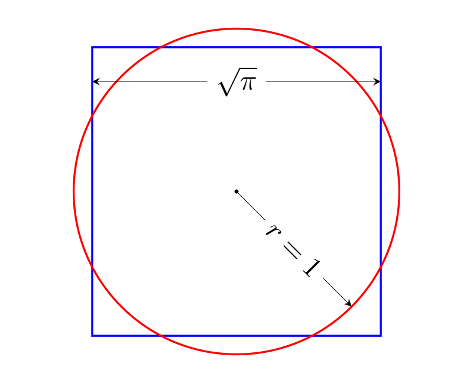
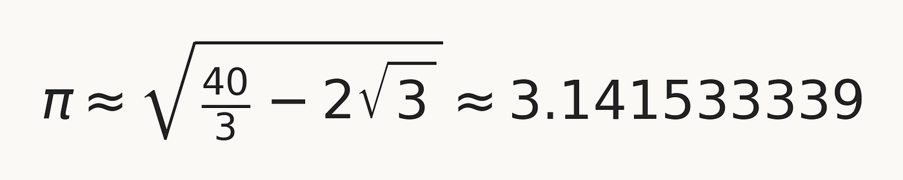
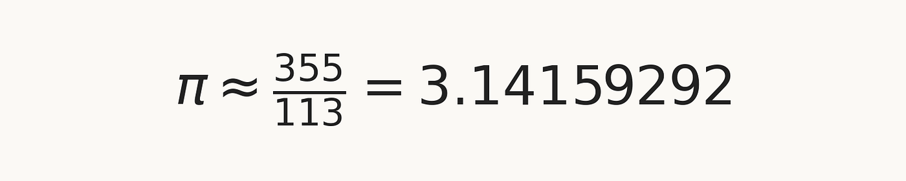
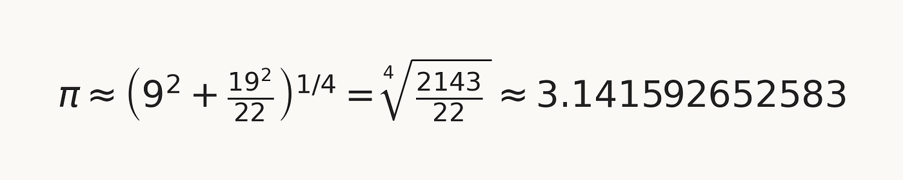

# 化圆为方：那个不可能的梦想

## 数学之谜

## 一场延续两千年的追寻，最终的归宿不是一个解，而是一个不可能的证明

想象一下，给你一个圆，再给你一个简单的挑战：只用一把**圆规**和一把**直尺**，画出一个面积与之完全相等的正方形。

不准测量。不准近似。只用纯粹的几何。

*经典的直尺和圆规工具陈列在几何作图草稿之上，展示了希腊几何所限定的作图器具。图片来源：Teodomiro，via Wikimedia Commons, CC BY-SA 4.0。*

它几乎像一道趣味题，那种有人可能会随手在纸上画几笔的题目。但这个看起来如此朴素的问题，被称为化圆为方，却抵挡住了两千多年的求解尝试。一些最杰出的数学头脑都试过破解它，却无一成功。

然而那次失败并不是故事的结尾。它是另一个更深远故事的开始。

## 用两件简单工具能做出什么

乍一看，古典几何的规则似乎相当苛刻。你只被允许使用**一把没有刻度的直尺**和**一把圆规**。没有带刻度的尺子，没有量角器，没有坐标，作图过程本身也不允许写入任何计算。

然而，在这些限制之内，几何却出人意料地丰富。

仅凭这两件工具，人们就可以**平分一条线段**、作出**一条垂线**、**复制一个角**、**平分一个角**、**画出平行线**，以及**找出一个圆的圆心**。整套几何论证都可以转化为精确的视觉操作。一段长度可以从一处搬到另一处，一个三角形可以根据给定数据构造出来，许多正多边形也可以被精确地画出。

其中有些作图尤其优雅。比如**正六边形**，几乎不费吹灰之力就能内接于一个圆中：一旦圆画好，圆规张开的距离本身就已经是六边形的边长。将这同样的半径沿圆周一步步迈过去，就依次标出了六个顶点。结果几乎像变魔术，尽管这直接源自圆的几何本身。

*用直尺和圆规作出内接于圆的正六边形的动画。来源：Aldoaldoz，via Wikimedia Commons, CC BY-SA 3.0。*

**这正是古典作图如此引人入胜的一部分原因**。它并不只是技术性配方的集合。它是一种受过纪律训练的创造形式，用最简单的工具产出精确而往往美丽的结果。这也是希腊几何那几个伟大的未解难题如此引人入胜的原因。它们并非从一个贫瘠的体系中冒出来，而是从一个看起来异常强大的体系中冒出来的。

## 古典时代的探索

这个问题的起源在**古希腊**，在那里几何远不只是一种实用工具。它是一种受过纪律训练的方式，用来推理秩序、形式和真理。

在那个世界里，数学家在严格的规则下工作。一个有效的作图必须只使用两件工具来完成，**一把没有刻度的直尺和一把圆规**。这些并不是随意的限制。它们定义了古典几何的性格，塑造了何为合法的解。

从这一背景中浮现出三个后来成为传奇的问题：**倍立方**、**三等分角**和**化圆为方**。每一个看起来都很容易表述，简单得几乎像是邀请你来解。而每一个都让几何学家苦苦挣扎了好几个世纪。

## 早期的尝试

已知最早试图化圆为方的努力，可以追溯到**公元前五世纪**的希腊世界。传统上将这个问题与**阿那克萨哥拉**（Anaxagoras）联系在一起，据说他在因宣称太阳并非神而是一块炽热石头而被囚禁期间研究过它。无论这个故事是否完全可信，它都表明这个挑战在很早的时候就已经攫住了数学的想象力。

让这些早期尝试如此有意思的，是它们并非都是幼稚的。其中一些开启了新的数学方向。例如**希俄斯的希波克拉底**（Hippocrates of Chios）并没有化圆为方，但他取得了一项非凡的成就：他证明了某些被圆弧所界、形如月牙的弧形——也就是月牙形——可以被精确地化为正方形。那是一个引人注目的结果。它证明了一个有曲线边界的图形并不自动地超出几何控制之外，并且想必鼓励了人们这样一种希望：圆本身或许最终也会就范。

*希波克拉底月牙形示意图。左上方的阴影月牙形与下方的阴影直角三角形面积相等。来源：Michael Hardy，via Wikimedia Commons, public domain。*

**安蒂丰**（Antiphon）以另一种方式接近这个问题。他设想在一个圆内内接一个多边形，然后一次又一次地把边数加倍。一个正方形变成一个八边形，再变成 16 边形、32 边形，依此类推。每加倍一次，多边形就更紧地贴合圆，剩下的弧形缝隙就变得越来越小。既然多边形可以被化为正方形，他相信圆最终也可以以同样的方式被捕获。

**赫拉克利亚的布里松**（Bryson of Heraclea）则把这一思路推进得更远：他同时考虑内接多边形和外切多边形，**试图把圆夹在二者之间**。这些论证并未解决问题，但它们正向一个深刻的思想靠近，那就是用多边形来逐步逼近曲线图形——这一主题后来在穷竭法中成为核心，并在更晚之后成为积分学的核心。

即便是在失败中，这些早期努力也改变了数学。它们促使几何学家更仔细地思考面积、近似、曲线图形，以及作图本身的极限。

## 数个世纪的执着

希腊人的尝试并未结束这个故事。这个问题熬过了古典时代，并在**中世纪**、**文艺复兴**和**近代早期**继续吸引关注。

一次又一次，数学家和业余爱好者都相信他们找到了那个久寻不得的作图。许多人发表了巧妙的图示和论证，却被后来的读者发现其中藏有近似手段，或对古典规则有微妙的违犯。化圆为方逐渐不再仅仅是一项几何挑战。它变成了一个象征，代表着执着、机敏，有时也代表着过度自信。

**当时仍然缺少的，是对圆规直尺作图究竟能产出什么的清楚理解**。在这个问题没有得到回答之前，问题在表面上一直是悬而未决的。

## 从几何到代数

在很长一段时间里，化圆为方被当作一个纯粹的几何挑战来对待。只要画得足够仔细、推理得足够巧妙，也许正确的作图终会出现。但几个世纪过去，这个问题慢慢改变了性格。数学家们开始意识到，真正的问题不仅仅是几何性的。**它也是算术性的**。

那是一种深刻的转变。圆规和直尺的作图看上去像是关于线、圆和交点的事情，但隐藏在它之下的是一种数的理论。每一个用这种方式构造出来的点都对应一个长度，而这个长度是通过一组有限的运算从更早的长度得到的。你可以做加、减、乘、除，以及开平方，一次又一次，但不能超出这些。**这个看似视觉化的古典几何世界，原来是由代数规则所支配的。**

一个关键思想浮现了出来：**任何可以用圆规和直尺作出的长度，必定是一个代数数**。这意味着它必须满足一个系数为有理数的多项式方程。

**√2 是一个完美的例子**。它是**无理数**，因为它不能写成整数之比。它的小数展开永不循环。但它仍然是**代数数**，因为它满足一个简单的代数方程：

因为 √2 是一个系数为有理数的多项式方程的根，所以它属于代数世界，可以用圆规和直尺作出来。**单纯的无理性并不是障碍**。

一旦这一点变得清楚，这个古老的问题就发生了变形。真正的关键不再只是有没有人能找到正确的图。它变成了这样一个问题：**π 是否属于古典作图所能触及的那一类数？**

如果是，那么化圆为方或许是可能的。如果不是，那么这场延续了几个世纪的努力从一开始就注定要失败。

## π 的超越性

到了**十八世纪**，这个问题开始改变它的形状。数学家们不再只是寻找巧妙的作图。他们开始问一个更根本的问题：**究竟哪些种类的数，可以从圆规和直尺的几何中产生出来？**

**1761 年**，**约翰·海因里希·朗伯**（Johann Heinrich Lambert）证明了 *π* 是无理数：它不能写成整数之比。但这仍然没能解决那个古老的问题。无理数并不自动地超出几何作图之外。√2 是无理数，却是可作图的。

到了十九世纪，法国数学家**皮埃尔·汪策尔**（Pierre Wantzel）厘清了：任何可以用圆规直尺作出的长度都必须是代数数。

接着，在**1882 年**，**费迪南德·冯·林德曼**（Ferdinand von Lindemann）给出了最终的答案。**他证明了 *π* 是超越数**。这意味着 *π* 不是任何系数为有理数的多项式方程的解。不是二次方程，不是三次方程，也不是任何有限次数的方程。这一证明建立在**夏尔·埃尔米特**（Charles Hermite）此前的工作之上，埃尔米特曾证明数 *e* 是超越数。林德曼把这些思想加以推广，证明了 *π* 完全位于代数宇宙之外。

至此，这个古老的问题不再是一个画图技巧的问题。它已经变成了一个关于数本身性质的陈述。

*数学家费迪南德·冯·林德曼（1852–1939）的肖像。来源：作者不详，via Wikimedia Commons, public domain。*

## 为什么这就终结了这个问题

要把一个半径为 *r* 的圆化为正方形，你需要构造一个面积相同的正方形。圆的面积是：

如果正方形的边长为 *s*，那么它的面积是：

要让两块面积相等，边长必须满足：

于是问题就归结为一个问题：**你能不能作出一段与 √*π* 成比例的长度？**

*经典"化圆为方"问题的图示：单位圆（r=1）面积为 π，因此面积相同的正方形必须以 √π 为边长。改编自 Squaring the Circle J.svg，via Wikimedia Commons, CC BY-SA 4.0。*

**门到此终于关上了**。古典作图只能产生那些由有理数经过有限次算术运算和开平方所得到的长度。这些都是代数长度。但 √*π* 是超越数。任何有限的古典步骤链，都不可能触及它。

所以那段所需的长度根本无法被作出来。不是精确地。也不是靠一张更巧妙的图。也不是靠更多耐心。

**这项任务从根本上就是不可能的。**

这正是这个故事的非凡之处。在两千多年里，数学家们一直在试着解这个问题。而他们真正所需要的，是去理解为什么它没有解。

那次失败并非源于技巧的不足。它并非源于几何洞察的缺失。它源于问题本身。

而一旦这一点被理解，这个问题就不是被击败了。它是被了结了。

## 近似化圆为方

一旦精确问题被证明不可能，故事并没有就此简单地结束。数学家们其实早在好几个世纪以前就已经知道，人们可以非常接近这个解；而在不可能性结果之后，近似作图变成了另一种挑战：不是为了打败那个定理而进行的失败尝试，而是一种关于几何机敏的优雅练习。

目标不再是精确地化圆为方，而是用一个足够简单到优美、又足够准确到令人印象深刻的作图来逼近它。

一个著名的例子来自波兰耶稣会士**亚当·阿达曼迪·科昂斯基**（Adam Adamandy Kochański），时间是**1685 年**。他的作图对应于这个近似

该值精确到小数点后四位。它之所以广为人知，并不是因为它是当时所能得到的最精确近似，而是因为**它用一个相对简单的作图就取得了非常好的结果**。

一个更加引人注目的近似是有理数

它来自**五世纪**中国数学家**祖冲之**的工作。这个值与 *π* 在小数点后六位上一致，对于如此简单的一个分数来说，准确得令人惊讶。很久以后，在**1849 年**，**雅各布·德·黑尔德**（Jacob de Gelder）发表了一种基于这个近似的直尺-圆规作图，展示了如何把它转化为一个面积与给定圆极其接近的正方形。

接着便是**斯里尼瓦瑟·拉马努金**（Srinivasa Ramanujan）。**1914 年**，他给出了几个更令人印象深刻的近似化圆为方几何作图。其中一个仍然是基于近似 **355/113**。另一个则使用了近似

由此拉马努金给出了一个几何作图，作出的正方形面积与圆的面积异常接近。这个值与 *π* 在**小数点后八位**上一致。通过一个看起来颇为古典的几何作图就达到这种精度，几乎令人难以置信。对于一个**半径 1 米的圆**，所得到的正方形面积与圆的真实面积之差只有大约 **0.001 mm²**，大致是千分之一平方毫米。

拉马努金并不是在推翻化圆为方的不可能性。他是在做某种更微妙的、以其自身方式同样美丽的事情：展示纯粹的几何可以多么贴近地追摹一个不可达到的精确值。

所以尽管精确的化圆为方是不可能的，近似化圆为方仍然是一门活生生的艺术。它成了一个地方，在那里创造力、优雅和数值洞察仍然能够相遇，远在那个古老的梦想本身被证明无法企及之后。

## 为什么"化圆为方"至今仍然意指那不可能之事

在那个数学问题本身被了结很久之后，它的措辞却存活了下来。

**"化圆为方"**演变成了比几何更宏大的意思，指的是一项以决心和机敏去追逐、却又无法在定义它的规则之内完成的任务。这个比喻并不是偶然出现的。两千多年来，这个问题始终伫立在看似可能的边缘，既邀请着解答，又同时抗拒着解答。

这个表达进入了文学和知识文化，因为它捕捉到了一种熟悉的人类经验。作家们用它来暗示徒劳、执念、悖论，以及理性的极限。在那种形态里，这个短语不再仅仅指圆和正方形。它成了一个象征，象征着每一个无法完全实现的优雅雄心。

希腊人用几何的语言提出了这个问题。答案在几个世纪之后，用代数和超越性的语言抵达。

而这正是为什么这个短语至今仍能引发共鸣。即使在今天，说某人正在试图化圆为方，就是在说他们正在追逐那做不到的事。

*封面图：一幅古典几何场景，纸上画着一个红色圆和一个蓝色正方形，旁边放着一只圆规、一把直尺、一支铅笔和一块橡皮。本文使用 AI 工具生成。*
