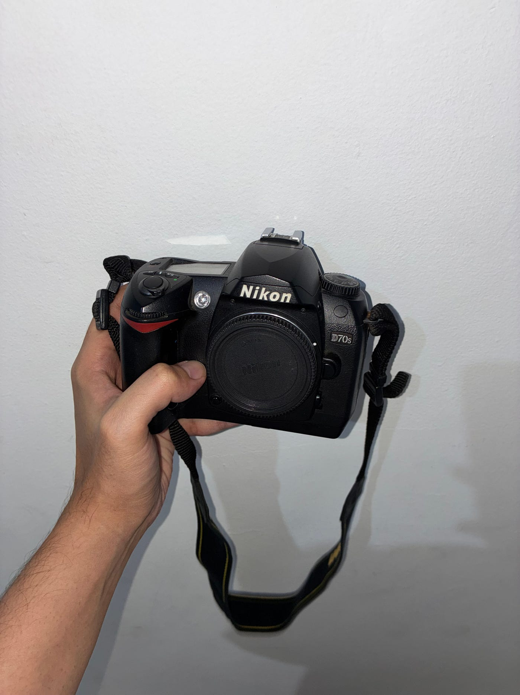
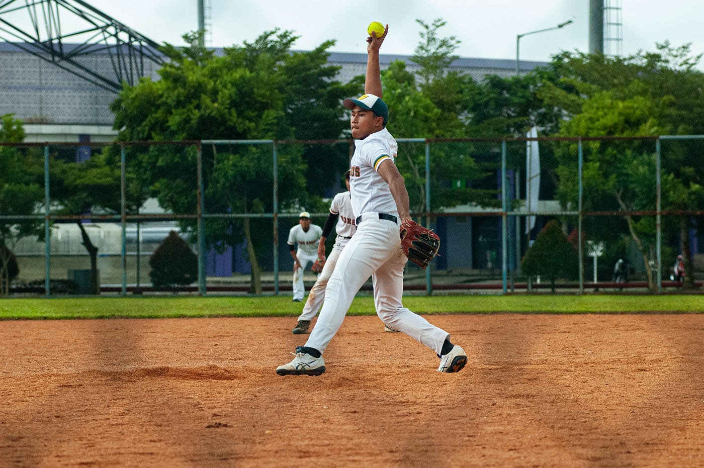
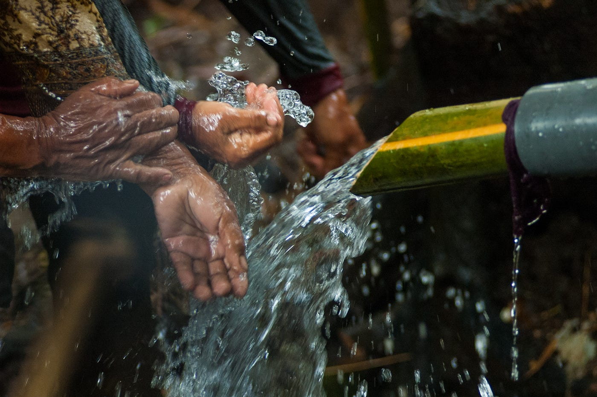

# Nikon D70s 是一台 21 年的老相机，我永远都不会停止使用它

## *有些相机是工具。有些相机会变成你看世界方式的一部分。这台两者都是。*

*作者拍摄*

如果你告诉别人，你要带着一台 21 年前、6.1 像素的 DSLR 去拍片，大多数人多半会以为你在开玩笑。或者以为你在做某种实验。或者觉得你只是在以那种摄影师有时为了显得有趣会刻意采取的方式标新立异。

我不是在做以上任何一件事。我真心地、持续地、毫无反讽地，仍然把 Nikon D70s 当作我的主力相机之一——在 Malang 拍街头摄影、拍人像、做民族志田野调查、做我在专业上真正在意的项目时都用它。这台相机陪我走过的事比我能轻易列举的还多，而它一次也没让我失望过。

D70s 在 2005 年发布。它是 Nikon 对当时正在增长的消费级 DSLR 市场给出的答案——是已经广受好评的 D70 的后续机型，加了一些细节优化，建立在一个本来就扎实的基础之上。当年它和早期的 Canon Digital Rebel 系列以及第一波平价可换镜头数码相机竞争。今天，那些相机大多在收纳箱里积灰，或者在二手市场上几乎卖不出什么价。

而我还在用我那台拍照。

## D70s 与之后所有相机有何不同

要理解为什么这台相机到今天还撑得住，你得明白 2005 年 Nikon 想做的是什么。数码相机市场当时还年轻，厂商们还没有为了在价格上竞争而偷工减料。他们想证明些什么——证明数码可以严肃、可以耐用、可以好到足够赢得那些花了几十年和胶片建立感情的摄影师的信任。

D70s 就是带着这种意图被造出来的。它的每一部分。

机身是镁合金的。它不是你拿过的最轻的相机，而这正是重点。你一拿起它，就能感到一种坚固感——一种这台相机被设计成可以经历各种事情的感觉。雨、灰尘、那种来自真正使用相机而不是把它干干净净放在陈列柜里所带来的日常磨损。我这台经历过所有这些。手柄已经显出磨损。橡胶随着多年使用稍微变软。它仍然完美工作，没有迟疑，每一次开机都是如此。

把这和今天发布的某些产品比一比——更轻的相机，是的，在几乎每一个可衡量的方面技术上都更优越，但用的是那种感觉像是已经在为自己的过时做打算的材料。我理解那些决策背后的经济学。但我没必要假装为我们正在失去的东西感到高兴。曾经有过那样的时代，相机是你可以传给下一代的东西。如果你好好对它，它能比买它的人活得更久。D70s 就是从那个时代来的。

*作者拍摄*

## 操控、人机工程，以及它为什么重要

我最喜欢拿 D70s 拍照的一点，是这种体验是多么物理性的。

每个功能都有专属的按钮或拨盘。曝光补偿、ISO、测光模式、自动对焦——没有一项是被埋在触摸界面三层菜单深处的。你设好你要的，举起相机，拍。你的手会建立起一种记忆，记住每样东西在哪里，过一阵子，相机就不再像是一台你在操作的设备，而开始像是你直觉的延伸。

这件事比听起来重要得多，尤其是在街头摄影里。当你面前正在发生什么——一个瞬间、一个动作、一场光影的碰撞，半秒钟后就消失——你最不想做的事就是在菜单里翻找。D70s 会让自己消失。控件就在你手指期待它们出现的地方，而相机响应得足够快，让你完全停止去想器材。

光学取景器是另一件我真心欣赏的事。95% 视野覆盖率，明亮、清晰，那种即时性——尽管电子取景器有它们的种种优势——对我来说仍然没法被完全复现。透过一个真正的光学取景器看出去，会以一种不同的方式把你和现场连接起来。没有延迟，没有对暗环境的人工提亮，没有一块屏幕横在你和你要拍的东西之间。只有玻璃、光线和画框。

*作者拍摄*

## 6.1 像素，以及这个数字为什么对我不再重要

我想坦诚地谈这件事，因为我知道这是大多数人最先盯住的地方。

是的，6.1 像素按今天的标准来说很低。你没法像用 4500 万像素全画幅传感器那样，从一张 D70s 文件做出大幅美术微喷。如果你需要大幅度裁切，你会撞上限制。这些是真实的约束，我不会假装不是。

但我用这台相机拍了多年之后发现：这种分辨率上的限制让我成为了一个更好的摄影师。

当你知道你没法靠裁切去得到一个更好的构图，你在按下快门前会更用力地去想画框。当你知道文件不会原谅你对曝光的草率，你会学着更仔细地读光。那些纸面上看起来像是弱点的约束，在实践中会变成一种纪律——一种即使你拿起一台分辨率是它三倍的相机时仍会留在你身上的习惯。

而且除此之外，那些文件本身有一种不会出现在任何参数表上的质感。D70s 上的 CCD 传感器渲染出来的色彩——温暖、丰富，高光过渡感觉是有机的而不是数码的——产生出一种能抓住注意力的画面，而技术上更优越的文件有时反而做不到。我把这台相机出来的作品和用更新设备出来的作品一起发表过，D70s 拍的图始终是大家最先来问的那些。

6.1 像素，经过那个特定的传感器和那个时代 Nikon 的色彩科学渲染，有些东西就是奏效。我没法用技术语言完全解释清楚。我只是一看就知道。

*作者拍摄*

## 用了多年的一台相机的感情一面

我要承认一件可能听起来奇怪的事，如果你从来没对一件器材有过这种感觉的话。

我对这台相机有感情依赖。

不是那种感伤的、非理性的方式——或者也许稍微是一点那种方式——而是在这样的意义上：这件物品在我作为摄影师的人生中很长一段时间里都在场。我把它带到过对我重要的地方。我用它记录过我真心在意要在场的那些社群、那些瞬间、那些人。这台相机一直都在那里，安静地、可靠地、不戏剧化地。

摄影师和一台用了足够长时间的相机之间会发展出一种关系。手柄上的磨损会告诉你它在你手里待过多少小时。一只你转过成千上万次的拨盘那种轻微的松动，是你曾经考虑过的每一帧的记录。这些不是缺陷。它们是某种历史。

哪怕在我知道自己不会拍照的日子里，我也会带着 D70s。它待在我的包里，就像有些东西就是会在某个地方——不是因为你时时刻刻需要它，而是因为它的缺席会让人感觉不对。我尝试过在轻装的日子把它留在家里，但每次都会发现少了它。

*作者拍摄*

## 不只是一台相机——是我父亲的一部分

关于这台相机，还有一件事我还没说。那件事在我写下的所有内容背后，可能比任何技术理由都更能解释为什么我到哪里都带着它。

这台相机是我父亲的。

他在去世前用它好几年。据我所知，那是他最后一次拿在手里拍照的相机。当它到我手里的时候，那不只是一件器材换了个主人——那是某种更沉重的东西，重得跟它的镁合金机身毫无关系。

在失去他之后的那段早期日子里，我不觉得自己真正理解过把它握在手里意味着什么。我只是知道我想继续用它。想让它继续工作，想让它继续被使用，想让它别躺在某个抽屉里像我们不知道该怎么处理的东西那样积灰。一台这样的相机应当被使用。我父亲懂这一点。我想这是他选它的部分原因。

有些时候，我在外面拍照——走过 Kayutangan，等光以某种方式落在一扇门上——我会意识到 D70s 在我手里的重量，然后想起他。想起他的手曾经也在同样的位置。想起他曾经透过同一个取景器看出去，用同样的拨盘做同样的调整，看到某件值得捕捉的事，按下我现在按下的这同一颗快门按钮。

我说这件事不是为了把它说得戏剧化。我说它，是因为它就是事实，因为我觉得它改变了这台相机的意义，以一种我没法和其他一切分开的方式。我之前说过的那种感情依赖——那种没有它在包里就会感觉不对的感觉——很大一部分来自这里。

这台相机是我和一个我再也没法说话的人之间的连接。每次我用它拍出一张我引以为豪的照片，都感觉像是某件事的延续。像是我代表我们两个人把它带向前。

*作者拍摄*

## 重点是你，不是相机

下面这部分我想确保不会被淹没在我写的其他一切里。

Nikon D70s 是一台很棒的相机。但它不是我的照片之所以是现在这个样子的原因。它不是我为什么会找到那些值得捕捉的瞬间的原因，也不是我为什么会一遍遍回到同一些街道、在寻常场景中寻找某种真切之物的原因。相机不做任何这些事。是我做的。

而这是我能说的最重要的一件事，不仅是关于 D70s，更是关于摄影本身。相机是一种工具。它放大你带给它的东西，但它没法供给那些原本就不在的东西。视野、耐心、能临在于现场的能力——这些东西不住在器材里。它们住在摄影师身上。

现在，就在我写这篇东西的时候，一台二手 Nikon D70s 大概要花你 250 美元左右。如果你找到合适的卖家，可能还更少。那比大多数单只镜头便宜，比一个月的软件订阅栈便宜，比摄影师们眼都不眨就花掉的很多东西都便宜。而且这是一台相机，在对的人手里，能产出和价格十倍于它的器材打平的作品。

我知道，是因为我已经这样做了好几年。

我为我的摄影做过的最好的投资，不是一台新相机或一只更快的镜头。是学会去看——而我把这件事弄明白时手里拿着的，就是这台又老、又沉、不可替代的 Nikon。

*作者拍摄*

## 我为什么不会把它换掉

或许会有那么一刻，有人读到这篇文章会想，好吧，但肯定有更新的东西能比它更好地服务于你。从技术上讲，他们是对的。有自动对焦更好、高 ISO 表现更好、视频更好、动态范围更好、几乎每个方面都更好的相机。

但更好和合适不总是同一件事。D70s 是适合我的相机。它适合我看的方式、我拍的方式、我在意的题材、我想做的图。它嵌进我的工作流程里的那种方式是花了多年才搭起来的，而我毫无想要打破它的欲望。

二十一岁。还在工作。还在做出我引以为豪的照片。

这不是妥协。这是一段关系。

如果你喜欢我的故事、照片，或者我分享的那些零零碎碎，你可以[在这里给我买杯咖啡](https://donate.stripe.com/7sYbJ17zh1Sd5aZ1Ym9bO00)。完全没有压力——你的支持帮我继续创作那些和你合拍的东西。谢谢你来过 ✌️
