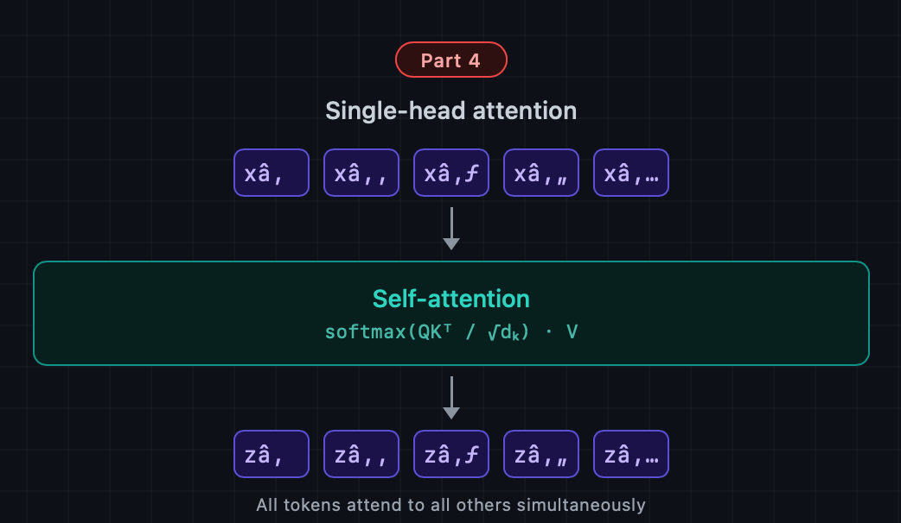
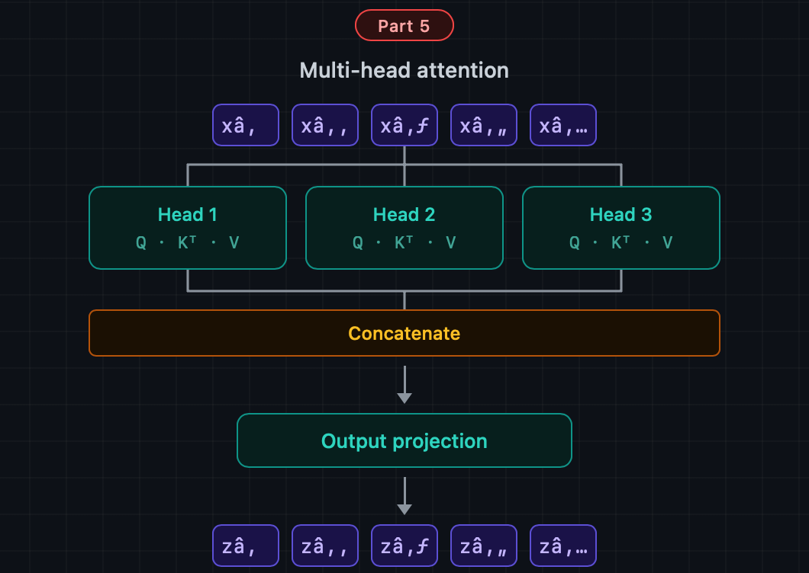
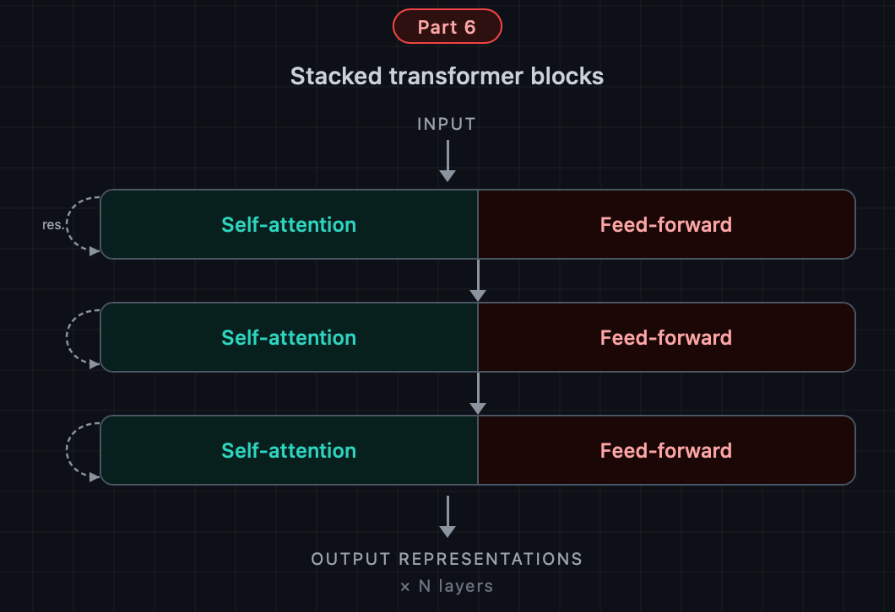

# 你的第一个 Transformer：通往 Attention 之路 第 4 部分。


*复数单位圆：i*

## 引言

终于到了第 4 部分，在这里我们将从零开始，一步一步实现 attention 机制。但请做好一点失望的准备。它远没有你想象中那么复杂。尤其是在我们已经完成本系列前三部分大量铺垫之后。尽管如此，到这篇相对短小的文章结尾，我们将对其基础有非常完整的理解。

Transformer。你听说过这个词。你今天可能已经用过一个——ChatGPT、Claude、Gemini，以及几乎所有现代的大型语言模型，都构建在 transformer 架构之上。这就是我们今天要构建的东西。商业模型里有多个 transformer，每个 transformer 又有多个 "head"。但在这里我们只看一个单 head 的 transformer。在后续文章中我们会构建多头 transformer。但这里的目标是从第一性原理出发获得透彻的理解。

Transformer 有一个核心机制叫 self-attention，self-attention 可以用一个公式表达出来。我们在 [Part 3](https://medium.com/gopenai/banish-the-rnn-the-road-to-attention-part-3-a25211967ff9) 中已经讲过这个公式。但我们会在这里复习一下，这样实现代码时就不用回去翻前一篇文章。

```
Attention(Q, K, V) = softmax(QKᵀ / √d_k) · V
```

这就是我们今天要在 PyTorch 中逐行构建的公式。到最后你将拥有一个可运行的实现——而且更重要的是——你会准确地理解其中每一部分在做什么以及为什么这么做。

如果你想了解我们一路走来的完整故事——为什么需要 transformer、它取代了什么，以及上面这个公式如何从第一性原理推导出来——这个故事分别在本系列的 [Part 1](https://medium.com/gopenai/why-rnns-had-to-die-the-road-to-attention-part-1-747b16bcf453)、[Part 2](https://medium.com/gopenai/the-road-to-attention-part-2-ed5b7c9e57d6) 和 [Part 3](https://medium.com/gopenai/banish-the-rnn-the-road-to-attention-part-3-a25211967ff9) 中讲述。这篇文章设计为可独立阅读，但那三篇会给你提供深入的上下文。Part 3 尤其对我们今天要讨论的 transformer 的许多相同部件给出了详尽的讨论。但 Part 3 聚焦于数学，没有实现。今天我们将用代码实现。

现在，对前三篇文章做一个简短的总结就够了：

在 transformer 出现之前，像 seq2seq 这样的序列模型使用循环神经网络——一次处理一个 token，每一步依赖于上一步。编码器会读取整个输入序列，并把它学到的一切压缩进一个单一的固定大小向量——称为 context vector——然后交给解码器。问题在于这个单一向量必须承载一切：词汇、句法、含义和顺序。输入序列越长，它要承载的就越多，直到再也承载不下为止。短序列没问题。长序列就悄悄崩塌。这就是压缩问题。

后来加入了 attention 来帮忙。attention 不再强迫编码器把一切压缩进一个向量，而是给解码器一种方式去回看编码器产生的每一个 hidden state——每个输入 token 对应一个——并自行决定在每一步解码时值得关注什么。这解决了压缩问题。但 RNN 还在。而 RNN 在设计上就是顺序的：在 h₂ 存在之前你无法计算 hidden state h₃，在 h₁ 存在之前你无法计算 h₂。解码器在编码器完成生产之前没法开始 attend 任何东西。Attention 让模型变得更聪明。但并没有让它更快。

Transformer 通过提出一个更激进的问题，彻底消除了瓶颈：如果 attention 本身已经在决定关注什么，那我们还需要 RNN 吗？答案是不需要。Transformer 完全取代了递归，让序列中的每一个 token 都能直接 attend 到每一个其他 token——全部同时进行，并行进行，不需要任何顺序处理。这就是上面公式所计算的东西。这也是我们将要构建的东西。

## 公式。

在我们写下任何一行代码之前，先让公式彻底清晰。再写一次：

**Attention(Q, K, V) = softmax(QK^T / √d\_k)V**

三个矩阵进去。一个矩阵出来。字母 Q、K、V 代表 **Query**、**Key** 和 **Value**——这些名字借自信息检索。把它想象成一次软数据库查找。你有一个 query——你正在搜索的东西。你有一组 key——可以用来匹配的东西。你还有一组 value——你想取回的实际内容。这个公式计算每个 query 与每个 key 匹配的程度，把这些匹配分数转换成权重，然后用这些权重把 value 混合起来。

这就是整个机制。让我们来构建它。

## 准备工作

我们将使用 PyTorch。如果你已经装了，那就准备好了。如果没有：

```
pip install torch
```

让我们从导入和一个随机种子开始，这样我们的输出是可复现的：

```python
import torch 
import torch.nn as nn 
import torch.nn.functional as F 
torch.manual_seed(42)
```

## 输入：一串 token embedding

Transformer 接收的不是原始文本。它接收的是 embedding——表示每个 token 的稠密向量。假设我们已经完成了 tokenization 和 embedding 查找。如果你对这些维度有任何疑问，参见 Part 3，那里详细讨论了这些数字。

我们的输入是一个形状为 **(T, d\_model)** 的矩阵，其中：

-   **T** 是序列长度——token 的数量
-   **d\_model** 是 embedding 维度——每个 token 被嵌入之后向量的大小。

让我们定义一些具体的数值并创建一个假的输入：

```
T = 6     
d_model = 16   
x = torch.randn(T, d_model) print(x.shape)   
```

我们有 6 个 token，每个用一个 16 维向量表示。`x` 的每一行是一个 token。这就是流入 attention 机制的东西。如果我们打印 x 的形状，(6, 16)，它包含 6 个 token 各占一行，每行有 16 个元素。这是因为我们用一个大小为 16 的 embedding 来表示这 6 个 token 中的每一个。

**Step 1：投影矩阵**

这是第一个需要特别注意的地方。Q、K、V 矩阵不是输入。它们是输入的投影。你把输入 x 乘以三个分别学到的权重矩阵，来产生 Q、K、V。是的，我们用同一个输入乘以三个不同的权重矩阵。因为权重矩阵各不相同，所以 Q、K、V 也不同。如果权重矩阵相同，Q、K、V 也会相同。但它们从来都不一样。这些权重矩阵会被命名为：W\_q、W\_k 和 W\_v。它们的初始化总是不同的。

为什么要投影？因为你想让模型学会怎么提问 (Q)、怎么呈现可供匹配的 key (K)，以及该取回什么内容 (V)——而这是三个不同的任务。让模型为每一个学习独立的线性变换，给了它把这三件事都做好的自由。

让我们定义这些权重矩阵。我们用一个 head 维度 d\_k，它是 Q 和 K 投影的宽度。对单 head 的 transformer，一个常见的选择是设 d\_k = d\_model，我们也可以让它更小，但这里我们把它设成一样。当你写 nn.Linear(d\_model, d\_k, bias=False) 时，PyTorch 会创建一个形状为 (d\_k, d\_model) 的权重矩阵 W，其中是随机初始化的值，会在训练中被精炼：

```
d_k = 16   
W_q = nn.Linear(d_model, d_k, bias=False) 
W_k = nn.Linear(d_model, d_k, bias=False) 
W_v = nn.Linear(d_model, d_k, bias=False)
```

现在我们做投影。这里我们通过把输入乘以三个权重矩阵来设定 Q、K、V 的值。

```
Q = W_q(x)   
K = W_k(x)   
V = W_v(x)   print(Q.shape)   
```

到目前为止挺简单的，对吧？

Q.shape 和输入形状一样——但这三个矩阵现在扮演完全不同的角色。

Q 携带 "我在找什么" 的信号。

K 携带 "我提供什么用来匹配" 的信号。

V 携带实际内容。

## Step 2：Attention 分数

现在我们计算每个 token 应该多大程度上 attend 每一个其他 token。我们通过取每个 Q 向量与每个 K 向量的点积来做：

```
scores = Q @ K.transpose(-2, -1)  
print(scores.shape)     
```

这给我们一个 (T, T) 矩阵——一个网格，其中 scores\[q\]\[k\] 表示 token q 想要多大程度上 attend token k。

点积越大意味着匹配越强。我们想要的直观理解是：我们在找每个 query 和每个 key 之间的最佳匹配：得到的 `(T, T)` 矩阵中每一项回答这个问题：*"token q 的 query 和 token k 的 key 匹配得多好？"*

所以整个 scores 矩阵——那个 T X T 矩阵——会长这样：

```
      k0    k1    k2    k3    k4    k5
q0  [ s00,  s01,  s02,  s03,  s04,  s05 ]   ← how well does token 0's query match every key?
q1  [ s10,  s11,  s12,  s13,  s14,  s15 ]
q2  [ s20,  s21,  s22,  s23,  s24,  s25 ]
...
```

`scores[2, 4]` 处的一个大值意味着 token 2 强烈地 "对 token 4 感兴趣"——它们的 query/key 向量在 `d_k` 维空间中指向相似的方向。

scores 矩阵包含原始值。我们接下来对这些值做归一化。

## Step 3：缩放

这些原始点积有一个微妙的问题。当 d\_k 较大时，点积的量级也会倾向于变大——因为你在更多项上求和。大的值会把 softmax 推到梯度变得极小的区域，训练就会慢得像爬一样。解决办法很简单：除以 √d\_k。

```
scale = d_k ** 0.5 
scores = scores / scale
```

这就是文章顶部 attention 公式里分母中的 √d\_k。一行。但这个缩放是让整个 transformer 工作起来的一小步。

## Step 4：Softmax

这里我们把缩放后的分数转换为权重——它们需要非负，并且沿每一行求和为 1，这样每个 token 的输出才是一个合法的加权平均。Softmax 正好做这件事：

```
weighted_scores = F.softmax(scores, dim=-1)   
print(weighted_scores[0].sum())      
```

dim=-1 意味着我们沿最后一维做 softmax——对每个 query，跨越所有 key。在这之后，weighted\_scores\[i\] 告诉你 token i 对序列中 T 个 token 中每一个的 attend 程度。

F.softmax 来自 PyTorch。它沿指定维度逐元素计算 softmax 函数。每个元素被取指数，然后除以沿 `dim` 上所有取指数后值的总和——所以沿那一维的输出和为 1.0，所有值都在 `(0, 1)` 中。

这一步把原始的点积分数转换成实际的 attention 权重——原始分数越高，分配到那个 token 上的概率质量就越多，但现在是以一种在所有 query 之间可比较的方式。

## Step 5：Value 的加权和

差不多完成了。我们用 Q 和 K 找到了分数。我们缩放了分数。我们从缩放后的分数得到了加权后的值 (weighted\_scores)。但其实我们只是对它们做了归一化。所以它们仍然是分数，但我们叫它们 weighted\_scores。现在我们把 weighted\_scores 和 V 组合起来求出输出。我们用这些 attention 的 weighted\_scores 得到 value 向量的一个加权组合：

```
output = weighted_scores @ V   
print(output.shape)    
```

从矩阵形状的角度拆开它。我们已经说过 weighted\_scores 或 scores 是一个 T x T 形状的矩阵。而 V 是一个 T x d\_k 形状的矩阵。所以结果是一个 T x d\_k 形状的矩阵：

```
weighted_scores  @   V      =   output
(T, T)           @ (T, d_k) =   (T, d_k)
(6, 6)           @ (6, 16)  =   (6, 16)
```

`(T, T)` 的 weighted\_scores 矩阵说明每个 token attend 每个其他 token 的程度。

`(T, d_k)` 的 V 矩阵保存了每个 token 实际作为 value 携带的内容。

结果 `(T, d_k)` 给每个 token 一个新的表示——不再只是它自己的 embedding，而是一个由整个序列共同提供信息的、上下文感知的混合体。

这听起来像是回报吗？是的。我们就到这里了。这就是整个机制的回报。在这一步之后，每个 token 的表示都被它认为最相关的那些 token 的信息所丰富了。

就是这样。这就是整个 attention 机制，用五步完成。

## 把所有部分组装起来

让我们把所有东西包成一个干净的 PyTorch 模块。哈哈，它一点都不大：

```python
class SingleHeadAttention(nn.Module):
    def __init__(self, d_model, d_k):
        super().__init__()
        self.d_k = d_k
        self.W_q = nn.Linear(d_model, d_k, bias=False)
        self.W_k = nn.Linear(d_model, d_k, bias=False)
        self.W_v = nn.Linear(d_model, d_k, bias=False)    def forward(self, x):
        
        Q = self.W_q(x)                          
        K = self.W_k(x)                          
        V = self.W_v(x)                                  scores = Q @ K.transpose(-2, -1)          
        scores = scores / (self.d_k ** 0.5)       
        weights = F.softmax(scores, dim=-1)     
        output = weights @ V                               return output, weights
```

让我们运行它：

```
attn = SingleHeadAttention(d_model=16, d_k=16)
x = torch.randn(6, 16)output, weights = attn(x)print(output.shape)   
print(weights.shape)  
```

输出形状和输入相同。每个 token 都被更新了——它现在携带的不只是关于它自己的信息，还有它 attend 到的每一个其他 token 的信息。weights 矩阵恰好告诉你这些 attention 是如何分配的。

## 刚才发生了什么

让我们停一下，欣赏一下这个模块到底在做什么——因为在代码里很容易错过它。

在这个机制存在之前，一个 token 只知道关于它自己的事。在跑过 self-attention 之后，每个 token 都知道关于每一个其他 token 的事。Token 0 看过了所有六个 token，根据相关性给它们加权，并产生了一个综合了它认为最有用信息的新表示。Token 3 也做了同样的事。它们全部同时、并行地做了这件事，彼此之间没有顺序依赖。

这就是与 RNN 的根本性决裂。一个 RNN 必须先处理 token 3 才能处理 token 4，先处理 token 4 才能处理 token 5。来自 token 0 的信息必须穿过每一个中间 hidden state 才能到达序列末尾——就像传话游戏，总有东西会丢失。而在这里，token 5 可以在一次操作中直接看到 token 0，没有中间人。

attention 权重也是可解释的。你可以把 weights\[i\] 可视化成热力图，实际看到 token i 决定关注哪些 token。我们在 Part 2 中针对 encoder-decoder attention 的情形恰好这样做过——同样的思路在这里也适用。

## 我们漏掉的一件事：位置编码

这个模块有一件重要的事不知道：顺序。Attention 公式把输入当作一个集合，不是一个序列。如果你打乱 x 的行，你会得到同样的 weights 矩阵——只是行列被置换。模型完全不知道 token 2 在 token 1 之后、在 token 3 之前。

RNN 免费得到了顺序——顺序处理本身就编码了位置。当我们抛弃递归时，也同时抛弃了那个隐式的位置信号。解决办法是显式地把它加回去，把位置信息注入到 embedding 中再送进 attention 层。那个机制——位置编码——就是下一篇文章的主题。

现在，明白我们的 SingleHeadAttention 模块是位置无关的就好。在实践中，你总是会在上游把它和一个位置编码步骤搭配起来。

## 结论

下面是我们今天用大约二十行 PyTorch 构建的东西：

-   三个学到的投影矩阵，把 token embedding 变换成 query、key 和 value
-   每对 token 之间的点积相似度计算
-   一个保持训练中梯度健康的缩放步骤
-   一个把原始分数转换成 attention 权重的 softmax
-   一个根据这些权重混合 value 向量的加权和

那就是一个 transformer。单个 head，还没有位置编码，没有前馈层——但核心在那里，而且它能工作。

这是我们简单的 transformer——part 4——放在我们接下来在 Part 5 和 Part 6 中要看的东西的背景下。







下一篇文章我们会加上位置编码，然后是位于每个真实 transformer block 中 attention 之后的前馈子层，然后是 layer normalization 和残差连接——使完整 transformer block 成立的那些架构细节。我们也会扩展到多 head。在 Part 6 我们会以 stacked transformer blocks 收尾。在那里我们还会谈谈这些思想在实际的、参数量数十亿的商业模型中是如何被使用的。

但最难的概念性跃迁是这一个。你已经迈过去了。
