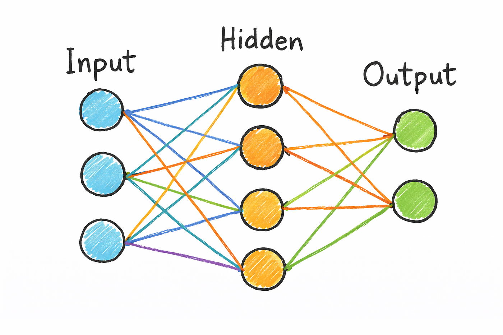
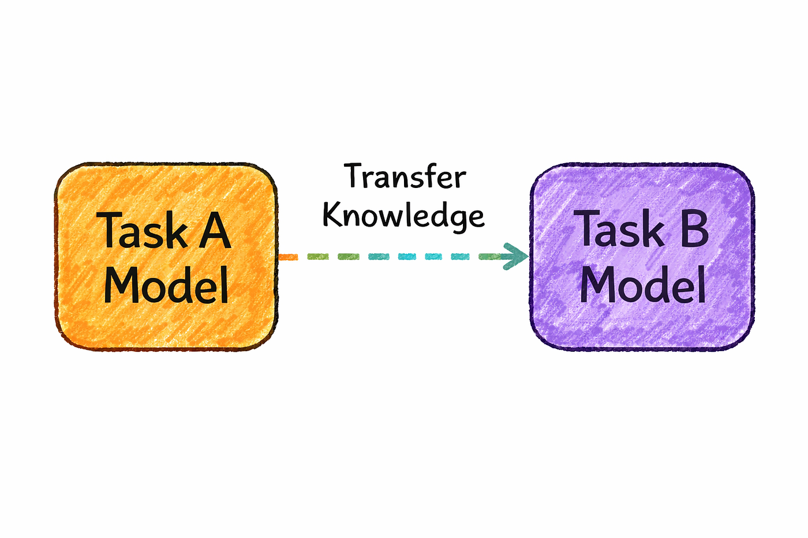
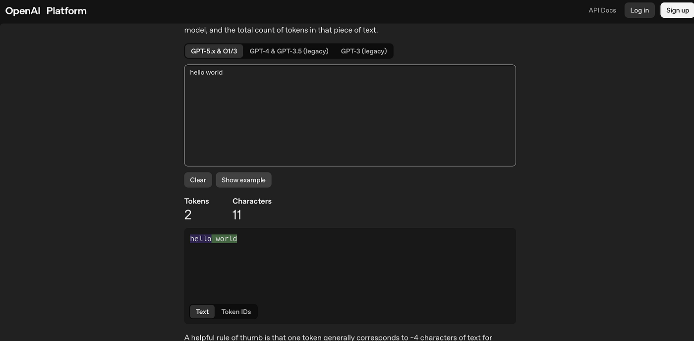
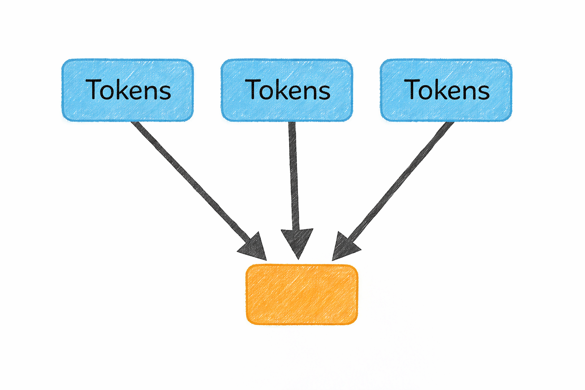
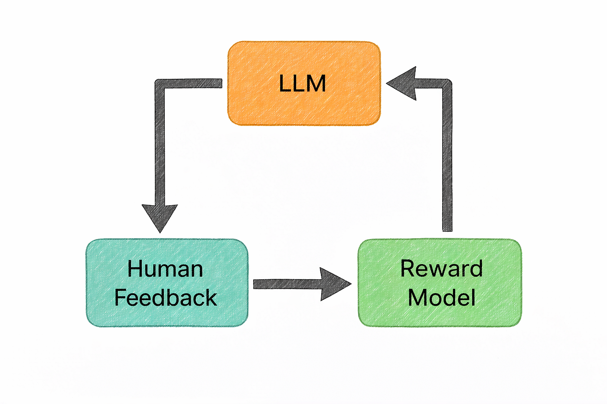
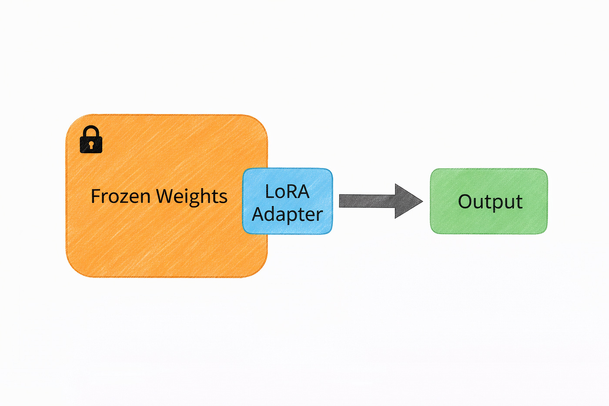
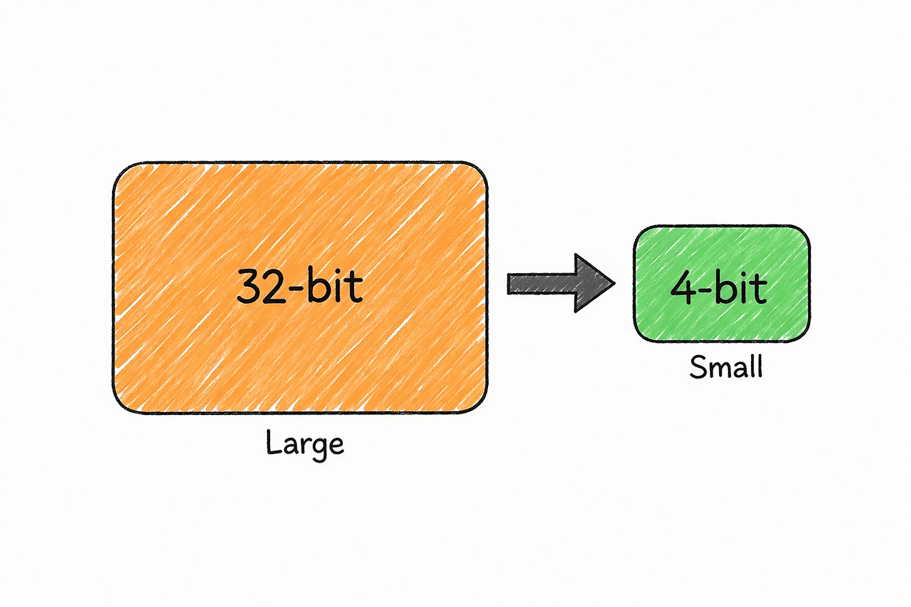
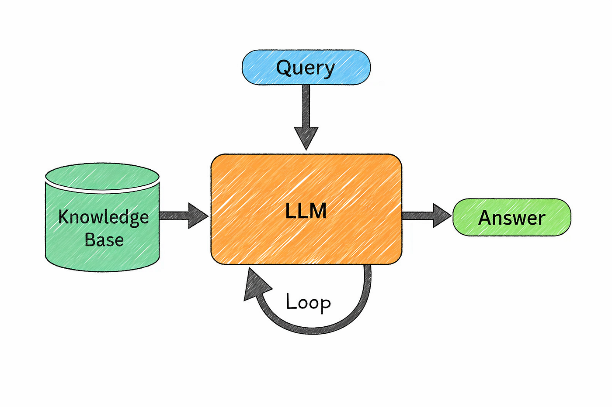
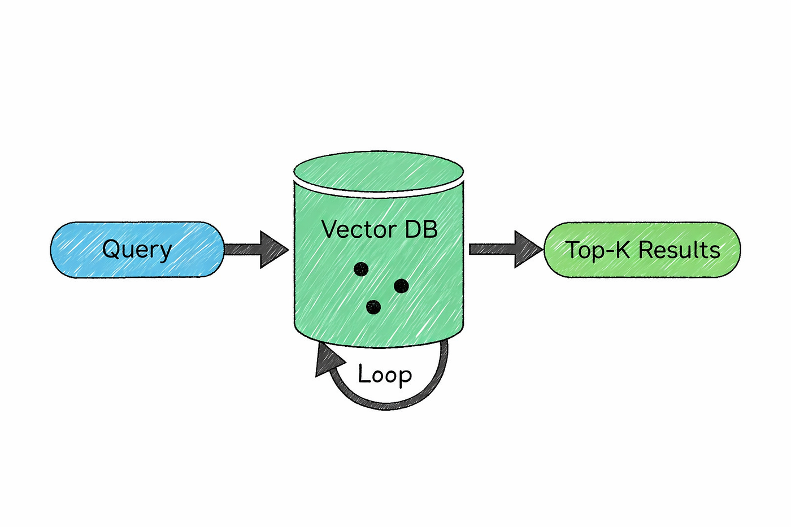
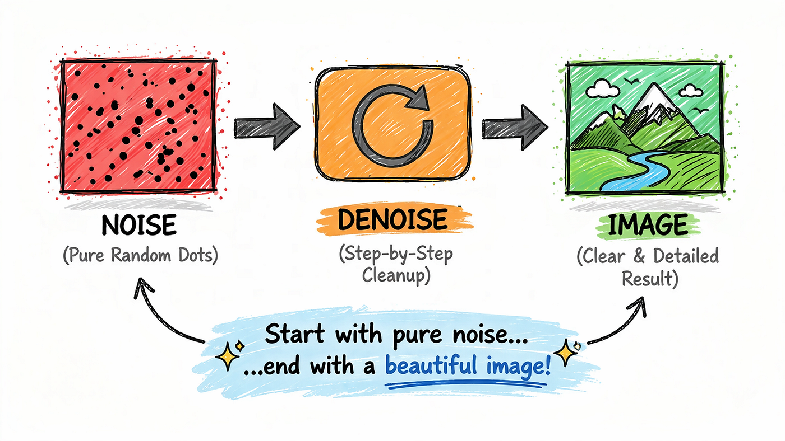

# 20 分钟讲清最重要的 20 个 AI 概念

## 新手友好指南

**很高兴你又来了。**

> **非会员** [**点这里**](https://medium.com/@Deep-concept/20-most-important-ai-concepts-explained-in-just-20-minute-b7dd3ad2b506?sk=29899d228dc38bc44b2b7b4799e88b57)

欢迎回到又一篇故事。

如果你曾尝试学 AI,你大概至少有过一次这种感觉……
*"这他妈到底在讲什么?"*

太多术语。
太多工具。
而且网上每个人都讲得像这是常识一样。

学 AI 让人觉得喘不过气来。

尤其是如果你不是直接做这行的,那感觉几乎就像在学一门全新的语言。

但我后来意识到一件事……

AI 其实并没有那么复杂。

一旦你理解了底层基础——尤其是 LLM 这种大模型是怎么工作的、现代 AI 工具是怎么搭起来的——一切就开始讲得通了。

在这篇故事里,我会用最简单的方式拆解 **20 个最重要的 AI 概念**。

不堆术语。
不过度复杂化。
就是清楚的解释和直观的例子——按我当年希望有人这样讲给我听的方式。

## 那我们现在开始吧 ✌️

## 基础部分

### 1\. 神经网络 (Neural Networks)

本质上,神经网络就是一套由小单元——称为 *neuron*(神经元)——组成的、相互连接的层。

可以把它想成一条流水线。

数据从**输入层**进入,穿过多个**隐藏层**,最后通过**输出层**作为预测结果出来。

但里面到底在发生什么?

理解它的一个简单方式是想象**逐步精炼**。

同一个输入被一遍又一遍地处理,
每多一层,模型就理解得稍微更深一点。

举个例子,在一个图像模型里:

-   最初几层可能识别一些简单的东西,比如**边缘或纹理**
-   中间几层开始识别**形状或图案**
-   再深的几层就能识别**真实的物体**

整个过程就像从 *像素 → 形状 → 含义*。

接下来是关键……

这些神经元之间的每一条连接都有一个叫 **weight**(权重)的东西。

你可以把权重看作小小的"重要性分数",决定
一个神经元应该多大程度地影响另一个。

那训练神经网络呢?

本质上就是**反复调整这些权重**的过程,
直到模型开始给出准确的结果。

而真正夸张的事情就在这里。

现代 AI 模型——尤其是大语言模型——
不只是几个权重。

它们有 **数十亿个权重**。

所有这些权重一起协作,把原始输入变成真正讲得通的东西。

### 2\. 迁移学习 (Transfer Learning)

从零训练一个神经网络听起来很酷……
直到你意识到这玩意儿真正有多贵。

它需要海量的**数据**、严肃级别的**算力**,
还要花很多时间。

这时 **transfer learning**(迁移学习)就登场了——说真的,它彻底改变了一切。

与其从零开始,
不如直接拿一个已经在更宽泛任务上训练好的模型,
**让它适配到更具体的事情上**。

所以你不是从零造……
你是在已经能跑的东西之上往上叠。

理解它最简单的方式就是**技能复用**。

设想你已经会骑自行车了。

那么再去学摩托就容易多了,对吧?

因为你不是从零开始——
你只是在适配你已经会的东西。

迁移学习也是同一个道理。

一个预训练模型已经学会了**数据中的通用模式**,
所以当你为自己的场景做 fine-tune 时,
它学得快得多,投入也小得多。

接下来是关键……

**今天大多数现代 AI 实际上就是这么搞的**。

大公司一次性训练庞大的 **foundation model**(基础模型),
然后像我们这样的开发者**把它们改造成具体任务**用的模型。

这就是为什么你能搭出强大的 AI 应用,
而不需要数十亿数据点或者疯狂的算力。

## 现在讲 Transformer 这一栈

### 3\. 分词 (Tokenization)

在模型能理解任何文本之前,它必须先把文本拆成更小的片段。这个过程叫 **tokenization**(分词)。

模型不是像我们这样去读句子,而是和叫做 *token* 的小单位打交道。这些 token 就像是模型内部用来处理语言的"字母表"。

但 token 不一定是一个完整的词。

有时候它是一个完整的词,但有时候它只是词的一部分。比如像 "playing" 这样的词,可能会被切成 "play" 和 "ing"。另一边,像 "dog" 这种又短又常见的词,通常就保持原样。

### 看下面这个

**你可以在这里试一下**

### 那你可能在想……为什么不直接用完整的词?

*图片来源:TERRA on Unsplash*

刚开始可能感觉怪怪的,但这么做有个很好的理由。

语言混乱得不行,而且一直在变。新词层出不穷,人们会拼错、会混语言、会自己造各种变体。如果一个模型试图存下所有可能的词,词汇表就会变得大到无法实现。

Tokenization 通过保留一组固定的"积木块"来解决这个问题。模型不需要把每个词都背下来,而是学习常见的模式和可复用的片段。这样,即使遇到一个它从没见过的词,它仍然可以通过把这个词拆成它熟悉的部分来理解它。

这就是为什么 AI 并不真的像人类那样在读文本。

它读的是 token——然后从这些 token 出发,一步步构建出含义。

### 4\. Embeddings(嵌入)

文本被切成 token 之后,下一步是把这些 token 转成模型真正能处理的东西。

这就是 **embeddings** 出场的时候了。

每个 token 都被转成一个向量——本质上就是一串代表它含义的数字。模型不是直接处理词本身,而是处理这些数值化的表示。

理解这件事的一个有用方式是把它看成一种 **map**(地图)。

每个词都在一个高维空间里有一个位置。意义相近的词会聚在一起,差别很大的词则被放得很远。比如 "doctor" 和 "nurse" 会靠得很近,而 "doctor" 和 "mountain" 就会离得很远。

虽然这个空间有几百甚至几千个维度,但它仍然能捕捉到有意义的关系。某些词之间的差异遵循一致的模式。比如,"actor" 和 "actress" 之间的关系就和 "prince" 和 "princess" 之间的关系类似。

有意思的是,模型并不是用我们的方式来理解语言。它不是按定义或规则去思考的。

它是通过 **distance 和 direction**(距离和方向)来理解含义——把词组织在一个空间里,让关系变成几何。

### 5\. Attention(注意力)

事情从这里开始变得真正有意思起来。

一个词的含义不是固定的——它取决于上下文。

拿 "apple" 这个简单的词举例。
在一个句子里,它可能是水果。
在另一个句子里,它可能指的是一家公司。

那模型怎么搞清楚正确的含义?

光靠 embeddings 是不够的,因为它们一开始就给每个 token 一个固定的表示。它们没法完整捕捉到含义如何随着周围的词而变化。

这就是 **attention** 出场的时候。

Attention 让句子里的每个词都能去看其他每个词,然后决定真正重要的是什么。模型不再把所有词一视同仁,而是学会去聚焦最相关的那些。

所以如果句子是 *"She bought shares in Apple"*,模型会更注意像 "shares" 和 "bought" 这样的词,从而帮助它理解这里的 "Apple" 是公司,而不是水果。

让这件事变得强大的是:模型不再是逐词去读了。

它是一次性看整个句子,并且动态地决定该把注意力放在哪里。

而 attention 这个想法,正是真正解锁了现代 AI 的东西。

在这之前,模型一步一步、从左到右地处理文本,常常会漏掉远距离的关系。Attention 改变了这一点——它让模型能看到全局,理解所有东西是怎么连起来的。

### 6\. Transformer

到目前为止我们讲过的所有部分——token、embedding、attention——都汇聚到一个地方。

那就是 **transformer**。

它就是几乎驱动当今所有现代 AI 系统的那个架构。

Transformer 是在 2017 年那篇叫 *"Attention Is All You Need"* 的论文里被提出的。它的想法其实简单得出奇:不要再一次一个词地处理文本,而是让 attention 成为核心机制,让模型能一次看到所有内容。

那一下转变改变了一切。

Transformer 是把多层 attention 与一些简单的处理块堆叠起来构建的。信息在这些层中穿行时,会被一步步精炼。

在前面几层,模型先理解基本的结构——比如语法和句子的句式。

往深处走,它开始捕捉词与想法之间的关系。再到后面的几层,它就能处理更复杂的推理与连接。

这不是魔法——只是反复精炼。

Transformer 最大的优势之一是它处理数据的方式。

旧的模型必须按顺序读文本,一次一个词。这让它们既慢,又限制了它们能处理的上下文规模。

Transformer 没这个问题。

它们 **并行(in parallel)** 处理所有 token,这让它们快得多,也让它们能借助 GPU 这样的现代硬件扩展到极大的规模。

这就是为什么像 GPT、Claude、Gemini 和 Llama 这些模型都依赖这套架构。

如果把镜头拉远,整个流程看起来是这样的:

文本被切成 token。
Token 被转成向量。
然后 transformer 层用 attention 来理解一切是怎么连起来的。

正是这个简单的流程,在驱动你今天用到的大多数 AI。

## 现在我们来讲大语言模型

### 7\. LLM(大语言模型)

现在让我们把所有内容连到大多数人今天真正在用的东西上——**large language models**,也就是 LLM。

从高层来看,LLM 就是一个在海量文本上训练过的 transformer。我们说的可是来自书籍、网页、代码等等的数据——通常是数千亿甚至数万亿的 token。

那训练时的目标是什么?

简单得让人意外。

模型通过尝试**预测下一个 token** 来学习。

就这样。

听起来基础得简直不像会有什么威力。

但当你在数万亿个例子上反复重复这个过程时,有意思的事情就发生了。

模型开始捕捉语言中的模式。它学到句子是怎么构造的、想法是怎么连接的,甚至推理是怎么流动的。慢慢地,这看起来很像"理解"——尽管实际上它只是在大规模的尺度上做模式学习。

这就是为什么这些模型能做这种事情:
写代码、回答问题、翻译语言、解释复杂主题——哪怕它们从未被显式地训练去做这些事。

大语言模型里的"large(大)"指的是参数(parameters)的数量。

这些是模型在训练中学到的内部值——而现代模型有 **数千亿个**。

在那个尺度上训练东西不便宜。它需要海量算力,经常要花上数百万美元。

但成果是一个能够泛化到很多种问题、并能产生意外有用输出的系统。

所以当你在用像 ChatGPT、Claude 或 Gemini 这样的工具时……

你其实是在和一个通过做一件简单事情学到语言的模型在交互——
那件事它做了一遍又一遍——预测接下来是什么。

### 8\. Context Window(上下文窗口)

每个 AI 模型一次能"记住"的东西都是有上限的。

这个上限叫 **context window**。

它指的是模型在一次交互中可以处理的最大 token 数——包括你写的内容,以及模型生成的回复。简单来说,它就像模型的短期工作记忆。

在更早的模型里,这个记忆相当小。

举个例子,早期版本的 GPT 一次只能处理几千个 token。这意味着长对话很快就会丢掉早些时候的细节,大文档也得被裁剪或拆分。

但现在情况变了很多。

现代模型可以处理大得多的上下文。有些能一次处理整本书、长对话或大段代码。这让它们在那些上下文真正重要的现实任务中,有用得多。

但有个坑。

更大的 context window 是有代价的。

它需要更多内存、更多算力,也常常导致响应变慢。所以虽然理论上越大越好,它也让系统变得更重、运行起来更贵。

而且即便有大 context window,还有另一个不那么明显的限制。

模型并不是对输入的每一部分一视同仁。

它们倾向于更关注开头和结尾,而埋在中间的信息有时会被忽视掉。这通常被称为 *"lost in the middle"*(迷失在中间)问题。

所以即便 context window 越来越大、越来越好……

它们仍然不完美。

理解这一点能帮你解释——为什么有时候模型会"忘掉"你明明早就提过的东西。

### 9\. Temperature(温度)

当一个语言模型生成文本时,它并不是直接在挑下一个词。

在幕后,它会为每个可能的下一个 token 计算概率,然后再决定选哪一个。

这就是 **temperature** 出场的地方。

Temperature 控制这个选择是多"严格"还是多"有创意"。

**在很低的温度下,模型会保守起见。**

它几乎总是挑最可能的下一个 token,这让输出更可预测、更聚焦、更一致。这就是为什么低温度很适合写代码、做内容摘要,或者任何准确性比创意更重要的任务。

**当你提高温度,模型就会变得更灵活。**

它不再总是选最高的那个选项,而是开始根据各自的概率去探索其他可能。这增加了多样性,让输出感觉更自然或更有创意,这对头脑风暴或者写同一内容的不同变体之类的事很有用。

把温度再推高一点,事情就开始变得不可预测。

模型可能会生成更出人意料或更有想象力的回复,但它也会很快失去连贯性,尤其是在更长的输出里。到这一步,重点就不是准确性了,而是实验。

所以在实践中,temperature 就是一种控制模型行为的方式。

低值让它更精准、更可靠。
高值让它更有创意、更多样。

而选哪种平衡,完全取决于你想从它那里得到什么。

### 10\. Hallucination(幻觉)

这是你认真用 AI 时最早注意到的事情之一。

有时候,模型给你的答案听起来自信得不行……
但其实是错的。

那叫做 **hallucination**(幻觉)。

它可能信誓旦旦地提到一份并不存在的研究、推荐一个从来没被造出来过的 API,或者把一个编造出来的事实当成常识抛给你。麻烦的地方在于——它*听起来*是对的。

### **那这种事为啥会发生?**

因为本质上,语言模型不是在试图说真话。

它是在试图生成 **最可能的下一段文本**。

它从海量数据里学了模式,它的工作就是以一种感觉自然且连贯的方式继续这些模式。但它并不会真的去验证它说的对不对。

所以如果一句假话*看起来*是接下来该出现的那种内容,
模型就会满怀信心地把它生成出来。

而这就是幻觉在真实场景下成为大难题的原因。

你不能盲目相信输出,尤其是在事实、代码或重要决策这种事情上。

这就是为什么很多今天的系统会试图通过让模型"扎根于真实数据"来减轻这个问题——比如把它接到可信文档上,或者要求它在可能时给出引用来源。

到头来,这个模型非常擅长**听起来是对的**。

但仍然需要一个人(也就是你)来检查它实际上是不是真的对。

## 讲完 LLM,我们现在来聊训练与优化

### 11\. Fine-Tuning(微调)

Fine-tuning 是模型已经掌握基础之后才发生的事。

不是从零开始训,而是拿一个已经预训练好的模型,在一个更小、更聚焦的数据集上继续训练它。模型已经懂通用语言了,所以你不是从零教它——你只是把它往某个特定方向引一引。

可以把它想成"专业化"。

一个通用模型在回答各种问题上可能都不错,但如果你想让它在某个具体领域里表现得真正出色,你就可以用更有针对性的数据来 fine-tune 它。

举例来说,如果你想要一个能理解法律文件的模型,你可以用合同、案例摘要和法律解释继续训练它。慢慢地,它就开始用更贴合这个领域的方式来回应。

但这是有代价的。

Fine-tuning 通常涉及更新模型很大一部分的内部参数。而这些模型本身就很大,所以这个过程需要严肃的基础设施。

你需要足够的内存把整个模型加载进来,加上训练时所需的所有额外数据。对于非常大的模型,这通常意味着多张高端 GPU 和大量算力资源。

所以虽然 fine-tuning 很强大,它并不总是轻量,也不总是好搭起来。

它给你控制权和定制能力——但你要为之付出复杂度和成本的代价。

### 12\. RLHF(基于人类反馈的强化学习)

到目前为止,我们讨论的所有内容都解释了模型怎么学语言。

但它没解释一件重要的事……

为什么现代 AI 模型感觉那么 **乐于助人、有礼貌、且擅长对话**?

这就是 **RLHF** 出场的地方。

本质上,RLHF 就是把模型从"只是预测下一个 token"变成感觉**与人类期望对齐**的那个东西的关键。

没有它,模型仍然能生成流畅的文本——但它不一定有用、安全,甚至不一定合适。它只会接着那条最可能的模式继续下去,不管这对你是不是真的有帮助。

那 RLHF 是怎么修这个问题的?

它把人类的判断引入到训练过程里。

模型不再只依赖原始数据,而是被人们实际偏好的东西所引导。对于一个给定的提示,模型会生成多个可能的回复,然后由人来对比它们——决定哪些更有帮助、更清晰,或者更安全。

随着时间推移,模型学会偏好那种人类会一致选中的答案。

有意思的是,模型并不是直接把这些答案背下来。

它是在学一种 **偏好感(sense of preference)**。

它开始理解这些事:
什么样的答案算好答案,
怎么正确地遵循指令,
什么时候要避免有害或误导性的回答。

这就是为什么现代聊天机器人和老一代系统给人的感觉很不一样。

它们不只是听起来流畅——
它们感觉是在试着*帮你*。

没有 RLHF(或者类似的对齐方法),模型仍然会很强大……

但它会远没那么可靠、远没那么安全,在真实世界的应用里也难用得多。

### 13\. LoRA(Low-Rank Adaptation,低秩适配)

我们刚刚讲了 fine-tuning,以及它有多强大。

但有个问题。

对一个巨型模型做 fine-tuning,意味着要更新数十亿个参数,这很快会变得既贵又难管。不是每个人都能拿到那种级别的基础设施。

这就是 **LoRA** 出场的地方。

不是去改整个模型,LoRA 走的路要轻得多。

它把原始模型冻住,然后在它之上加一些小的、可训练的组件。这些额外的部分相对完整模型来说非常小——通常只占总参数的极小一部分百分比。

所以你不是在重写整个系统,你只是在需要的地方加上小调整。

这背后的想法其实出奇地聪明。

当你 fine-tune 一个模型时,大多数变化其实并不需要全尺寸的更新。它们可以用小得多的变换来近似。LoRA 利用了这一点,并以紧凑的方式捕捉这些变化。

为什么这件事重要?

因为它让 fine-tuning 变得 **远远更容易接触到**。

以前需要多张高端 GPU 才能做的事,现在常常可以在一台机器上完成。而且你不必为模型保留多个完整版本,你可以存多个 LoRA adapter,根据任务在它们之间切换。

简单说,LoRA 给你 fine-tuning 的好处……

而不带通常伴随它的那种重成本。

### 14\. Quantization(量化)

随着模型变得越来越大,跑起来也越来越难。

它们需要更多内存、更多算力、更强的硬件。

这就是 **quantization** 出场的地方。

Quantization 基本上就是一种通过更高效地存储模型权重,让模型变得更小、跑起来更便宜的方法。

在一个全精度模型里,每个权重都用很多位(bit)来存。Quantization 把这个尺寸缩小——有时缩得很厉害——这意味着整个模型占用的内存少得多。

想法很简单:用更少的精度,但保留大部分有用的信息。

当你减小每个权重的尺寸,这种影响会迅速累积。

一个本来需要巨大内存的模型,突然就能小到可以在更普通的硬件上跑。而且令人意外的是,质量的下降通常比你预想的要小得多,尤其是在中等程度的量化下。

这是大模型变得越来越实用的关键原因之一。

当你看到有人在桌面 GPU 甚至笔记本上跑强力模型时,他们用的通常不是完整版本。他们用的是被压缩到能塞进现实约束里的那个量化版本。

简单说,quantization 就是把大型 AI 模型从巨型数据中心里搬出来……

带进日常机器里的那个东西。

## 现在我们来理解 Prompting 与推理

### 15\. Prompt Engineering(提示工程)

如果你哪怕只用过一点 AI,你大概也注意到这件事……

你怎么问,真的非常非常重要。

这就是 **prompt engineering** 在讲的事情。

它是塑形你的输入,让模型给出更好、更有用输出的过程。

同一个问题,用两种不同方式问,可能导向完全不同的结果。

如果你说 *"explain APIs"*,模型通常会给你一个宽泛、表面的答案。但如果你问 *"explain how REST APIs handle authentication with a real example"*,你就给了它方向——输出立刻就变得更聚焦、更实用。

让一个 prompt 变好的不是复杂度——是清晰度。

当你清楚地定义你想要什么,模型就有大得多的概率给你正好那个东西。有时这意味着设定一个角色,比如让它以一位经验丰富的工程师身份来回答。其他时候这意味着展示例子、把任务拆成步骤,或者就是把格式和语气讲清楚。

慢慢地,你会意识到一件重要的事。

Prompt engineering 不是某种技巧或绕道。

它就是你和模型沟通的主要方式。

而它带来的差别巨大。

模糊的 prompt 给你泛泛的输出。
精心打磨的 prompt 能给你一份结构化、准确、真正可用的东西。

### **试试这些我花了大量时间总结出来的 prompt 👇**

### 16\. Chain of Thought(CoT,思维链)

有时候模型给出一个糟糕答案,不是因为它什么都不懂,而是因为它太快地跳到答案了。

这就是 **chain of thought** 出场的地方。

它是一种 prompting 的方式——让模型按中间步骤把问题走一遍,而不是直接冲到最终结果。这对涉及逻辑、数学,或者任何需要多步推理的任务,通常帮助很大。

理解它的一种简单方式是:

如果你只让它给最终答案,模型可能太依赖模式匹配。但如果你鼓励它更仔细地走一遍这个问题,它就更有可能得到正确的结果。

举个例子,如果你直接让模型解一道乘法题,它有时会猜错。但如果它先把问题拆成更小的部分,然后再合起来,答案就可靠多了。

这就是为什么 chain of thought 经常被描述为给模型一种 **scratch space**(草稿纸)。

不是逼它给即时回答,而是允许它把任务用更小的步骤处理一下。对于很多重推理的问题,这一点小改变就能带来很大的不同。

简单说,更好的结果常常来自给模型空间去把任务想一遍……

而不是让它一步跳到结论。

## 现在讲构建 AI 系统

### 17\. RAG(检索增强生成)

还记得我们前面提的幻觉问题吗?

RAG 是处理它最实用的方法之一。

想法很简单。

不再只依赖模型已经知道的东西,而是让它在**回答的那一刻就能拿到真实的、相关的信息**。

在生成回复之前,系统先从一个知识源里搜索有用的文档。然后把这些文档作为上下文传给模型,模型用它们来产出一个更"接地气"的答案。

可以这样想。

模型不再凭记忆答题,它被允许 **先查一下**。

举个例子,设想你在搭一个客服助手。当有人问到价格或政策时,系统不靠猜。它先从你的内部文档里拉到最新信息,然后由模型用清晰、自然的方式把它解释出来。

让这个方法变得强大的,是角色的分离。

模型负责理解问题并解释答案。
知识库负责提供真实的事实。

这带来一个很大的好处。

如果你的信息变了,你不需要重新训练模型。你只要更新你的文档,系统立刻就会开始用新数据。

简单说,RAG 把模型从一个 *回忆者*……

变成一个能 **阅读、核实并基于真实上下文回应** 的东西。

而这就是它在真实使用中可靠得多的原因。

### 18\. Vector Database(向量数据库)

那既然 RAG 是关于把对的信息取过来……

系统到底是怎么 *找到* 它的?

这就是 **vector database** 出场的地方。

不是按传统方式存文本,vector database 存的是 **embeddings**——也就是我们前面讲过的那种含义的数值表示。

这让系统可以基于 **semantic similarity**(语义相似度)来搜索,而不只是精确匹配的词。

实际中长这样。

你的文档先被切成更小的 chunk,每个 chunk 都被转成一个 embedding。然后这些 embedding 被存到数据库里。

当用户提问时,这个 query 也被转成一个 embedding。系统再去找数据库里离它最近的那些向量——也就是含义上最相似的——然后把它们当作上下文返回。

这件事的强大之处在于它和传统搜索有多么不同。

如果你用精确关键词搜,你可能因为措辞不一样就漏掉相关信息。但用向量搜索,系统仍然能找到正确的内容,因为它理解的是 **词语背后的意图**,而不只是词本身。

这就是 RAG 工作得这么好的原因。

模型不只是把文本检索出来——
它检索的是 *最相关的含义*。

有几种工具可以处理这种搜索,包括 Pinecone、Weaviate、Qdrant 这样的系统,甚至 PostgreSQL 加上支持基于向量查询的扩展。

简单说,vector database 就是让 AI 系统超越关键词匹配……

并开始用人类的思考方式去搜索的那个东西。

### 19\. AI Agents

到目前为止,我们讲的所有内容都聚焦在生成文本的模型上。

但如果模型真的能 **做事** 呢?

这就是 **AI agents** 出场的地方。

AI agent 本质上是一个能采取动作、不只是回答的语言模型。它不会停在一个答案上,它能和工具交互、跑代码、搜索信息、调 API,并把这些步骤组合起来去完成一个任务。

换句话说,它从 *thinking* 进化到了 *doing*。

大多数 agent 在一个简单的循环里运行。

它们看一下当前情况、决定下一步做什么、采取一个动作,然后基于发生的变化重复这个过程。语言模型坐在这个循环的中心,在每一步都扮演决策者的角色。

设想一个在处理 bug 的编码助手。

它读问题、探索代码库、找出可能出错的地方、写一个修复、跑测试、看哪里挂了,然后调整方案,直到一切都正常。每一步都依赖前一步,模型会随着新信息进来不断适应。

这件事很强大——但也是事情开始变得棘手的地方。

每一步都有可能出问题,这些小错误会累积起来。一个看起来很简单的任务,一旦涉及一连串决策,就可能变得不可靠。

这就是为什么搭一个好的 agent 不只是让它能力强。

而是要让它 **可靠**。

现代系统会大量投入到规划、校验、重试和自我纠正上,以便让这些多步流程不偏离轨道。

简单说,AI agents 就是把语言模型变成 **能在真实世界里采取行动** 的系统的那个东西。

### 20\. Diffusion Models(扩散模型)

到目前为止,我们大多在讲文本。

但图像呢?

这就是 **diffusion models** 出场的地方——很多现代图像生成器背后的技术。

这个想法直觉上反过来得令人意外。

模型不是先学怎么直接造出图像,它先学怎么 **毁掉它们**。

在训练时,真实图像会被一遍又一遍地加噪声,逐渐被破坏,直到变成完全的雪花点。然后模型被训练去逆转这个过程——一步一步学怎么去噪并恢复出原图。

到了要生成新东西的时候,流程就反过来。

你从纯噪声开始。

然后,一点一点地,模型把它清理干净——加上结构、形状和细节,直到一张完整的图像浮现出来。每一步都让结果更精炼,由你的提示来引导,把随机性变成有意义的东西。

"Diffusion(扩散)"这个名字来自物理学——粒子随时间随机扩散开,就像墨水在水里散开一样。

而在这里,模型学的是相反的方向——怎么把秩序从那种随机性里带回来。

有意思的是,这个想法已经不再仅限于图像。

同样的方法现在也被用来生成视频、音频、3D 内容,甚至在科学领域里——比如设计分子或预测蛋白质结构。

简单说,diffusion models 就是让 AI 可以从纯噪声出发……

把它变成你真的能看见、能听见或能用的东西。

## 类似的故事

## 我真的很高兴你一路读到这里

谢谢你花时间读这篇。

如果这篇故事让你对 AI 的理解多了哪怕一点点——哪怕只多懂一个概念——这对我都意义重大。

如果你觉得它有价值,
别忘了拍手 👏 ,把它分享给那些也在试着学 AI 的朋友或同事。

也欢迎在这里关注我——我会继续分享更多这种简单、实用、真有用的故事。

**下一篇见。**

> **Editor's Note :** AI 工具帮我打磨并组织了这篇故事的部分内容,也帮我做了图片。但这篇故事、其中的对话和分享的观点,都完全是我自己的。AI 只是帮我把这些想法表达得更清楚一些。
> 我相信对自己写作时所用的工具保持透明。😊
