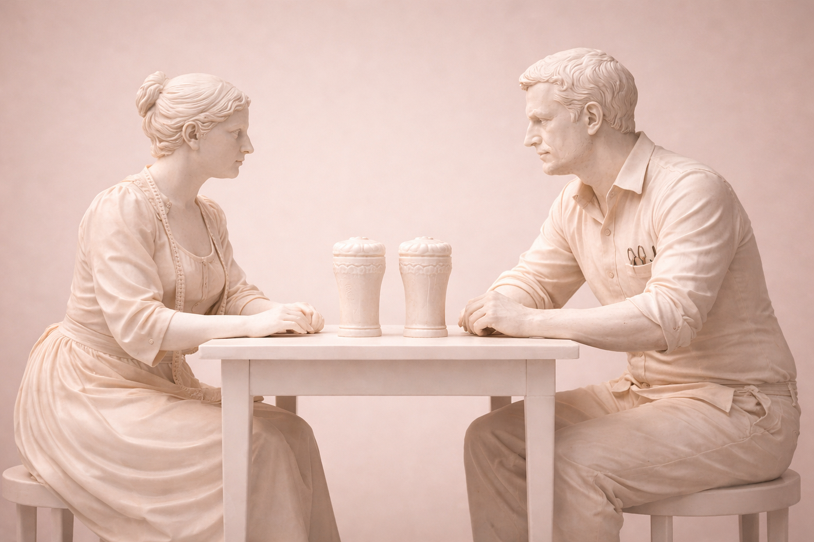

# 在你需要现实是什么样和它实际是什么样之间

## 论失范、流亡,以及生活在缝隙之中

养成一个稳定的写作节奏,可能最让人享受的事情是,你也由此养成一个稳定的思考节奏。一种练习思考的节奏。坐下来,看着你周围的世界——你读到的、看到的、听到的、感受到的、想象到的——然后花时间不让那个想法直接溜走,而是和它一起坐一会儿。在和它一起坐着的过程中,让它改变你对它本身的看法。让它在其他观察和零碎信息进入你的视野并对它施加拉力时演化。

我提这件事,是因为我被人问过——不算频繁,但时不时——我是怎么决定写什么的。我怎么形成一个想法或获得灵感。有时候这是世界上最显而易见的事。你坐在空白的页面前,几乎你想说的一切都已准备好从你的指尖里涌出来。这是不可避免的。其他时候,这只是一种感觉。一种好奇的感觉,因为一连串的事情已经引起了你的注意,你知道里面有什么东西,但你不确定那个"那里"到底在哪儿。

这两种感觉中的第一种,在过去这一年里,在面对铺天盖地的 AI 煽情时,一直伴随着我。我已经在其他文章里大量写过这一点,所以我不想在这儿重复同样的论点,只想说,似乎确实有一种存在主义层面的转变正在发生在我们作为社会的组织方式上。

或者真的有吗?

过去这一年——也许更接近两年——要真切知道究竟在发生什么,是相当困难的。我们经历了 [Matt Shumer 的病毒式文章](https://x.com/mattshumer_/status/2021256989876109403)。我们经历了 [Axios CEO Jim VandeHei 写给他家人的公开信](https://www.axios.com/2026/01/23/ai-jim-vandehei-letter-kids)。然后我们经历了 Marc Andreessen 之类的人告诉我们什么都不用担心。要追踪的信号太多了,挤在同一些小空间里的声音太多了,被淹没的能力达到了非凡的程度。

到底发生了什么,谁说得最对?

那么让我们把这个平台本身当作基线汇流——我思考和理解正在发生什么的空间——让它成为我审视其他一切的主要透镜。第二次汇流来自我在 Instagram 上偶然看到 Tatler 的一篇帖子,谈到 BANI 这个概念。[一个由未来学家 Jamais Cascio 创造的缩写](https://medium.com/@cascio/facing-the-age-of-chaos-b00687b1f51d),试图捕捉我们大多数人从 2020 年起一直在经历的感觉。它代表 Brittle、Anxious、Non-linear、Incomprehensible。

-   Brittle:看似强壮的系统和计划,在压力下骤然破碎。
-   Anxious:由持续的、不可预测的、且经常是负面的信息所引发的弥漫性焦虑。
-   Non-linear:事件不再遵循一条直线、成比例、或合乎逻辑的因果路径。
-   Incomprehensible:情况复杂到难以完全把握,导致决策瘫痪。

我看到这个的时候想,是的。其中很多说得通。空气里确实有一点 BANI。无论是一个高中生在试图决定学什么才不会被下一次 Claude 更新抹掉,还是一个大学毕业生眼睁睁看着入门级岗位实时干瘪、与此同时还要试图踏上一段类似职业生涯的旅途。我想我们所有人都在感受某种程度的 BANI,因为要把握我们所处时刻的体量和复杂度,是真的很难。

这把我带到了我以为是我想写的第一件事。BANI 是新的吗?还是它是一个老掉牙的故事?是否真的有过一个时期,我们清楚地知道社会怎么运转、我们应该扮演什么角色?或者那只是我们通过事后回望制造出来的幻觉?我们觉得过去更简单,是因为它对我们来说看起来更简单——结局已经知晓,所以它感觉不可避免?或者这单纯是一个人必须经历的状态,一个进入成年期的成人礼,一个一个人需要习以为常的永久状态,这样才能弄明白一个其实没有任何作者、因此也不可能讲得通的全球叙事?

为此,我想再次求助于 Émile Durkheim。

## 它读作 Anomie,不是 Amelie

我以前写过 Durkheim。他的 anomie 概念和 Cascio 的 BANI 并不太不一样,我今年早些时候就介绍过它,当时我在试图弄清楚正在发生在那些进入一个不再知道如何承接他们的劳动力市场的年轻人身上的事。你可以在下面读那篇文章。但我现在想回到他这里,不只是为了这个概念,而是为了感受一下他写它时所生活的那个世界。理解他的语境与他所造之词之间的关系。

Durkheim 是在十九世纪末写作的,法国在不太久前的记忆里输给了 Prussia,目睹了一个皇帝倒台,经受了 Paris Commune 的血腥崩塌,正跌跌撞撞地走过 Third Republic 早期没有定下心来知道自己应该是什么的几年。旧的天主教社会秩序已被显著削弱。工业革命来得迟而且不均匀,把人从村庄里拽出来扔进了没人认识他们、一切都是新的城市里。科学的世界观在替换宗教的权威,却不一定为宗教曾经提供的意义提供任何道德上的替代物。火车时刻表和工厂轮班正在重写日常生活的节奏。一个生活在那个时代的人有充分的理由感觉脚下的地基不如以前稳固。

这听起来对我来说挺 BANI 的,不是吗?

Durkheim 的项目,贯穿他的整个职业生涯,是要理解当一个社会的调节结构崩溃得比新的能取而代之的更快时,会发生什么。Anomie 就是他给那种"过渡中"状态起的名字。他 1897 年的研究 *Suicide* 全力以赴地推进了这一论点:他注意到自杀率不仅在经济崩塌的时期飙升(这是人们可能预期的),也在经济繁荣的时期飙升。两者的共同点不是苦难而是迷失方向。无论是哪个方向上的快速变化,都把人从那些之前让他们的生活对自己来说可读的预期里解开了缆。

这,对我们的目的来说,是关键的洞见。Anomie 不是贫穷。它甚至也不真的是通常意义上的痛苦。它是生活在你被教导对生活应有何期待与生活实际给你的之间的缝隙里的体验。那些本来用来告诉你做得好不好的框架和路标停止运作了,某种眩晕开始浮现。

Durkheim 的接受度参差。他职业生涯后期的相当一部分时间都在试图首先把社会学确立为一门正当的学科,他在 1917 年去世,部分死于悲痛,因为他的儿子 André 1915 年在 First World War 的 Macedonian Front 战死。他的思想在演化,但不是朝乐观主义的方向。在他后期专注于宗教的著作里,他更确信社会需要仪式、符号、和集体亢奋以维持凝聚。他不是在为某一种宗教或者作为教条的宗教辩护,而是某种功能上等同于它的东西。某种定期提醒人们他们是一个比自己更大的东西的一部分的东西。

那么对我来说自然引出的问题是这样的:这个世界"走出"anomie 了吗?如果你看接下来发生了什么——First World War,两次大战之间的崩塌,法西斯主义在欧洲各地的崛起,Second World War——氛围当然是二十世纪并没有解决 Durkheim 所描述的那个状态。相反,它强化了它。可以说,加重了它。一些试图弥合那条缝隙的努力遭遇了越来越极权化的工程。民族主义。共产主义。大众政治。一些对非常真实而复杂的问题最具灾难性的解决方案。其他一些则不那么暴力、不那么有破坏力。比如战后的福利国家,或者二十世纪中叶自由民主体制下定下来的那些机构,确实在至少几十年里,产出了某种看起来很像稳定结构的东西。有一段时间,我们有了一个大致告诉人们对生活该期待什么的框架。工作、家、进步——你懂的。

但那个框架已经磨损了一段时间了。而我们正在经历的,恰好赶上了一项正在重写认知劳动本身的技术的到来。

把 Durkheim 的法国与我们当下时刻做比较是有用的。但它不是唯一可用的比较,而在我们继续往下走之前,我想再短暂地拉一下另一个比较。因为在我把这篇文章写下来的过程中,我也开始读 Hilary Mantel 的 *Wolf Hall* 三部曲。我刚读完第一本,这本书不管你是通过小说、BBC 改编版、还是历史本身接触到的,都是一个关于一种非常特殊的 anomie 的故事。十六世纪的英格兰。一位试图重写继承规则的国王,因为他想要一位新妻子。一座权威突然变得可议价的教会。一个大致维持了几个世纪的法律和神学秩序,被一个来自 Putney(西南伦敦的代表!)的铁匠之子实时即兴重塑。

Thomas Cromwell 是一个值得停下来坐一会儿的人物,因为他正在做的事——在英格兰拆解天主教会,把它的财富重新导向,并重写王室与每一个先前与它并立的机构之间的关系——在一个世纪之前是不可能做到的。技术根本就不存在。我说的不只是印刷机,虽然显然那才是催化剂,而是从它涌现的整套机器。便宜的小册子,政治和神学思想可以在其中被广泛分享。把福音书翻成普通人理解的语言的方言版圣经。有史以来第一次,思想可以传播得比教会监管它们的能力还快。Tyndale 在欧洲大陆的一家印刷店里把 New Testament 翻译成英语。Luther 的论纲数周内传遍欧洲大陆。等到 Cromwell 处于一个能重塑英格兰国家的位置时,印刷术已经在英格兰土地上待了大约六十年。久到它的效应已浸透了文化。久到旧秩序再也撑不住了,即便大多数人还没弄清楚什么在取而代之。

这一切的意思是,Reformation 不只是一场神学之争,而是当一项信息技术跑赢了那些此前为一个文明调节意义、权威和身份的制度框架时所发生的事。

所以我们有了两个例子,从不同的世纪和国家拉出来,说的是同一个底层模式。毫无疑问,你的脑子时钟现在已经在转,你能想到世界各地无数其他的例子。但目前来说,我们有十九世纪末的法国,跌跌撞撞地穿越工业化和城市化,产生了 Durkheim 对 anomie 的诊断。还有十六世纪的英格兰,跌跌撞撞地穿越印刷术革命及其所启用的政治重组,产生了我们如今浪漫化为现代国家诞生、但当时被大多数人体验为对他们最信任的、更不用说被认为是神圣的东西的可怕失去的局面。

不同的技术,不同的国家,不同的时代。同一个老套的模式。

一项新技术到来。它扩散。此前组织生活的结构——工作、信仰、政治、社群——开始磨损,因为它们是为一个不再存在的世界搭建的。一段迷失方向的时期接踵而至,这段时期可能持续很久,可能变得非常难看。最终,新的结构围绕新的技术形成。生活重新变得可读,我们把那段时期叫做稳定,直到下一项技术到来,这个循环重新开始。

稳定。扰动。失范。适应。新的稳定。

这就是历史模式。每一代经历过这种循环之一的人都假定他们这一代是独一无二地灾难性的。我意思是,看在老天份上,想象一个真正相信神性的社会,然后突然之间教皇就只是 Rome 的一个主教了。这是会扭曲现实的事。然而即使在那时,以及之前和之后的每一代,都被证明是错的。结构最终重新形成,世界重新变得可读,而在一段时间里,事情变成我们喜欢称之为"正常"的东西。

那么,我们是否只是处在又一个这样的循环里,某种形式的稳定就在前方拐角处仍然唾手可及;还是说,技术演进和变化的方式意味着这个循环本身再也撑不住了?

## Bay Area Boom

*A pint across time*

让我们走一遍 1820 年代的英格兰。如果你和我都在那儿,我们想去找个职业,我们其实只能选寥寥几种。[当时的人口普查数据基本把它分成四大桶](https://www.history.ox.ac.uk/professions-nineteenth-century-britain-and-ireland#:~:text=The%20nineteenth%20century%20witnessed%20a,included%20manufacturers%2C%20merchants%20and%20entrepreneurs.)。农业、贸易、制造、或手工艺。这些是我们主要且最容易接触到的选项。大多数人种地,或者在某种家庭作坊式的行当里用手干活,或者在仆役服务里。想想你那些织工、铁匠、磨坊工和车轮工。在更大的城镇里——比如 London 和 Manchester——你有一小撮文员和专业人士,在仆役、烹饪、清洁和洗衣中度过生活的女性和女孩则更多——她们的生活对她们的祖母看起来会很熟悉,运气好的话对她们的孙女来说也是。生活相当可预测,十年与另一十年看起来差不多。你知道你正进入的是什么样的世界。

[快进一百年,我们在 1920 年代的 Britain](https://www.findmypast.co.uk/blog/history/jobs-in-1920s-britain)。画面已经显著变了。在这个世纪里,有一百多万男性在煤矿工作。工厂工作、办公室工作、和运输已经成了大多数男性的主要职业。文员和打字员开始大量出现,其中许多——是有史以来第一次——是女性。1921 年的英格兰和威尔士人口普查记录了第一位女性警察和第一位女性赛车手,这告诉你一个人应该或可以是什么这件事变化得有多快。仆役服务仍然是女性最大的单一职业,但数量已经开始下降。教育法案把孩子们从劳动力中拉了出来,各种新行业里都打开了职业空间。我们现在认为是现代工作世界的相当一部分,到 1920 年代已经开始变得可见。

所以,变了不少。但也注意一下没变的东西。1820 年代存在的大多数工作,在 1920 年代仍然以某种形式存在。铁匠还是铁匠,农民还是在务农,即使两者都在用更新的机械。家仆、女裁缝、教师、磨坊工、马车夫——都还在。数量更少,是的;细节不同,是的;但工作的类别还是认得出来的。如果一个 1820 年的人当过裁缝,而一个 1920 年代的人也做了同样的事,他们大概能彼此理解对方的工作日,足以在一天结束时一起喝一杯。

我想说的点是,在大多数现代历史里,工作确实在变,但变的速度是一个人的一生能吸收的。事情在动。新行当出现,旧行当萎缩。但变化的节奏是代际的。你祖父的工作大概能被认作是你父亲那份工作的某个版本,而你父亲的那份大概又能被认作是你那份工作的某个版本。你可能出生在一组不同的工具里,但你不是出生在一种不同的工作本体论里。各种就业类别本身被发明、饱和、退役的速度,慢到一个人确实能在其中一个里建立一份职业并从中退休,而无需在中途重新发明自己。

那就是这桩交易,大致如此。而那是一桩相当不错的交易。你挑一个行当,学会它,精通它,等到世界变得足以让你的技能感觉过时时,你已经安全地在退休的路上了。扰动落在你的孩子或孙辈身上,而不是你身上。他们会进入某种新的东西,而大体上,那种新的东西又会陪他们一辈子。这套系统能跑起来,是因为任何特定工作底下的技术稳定到一个工作的人生能舒服地装进一个角色里。

历史上大多数工作可能都是我们想称之为共生的那种。一个人和某项特定技术、在某个特定时刻配对,做一种只有当两者都在时才说得通的特定工作。比如电话交换台接线员,他作为一个人的价值,只有放在交换台的语境里才说得通。同样地,点灯人需要那种必须用手点亮的煤气灯。技术变了,这个角色就跟着演化或消失。但这些配对的半衰期过去是以几十年甚至几个世纪来度量的。比如铁匠和锻铁炉的安排,以各种形式持续了大约三千年。那里没什么 anomie,我的铁匠朋友们。

那买给我们的,集体而言,是时间。学习的时间、练习的时间、培养精通的时间、在世界没带上你就走过去之前把你学到的传给一个更年轻人的时间。它买给我们的是把职业作为一个单一事物——一个名词而不是一个动词——的可能性。它买给我们的,也许最重要的,是某种对自己的可读性。你知道你是什么。即使在某些时刻你不知道你是谁,你至少始终可以退回到你的职业。我是个裁缝。我父亲是个裁缝。而裁缝,远不只是一份工作。它既是家族的连结,也是通往结构和稳定的生命线。它是你定位自己于这个世界、以及这个世界定位你的方式。

*\[请注意,事实核查的读者朋友,我不是裁缝,我父亲也不是。在那儿我搞了点小诗意自由,如果你不介意的话。\]*

现在把同样的框架放到 1985 年的 San Francisco。你是一位正在决定要拿自己人生干什么的年轻人,你听说有一些叫个人电脑的新机器,这片地区有公司在造它们,有一种叫软件的东西正在变成一回事——哦,生在这个时代真是好。你赌一把,你学着写代码,你出去为自己建一份职业。挺好的。你刚选了二十世纪末标志性的职业之一。只不过,不像铁匠,你工作生涯进入二十年时,脚下的地基已经晃过好几次了。其一,你学着写代码用的那门语言基本上已经过时。桌面软件业务让位给了互联网,互联网又让位给了移动,等你四十多岁时,一个叫云计算的东西已经重写了你以为你身处其中的整个行业的经济。你不得不重新培训过不止一次,只是为了保持相关。与此同时,你的孩子被告知要学写代码。写代码就是未来;你几乎都能听到那段广告音了。

这段时期我喜欢称之为 Bay Area Boom,因为这是一旦 Silicon Valley 不再是一个地方而开始变成一种存在方式之后,工作世界开始发生的事的最贴切简称。从大约 1970 年代中期起,并从 1990 年代和 2000 年代起急剧加速,全新的工作类别开始以人们都没法在其中走完一份职业的速度出现。Web 开发在大约 1993 年之前不是一份工作。社交媒体经理在 2008 年之前不是一回事,二十年过去,许多那种角色已经在被造就了它们的技术吸收回去。App 开发作为一种职业只存在于 2008 年 App Store 推出之后。SEO 专家、数据科学家、UX 设计师——全都是过去二十到二十五年的孩子。Prompt engineer 在 2022 年之前几乎不存在,而现在持有那个头衔的人已经在看着它被吸收进更广义的 AI 角色,而那些角色本身还在被发明中。

我前面写过的共生——一个人和一项技术配对、做一份只有当两者都在时才说得通的角色——可能仍然成立,但区别在于技术现在变得比任何人能跟上的还快。这种配对断了,因为它的半衰期在坍缩。你不再有三千年陪着锻铁炉了。你顶多有六个月陪着当下的模型,如果走运的话。然后地基在你脚下又晃了,你被要求把这一切再重来一遍。

这把我们带到了这一整节都在驱动的问题。如果历史上的模式是稳定、扰动、失范、适应、新的稳定,那当适应窗口坍缩到比扰动周期本身还短时会发生什么?当这个循环再也无法闭合时会发生什么?

这个问题我整年一直在绕,自己都没完全意识到。在我所有的文章里,它一直都在,而每次我都走到了这个问题的边缘但没法看到它的另一面。然后来了 Stephen West 在他的 *Philosophize This!* Substack 上关于 Albert Camus 和流亡概念的文章。我对 Stephen 的工作并不陌生——他关于 Nishitani 的那篇文章是塑造我另一篇文章 *The Problem of the Gentleman* 的作品之一——而这篇新的文章,在我试图写下你现在正在读的这篇时,出现在了我的收件箱里。当我打开它时,它感觉不像是关于 Camus 的。它感觉就是关于这篇文章的。关于当那些过去用来组织你与现实的关系的结构停止与现实本身相匹配时所发生的事。你会注意到,那正是我一直没能回答的问题。

所以这就是,如果你愿意容忍我,第三次汇流。第一次是 AI 煽情的一般感觉。第二次是把我介绍给 BANI 的那篇 Tatler 帖子。第三次是 Stephen 的那篇文章,以及它对我以为我正在做的论证所做的事。看,一旦我读完它,我意识到我一直在问的循环问题——我们是否仍处于一种稳定、扰动、失范、适应、新的稳定的模式之中,还是这种模式本身已被打破——可能不是最有用的问题。或者更准确地说,它可能是问关于世界的对的问题,但是问关于接下来该怎么办的错的问题。更有用的问题可能是一个更老的问题。

## Human Area Bust

*The cracks are starting to show*

Albert Camus 是一位毕生大部分时间都在思考"在没有世界历史性地提供的安慰下生活意味着什么"的作家。他在法属 Algeria 长大,在法国在 Nazis 之下崩塌的过程中写作,加入了 Resistance,看着 Europe 在所有人都能感受到比它假装的还要摇晃的根基上重建自己,在 1960 年四十六岁时死于车祸。我提这一切不是为了带你过一遍他的传记,而是为了注意他写作所自的那个世纪的质地。那是一个承诺过稳定却屡屡发现自己身处崩塌中的世纪。换句话说,他是从我们一直在讨论的那种未解决的 anomie 的长长阴影里写作的。

Camus 注意到的——贯穿他的散文和小说——是有一种特定的人类经验,在英语里没有一个好名字。它不完全是乡愁。它也不是异化。它不完全是悲伤,虽然有时它感觉很像悲伤。他能找到的最贴近的词是 exile(流亡)。他说的流亡,不是被赶走——比如可怜的 Wolsey 在 *Wolf Hall* 里那样——而是某种更陌生、更亲密的东西。他指的是那种站在一个已停止与你以为你身处的现实相匹配的现实里的体验。地方没变。你也没变。但你和这个地方之间的关系停止运作了。你,在某种与地理无关的意义上,不再在家了。

这,我发现,正是我们当前的语言失效的地方。Camus 意义上的流亡,不是不满。不满假设有什么不对劲,且原则上你能修好它、离开它、或熬过它。流亡是当那些都不在桌面上时你所处的状态。而在一个非常真实的意义上,这就是当下正在发生的事。技术正在按它自己的形象重写世界,而我们曾经在其中占据的位置正在我们脚下消失。我们没去任何地方。是地基。

把这映射到一个职业上,你能看到大多数人正在预期即将降临到他们身上的流亡。你不再认得你身边的行业。你可能仍然想成为你的职业过去所意味的那个东西,但它已不再意味那个了。

Camus 的论点,贯穿他一生的写作,是这种状态不是异常。它是一旦你停止假装这个世界自带框架后人类的默认处境。我们其余的人,大多数时候,生活在一种安慰性的幻觉里——以为我们成长其中的那些结构,职业、机构、叙事、国家故事,都是现实里永久的特征。流亡是当这种幻觉裂开时所发生的事。这就是为什么它来临时会感觉如此暴烈。不只是出了什么差错。而是有什么你以为是宇宙家具的一部分的东西,事实证明一直都是一种构造。

这就是 Stephen 的文章给了我的东西。一种语言,用来说 Durkheim 在社会学上一直在描述的东西、Cromwell 的英格兰在历史上一直在经历的东西、Bay Area Boom 在经济上一直在产生的东西,但是从内部说。流亡是当你正是经历它的人时,anomie 感觉起来的样子。它是结构性崩塌的内在质地。而它值得用自己的词命名,原因在于对流亡的回应与对 anomie 的回应不一样。Anomie 是社会的一种状态。作为个人,你不修它。流亡是一个人的状态。而你怎么生活在它之中——你是好好地还是糟糕地生活在它之中——才是真正的问题。

这,顺带一提,就是为什么我在文章开头提到的三种声音——Shumer、VandeHei、Andreessen——感觉都以同一种方式微妙地不对,即使它们看起来在说非常不同的事。Shumer 告诉你重新装备工具。VandeHei 告诉他家人投身其中。Andreessen 告诉所有人放轻松。三个人都在回应在一个循环*之内*的扰动。他们没有任何一个在回应一个可能性,即这个循环本身已经断了,我们被要求适应的不是一组新工具,而是一种永久的流亡状态。你没法用重新装备工具走出一个缺失的框架。你没法投身于一个正在你脚下溶解的结构。你也没法靠放松走过一个对你提出比优化更根本要求的时刻。这些建议在内部是自洽的。是前提错了。

某种意义上,这一切都不算特别新。它当然比 Camus 或 Durkheim 还老。它是每一代都假装自己已经回答了、而每一代都发现自己还没有的问题。当地基不停在动的时候,你站在什么上?当框架停止维持的时候,你拿什么作为依靠?如果你不再是你过去所是的那个东西,你是谁?

我想我没法在这儿回答所有那些问题。不是因为不想,而是因为我觉得它们值得更多的思考和它们自己的一篇文章。我现在能说的是,在你需要现实是什么样和它实际是什么样之间,永远会有一道缝隙。这个循环可能闭合也可能不闭合。新的稳定可能到来也可能不到来。但缝隙永远存在,且永远是你必须学会生活在其中的那个东西。

这就是我下次要从这里接着写的地方。

This story is published on [Generative AI](https://generativeai.pub/). Connect with us on [LinkedIn](https://www.linkedin.com/company/generative-ai-publication) and follow [Zeniteq](https://www.zeniteq.com/) to stay in the loop with the latest AI stories.

Subscribe to our [newsletter](https://www.generativeaipub.com/) and [YouTube](https://www.youtube.com/@generativeaipub) channel to stay updated with the latest news and updates on generative AI. Let's shape the future of AI together!

