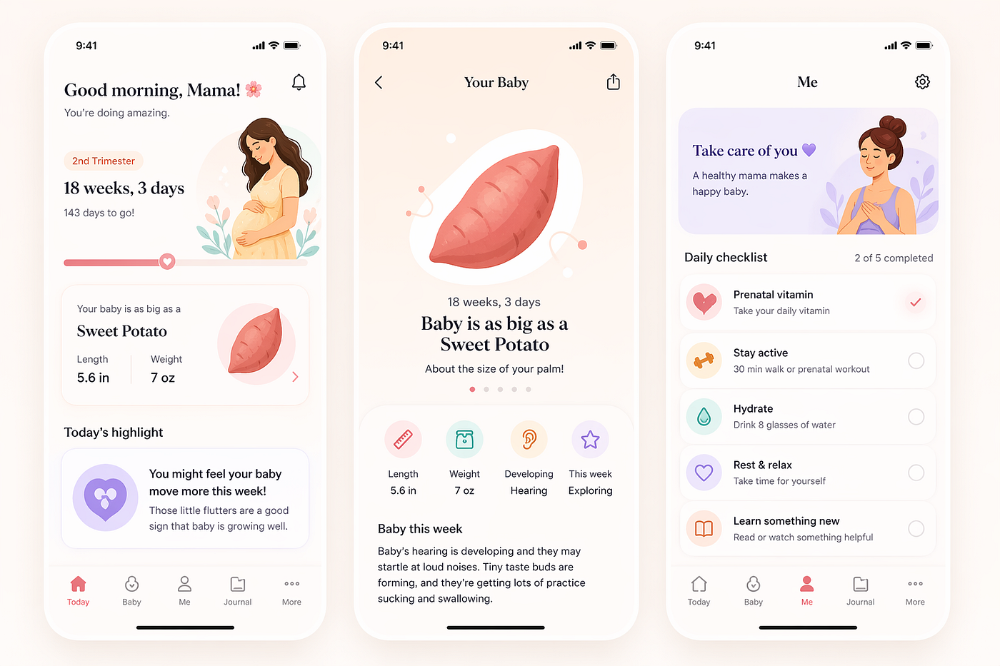
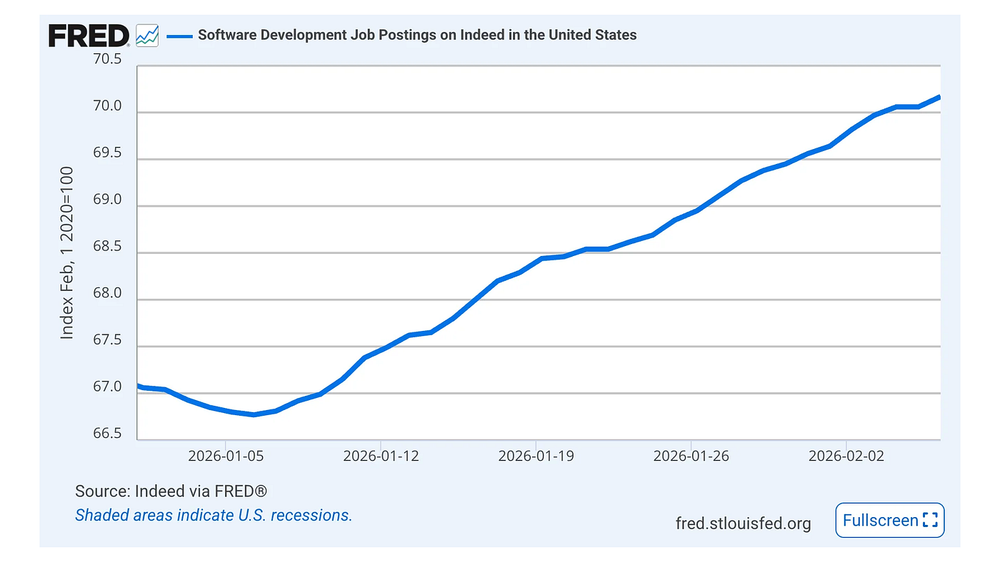
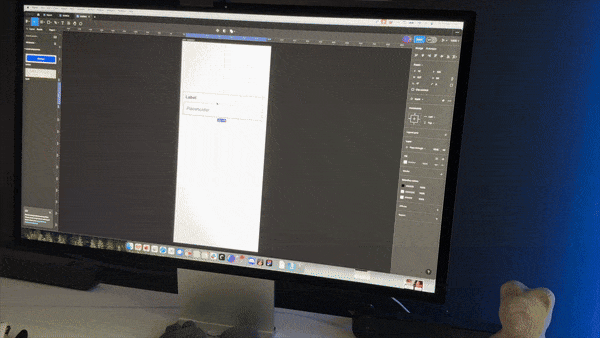
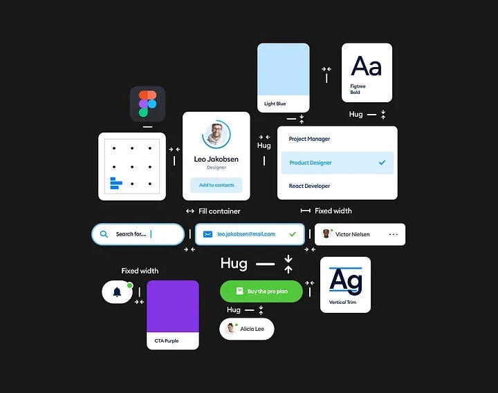
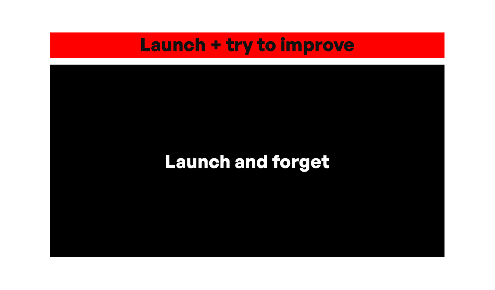

# AI 生成的 UI 设计现在已经强过 80% 的人类

## 当 UI 拼装变得快得多，对这个行业的未来意味着什么？

AI 之间争夺主导地位的战争看起来已经全面打响。就在 Anthropic 发布 Claude Design 几天后，OpenAI 又扔出了一个全新的图像模型。这次，它还专门针对 UI 设计做了调教。我把它拿来测试了一下，不得不说，结果极其惊艳。

## 等等，什么？

两年前 ChatGPT 第一次学会生成图像时，UI 设计的质量大概和如今臭名昭著的 Will Smith 吃意大利面视频差不多。

很明显模型是在 Dribbble 上训练的，因为它非常用力地想做出有创意的屏幕展示形式，但屏幕本身却滑稽地糟糕。

### 现在不是了

我用两个简单的 prompt 做了测试，分别生成了一个 B2B 金融 app 和一个 B2C 怀孕追踪 app。

之所以选这两个品类，是因为我都做过这类项目、做过这类 app，所以拿来评估很合适。

除了一些小的内边距问题和少量错乱的图标之外，这些就是 9/10 质量的 dribbble shot。

*用 OpenAI 第二代图像模型生成的 UI 设计*

等等，它们不是 UI 设计吗？嗯，算是吧。

它们在技术上算是 UI 设计，但实际上更像是 dribbble shot。

那些图片里的文字带着一些 Dribbble shot 的典型套路——用到名字时，永远是过去十多年里设计师之间互相抄来抄去的那几个名字。

> 现在 AI 在抄那些抄来的东西。

这就是为什么大多数女性都被命名为 Ava——因为设计师意识到 3 个字母的名字在视觉上换行更好看。Shot 是为"看起来好看"而做的，不是为"确保长名字也能正常显示"这种事而做的。

*这是 Google Stitch 一年前的 UI 设计。从那时到现在的进步是肉眼可见的。*

## 它会变得更好

它已经强过大约 80% 设计师的手工水平，并且最终会变得更好。可能接近 90%。

> 那么设计师完蛋了吗？我们结束了吗？打包走人，让 AI 来做 UI 吧？

**事情没这么简单。**

问题源于一个早在 AI 出现之前就存在的误区。如果有人能把某些 Dribbble 风格复刻得很好，他就是个能搭出成功产品的"足够好的设计师"吗？

以前，大量设计师有点无脑地从 Dribbble 抄模式和点子。问题是那里几乎全部的项目都不是真正的 app。它们更像是为了卖第一印象而做的展示型 artwork。

*这个怀孕 app 有点泛型，跟一些热门的 dribbble 例子很像，但仍然算挺不错的*

在这一点上，OpenAI 在我那两个 prompt 里给出的方案，比许多 dribbble shot 多年来的产物都更说得通。

## 品味是护城河？

AI 的产出在不断变好。这是不是意味着 AI 终将攻破"品味"——那个设计领域最终的、神秘的圣杯？是，也不是。

它在产出层面肯定会越来越好——这件事正在发生。

但品味本身在不断地往更精细的方向生长。它不是刻在石头上的，它会变。东西因为被过度使用而显得过时，品味也会因此调整。

所以 AI 生成的设计越多，就越需要品味去把作品从"AI 风"里推开、去做差异化。然后 AI 又从这些新作品里学习，整个游戏重启一轮。

*2024 年我画过这张图，预测到 2025 年 AI 会掌握 UX 大部分的基础（包括 UI），我们就能去做新东西的创新。我看我晚了一年。*

## 设计是什么

问题在于我们仍然把设计当成纯粹的"拼装"。在你常用的设计软件里点一连串按钮，拖拽几个矩形，然后就完事了。

由于多年来很多 UI 工作都是基于已有模式（不算很有创意），AI 在这里没有变成"设计师替代品"。

它变成了一种让你工作得更快的设计工具。

就像 Photoshop 让位给了更快、更适合 UI 设计的 Sketch，再后来 Figma 出现了；现在我们手里有了在几分钟、而不是几小时之内输出概念的工具。

> 你注意到了吗：
> 所有 shot 顶部的时间都是 9:41，这是在致敬 Apple——他们在营销素材里展示的就是 Steve Jobs 第一次发布 iPhone 时的那个时间。

*我们在"千篇一律"的循环里待得太久了。UX 需要创新。*

## 谁来做选择

这里大部分的恐惧来自未知。很多人觉得不再需要设计师了，因为 AI 在 UI 和 UX 上只会越来越好。

但归根结底，你得懂设计，才有能力说"ChatGPT 给我的这些图到底好不好"。

我能去评估层级、信息架构、字体、清晰度、对比度。

我会满意这些设计吗？不会。它们当然可以作为一个起点，但从这里到一个真正有价值的产品，还有很长的路要走。

但有了这些工具，我能很快地为我（自己）能想出来的 20 个具体点子去 prompt，然后有意识地把其中最好的那几个融合起来。这就是主要的区别——它加速了发现阶段。

以前你必须去 Dribbble 这样的网站看大量"灵感"，然后全部手工去做这件事。

*大多数人现在会快速做出"基础 UX"，而离群者会在做新东西，这些新东西反过来会去影响那些基础 UX。*

## 设计师看到了什么？

大多数非设计师只看到图标、矩形和文字。如果你没有设计预算，现在你确实可以在没有设计师的情况下，拿到比一年前好太多的结果。

但设计师在同一批 AI 工具里做出来的东西仍然会**好得多**。尤其是当 7/10 质量的 UI 急剧通胀之后。

## "够用就行"的陷阱

当每个产品都是"良好的设计"时，设计就必须往一些新方向走。

> 那些 AI 还没机会爬取并学习到的方向。

我们用这些工具能省下大量时间。第一稿现在可以在几分钟内出现。做出真正好的结果可以在几小时内、而不是几天内完成。

那么我们要拿这些多出来的时间去做什么？

一种思路是裁掉大多数人，单纯用这些工具去**做更多的东西**。既然产物都在 7-9/10 这个区间，这种速度意味着可以规模化地输出"够用"的东西。

*当整个行业坐在同一水平线上时，就需要做出差异、做到超出预期*

但所有人都会这么做。"够用"将不再够用。越来越多的模式会变成无聊的套路。某些以前看起来酷的东西会开始"有 AI 味"。

只要产品价值还在，这就不是太大的问题。问题在于：相似的产品之间会出现相似的价值。

只满足于"够用"，就意味着接受和竞争对手平分收入。这等于放弃。

*尽管有 AI，开发者岗位看起来又在上升了*

## AI 先吃掉了写代码

AI 是先以暴风骤雨之势"接管"了写代码。这事已经持续将近一年了，所有人都在用 AI 写代码。

它替代开发者了吗？并没有。如果说有什么，那就是它制造了比以往任何时候都更高的对优秀开发者的招聘需求。就业市场在增长。

公司意识到，单纯用更快的速度做出"够用"已经不再是护城河。你必须超越竞争对手。所以我们现在进入了另一种、不同形式的竞赛。

*设计师岗位在增长*

## UX/UI 也是一样

事实上，2025 年 UX 领域中的 UX/UI 岗位增速比整个科技行业整体还要快。而 AI 早就已经在那里了。

我已经讨论这件事有一阵子了。自从 flat design 出现以后，产品设计就停滞了。这意味着 UX 和 UI 都停滞。模式、组件以及拖拽式操作让设计被高度划分隔间。

> 这个问题用**这种**方式解决，而且只能用这种方式解决，因为我们已经知道答案了。没时间瞎搞！

是有些多样性，但总体上大多数 app 和网站都是抄抄抄的产物。

为什么我们再也没有出现过自己的"下拉刷新"那种级别的点子了？

因为直到不久前，要做到那种已知的、成熟的 UI 还是要花时间的。现在它发生得快得多，让我们有余地往后退一步、思考。

我们真的还需要用过去十年用过的、千篇一律的解决方案去解决那个问题吗？

**或者也许有更好的办法？**

*这一代设计师只是在反复做那同一组动作。这件事**应该**被 AI 自动化掉。*

我们拿到的不再是一盒积木 + 一张说明书让你照着封面拼出某个东西，而是一块拥有无限可能性的画布。原型可以做得非常快，我们可以想出 AI 还没见过的概念，然后 prompt 一个 AI 把它们呈现出来给我们看，让我们能测试和继续迭代。或者直接弃掉这个点子，跳到下一个。

## 拼装时代结束了

谢天谢地！我从 2022 年起就盼着这件事发生。现在是时候迎接真正的创造力了——拥有设计决策的所有权。知道什么管用、什么不管用、以及为什么。测试新点子，不断迭代。

不害怕去尝试新东西。同时尝试多种方案的时刻，正是现在。

基于设计系统的"表单式拼装"完全可以被自动化。

## 追平

AI 已经追平了我们这种基于拼装的 UI 制作。挺好。我们现在可以更快地做这件事了。下一步是走出拼装、走进未被探索的区域，去做一些新东西。

新的 UI 范式。新的 UX 模式。新的流程。把 UI 重新和前端融合到一起，再加入愉悦感。

这是一个让我兴奋的未来。而且就和开发者那一波一样，它将需要设计师。岗位很可能会爆发，因为我们已经为"把设计向前推"建立了一个基线。

*我们真的不需要更多这种无聊的东西了。*

企业从现在起会去招那些有创造力的、能 prompt AI 工具去出新概念的设计师——是为了真正地竞争，而不是模仿。会有一群人通过反复重试 prompt，把作品从 7/10 拉到 9/10 甚至更高。这个过程里，必然会冒出一些真正酷的点子。

我也不认为手工工作会彻底消失。AI 工具能把你带过大部分路，然后你可以手动去做实验，或者在工具里、或者直接在代码里。微调、拆开、围绕已知模式跳一段舞。

品味和好奇心是这里真正的技能。不是怎么拼盒子。

特别是因为我们 PF 目录里 [80-97% 的网站](https://pageformance.com/categories)甚至从不做调研、测试或优化。它们上面**好几个月**没有任何变化。

*发布即遗忘是主要策略*

这件事很可怕，因为它表明我们在大规模地生产东西，但背后没有任何章法或道理。

> 只是更多的"东西"。

工具会变，做设计的人不会。差别只在于"自己做决策"和"把决策外包出去"。如果你理解什么**才是**好设计，你就能把好设计变成伟大的设计。

工具能为你做一个 OK 的设计，但没有那些技能，你就不知道要改进什么、怎么改进。

那条唯一能达到的天花板，就是追上竞争对手——成为一大堆 7/10 里的另一个 7/10。

我们可以做得更好。我们也会做得更好。

我兴奋于去设计**新**的东西！
