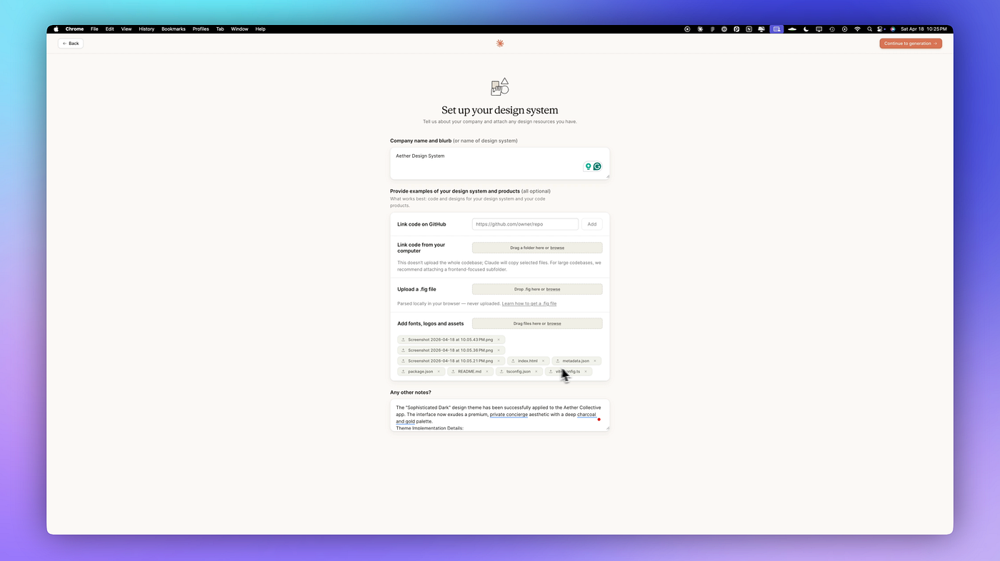
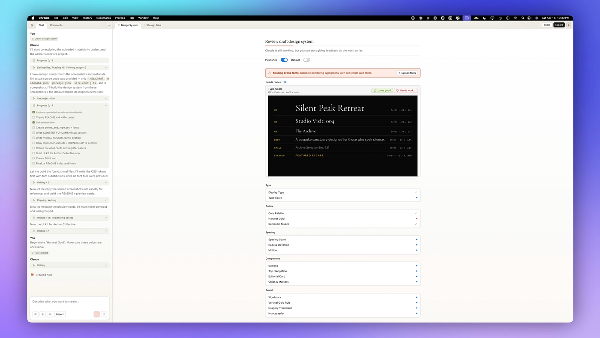
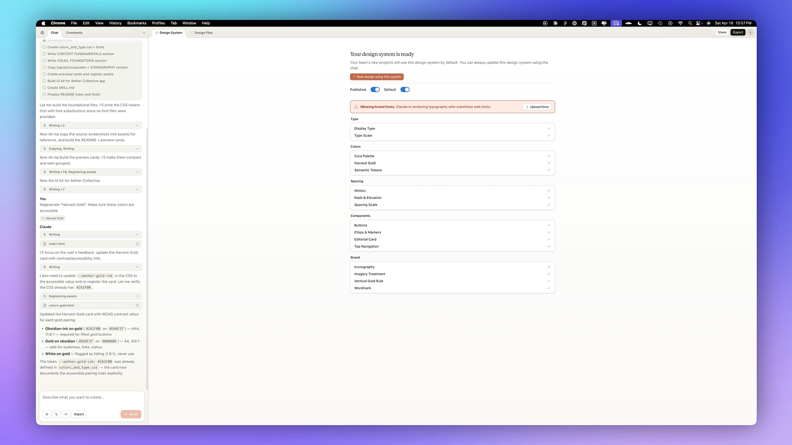
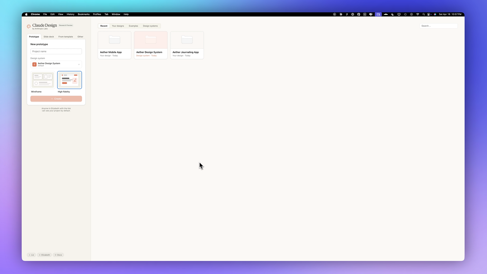
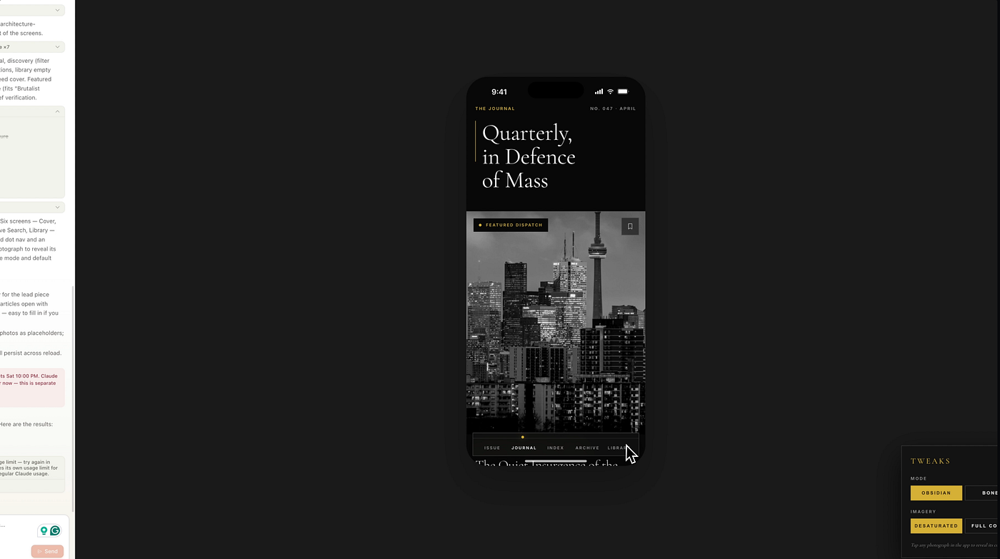
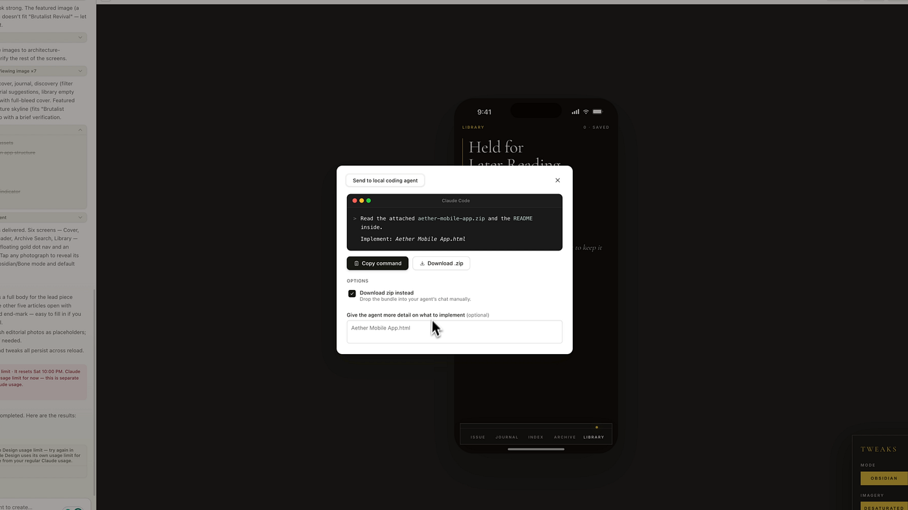
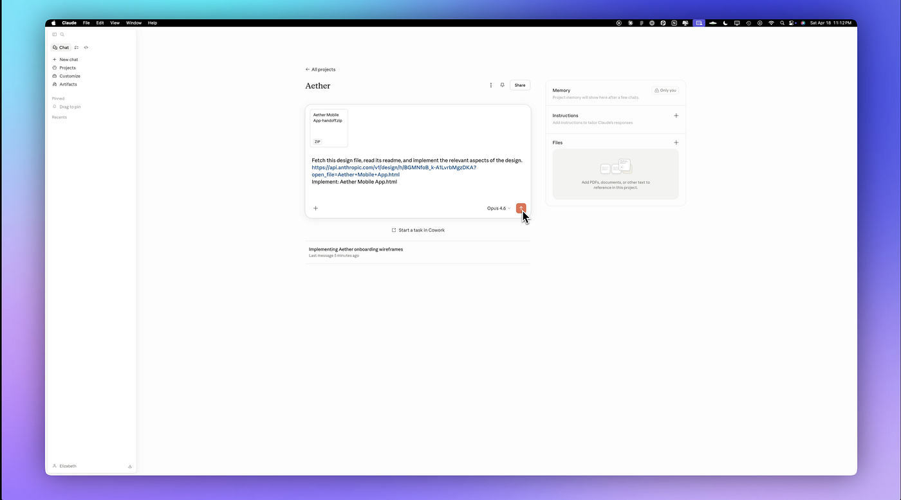
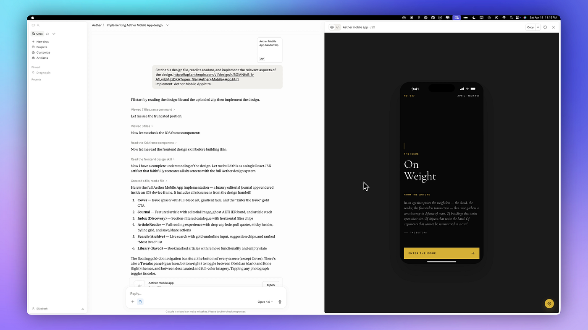

# 我用 Claude Design 做 UX/UI——设计师应该知道的事

[Claude Design](https://www.anthropic.com/news/claude-design-anthropic-labs?ref=designerup.co) 才发布几天，就已经有了一大堆通用的演示和教程。[这周我把它用在了一个真实的 UX/UI 项目上](https://youtu.be/xwzXSegBJbo?ref=designerup.co)，看看针对我们正在做的这类产品工作具体能做到什么（它擅长什么，又会在哪里崩掉）。下面是我测试的内容：

🔶 从零生成一套 Design System
🔶 使用一套已有的 Design System
🔶 创建 Wireframe 流程
🔶 UX 逻辑与规划
🔶 制作高保真的 App Prototype（带动效）
🔶 把它交接给 Claude Code 做实现

在这篇指南里，我会精确地告诉你怎么做这些事，以及它是如何融入到我的产品设计工作流中的。

## 极速速览

Claude Design 目前处于 Research Preview Beta 阶段。你需要付费方案。哪怕是基础的 Pro 方案也行。但要记住，目前它的用量是独立于你的 Claude 账号的，有自己的用量上限，每天封顶一定额度后重置。

Claude Design 里所有东西的基础是一个 Design System。这就是它对 UX 与 UI 设计师如此强大的原因。如果你没有，可以让它帮你生成一套 Design System——你只需要你的品牌或风格指南就能开工，甚至只需要一些截图或视觉灵感，Claude 也能为你搭起一个 Design System。

如果你已经有现成的 Design System 就更好了，可以上传你的素材，立刻开始干活。

## 搭建我的 Design System

我从我的 Design System 开始。如果你已经有一个 GitHub 仓库放了你的组件，你可以把它链接过来。如果它在你电脑本地，你可以直接上传一个包含一堆素材的文件夹。我特别喜欢的一点是它和 Figma 配合得很好——所以如果你在 Figma 里有风格指南、或者组件加品牌指南，你可以导出一个 FIG 文件传上去。你也可以选择给项目使用一套[现有的开源 Design System](https://designerup.co/blog/10-best-design-systems-and-how-to-learn-and-steal-from-them/)。

我上传了我手头一个项目的素材和 Design System。我还有一堆其他相关的代码文件想让它参考，于是也一并加进去了。

💡 *几个小贴士：如果你想省点 credits，又还没有 Design System 素材，可以先在 [Google Stitch](https://youtu.be/-oD8-MmqcL0?ref=designerup.co) 这类工具里生成出来，因为这一步绝对会吃掉很多 token。另一个建议是，对一些简单任务和微调，把模型切换一下，不要把你的用量整个用空。*

我接着继续往下走，进入生成阶段。它说会花大概 5 分钟，然后就开始搭建 Design System。它会创建一个不错的进度列表，让你能看到它正在做什么、上传了什么、读了哪些文件。然后它用 CSS tokens 构建出那些基础文件。

## 评审草稿版 Design System

接下来这一步就相当好玩了。它给你做出一份草稿版 Design System，你可以审视所有组件。我这一份字体还缺——我没把字体全传上去，所以它渲染了一些替代的 web 字体。

它把我的[配色板](https://youtube.com/playlist?list=PLl0Umi92CQzXzdGkynmhh-ZjpoZW1f1Mm&si=_fJLNeEhD6k9hgbP)调出来了，我边看边逐个 approve。这一步需要点工作——配色绝对没达到无障碍标准。所以我告诉它这里需要改，让它确保这些颜色满足无障碍要求，然后提交。接着它会给你看前景和表面，让你确认一切没问题。我看着挺好。

字体看起来不错。Spacing、所有这些——挺漂亮。它做了一个 typography scale。非常好。Word mark。漂亮的 spacing scale。我喜欢。按钮看起来不错。然后我现在有两种通过无障碍校验的颜色了。

我还很喜欢这个 motion。我给了它一段描述，说我希望动效是什么样的感觉——Claude Design 在动效方面其实表现得相当令人印象深刻。

现在我可以继续用这套 Design System 来做设计，把它应用到我的项目上。当你回到主屏，你可以看到你的 Design System 和其他的项目。

## 启动一个新项目：Wireframe

现在是时候创建我的第一个项目了，我想从 wireframe 开始。我在做一个新闻 + 日记 App，它通过引导你写下你对话题的想法，帮你针对你筛选出的话题形成观点、表达立场。所以接下来，我会把 prompt 粘贴进去。从 onboarding 流程开始。

下面这一点是我真心喜欢的——**对于我做的每一个设计，Claude Design 都会真的对我做一次 onboarding，确保它理解我想创建的东西的 UX，并问我一些更重要的问题。**

我对它问的问题给出的部分回答包括：

- 它是一本融合了精选 feed 的私人日记。
- 我希望 onboarding 简短，并且我**绝对**想要知道用户的兴趣话题。
- 我希望这些 wireframe 有三种不同方向——一种 editorial（杂志风）的感觉，也许还有 gallery 风，以及 notebook 风。
- 我希望用户能在话题上选择一种立场。

而且这一点很重要——它**专门**会问到 [paywall 与商业模式](https://designerup-paywall-patterns.figma.site/trial-paywall?ref=designerup.co)的 UX，我觉得这是 Claude Design 最显著、最重要的差别之一。我做过一整期视频讲怎么[通过 paywall、订阅、升级页面去设计有意图、有转化效果的转化点](https://youtu.be/WvOhpkAcHno?si=3n5eFMBbbjRf1IRp&ref=designerup.co)，这就是我特别想在 UI 里看到的那种逻辑。

你还可以精确决定你想在 UI 里能控制和切换哪些"调节项"，就像你在 Figma 里用 variant controls 一样。

这点正是我觉得 Claude Design 现在能脱颖而出、超过 Google Stitch 甚至 Replit 以及 Lovable 这类生成设计的 builder 的原因——**它对 UX 的考量多得多，而不是先生成、事后再回头微调。**

如果你还有任何其他约束——比如我想用某些 API、或者你想让开发者考虑的特定条件分支或逻辑流——你也可以在这里输入。

## 评审 Wireframe

好的，下面是它给出的结果。我们有三种各不相同的风格、三种不同的方式去开始 onboarding。有 editorial 流，有 gallery 风，也有 notebook 风。这些都非常棒，我有点偏爱第一种，单纯因为它是一种现代风加上更偏手写笔记本风的混搭。它会给你提示，帮你就一个话题去写、并对它做更深入的思考。

我打开了 tweaks。我想把 editorial 版本单独拿出来、放大看看有没有什么我想改的地方。但这是一个很棒的简洁 onboarding。

顶部还有一些其他你可以做的事。你可以对某个东西评论——比如说，"这个进度指示器是不是足够清晰？"——然后把它发给 Claude。这样问，它会把问题发给 Claude，如果你想做调整，这就能制造出一些变体。你也可以直接在这里编辑一些基本的东西——spacing、opacity、margin，或者你可以在设计上画一画，然后让它去改某个东西。

## 进入高保真

假设你想拿这套 Design System，把它应用到 wireframe 上，做一个高保真的移动端流程。

你可以点进你的 Design System，看到它已经被发布并设为默认。从这里，点那个按钮，让它用这套 Design System 创建一个新的设计。

它会在 Claude Design 里打开另一个窗口，Design System 会自动挂上去。这一次，你可以点 **high fidelity**、给项目起名，然后点击创建。

你愿意的话可以从 sketch 开始，但因为我已经有那些 wireframe 了，我把它们附了上去。我引用了另一个项目——那些 wireframe——并且只说了一句：***给我创建一个最终的、高保真的移动 App，主题是这本新闻 + 艺术观点日记。***

然后它会去翻你创建的 Design System、用上那些样式，并在正式开始前再问几个问题让你回答。我针对自己脑子里设想的 UX，挑了一堆听起来不错的选项。我又一次很喜欢这个过程，因为你不必从零去想到所有事——它会提示你，这真的能帮你打开创意的水龙头。

最后出来的是一个看起来很漂亮的移动 App。我真的觉得它相当精致。先是 first Issue，有点像是你自己策展过的那份新闻的私人摘要。然后是日记，你可以加条目、做不同事项的索引，还有一个归档库。这真的很酷。我接下来要做的下一个流程，可能就是录入日记条目，以及 onboarding 阶段引出的更多东西。

但就这么多了——一个完整的 App prototype。

## 再往前一步：交接给 Claude Code

你们中有些人可能在想——好吧，这跟 Claude Code 有什么不同？

其实，差别没那么大。**这真的只是 Claude Code 之上的一个视觉层。**比如说，如果你已经把你的 [Claude 接到了 Figma MCP](https://youtu.be/CJIivdkGT5Y?si=8fGg9ojfyEIaPe14&ref=designerup.co)，你就可以在 Figma 里做这件事——但话说回来，你还是得回到 Claude Code 里，让它和你的 Design System 来回通讯。所以这其实只是把这一切包到 Claude 里，省掉了 Figma 那一步。

那么，如果你真想把它变成实际的东西，你可以导出它、交给 Claude Code。导出有几种不同的方式。点 Claude Code、复制它给你的命令；我也建议把 zip 文件下载下来作为备份。

🔖 **特别说明**：Claude Design 当前在桌面 App 上不能用，所以你必须在浏览器里用它。但如果你在用 Claude Code 的桌面 App，你可以切换过去。我自己就是这么做的。

到了 Claude Code 那边，打开你的项目，把你刚才从 Claude Design 复制的 prompt 粘贴进去，并且把 zip 文件也上传上去，以防万一出什么问题。一旦你点上传，它就会在 Claude Code 里面被完整实现。

我们就拿到了——在 Claude Code 里完整实现的版本。

## 这套工作流为什么对 UX/UI 设计师很棒

这真的太棒了——从一堆点子，到把 UX 梳理清楚，到 wireframe 被替我创建出来，再到最终的高保真设计，然后交接给 Claude Code。对 UX 与 UI 设计师来说，这是一套相当出色的工作流。

我会继续围绕这套东西做实验，因为我还想把 Cowork 集成进来，自动化诸如调研之类的事情，以及产品设计流程的其他环节。我已经迫不及待要在[我产品设计课的学生](https://designerup.co/product-design-ui-ux-course?ref=designerup.co)里做下一场直播了。如果你对此感兴趣，过来看看吧。

我很期待看到它在我工作流中接下来的演进。所以如果你想跟着继续看，记得关注我、留言评论，并把这篇文章分享出去，让更多 UX 和 UI 设计师也能从中受益！

谢谢阅读。
