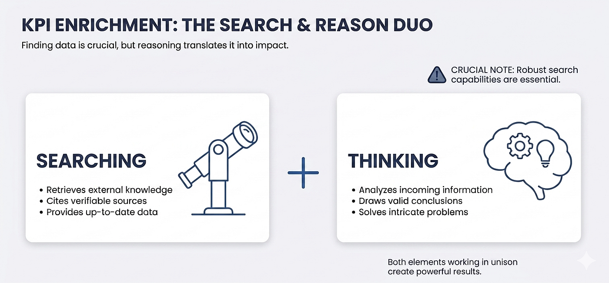
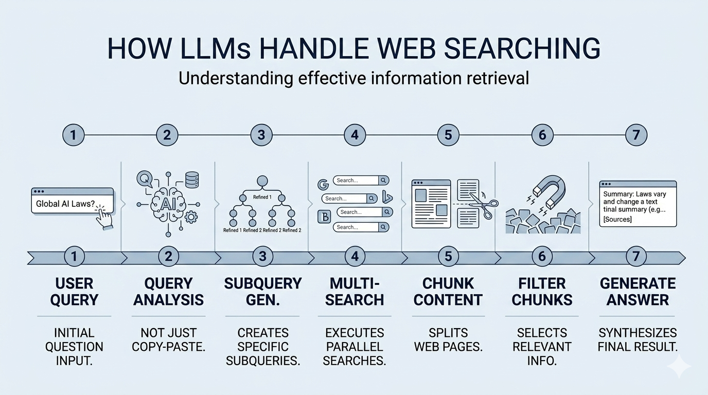
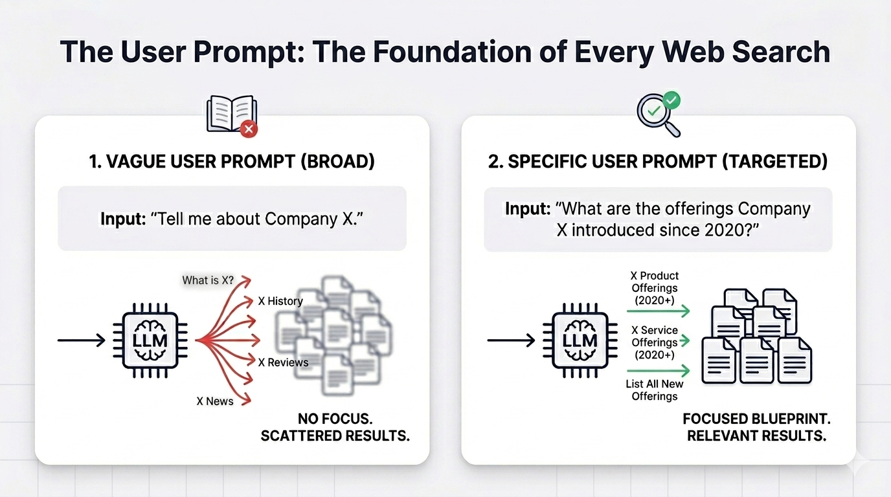
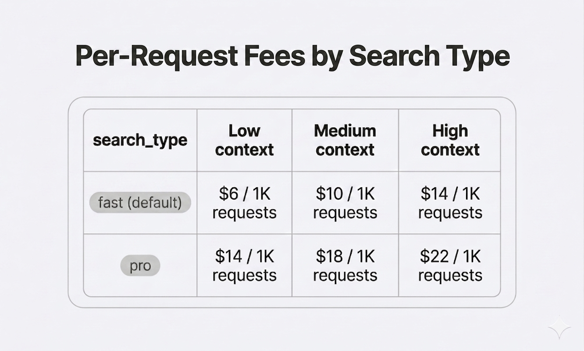

# 用 LLM 搜索网络:为什么找到比思考更重要

## *人们倾向于低估检索。但没有正确的来源,再聪明的模型也只是在猜。*

*Finding vs Thinking (Image by the Author)*

通过 LLM API 检索信息时,一个常见的错误是:如果 AI 搜索工具结果不好,就升级 reasoning 模型。但这个做法大多数时候是错的。在实践中,要做好信息检索,光有强 reasoning 能力是不够的;模型在网上找到什么的质量,远比你在分析信息和得出结论时模型有多强大要重要。如果信息根本没被检索到,你的 reasoning 能力毫无用处。

在这篇文章里,我们会详细解释通过 API 用 LLM 搜索网络时(以 Perplexity 的 Sonar API 为例)retrieval 和 reasoning 的区别,以及如何同时提升两者的质量。我们会探索常见错误,以及你可以用来有效从网上收集信息的策略和技巧。

## search 和 reasoning 这对组合

用 LLM 在线收集信息时,人们倾向于低估 retrieval 这一环。在用 RAG 系统时也一样。用户经常以为如果结果不好,解决办法就是升级 reasoning 模型。他们错了。大多数情况下,如果结果不好,是因为信息没有被恰当地从网上检索回来。

成功的网络搜索同时需要有效的 search 和 reasoning。差别在于把信息拿到手 vs 恰当地分析它并从中得出结论。Search 部分从网上(比如网页、文档和报告)收集相关的外部知识,reasoning 部分分析这些文档里可用的信息以提供一个简洁的答案,把文档里同样存在的所有不相关信息剔除掉。

*Searching vs Thinking (Image by the Author)*

## LLM 是怎么处理网络搜索的(fast 和 pro search)

要做有效的信息检索,我们首先得理解 LLM 怎么处理网络搜索。

信息搜索可以仅用一次搜索完成;LLM 把你的 user query 转换成一两个搜索查询(对关键词友好的形式),提交给搜索引擎,从网上拿到 snippet 来生成答案。

在另一些情况下,LLM 不只是把你的查询改写到搜索引擎里,而是把它拆成多个子查询,跑好几次搜索来收集更多相关信息(并行或顺序),评估中间结果,如有必要再跑后续查询。然后只有从网站检索回来的相关 chunk 才会被 LLM 用来生成最终答案。

*How LLMs Handle Pro Web Search (Image by the Author)*

这正是 Perplexity 的 Sonar API 中 `search_type: "fast"`(单次通过和分块结果)和 `search_type: "pro"`(顺序查询和排过序的分块结果)的区别。其他 API,比如 Gemini,也提供等价的 fast 和 pro 搜索模式。

在 `search_type: "fast"` 和 `search_type: "pro"` 之间的选择取决于你想收集的信息有多复杂。对简单问题,单次通过就够了;比如,问 Python 3.9 是什么时候发布的,只需要一次查询就能拿到准确答案。对更复杂的问题,比如核实一家特定企业是否提供多种服务,就需要多查询的方式,需要从几个来源汇总以得到最终回答。

不管你用哪种 search 类型,永远不要忘记 user prompt 始终是收集准确结果时最关键的因素。让我跟你解释一下为什么。

## user prompt:每一次网络搜索的基础

一个被优化过的 query(user prompt)对成功的信息检索至关重要。LLM 把你的 user prompt 当作生成搜索查询的蓝本。模糊或不完整的 user prompt 会导致没聚焦的子查询,失败地无法收集到包含你想要信息的 chunk。如果你的 user prompt 模糊,无所谓模型跑多少次查询;你大概率找不到你要的信息。

假设我们想收集 X 公司的产品。一个像"告诉我更多关于 X 公司的信息"的 prompt 太宽泛,没给模型任何聚焦点;而"X 公司自 2020 年起推出了哪些产品?"会产生有针对性的子查询,返回直接相关的结果。

*Importance of User Prompt in Web Search (Image by the Author)*

一个常见的错误是把你想搜什么放在 system prompt 里,然后用一个模糊的 user prompt。System prompt 应该定义你的规则(角色定义、输出格式、语气),而你想问的实际问题应该在 user prompt 里指定,因为触发查询生成的是 user prompt。

永远记住:花时间定义一个聚焦的 user prompt。

## 优化网络搜索的策略

接下来这一节,我会带你过一遍可以用来通过 LLM 优化网络搜索的策略,用 Perplexity API 作为参考模型。不过同样的原则可以应用到其他 LLM 上。

### 1\. 定义清晰简洁的 user prompt

清晰简洁的 user prompt 是搜索网络时最重要的一环。如果你的 user prompt 没设计好,你生成的查询就没法收集到你想要的信息。

花时间写一个好的 user query。

### 2\. 评估你想收集的信息有多难拿到

不是所有问题都需要相同的搜索深度。简单问题用一次查询就能回答,而更复杂的问题需要多查询的做法,甚至需要 agentic query 能力来反复重新定义搜索。对于用 Perplexity API 做网络搜索来说,这就翻译成在 `search_type: "fast"` 和 `search_type: "pro"` 之间做选择。

不需要时不要使用复杂的搜索能力,这一点很重要,因为它们消耗更多 token 并显著抬高每次请求的成本。`search_type` 参数影响每次请求的费用,这个费用是在 token 成本之上收取的,并随着 context 大小(low、medium、或 high)按比例增加,你可以在下表中看到。

*Per-Request Fees by Search Type with Sonar (Image by the Author)*

除了 `fast` 和 `pro` search 类型外,Perplexity API 还引入了一个 context 参数,可以帮助为复杂的信息检索拿到更好的结果。

### 3\. 为复杂的信息检索增加来源数量

`search_type`(`fast` 和 `pro`)控制搜索是怎么执行的,意味着跑了多少查询、以及模型是否在它们之间 reason 来调整查询策略。相比之下,`search_context_size` 控制有多少文档被检索回来,因此被传给 reasoning 模型来生成答案。

它们是独立但互补的参数。对于复杂的信息检索,你可以把 `pro` search 与 `high` context size 结合起来。下面这张表解释了不同的组合策略。我的建议是先分析你的检索需求有多复杂,因为如同定价表里所示,两个参数的复杂度上去时成本都会上去。

*How search_type and search_context_size Work Together (Image by the Author)*

### 4\. 跑测试用例评估哪些参数最适合

我推荐的策略是从你的数据集里选一小份样本,测试不同的检索策略组合,评估根据策略不同你的结果有多好。一旦你识别出表现最佳的配置,就可以用这些参数跑整个数据集。这是一个针对你的用例平衡质量和成本的好策略。

啊,瞧!按照这些策略,你会在平衡质量和成本的同时拿到非常好的检索结果。永远不要忘记:一个被精心设计过的 user prompt 仍然是最重要的事情。

## 总结

用 LLM 做网络搜索的用户倾向于低估 retrieval 这一环,经常假设差结果是因为模型的 reasoning 能力。

这篇文章解释了执行网络搜索时 search 和 reasoning 的区别,以及你可以遵循哪些策略,在不为简单搜索抬高成本的前提下,为复杂信息提升检索能力。

永远不要忘记:finding beats thinking。

谢谢阅读!

想看更多这类内容,欢迎查看我的 Instagram [@ai\_data\_con\_amand](https://www.instagram.com/ai_data_con_amanda)a,我在那里分享关于数据科学和 AI 的视觉化内容和洞见。📊🤖

你也可以订阅我的 [Newsletter](https://amandaiglesiasmoreno.medium.com/subscribe) 保持关注;我的常规内容包括数据科学、数据可视化、地理空间数据和人工智能领域的文章:

Amanda Iglesias
