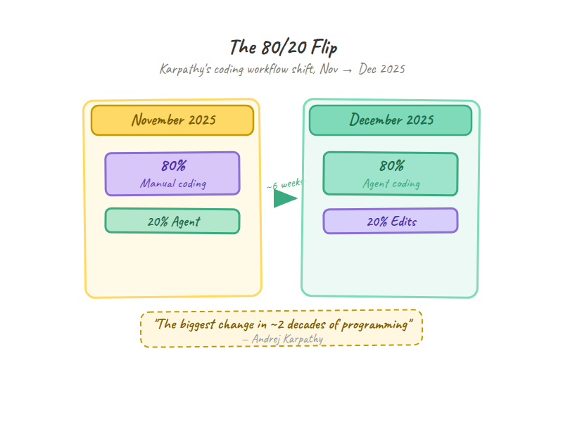
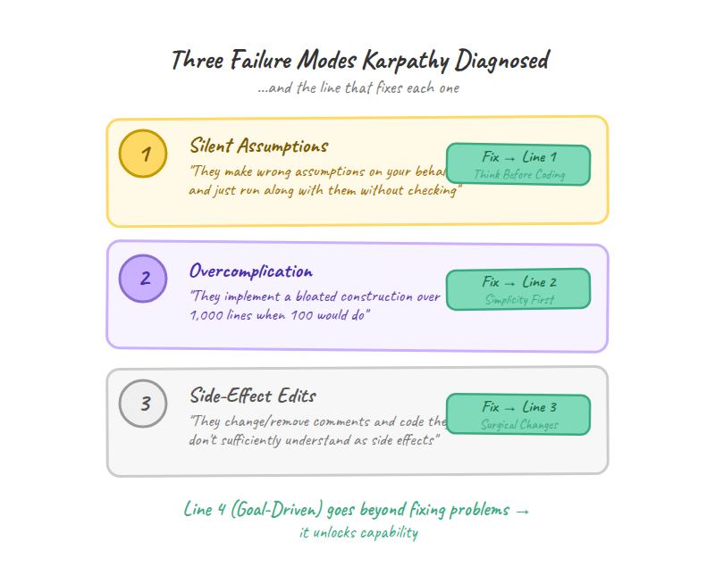
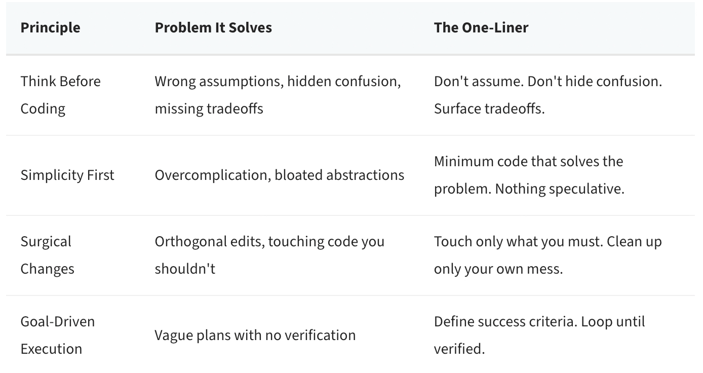
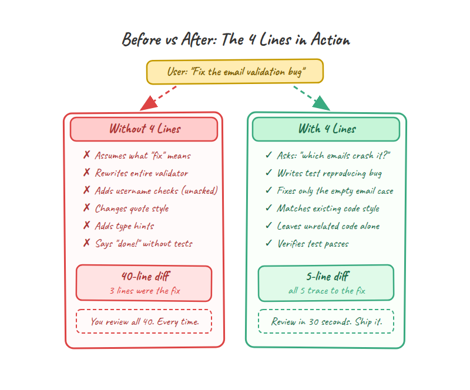
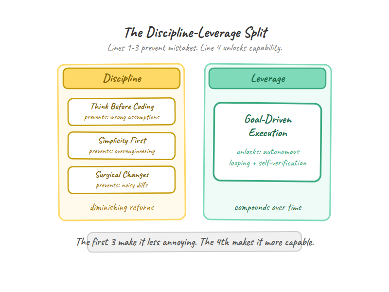
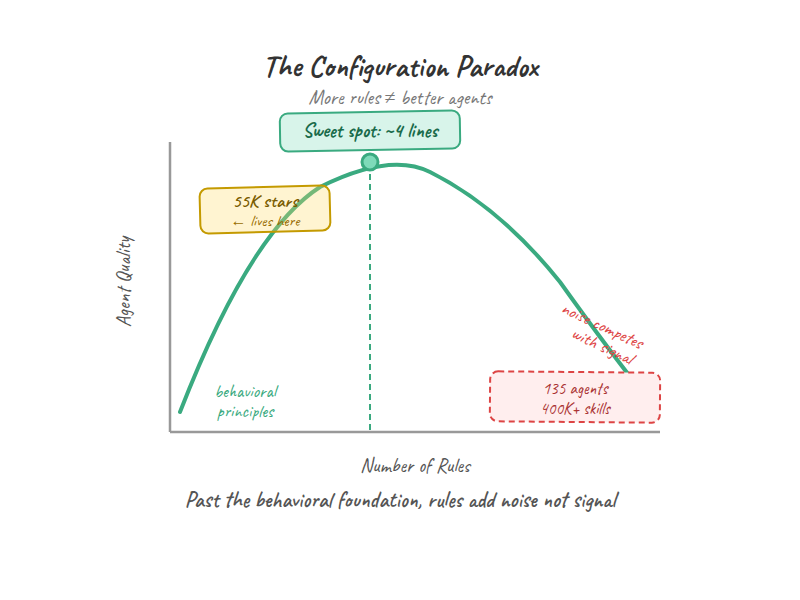
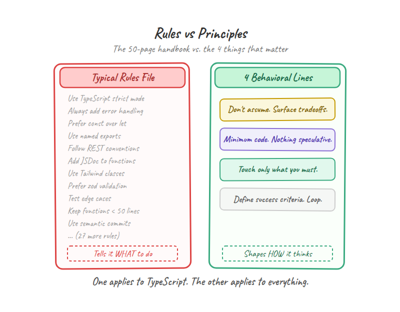
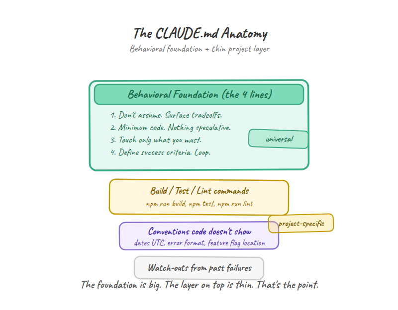
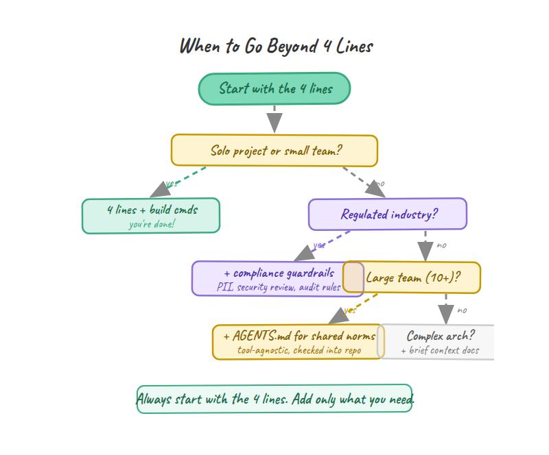
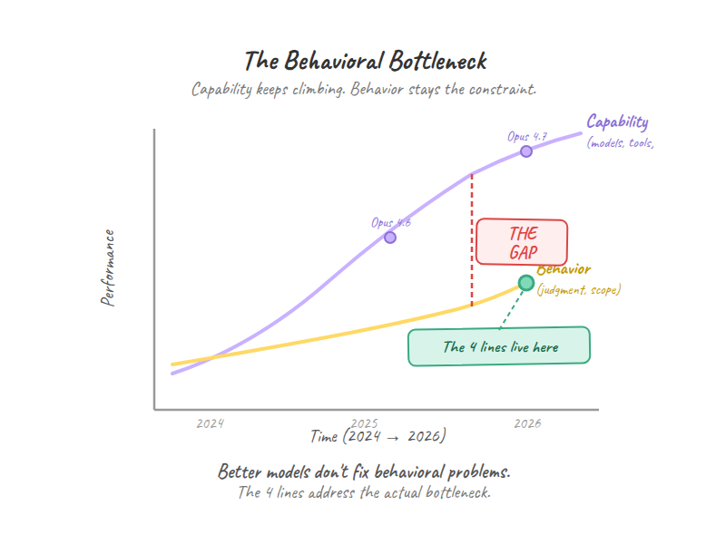

# 每个 CLAUDE.md 都该有的 4 行字

## Karpathy 诊断了什么、60,000 名开发者收藏了什么,以及为什么"行为约束"赢过"功能清单"

在 2026 年 4 月的某一周，Anthropic 发布了 Claude Opus 4.7，推出了一款叫 Claude Design 的新产品，并新增了即便笔记本盖上也能运行的 Routines 功能。

同一天，OpenAI 给 Codex 加码——上线了能在你 Mac 上点击和输入的并行 agent。

这就是当下的常态。2026 年 4 月被称为有记录以来 LLM 发布最密集的月份之一。约 65–70% 的企业代码由 AI 写成。超过 50% 的公司把自己采用 AI 的状态描述为一场"[混乱的乱斗](https://siliconangle.com/2026/04/09/backlash-brewing-rapid-innovation-ai-coding-agents-may-force-push-enterprise-order-control/)"。

[免费阅读本文](https://levelup.gitconnected.com/the-4-lines-every-claude-md-needs-2717a46866f6?sk=4663250d4954fa2a9b4e5944f0af8085)

*图片来源：Andrew Small / Unsplash*

然而在这整个领域里被加 star 最多的开发者资源，不是某个框架，不是某个插件，也不是某个模型。

**它是 markdown 文件里的四句话。**

一个 GitHub 仓库。[60,000 个 star](https://github.com/forrestchang/andrej-karpathy-skills)。

没有依赖，没有 API，没有构建步骤。

就是一个 `CLAUDE.md` 文件，里面写着从 Andrej Karpathy 一月发的内容里推导出来的四条行为准则。60,000 名开发者收藏了什么，比这一周里的任何产品发布都更能说明 AI 辅助编程的真正瓶颈。

上周末我花时间把自己的 `CLAUDE.md` 迁移到适配最新版 Claude Code。四十七条规则，几个月里精心累积起来。结果 agent 忽略了其中一半，还幻觉出了一堆我从没写过的约定。就在那一刻我发现了这个仓库。也就在那一刻我意识到，问题不是规则本身，而是我写的规则太多了。

*作者绘图：80/20 的反转*

## Karpathy 究竟诊断了什么

2026 年 1 月，Andrej Karpathy 发了[一条帖子](https://x.com/karpathy/status/2015883857489522876)，它在众多 AI 评论中显得不太一样。他没有在发布什么，他是在描述什么坏掉了。

在大约六周时间里，从 2025 年 11 月到 12 月，他从"80% 手写代码 + 20% agent 辅助"完全反过来变成"80% agent，20% 自己改"。他形容这是"*近 20 年编程生涯里最大的变化，毫无悬念*"。但这条帖子不是庆功，是诊断。

模型并不是写不好代码，它们是判断力不行。

**"模型替你做了错误假设，然后头也不回地按假设往下跑，连核对都不核对。"** Karpathy 戳中了更深层的问题："它们不管理自己的困惑、不寻求澄清、不暴露矛盾、不呈现权衡、该顶回去的时候也不顶。"

你说"导出用户数据"，agent 就假设是 JSON、写到磁盘、包含每一个字段、跳过分页。它从不停下来说"我不确定你要哪种格式"，它直接选一个然后开干。

第 1 行就是从这里来的。

**"它们超爱把代码和 API 搞复杂，把抽象搞臃肿。"** Karpathy 的原话：它们"用 1,000 行去搭一个臃肿的结构，其实 100 行就够了"。

你想要一个折扣计算器，结果拿到的是 Strategy 模式、抽象基类、一个 enum、一个 dataclass 配置，外加 40 行 setup。agent 在为明天的需求而建，而不是为今天的问题。

这直接对应第 2 行。

**"它们有时仍然会顺手改掉、删掉自己没充分理解的注释和代码，作为副作用，哪怕这些和任务正交。"**

你让 agent 修一个 bug，结果 PR 顺手把你的单引号格式化成双引号，加上你没要求的 type hints，还重写了周边代码。修复本来 3 行，diff 变成 40 行。

第 3 行就因这一点而存在。

*作者绘图：三种失败模式*

这条帖子之所以引起共鸣，是因为它不带处方性。Karpathy 没给出解决方案，他只是把失败模式描述得足够清楚，几天之内就有人把它们翻译成了一个四行的 `CLAUDE.md` 文件，发到 GitHub 上。

但还有第四行，它超出了纪律的范畴，进入了 Karpathy 自己暗示过的领域："*LLM 特别擅长循环直到达成具体目标。不要告诉它做什么。给它成功标准，然后看着它跑。*"

这就是第 4 行。也正是这一行让整套东西不止是一份风格指南。

## 那 4 行

下面就是完整内容。一个 `CLAUDE.md` 文件中完整的行为章节，55,000 名开发者认定它值得加 star：

> 1\. 不要假设。不要隐藏困惑。把权衡摆到台面上。
>
> 2\. 用最少的代码解决问题。不写任何投机性的代码。
>
> 3\. 只动你必须动的地方。只清理你自己造的烂摊子。
>
> 4\. 定义成功标准。循环直到验证通过。

全部就这些。每一行都直接对应 Karpathy 的某一种失败模式：

*4 行：你完整的 CLAUDE.md 行为基石*

我们逐条拆解为什么它们有效。下面的"之前/之后"示例改编自[该仓库的 EXAMPLES.md](https://github.com/forrestchang/andrej-karpathy-skills/blob/main/EXAMPLES.md)，那里对每条原则都有完整走查。

### 先思考再写代码：不要假设。不要隐藏困惑。把权衡摆到台面上。

这一条解决了使用 AI 编码 agent 最常见的痛点：该问的时候它在猜。

没有这一行的话，当你对 agent 说"加一个导出用户数据的功能"，会出现下面这种情况：

def export\_users(format\='json'):
    users = User.query.all()
    if format == 'json':
        with open('users.json', 'w') as f:
            json.dump(\[u.to\_dict() for u in users\], f)
    return f"Exported {len(users)} users"

agent 假设了 JSON。假设了所有用户。假设了文件输出到磁盘。假设了要包含哪些字段。它从没提过这些决策中的任何一个，直接选了就往下走。

应用了这条原则之后，agent 的第一句回复变成这样：

Before implementing, I need to clarify:
1. Scope: Export all users or a filtered subset?
2. Format: JSON download, CSV file, or API endpoint?
3. Fields: Which user fields? Some might be sensitive.
4. Volume: How many users? (affects the approach)

四个问题代替四个假设。代码出现在答案之后，而不是之前。

**为什么这件事比表面看上去更重要：** LLM 天然不会把不确定性外显出来。它们是在补全（completion）上被训练的，不是在暂停上。它们训练数据里的每一个 token 都在往前走。停下来说"我不确定"违背了这些模型学习生成文本的纹理。这一行强制要求一种模型有能力但默认不做的行为。它不是在加一个特性，它是在覆盖一个默认值。

### 简单优先：用最少的代码解决问题。不写任何投机性的代码。

这一条干掉过早抽象。没有它的话，你要"一个计算折扣的函数"，结果拿到的是这样：

class DiscountStrategy(ABC):
    @abstractmethod
    def calculate(self, amount: float) -> float:
        pass
class PercentageDiscount(DiscountStrategy):
    def \_\_init\_\_(self, percentage: float):
        self.percentage = percentage
    def calculate(self, amount: float) -> float:
        return amount \* (self.percentage / 100)
class FixedDiscount(DiscountStrategy):

class DiscountCalculator:
    def \_\_init\_\_(self, config: DiscountConfig):

抽象基类。Strategy 模式。配置 dataclass。四十多行代码就为了一道算术。

用了这条原则：

def calculate\_discount(amount: float, percent: float) -> float:
    return amount \* (percent / 100)

一个函数。一行逻辑。等你以后真的需要 Strategy 模式，那时候再重构，不是现在，不是出于投机。

**这是大多数文章都漏掉的洞察：** 过度复杂的那个版本并不是明显错的。它遵循真实存在的设计模式。在一个大型计费系统里，资深工程师确实可能用 Strategy 模式。问题在于*时机*。过早抽象的代价是会复利的：更多的代码意味着更多的 bug 表面积、更多的评审者认知负担、改变方向时更大的惯性。agent 是在为还不存在、甚至可能永远不存在的需求而建。好的代码简单地解决今天的问题，而不是过早地解决明天的问题。

原文里那个"资深工程师测试"一针见血："资深工程师会说这玩意儿过度复杂吗？"如果会，那就化简。

*作者绘图：在一个真实 bug 修复上 4 行原则起作用前后的对比*

### 外科手术式修改：只动你必须动的地方。只清理你自己造的烂摊子。

这一条保护你的 diff。你让 agent 修一个 bug——空邮箱会让校验器崩溃。没有这条原则，diff 长这样：

\- if not user\_data.get('email'):
\+ email = user\_data.get('email', '').strip()
\+ if not email:
      raise ValueError("Email required")
\- if '@' not in user\_data\['email'\]:
\+ if '@' not in email or '.' not in email.split('@')\[1\]:
      raise ValueError("Invalid email")
\- if not user\_data.get('username'):
\+ username = user\_data.get('username', '').strip()
\+ if not username:
      raise ValueError("Username required")
\+ if len(username) < 3:
\+     raise ValueError("Username too short")
\+ if not username.isalnum():
\+     raise ValueError("Username must be alphanumeric")

bug 修复本来是处理空邮箱。agent 顺手"改进"了邮箱校验、加了用户名长度检查、加了字母数字强制要求、还改了变量名。这些没有一条是被要求的。

应用了这条原则之后，diff 是外科手术式的：

\- if not user\_data.get('email'):
\+ email = user\_data.get('email', '')
\+ if not email or not email.strip():
      raise ValueError("Email required")
\- if '@' not in user\_data\['email'\]:
\+ if '@' not in email:
      raise ValueError("Invalid email")

每一行改动都能追溯到 bug 报告。没有其他。

**这里真正的解锁点不是整洁，是可审计性。** 当一个 agent 的 diff 含 40 行而只有 3 行追溯到请求时，你没法信任剩下 37 行——除非你一行一行去看。这不是小麻烦，这是对每一段 AI 生成代码的评审税。外科手术式的修改让 AI 的输出在你实际需要的速度上*可被评审*。diff 越小，你越快能信任它、合并它、然后继续。

原文里加了一条细微但重要的微差：如果是你的改动产生了孤儿（未使用的 import、死变量），清理掉。但已经存在的死代码，除非被要求，否则不要碰。你的烂摊子，你来清。别人的烂摊子，别人来决定。

### 目标驱动执行：定义成功标准。循环直到验证通过。

前三条原则是护栏。它们约束行为。这一条不一样。它是一次能力解锁。

这条原则把 Karpathy 的观察变成杠杆。他注意到 LLM "特别擅长循环直到达成具体目标"。问题不在于 agent 不能迭代，而在于我们给的是含糊的指令，而不是可验证的目标。

没有这条原则，你说"修复认证系统"，agent 会回：

I'll fix the authentication system by:
1. Reviewing the code
2. Identifying issues
3. Making improvements
4. Testing the changes

含糊的计划。没有成功标准。没有验证。它会改点什么然后宣告完成。

应用了这条原则，同样的请求变成：

1\. Write test: password change → old session invalidated
   → Verify: test fails (reproduces bug)
2\. Implement: invalidate sessions on password change
   → Verify: test passes
3\. Edge cases: multiple sessions, concurrent changes
   → Verify: additional tests pass
4\. Regression: existing auth tests still pass
   → Verify: full test suite green

每一步都有验证。agent 可以独立循环，因为它知道"完成"长什么样。强成功标准替代了不断的手把手指导。

*作者绘图：纪律 vs 杠杆*

**这一条和其他三条的关键区别：** 先思考再写代码、简单优先、外科手术式修改都是纪律，它们防止坏行为。目标驱动执行是杠杆，它解锁了 agent 本来就擅长、但缺少正确 prompt 结构就不会被激活的行为。前三条让 agent 不那么烦人，第四条让它更有能力。这个区别很重要。纪律有边际递减，杠杆有复利。

一个保留意见：这些示例展示的都是干净的单文件任务。我想看看这 4 行在一个 10 万行、多团队、依赖纠缠的 monorepo 上是否还能撑住。单人项目是简单情形。更难的问题是：行为准则单独能否扩展到大多数企业代码库实际拥有的复杂度。

## 配置悖论

当 AI agent 行为不当时，本能反应就是加更多规则。别用分号。永远加错误处理。遵循仓库的命名约定。优先使用函数式范式。开启 TypeScript strict mode。

这种本能催生了一个规模骇人的生态。一个流行的 GitHub 工具包列出了 [135 个 agent、35 个精选 skill、市场上 400,000+ 个 skill、176 个插件、42 个命令](https://github.com/rohitg00/awesome-claude-code-toolkit)。另一个给出 [30 个专业 agent 和 136 个 skill](https://github.com/affaan-m/everything-claude-code)。现在至少有五种相互竞争的配置格式：`CLAUDE.md`、`AGENTS.md`、`.cursorrules`、`copilot-instructions.md` 和 `.windsurfrules`。甚至还有一个[在不同格式之间转换规则的工具](https://dev.to/nedcodes/rule-porter-convert-cursor-rules-to-claudemd-agentsmd-and-copilot-4hjc)。

这个生态里的配置选项比大多数团队的工程师还多。

*作者绘图：配置悖论——agent 质量早早达到峰值，规则越多反而越下滑*

问题是：它的扩展方式不像你预期的那样。Claude Code 给单个规则文件设了 6,000 字符上限，总规则合计上限是 12,000 字符。这些上限是有原因的。一旦超过某个阈值，加规则只会得到困惑的 agent，而不是有纪律的 agent。Anthropic 自己的文档说得很直白：["对每一行问一句：'去掉它会让 Claude 犯错吗？'如果不会，砍掉。"](https://code.claude.com/docs/en/best-practices)

把它想成给新员工 onboarding。你可以塞给他们一本 50 页的员工手册，涵盖所有可能场景。或者你可以告诉他们公司真正践行的四条原则，然后相信他们会运用判断力。手册会被归档到抽屉里。原则会被用起来。

*作者绘图：规则 vs 原则——典型的臃肿规则文件 vs 4 条行为原则*

这就是配置悖论：更多规则感觉像更多控制，但一旦超出行为基础，它们就在加噪音、和信号抢通道。那 55,000 个 star 不是给极简主义这种美学的投票，而是给"行为约束胜过功能清单"这一洞察的投票。

这 4 行管用，是因为它们塑造的是 agent *怎么*思考，而不是它做*什么*。它们可以跨项目、跨语言、跨问题类型迁移。"用 TypeScript strict mode"这种规则只适用于一种技术栈。"不要假设"适用于一切。

## 你的文件里到底该放什么

最快路径：直接从开启这一切的仓库里把文件装上。

**方案 A：Claude Code 插件（推荐）**

在 Claude Code 内，添加 marketplace 并安装：

/plugin marketplace add forrestchang/andrej-karpathy-skills
/plugin install andrej-karpathy-skills@karpathy-skills

这会让这套准则自动在你所有项目中可用。

**方案 B：直接下载文件**

新项目：

curl -o CLAUDE.md https:

已有项目（追加到当前文件）：

echo "" >> CLAUDE.md
curl https://raw.githubusercontent.com/forrestchang/andrej-karpathy-skills/main/CLAUDE.md >> CLAUDE.md

完整文件用子条目和示例展开每一条原则。但核心仍是那四条一行字。其他一切都是详述。

等行为基础就位后，在上面加一薄层项目特定上下文。不是关于"怎么写代码"的规则，而是 agent 通过读你的文件无法推断出来的上下文。

**构建命令。** agent 需要知道如何跑你的项目：

\## Project
\- Build: \`npm run build\`
\- Test: \`npm test\`
\- Lint: \`npm run lint -- --fix\`

**代码不展示的约定。** 在现有代码中看不见的决定：

\- API errors return { error: string, code: number }, never throw
\- All dates stored as UTC, displayed in user's timezone
\- Feature flags live in config/flags.ts, not inline

**过去失败的教训。** 一行式提醒——以前坏过的事情：

\## Watch out
\- The payments service timeout is 30s, not the default 5s
\- Don

*作者绘图：CLAUDE.md 解剖——CLAUDE.md 解剖：行为基础 + 薄薄的项目层*

就这些。来自仓库的行为基础、构建命令、几条约定、也许一条警告。在 4 行之外你每加一行，都要做一次试金石测试："去掉这一行会让 agent 犯一个无法恢复的错误吗？"如果答案是否，就别放进去。

**不**该放进文件的：agent 能从代码里读出来的架构概览、能从现有模式中推断出来的风格指南、能在 `package.json` 里找到的依赖列表、能通过你的仓库访问到的文档。agent 会读你的代码库。别重复已经存在的东西。

## 4 行不够用的地方

这些准则把行为层处理得不错。但行为不是唯一的层。

**复杂的跨文件重构。** 当你在重组整个模块、跨文件搬动函数、更新 import 链时，agent 需要的是行为约束无法提供的架构上下文。如果 agent 不知道哪些文件依赖哪些文件，"不要假设"也帮不上忙。对于大型重构，你需要在 `CLAUDE.md` 里加一段简短的架构小节，或者把工作拆成 agent 一次能处理一个的小范围任务。

**受监管行业。** 如果你在医疗、金融科技，或任何有合规要求的领域工作，四条行为准则覆盖不了"绝不记录 PII"或"所有 API 改动都需要安全审查"。领域专属护栏是与行为准则不同的关切点。把它们加在 4 行*旁边*，而不是用来*替代*它们。

**团队规模的一致性。** 一个开发者的 `CLAUDE.md` 很直接。让 20 个工程师为他们的 agent 共享同一套行为规范，这是协调问题，不是配置问题。这正是 `AGENTS.md`（提交进仓库、工具无关）这种格式开始变得重要的地方。4 行是团队的起点，但团队还需要就上层的项目专属规则达成一致。

**工具可移植性。** 这套准则是为 Claude Code 专门写的。Cursor、Copilot、Codex 有交叠但不同的失败模式。原则可以迁移——"不要假设"无论你用哪个 agent 都是好建议。但具体措辞、以及 agent 对它响应的程度会因工具而异。如果你用 Cursor，你需要把它们改写成 `.cursorrules` 格式，并测试 agent 是否做出同样的解读。

*作者绘图：什么时候要走出 4 行*

再一句诚实话：60,000 个 star 是共鸣的信号，不是效力的证明。我们没有严谨的前后对照基准来精确显示这些准则到底把输出质量提升了多少。某个站点声称[使用 Karpathy 准则后准确率为 94%](https://byteiota.com/karpathy-claude-md-ai-coding-pitfalls-accuracy-2/)，但在把它当作定论数字之前，我想先看看方法学。我们手里的是来自一大群开发者的强烈轶事共识，这有意义，但这不是受控研究。

## 行为瓶颈

一个文本文件 60,000 个 star，告诉你的是产品发布说不清的事情：AI 辅助编程的瓶颈从来不是能力，是行为。

*作者绘图：能力 vs 行为——能力与行为之间的差距，正是这 4 行所在的位置*

模型可以写代码。它们已经能写代码一段时间了。它们不能可靠地做的是：决定什么时候停止写、开始之前问什么、要改多少、以及如何验证自己完成了。这些是行为问题，不是智力问题。行为问题不是靠把模型变得更聪明来解决的，是靠告诉模型怎么做来解决的。

这就是为什么四句话能跑赢一整个由插件、agent 和 skill 构成的生态。不是因为这个生态是错的——它没错。而是因为它在解决能力层，而行为层依然是那个收紧的约束。

每一次模型改进都有帮助。但在 agent 能够可靠地管理自己的不确定性、限定自己的改动范围、验证自己的工作之前，每个字符所做的事情，4 行都会持续超越任何功能发布。

**我明天真要在自己工作流里改的事情：** 打开我的 `CLAUDE.md`，把所有 agent 通过读代码库就能弄清楚的规则全部剥掉，把 4 条行为准则加上去（如果还没加的话），然后用一个问题判断未来每一条想加的规则：它塑造的是 agent 的*思考方式*，还是只是它*做什么*？如果是后者，那它大概率不该在这个文件里。

如果你想再深入，[该仓库的 EXAMPLES.md](https://github.com/forrestchang/andrej-karpathy-skills/blob/main/EXAMPLES.md) 里对每条原则都有完整的"之前/之后"代码走查，包括针对第 4 行的多步验证模式。

模型会持续变得更聪明。工具会持续变得更强大。瓶颈会一直停留在行为层，直到模型学会管理自己的判断。在那之前，markdown 文件里的四句话，会持续跑赢产品发布周期。
