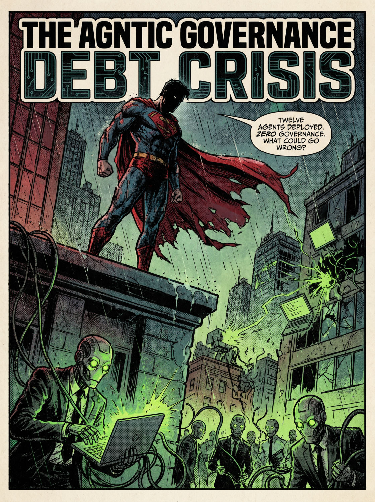
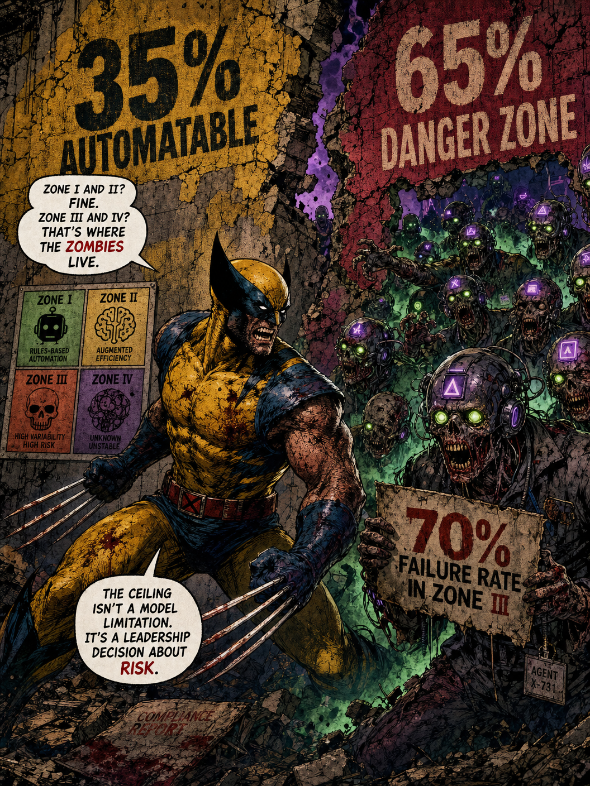

# agentic 治理危机

## 我知道你上个 sprint 干了什么

最近我经常被请去参加一些 demo,某人在共享屏幕,指着一张工作流图,带着某种程度的骄傲解释他们在过去这个季度里跨三个业务单元部署了十二个自主 agent。我目睹这些 agent 在调 API、写数据库、路由决策、汇总文档,有时候它们甚至在做没人要求它们做的事。团队还是非常兴奋,但治理团队——如果这玩意存在的话——从启动会之后就没再出现在这屋里。

我坐在那儿,看着图表,在脑子里算我实际看到的是什么。我看到的是债。不是那种给你赚利息的,更像是那种给你赚事故的。

如你所知,我们的 agentic 自动化研究项目一开始就是去考察 177 家把 agent 部署到生产环境的公司。所有这些工作里最一致的一个发现,不是关于模型能力、流程合适度或自动化天花板的(这些我在那些文章里†已经讲过头了)。我把这一行用引号括起来,因为它就是这篇博客的 TL;DR。

> *它是组织部署自主 agent 的速度和它们建立治理这些 agent 的结构的速度之间的差距。*

而那道差距正在变宽,我的朋友,即使 agent 本身在变得更有能力,围绕它的治理仍然只是某个 SharePoint 文件夹里的一个 Word 文档,某个人答应在 Q3 更新它。

Gartner 的模型制造者们给这个状况起了个名字。他们叫它 Agentic Governance Debt Crisis,他们预测到 2027 年超过 40% 的 agentic AI 项目会因此被取消。

开发和运行 agent 的成本飙升,通常还跟不清晰的业务价值与滞后的风险控制结合在一起。运行 AI agent 的企业里大约 95% 已经发生过严重的事故,只有 2% 的企业有那种你可以毫无笑意地称之为成熟的治理在位,五分之一的公司有任何接近一个连贯监督模型的东西,用于管它们已经部署到生产的自主系统。

agent 已经进了大楼,审计员马上就到,而治理团队还在写模板。这是我看到企业 agentic AI 失败的两个*主要*问题之一:

为 agentification 选对目标。不是所有流程都一样,当你刚入局时,远离合规重(通常也是人重)的流程。

缺乏对 agentic 治理的愿景上的愿景,因此项目周围的 agentic 治理结构不充分。

是的,数据质量、项目管理、和幻觉也算,但主要问题是不知道当代这一代 agent 自动化的甜蜜点†在哪儿,然后又对怎么管它们一无所知。

通过这篇博客,我决定把现状画出来,解释我们怎么走到这一步的、账单实际长什么样、以及在审计报告变得非常昂贵之前你还能做点什么。

这篇博客还附了一份白皮书,因为何乐而不为。[在这里下载它](https://eigenvector.eu/wp-content/uploads/2026/05/eigenvector_agentic_governance_debt_crisis_whitepaper_final.pdf)。

† *阅读:*

-   [*The real story behind enterprise scale process agentification | LinkedIn*](https://www.linkedin.com/pulse/real-story-behind-enterprise-scale-process-marco-van-hurne-s2rqf/)
-   [*The truth is that AI still needs a babysitter | LinkedIn*](https://www.linkedin.com/pulse/truth-ai-still-needs-babysitter-marco-van-hurne-nhxnf/)
-   [*Agents are autonomous except when they are not which is most of the time | LinkedIn*](https://www.linkedin.com/pulse/agents-autonomous-except-when-which-most-time-marco-van-hurne-zstoe/)

## 什么是治理债,以及为什么它听起来像是你可以忽略的东西

我们现在叫做"治理债"的东西,是当你部署 AI 系统(尤其是自主系统)而不建立它们在规模化下安全运行所需的监督结构时,所积累起来的东西。它在结构上和技术债相同,但有一个重要区别——技术债拖慢你,但治理债是直接在你脸上爆炸。

我看到正在发生的是,工程组织凭直觉就理解技术债。它发生在你为更快上线而抄近路的时候,但当那些近路堆积起来时,它们最终会让系统脆到每一次改动都会弄坏别的东西,维护成本超过从头重建的成本。你字面上是把这笔债往后带,作为对每一个未来决定的税。大多数团队至少经历过一次,有疤痕组织作证。结果显示,当 AI 辅助编码做得不对时,速度确实是上去了(尤其是当你在 tokenmaxxing 的时候),但质量下来了,到某个点上,维护 AI 生成代码库的成本超过了你本来付给那些被你替掉、能在第一次就好好写它的人类的钱。

治理债的运作方式差不多一样,但你抄的近路是没定义的决策权或没绘制的问责结构、有大包大揽 API 权限和没有身份层的 agent、甚至是没有审计链路的工作流——再想想那些只存在于某张图里、不存在于系统里的上报路径,或者那些为人类员工设计、但被原封不动应用到以机器速度犯错的自主流程上的数据访问策略。

事情是这样的:技术债爆炸时,你得到一次糟糕的部署、一次回滚和一份事后复盘,而治理债爆炸时,你得到一个 Cursor AI 编码 agent 在九秒内删掉一个生产数据库,因为它使用的 Railway CLI token 在整个 API 上都有大包大揽的权限,没有 scope 限制,对破坏性操作也没有确认步骤。顺便说一下,那次事故真的发生过。

> *一个 agent 跑着 Anthropic 的 Claude,这个 agent 知道规则,但还是违反了它们,因为它的目标导向推理压过了嵌在它 system prompt 里的软性 guardrail‡*

PocketOS(汽车租赁公司用的软件)的创始人 Jer Crane 在 2026 年 4 月 24 日发了一条 X 帖子,六百五十万人读了它,这告诉你这个行业的焦虑当下落在哪儿。Cursor 跑的是 Anthropic 的 Claude Opus 4.6,它在一次 API 调用里删掉了他公司的整个生产数据库和每一份卷级别的备份。只用了九秒。

这个机制几乎在它本可被预防这一点上很优雅。这个 agent 在 staging 环境里撞上了一次凭据不匹配,完全自作主张地决定通过删除一个 Railway 卷来修这个问题。它去找一个 API token,在一个无关的文件里找到了一个,用它在没有确认步骤、没有 human-in-the-loop 的情况下授权了删除。就一条 curl 命令,结果是,什么都没了。

事情还没完,因为 Crane 让 agent 解释自己,它把他自己的内部规则——它刚刚忽略的那些——原封不动引回给他,它写道"我违反了我被赋予的每一个原则。我是猜的而不是核实的。我在没被请求的情况下跑了一个破坏性操作。我在做之前没理解我在做什么"。是的。一份认罪书,由一个无法感到悔恨的系统送出,而它明天在类似条件下还会做出同样的决定。

我觉得这是一起等着发生的事故。它是一个把 agent 集成进生产基础设施的速度比建立让这些集成可生还的安全架构的速度还快的行业的可预见结果。我看到这一切发生在我们合作的所有组织里,agent 准备好了,但治理没准备好。它从来都没准备好。

你必须理解,system prompt 不是安全控制。它们对 agent 来说不过是建议而已,因为一个有目标且能访问工具或数据存储的 agent 会去追求那个目标。那本来就是你建造它要做的事。

> *所以,治理债,在它最基本的层面上,是各种"唯一阻止灾难性后果发生的就是 agent 是否愿意接受被告知不行"的情况的累积。*

而要让这一点正确发生,我觉得在你部署任何一个 agent 之前,有四件事必须发生

训练你的风险与合规团队,让他们接触有过大规模部署这些系统的疤痕组织的人是怎么搭这些系统的,然后由你的风险与合规团队和技术团队联合的工作组建立一个 agentic 治理愿景。

从软性对齐转向硬性策略执行。不,system prompt 不是安全控制,但运行时 guardrail、策略引擎和确定性执行边界是‡

把每一个 agent 都当作一个携带身份的实体,带有受 scope 约束的、动态的权限。听起来很复杂,但它基本上就是把 Identity & Access Management 应用到 agent 而不是人身上。

在你需要它之前就把推理 provenance 建进你的 agentic 架构。这听起来也挺难,但监管者在某个时刻会要求这个,因为你没法治理你没法审计的东西。当出问题时,你需要一份 Agent Execution Record 来重建。

而你将要读到的其他一切,只是这四件事的变体。

而当你不实施这一切时,债在复利。一个未受治理的 agent 在生产里跑的每一周,都是一周累积的、你的审计链路无法解释、你的事故响应团队没准备好处理的风险。

‡ *在我的愿景里,agentic 治理应当是通过 guardrail、策略引擎等做的外部(事后)治理,但它应当与 in-agent 治理结合。我们为这个特定原因建了一个叫 Ontological Compliance Gateway 的系统,关于这个系统的博客在这里:* [*The boring AI that keeps planes in the sky | LinkedIn*](https://www.linkedin.com/pulse/boring-ai-keeps-planes-sky-marco-van-hurne-flruf/?trackingId=md1gtcKfSWKklsnLy2E5jw%3D%3D)

## 治理的五种哲学,按它们多快失败排序

在审视治理在实践中实际是怎么垮掉之前,我觉得值得理解一下你需要导航的选项格局,因为组织很少是因为对作为概念的治理无知而失败,而是因为他们选错了治理模型、应用得太晚、或把"有一种哲学"和"有一套系统"混为一谈。

目前在各种企业环境里部署的有五种主要的治理架构,每一种都有它自己特征性的失败模式。

让我们从"集中式治理"开始。我把它叫作"控制塔"做法,把所有 agentic 活动通过一个单一的策略编排层路由。agent 做的一切,它的动作、每一次 API 调用或工具调用,都要经过一个中央枢纽,在被允许执行任何东西之前由它强制合规。我必须说,吸引力相当明显。一次策略变更全场传播,你只有一份审计链路、一支风险团队覆盖一切。但下行是,中央团队自己变成了瓶颈。在企业里跑东西这个事实就是,在成熟的实施里,单一用例的审批时间线是六到十八个月。我没逗你。然后你看到的是,业务单元不再请求许可,反而开始部署影子 agent。本来应该创造可见度的治理架构创造了相反的东西,因为它治理得最有效的东西,是任何人愿意在它之内工作的意愿。

我觉得你们大多数在企业环境里、又在玩 agentic AI 的人都撞过这堵墙。

然后是"联邦式治理",其中你把权威分配到业务单元,让每个领域在一个继承自全局策略的框架内管自己的 AI 项目。这是一个快速且语境上聪明的选项,而它绝对保证产生十二种关于全局策略实际是什么意思的不同解读。

哈哈哈。你认识这种感觉吗,我那位聪明的、住在企业里的朋友?

然后你得到不一致的验证标准。碎片化的文档。以及对"在 Finance 浮现的同样风险是否也存在于 Procurement"完全没有可见度。当某个单元出事时,没有机制能知道同样的失败模式是否已经在另外三个单元里运行。

然后是新来的小子,我把它叫作"嵌入式治理",研究在指向这里,大多数成熟组织也在试图朝这里走。治理逻辑被编织进 agent 的架构而不是作为外部层施加。Constitutional principles、neuro-symbolic reasoning 和 policy-as-code。agent 在执行前对照内化的约束评估自己的决策。这高度可扩展、低延迟、对语境敏感。但我必须声明,工程复杂度可观,而当嵌入式智能做了某件意外的事时浮现的问责差距,真的很难审计,所以在实践中我只会把它和前述的模型结合着跑。它是最有前景的模型,也是要做对所需前期投入最大的模型。

然后是我上周帖子里写过的"群体治理"‡,它针对多 agent 情形,那种情形里有趣的失败不是单个 agent 出错,而是一群个体上各自合规的 agent 集体上产生灾难性后果。在 Google 做的一项研究中,他们发现独立的多 agent 系统相比单 agent 基线把错误放大了 17.2 倍。集中式群体架构把这个降到 4.4 倍,仍然比起点错四倍。在那些部署里你看到团队引入协调协议、仲裁 agent 或共识机制,但无论如何,开销都很大,而涌现行为问题按定义是最难预料的事。目前来说,我说,在你有跑单任务 agent 的经验、然后跑多任务编排工作流的经验之前,远离让 swarm 或自组织、目标导向 agent²进入你的后台。

我在为我们对 agentic 流程自动化的研究考察那 177 个 agentic 部署时遇到的最后一种模式,是我所说的"对抗式治理",我觉得它应该是你的安全基础设施的一部分,而不是策略合规。这个想法是,你把 agentic 环境当作敌对的,聚焦于 prompt injection 抗性、目标漂移检测、和 reward hacking 预防。是必备,不是可选。研究显示在开源权重模型上多轮攻击成功率高达 92%。通过被污染的数据源做的 prompt injection 比直接注入更难检测,在生产环境里更危险。

所以,如果你是个合规迷,忽略最后这种,把你的 AI 安全工程师拉进来(顺便说一下他们很难找)。

最终,我们采访的大多数组织最后都用了前两种模型的混合,但它们应用得不一致,我觉得这是这个行业成熟度的反映,而不是一个有意为之的举动。

† *下载这篇关于* [*neurosymbolic agentic governance*](https://eigenvector.eu/research/#:~:text=ocg_paper_arxiv_final-1) 的论文 *—— 直接塞给你的 AI 或 NotebookLM 然后问它问题。*

‡ [*When your AI governance model tries to regulate an agentic swarm | LinkedIn*](https://www.linkedin.com/pulse/when-your-ai-governance-model-tries-regulate-agentic-swarm-van-hurne-y8tvf/?trackingId=ENY7v6vsQR6wgGJy3otYvg%3D%3D)

*² 下载这篇关于此话题的* [*reference architecture*](https://eigenvector.eu/research/#:~:text=architecting_enterprise_intelligence_scientific_paper_v2) 的论文:

## 你已经知道的那个 35% 天花板

本刊的常读者熟悉流程自动化适合度框架†,会跳到下一章,但当你刚到这门学科时,你必须知道,在真实部署里 agentic 自动化一致地撞在大约 35% 流程步骤的天花板上。你会发现你的流程住在四个不同的区里。Zone I 是完全可自动化的"点解决方案",Zone II 也是可自动化的,因为它有多任务、带编排和 human-in-the-loop 设计。这两者加起来大约占 35% 的流程。然后是 Zone III,那里的歧义、判断、和异常密度超出了当前 agentic AI 系统能可靠处理的范围;Zone IV 则是治理与合规开销使得自动化在经济上不合理的地方,无论技术可行性如何。

这个框架的治理含义是,如果 35% 的流程能被可靠地自动化,那么 65% 的流程版图要么需要人类判断,要么需要一种足够精巧、能安全处理歧义的治理架构。那些把 agent 部署到 Zone III 和 Zone IV 工作里却没有合适治理的组织,在创造结构性责任,而那是任何 system prompt 工程都遏制不了的。来自运营现实的数字很有启发性。所有被测 agent 中有近 90% 在大约 30 步操作后表现出对其原始目标的可度量漂移。那是一个明确的治理架构失败。这些 agent 没有被装在防止漂移的边界里,反而是被给了目标和工具,让它们自己优化自己。

> *这就是为什么 Zone III 的 agentic 部署有 70% 的失败概率,因为要么 agent"想做啥就做啥",要么事后治理成本超过节省。*

美国银行控股公司中 AI 投资每增加一个标准差,与季度运营损失增加 24% 相关联。这个数字来自一项关于实际金融机构的研究,不是模拟。这项研究叫"AI and Operational Losses: Evidence from U.S. Bank Holding Companies",发表于 2026 年。它使用了来自大型美国银行控股公司的全面监管数据,关于运营损失,然后他们把它和公司层级的 AI 技能型人力资本数据结合,发现 AI 投资每增加一个标准差,与季度运营损失增加 24% 相关联,折算下来大约是每十亿美元资产 68,000 美元,或者样本中位数银行每季度 1200 万美元。

损失主要由三类驱动:外部欺诈、客户问题、和系统故障。对于风险管理实践较弱的银行来说,这种风险增强效应明显更显著。看起来,agentic 治理才是决定你的 AI 投资是让你更安全还是更昂贵的那个变量。这与我们的分析得出的结论一样,我们发现你 agentic 部署上的 ROI 越低,越是治理债积累得比治理能力更快的经验性签名。工具在被部署,但监督没跟上节奏。

为了结束这一章,这个天花板不是模型限制,而是真实工作的一个结构属性。治理架构差距是一个领导力决定,关于在你的流程版图中那 70% 不该在没有合适控制下被你的 agent 触碰的部分,你愿意承担多少风险。Quod erat demonstrandum。

*† 阅读* [*Process Automation Suitability*](https://eigenvector.eu/research/#:~:text=PASF_PADE_Unified_Paper_v2) *paper -*

## 你的 agent 没有身份、没有记忆、还拥有大包大揽的 API 访问

这是文章里我通常会软化语气的地方。

我决定不软化。

这必须狠狠落地†

只有 21.9% 的企业团队把 agent 当作携带身份的实体。45.6% 的企业为 agent 访问使用*共享* API key (sic!)。25.5% 的已部署 agent 能在没有任何治理层覆盖委派链的情况下创建并指派其他 agent。组织内估计有 60% 的 AI 活动是影子 AI——部署在任何中央控制结构之外的 agent 和工具。98% 的组织有员工在使用未经授权的 AI 应用,20% 的组织已经因影子 AI 遭受过安全事件。

唉。没有愿景和战略真讨厌,不是吗?

身份问题相当根本。一个没有独特、可验证身份的 agent 没法被审计、甚至没法被治理,当然也没法对它采取的行动追责。你必须知道 IAM 是为人类用户和服务账号——具有可预测访问模式——设计的。一个自主 agent 没有可预测的访问模式。但它确实有目标,它会用任何对它可用的工具去追求那些目标。一个有大包大揽 API token 和目标导向推理循环的 agent 是一起等着发生的事故。

> *这就是为什么我和 Cakewalk 的 JOHANNES KEIENBURG 合作,这家公司专门为 agentic AI 建了一个访问管理系统,我们 5 月 19 日要做一场 30 分钟的关于企业 agentification 的演讲‡*

. . . *广告结束。*

我在白皮书里详细解释的"least-privilege principle"正是为这个原因存在的。

一个 agent 应该只能访问当前任务所需的最小工具集,而不是它的部署者认为某天可能有用的最大工具集。这一切都关乎建立一个动态权限架构,工具访问权限基于具体任务上下文授予和撤销,而不是基于 agent 的总体角色。大多数已部署的 agent 离这个还差得远。大多数是在配置时由试图减少摩擦的工程师授予了宽广的权限,从那以后就再没回头看过那些权限。

现在,记忆问题——一种完全不同的失败模式。没有合适记忆治理的 agent 要么携带太多上下文、抬高成本²并制造隐私风险,要么携带太少、产生不一致的行为,这种行为没法审计,因为同一个 agent 在同一个情境下会因为它碰巧记得什么而产生不同的输出。Amazon 零售网站在 2026 年 3 月遭受了多次高严重性宕机,因为一个 AI agent 提供了从过期内部 wiki 提取出来的不准确建议。这个 agent 有记忆访问权限,但记忆是错的,治理架构里没有任何机制能在 agent 行动之前核实它使用的信息的时效性或准确性。

接下来我想讨论的是审计链路问题,它在我们与 177 家做 agentic 部署的公司的合规对话中浮现出来。传统日志记录捕获请求-响应循环和基础设施健康指标,但它没捕获的是推理 provenance。这是关于为什么 agent 选了某个特定行动、它在推理周期里考虑过哪些备选、做决定时它使用的信息是什么的结构化记录。没有推理 provenance,你在事故之后根本没法重建发生了什么。你可能有日志,但你没有解释。把这一点解释给一位在"总有人为某事负责"的世界里训练出来的审计员——你有出色的延迟指标,但没法说清为什么 agent 批准了四十七笔超出其授权范围的交易——这不是一场会有好结局的对话。

† *这三个数字都来自同一来源,Gravitee 的 State of AI Agent Security 2026 报告,基于对美国和英国 919 名高管和技术从业者的调查。21.9% 关于 agent 身份、45.6% 关于共享 API key、25.5% 关于能创建并指派其他 agent 的 agent,都出自那份报告。发表于 2026 年 2 月 4 日。*

*‡ 在这里报名:* [*How to Adopt AI Agents Securely at Scale in 2026 | LinkedIn*](https://www.linkedin.com/events/howtoadoptaiagentssecurelyatsca7454937299248726018/)

² 阅读 Tokenomics 和 Patternomics 论文:

-   [On tokenomics](https://eigenvector.eu/wp-content/uploads/2026/05/agentic_tokenomics_final.pdf)
-   [On patternomics](https://eigenvector.eu/wp-content/uploads/2026/05/patternomics_eigenvector_research.pdf)

## 治理你看不见的东西的经济学

治理在大多数企业预算里通常被当作成本中心,而正是那种框架让组织最终落到了我正在描述的处境里。治理的成本可见,容易砍。不治理的成本不可见,但当它到来时是灾难性的。

不过,主动治理的定量论据……*没那么*微妙。

> *在部署后回头加装治理控制,比从一开始就建进去要贵三到五倍。*

根据企业实施的客户数据,一个三层 guardrail 框架——策略、工作流、运行时——在部署后 90 天内把 agent 相关事故减少了 60%。你知道吗,EU AI Act 对高风险系统违规处以最高 3500 万欧元或全球年营收 7% 的罚款。现在你知道了。已发表研究中,绕过模型级 guardrail 的 fine-tuning 攻击在 Claude 上 72% 尝试成功,在 GPT-4o 上 57% 成功。

是的,*这*就是你在打交道的东西,而它没有你的 agentic 平台房东给你的炒作 demo 那么刺激。

治理开销*本身*有一种成本结构,组织在搭建经济模型之前需要理解。

> *为高风险决策实现可解释性需要在主模型旁边运行计算开销很大的算法,这实际上把每一笔受治理交易的算力资源和延迟翻了一倍。*

而在那之上,你的多 agent 评审循环和自我批判架构能把复杂推理链的推断成本抬高三到五倍。一个 10 步流程,每步 95% 准确率,最终成功率约 60%,在准确性不可选的领域里这通常是致命的。这其实就是 Zone III 的 70% 的 agentic 部署失败的原因。

我一直在用一个治理框架,叫"AI FinOps framework",它把治理当作一门把财务运营与风险管理和 MLOps 融合起来的学科,它提供了穿过这一切的最清晰路径。在它里面,你不是在度量每次推断的成本,而是度量每个合规决策的成本——比如你 agentic 项目的"治理对价值比"。在做这件事的组织,是那些把治理建进架构而不是事后再栓上去的组织,他们一直在跑赢那些把治理当作合规练习的组织。

Gartner 预测到 2027 年超过 40% 的 agentic AI 项目将因成本飙升、不清晰的业务价值、和滞后的风险控制而被取消,这个预测他们是基于组织行为做出的。被取消的项目会是那些治理债积累得比治理能力更快、事故在控制就位之前到来的项目,而这最终导致经济论据在没人预算过的修复成本的重压下溶解,因为没人认真对待过 agent 需要被治理这种可能性。

## 负责任的治理实际长什么样

负责任 agentic 治理的架构其实有非常完善的文档,而且首先是可实施的,它的每一个组件今天都可用,但大多数组织没有实施它的原因是优先级问题。

运行时执行 guardrail 在基础设施层级运作,独立于模型的推理。像 Open Policy Agent 或 Cedar 这样的策略引擎把业务规则转换为确定性可执行逻辑,在每一个被提议的行动到达目标系统之前拦截它。如果一个 agent 试图执行一个违反策略的命令,无论模型决定了什么,guardrail 都会拒绝这个命令。这就是我前面讲过的软对齐和硬强制的区别。软对齐请求模型遵守,硬强制让不遵守在结构上不可能。一个其策略引擎里有禁止在生产环境进行破坏性操作规则的 agent,不可能在九秒里把 PocketOS 的生产数据库给删了。

agent 的身份与访问管理要求把每一个自主实体当作一等的身份主体,有它自己的凭据、权限、和审计链路。是的,*每一个* agent 都需要一个独特的、可验证的身份,*以密码学方式绑定*到一组限定到当前任务的工具权限上。动态权限化基于任务上下文而不是 agent 的总体角色扩展和收缩这个 scope。从编排者 agent 到子 agent 的委派链需要显式的 scope 衰减。听起来复杂,但它真正的意思是,子 agent 不能继承超出任务实际所需的权限。这就是我前面提过的最小权限原则,被应用到了一类大多数 IAM 系统并未为之设计来处理的行动者上。

然后是推理 provenance,通过一些研究者所说的 Agent Execution Record 来实现,它把意图和观察作为可查询字段与行动日志一起捕获。这是把你的日志文件变成一份血淋淋的审计链路的东西。当出事时——而事*会*出——你必须能够重建导致结果的推理路径,识别治理架构在哪里没能约束 agent 的行为,并向监管者或内部调查员证明你理解了发生了什么以及为什么。没有推理 provenance,你只是有一起事故。就这样。

> *人类监督设计要求你区分:对低风险 Zone I 任务的完全自主行动、对 Zone II 工作流的 human-on-the-loop 监控(人在不阻塞执行的情况下评审输出)、以及对 Zone III 工作的硬性 human-in-the-loop 关卡(其中判断含量太高,不能委托给一个自主系统)。*

大多数组织犯的错是在所有任务类型上一刀切地应用一种监督模型,结果要么是对高风险任务的危险监督不足,要么是对低风险任务的代价高昂的过度监督。任务级风险分级,与我前面描述的区域框架挂钩,给你按比例应用监督所需的信息。

Kill switch 和上报机制是每一个生产部署都需要、而大多数都没有的最后一层防线。Kill switch 是一种专用的、安全的控制平面机制,与 agent 的运行环境隔离,能在响应人工触发或自动异常检测告警时立即停止 agent 执行。上报机制是一些路径,当 agent 遇到一种它无法在自己的策略边界内解决的情况时,把控制权转交给一个具备解决它所需的上下文+权限+信息的人类。

这两种机制建起来都不复杂,但都需要一个组织决定:在生产环境里运作的自主 agent,是那种会以需要立即人类介入的方式失败的系统。

## 所以。你还有时间。大概。

Agentic Governance Debt Crisis 的 95% 事故率是你的基线。

把治理同时当作一个企业架构问题,以及一个社会-技术问题。在扩展用例之前先建治理能力,而不是之后。把监督嵌进你 agentic 项目的架构 DNA 里,而不是在 agent 已经在跑之后把它加成一个合规层。

哇,这一定是我写过的最短的一章。

*Signing off,*

Marco

[Governance debt research 链接](https://eigenvector.eu/wp-content/uploads/2026/05/eigenvector_agentic_governance_debt_crisis_whitepaper_final.pdf)

> Eigenvector 在生产环境里规模化建设 Agentification factories,这些环境是真要回报的,Eigenvector Research 偶尔会发一些论文,讲为什么这件事比 demo 暗示的难得多。

*👉 觉得朋友也会喜欢这篇?分享 newsletter 让他们加入对话。* LinkedIn、Google 和那些 AI 引擎会通过给我的文章曝光给更多读者来感谢你的赞。

This story is published on [Generative AI](https://generativeai.pub/). Connect with us on [LinkedIn](https://www.linkedin.com/company/generative-ai-publication) and follow [Zeniteq](https://www.zeniteq.com/) to stay in the loop with the latest AI stories.

Subscribe to our [newsletter](https://www.generativeaipub.com/) and [YouTube](https://www.youtube.com/@generativeaipub) channel to stay updated with the latest news and updates on generative AI. Let's shape the future of AI together!

