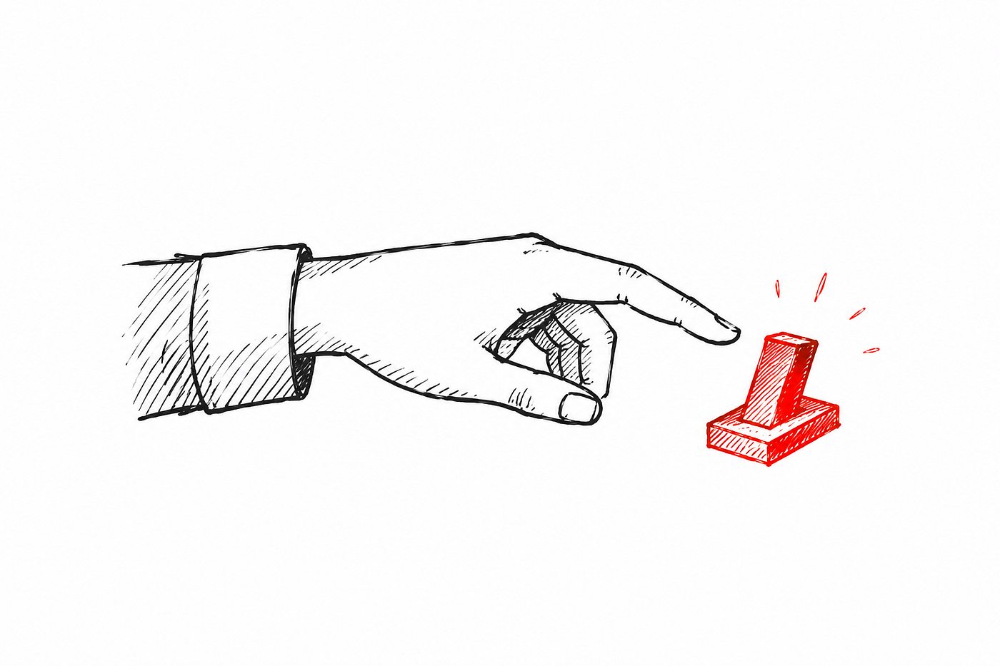
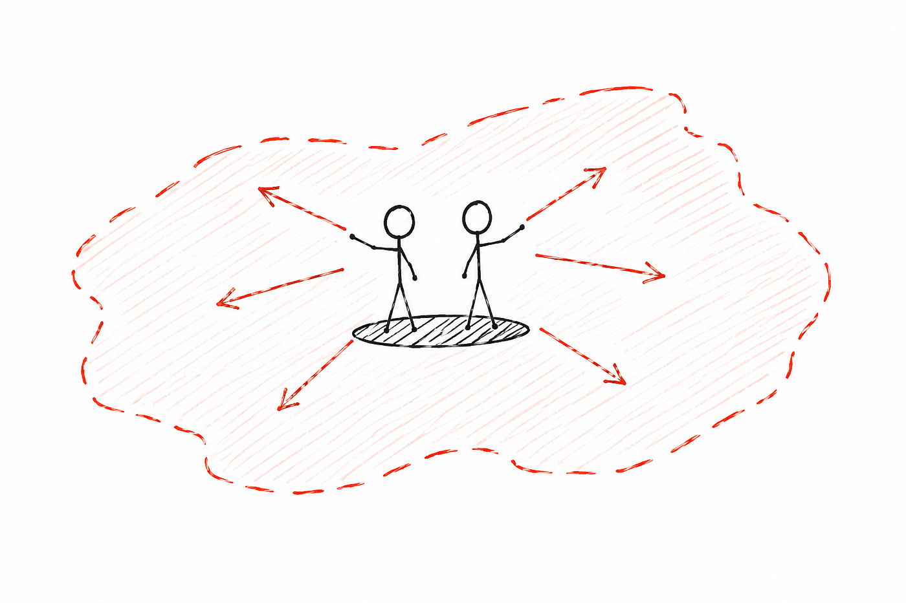

# 两人团队就是新的十人团队

我曾经管过一个 120 人的工程团队。我现在同时在两家公司管工程。一家有 19 名工程师,组织成两到三人一组的产品团队和平台团队。另一家,整个工程职能就是两个人。

两种情况下,工作单元都是小团队。不是作为一个会成长为更大东西的起点,而是作为工作展开时的形态。两到三人的团队不是十人团队的缩小版,十人团队也不是百人团队的缩小版。它们是结构上不同的东西。把它们当作同一条线上的点、把小的当作通往大的路上的过渡,这是 2026 年人们谈论团队规模时我最常见到的错误。

我想就小团队本身为它辩护。不是因为它将就、临时、或者需要为什么道歉。而是因为它就是工作的正确形态——只要工作合适。

## 小团队真正擅长的是什么

简单的答案是沟通。两个人可以把整个系统装进脑子里。决策是几分钟内做出的而不是开会开出来的。知识转移是协同工作的副产品而不是一个文档化的流程。这些都是真的、都重要,但这并不是让小团队跑起来的关键。

让小团队跑起来的关键是 agency(主体性)。

在大多数有点规模的组织里,自治是领导层挂在嘴上但团队实际并不拥有的东西。要么决策是悄悄在他们头顶上做出的、然后以咨询的姿态下发的;要么团队在纸面上获得了自治权但并没有真的拿起来,因为文化信号告诉他们最终还是会有人来签字盖章。无论哪种情况,团队其实并没有在做决定。

两人团队没法这样运转。决策无处可去。要么你拍板,要么什么都不会发生。一旦这个状况持续得够久,你就不再向上张望要许可了。团队变成了答案诞生的地方,而不是答案被执行的地方。

在两人团队里这一点我们没妥协。两位工程师就是决定系统怎么搭、什么先做、什么往后推、什么算够用的人。他们不是在等我,也不是在等 CEO。这是大多数配置都搞错的部分,而这正是让团队跑起来的部分。

相比之下,在那个 120 人的组织里,agency 是我们一直在搞但从未彻底解决的东西。Squad 有 owner,owner 有职责范围,职责有边界,边界有上报路径。这一切都不算错。在那个规模下你需要这些。但代价是 agency 本身变成了一种被管理的资源而不是默认的行为,而且相当一部分工程能量被花在协商边界上而不是在边界内做事上。

*Agency,在没人可以再上报的时候*

## 小团队做不到的事

两人团队每周都要在那些没法立刻产生价值的事情上做战术决定。最清楚的例子是数据主体访问请求(DSAR)。我们倒是想把整个流程端到端自动化。但量级不值得。所以现在我们手工处理,而且会一直手工处理下去,直到量级告诉我们不该再这样。一个更大的团队早就把自动化建出来了,大概是作为某个没人具体提出但因为有人头所以说得通的更广泛合规工作流的一部分。

这就是这个交易。有些类别的工作就是排在队列里,而这个队列是诚实的。没人在假装它会在下个季度被捡起来。

跑小团队这段时间我变得更坚定的一点是:当被浪费的东西是工程师时间时,你必须激进且尽早地把它自动化掉。在两人团队里工程师时间是稀缺资源。任何蚕食它而不产生相称价值的东西都得滚蛋,而且要快。这门纪律不在于决定要做什么。它在于决定不做什么。

另一个代价更难靠工程绕过去。两人团队就是两个单点故障。如果一名工程师离职,你就丢了一半的团队和系统某部分的大部分实操知识。传统意义上的接班人计划不存在。没有板凳席,没有影子,没有把交接平滑递给轮岗下一棒的人,因为根本就没有下一棒。

你可以把锋利的边角磨钝一点。把东西写下来。把系统保持得足够小,让一名新工程师能在几周而不是几个月内进入状态。用 AI 工具让代码库对一个空降进来的人变得可读,因为一个能被快速重读重新理解的系统对建造者本人的依赖更小。这些都不能消除风险。它们只能在风险落地时减轻冲击。你是用更高的方差换小团队带来的好处,你必须诚实地接受这个方差。

## AI 真正改变了什么

*AI 改变的是覆盖面,不是吞吐量。*

大多数关于 AI 和小团队的写作都伸手去抓一个吞吐量上的论断。AI 让工程师更快,所以小团队能干大团队的活。我觉得这个框架没什么用。它论断的形状不对,而且低估了正在发生的事情。

对一个两人团队来说,协调成本本来就接近零。靠去掉会议或缩短评审周期来追求吞吐量乘数没什么空间,因为这些成本从来就不是约束。AI 改变的是覆盖面。它把团队延伸到了它原本不得不忽略或外包的地盘。

具体的例子是数据管道。我们没有数据工程师。我们也没在建模仓库。但我们建了并跑着一条进 BigQuery 的自动化管道,在 dbt 里做转换,对业务需要来说够用了。这不是我见过最精致的东西。它存在,它在跑,两位工程师拥有它。两年前这种工作要么是外包出去,要么是延后,要么是在电子表格里马马虎虎地搞。现在它在团队的覆盖面以内。

这就是规律。AI 让小团队守住它过去本会让出的地盘。运维工作、基础设施、内部工具、文档,以及那些历史上要么需要专业人员要么需要更大团队来吸收的长尾事务。这些都不能把两个工程师变成十个。但它确实让两个工程师变成一个能可信地拥有更广覆盖面的团队。

## 为什么这不是一个过渡阶段

人们的自然假设是两人团队是一个更大团队的早期阶段,问题只是什么时候招人。我不是这么想的。这个团队是工作的答案,不是某个未来才是真正答案的团队的占位符。

这个结论不能推广到所有工作或所有业务。有些产品确实需要十个或二十个或一百个工程师,因为问题的覆盖面是不可压缩的、工作不能被串行化下来。我跑过那种团队。它们不是焦点失守。它们就是它们正在做的事的正确形态。

但有一类工作、有一类业务,两人团队就是正确的形态而且会一直是正确的形态。具有连贯内核、清晰用户群、以及一份从持续性中获益胜过从并行中获益的路线图的产品。碎片化成本高于长尾上吞吐量更慢的成本的业务。在这片地盘上我会主动选择小团队而不是容忍小团队。

## 我落到哪儿

我不再在两人团队里等着扩招了。这个团队就是这份工作需要的东西。招人不会让产品更好。它会让产品变得更像每个其他产品,被每个其他团队建造,连贯性被稀释到更多的脑袋里。

同时跑这两家公司让我看清了一件我管 120 人时没看清的事。团队规模不是认真程度或野心的度量。它是一个设计选择。两人团队、三人产品团队、百人工程组织是不同的乐器,适合不同的工作。技艺在于知道工作需要哪件乐器,以及在你做了选择之后愿意待在那儿。我现在管的两家公司,乐器都是小团队,而它就是答案,不是序章。
