# 20 Most Important AI Concepts Explained in Just 20 Minute

## Beginner-Friendly Guide

**Glad you’re here again.**

> **Nonmembers** [**click here**](https://medium.com/@Deep-concept/20-most-important-ai-concepts-explained-in-just-20-minute-b7dd3ad2b506?sk=29899d228dc38bc44b2b7b4799e88b57)

Welcome back to another story.

If you’ve ever tried to learn AI, you probably felt this at least once…  
*“What the hell is actually going on?”*

So many terms.  
So many tools.  
And everyone on the internet talking like it’s obvious.

Learning AI can feel overwhelming.

Especially if you’re not working directly in it it almost feels like learning an entirely new language.

But here’s what I realized…

AI isn’t actually that complicated.

Once you understand the fundamentals especially how things like large language models (LLMs) work and how modern AI tools are built everything starts to make sense.

In this story, I’m going to break down **20 most important AI concepts** in the simplest way possible.

No heavy jargon.  
No overcomplication.  
Just clear explanations and intuitive examples the way I wish someone had explained it to me.

## let’s start now ✌️

## Basics

### 1\. Neural Networks

At its core, a neural network is just a system of connected layers made up of small units called *neurons*.

Think of it like a pipeline.

Data goes in through the **input layer**, passes through multiple **hidden layers**, and finally comes out as a prediction through the **output layer**.

But what’s actually happening inside?

A simple way to understand this is to imagine **step-by-step refinement**.

The same input is processed again and again  
and with each layer, the model understands it a little better.

For example, in an image model:

-   The first layers might detect simple things like **edges or textures**
-   The middle layers start recognizing **shapes or patterns**
-   And deeper layers can identify **actual objects**

It’s like going from *pixels → shapes → meaning*.

Now here’s the important part…

Every connection between these neurons has something called a **weight**.

You can think of weights as tiny “importance scores” that decide  
how much one neuron should influence another.

And training a neural network?

It’s basically the process of **adjusting these weights** again and again  
until the model starts giving accurate results.

And this is where things get crazy.

Modern AI models especially large language models  
don’t just have a few weights.

They have **billions of them**.

All working together to turn raw input into something that actually makes sense.

### 2\. Transfer Learning

Training a neural network from scratch sounds cool…  
until you realize how expensive it actually is.

It takes massive amounts of **data**, serious **compute power**,  
and a lot of time.

That’s where **transfer learning** comes in and honestly, it changes everything.

Instead of starting from zero,  
you take a model that’s already been trained on a broad task  
and **adapt it for something more specific**.

So you’re not building from scratch…  
you’re building on top of something that already works.

The easiest way to understand this is **skill reuse**.

Imagine you already know how to ride a bicycle.

Now learning a motorcycle becomes much easier, right?

Because you’re not starting from zero  
you’re just adapting what you already know.

Transfer learning works the same way.

A pretrained model has already learned **general patterns in data**  
so when you fine-tune it for your use case,  
it learns much faster with far less effort.

And here’s the important part…

This is how **most modern AI actually works today**.

Big companies train massive **foundation models** once  
and then developers like us **adapt them for specific tasks**.

That’s why you can build powerful AI applications  
without needing billions of data points or insane compute.

## Now Transformer Stack

### 3\. Tokenization

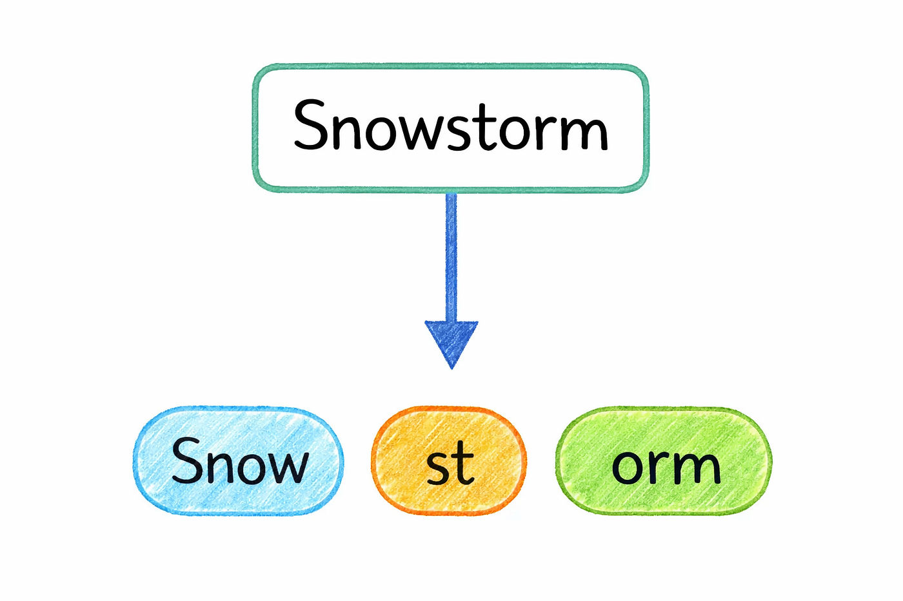

Before a model can understand any text, it has to break it down into smaller pieces. This process is called **tokenization**.

Instead of reading sentences the way we do, the model works with tiny units called *tokens*. These tokens act like the model’s internal “alphabet” for language.

But a token isn’t always a full word.

Sometimes it’s a complete word, but other times it’s just a part of one. For example, a word like “playing” might be split into smaller pieces like “play” and “ing”. On the other hand, a short and common word like “dog” will usually stay as it is.

### see this

**you can try this here**

### Now you might be wondering…Why not just use full words?

*Photo by TERRA on Unsplash*

This might feel a bit strange at first, but there’s a good reason for it.

Language is incredibly messy and constantly evolving. New words appear all the time, people make spelling mistakes, mix languages, or create their own variations. If a model tried to store every possible word, the vocabulary would become impossibly large.

Tokenization solves this problem by keeping a fixed set of building blocks. Instead of memorizing every word, the model learns common patterns and reusable fragments. So even if it encounters a word it has never seen before, it can still understand it by breaking it into familiar pieces.

That’s why AI doesn’t really read text the way humans do.

It reads tokens and from those tokens, it builds meaning step by step.

### 4\. Embeddings

Once text is broken into tokens, the next step is turning those tokens into something a model can actually work with.

That’s where **embeddings** come in.

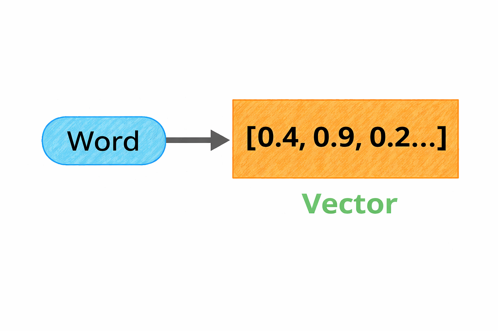

Each token gets converted into a vector basically a list of numbers that represents its meaning. Instead of dealing with words directly, the model works with these numerical representations.

A helpful way to think about this is as a kind of **map**.

Every word gets a position in a high-dimensional space. Words that are similar end up close to each other, while very different words are placed far apart. For example, “doctor” and “nurse” would be near each other, while “doctor” and “mountain” would be much farther away.

Even though this space has hundreds or thousands of dimensions, it still captures meaningful relationships. The difference between certain words follows consistent patterns. For instance, the relationship between “actor” and “actress” is similar to the relationship between “prince” and “princess”.

What’s interesting is that the model doesn’t understand language the way we do. It doesn’t think in definitions or rules.

Instead, it understands meaning through **distance and direction** by organizing words in a space where relationships become geometry.

### 5\. Attention

Here’s where things start to get really interesting.

The meaning of a word isn’t fixed it depends on context.

Take a simple word like “apple”.  
In one sentence, it could mean a fruit.  
In another, it could refer to a company.

So how does a model figure out the right meaning?

Embeddings alone aren’t enough, because they start with a fixed representation for each token. They don’t fully capture how meaning changes depending on the surrounding words.

That’s where **attention** comes in.

Attention allows each word to look at every other word in the sentence and decide what actually matters. Instead of treating all words equally, the model learns to focus on the most relevant ones.

So if the sentence is *“She bought shares in Apple”*, the model will pay more attention to words like “shares” and “bought”, helping it understand that “Apple” is a company, not a fruit.

What makes this powerful is that the model isn’t reading word by word anymore.

It’s looking at the entire sentence at once and dynamically deciding where to focus.

And this idea attention is what really unlocked modern AI.

Before this, models processed text step by step, left to right, often missing long-range relationships. Attention changed that by letting the model see the full picture and understand how everything connects.

### 6\. Transformer

All the pieces we’ve talked about so far tokens, embeddings, attention come together in one place.

That place is the **transformer**.

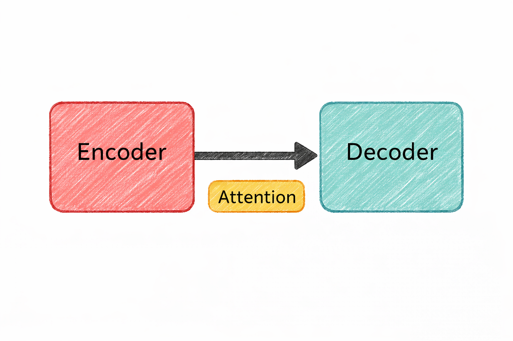

It’s the architecture that powers almost every modern AI system today.

The transformer was introduced in a 2017 paper called *“Attention Is All You Need”*. And the idea was surprisingly simple: instead of processing text one word at a time, make attention the core mechanism and let the model look at everything at once.

That shift changed everything.

A transformer is built by stacking multiple layers of attention along with simple processing blocks. As information moves through these layers, it gets refined step by step.

In the early layers, the model starts by understanding basic structure — things like grammar and sentence patterns.

As you go deeper, it begins to capture relationships between words and ideas. And in the later layers, it can handle more complex reasoning and connections.

It’s not magic it’s just repeated refinement.

One of the biggest advantages of transformers is how they process data.

Older models had to read text sequentially, one word at a time. That made them slow and limited in how much context they could handle.

Transformers don’t have that problem.

They process all tokens **in parallel**, which makes them much faster and allows them to scale to massive sizes using modern hardware like GPUs.

That’s why models like GPT, Claude, Gemini, and Llama all rely on this architecture.

If you zoom out, the whole pipeline looks like this:

Text gets broken into tokens.  
Tokens turn into vectors.  
And transformer layers use attention to understand how everything connects.

That simple flow is what powers most of the AI you’re using today.

## Now we understand Large Language Models

### 7\. LLM (Large Language Model)

Now let’s connect everything to what most people actually interact with today **large language models**, or LLMs.

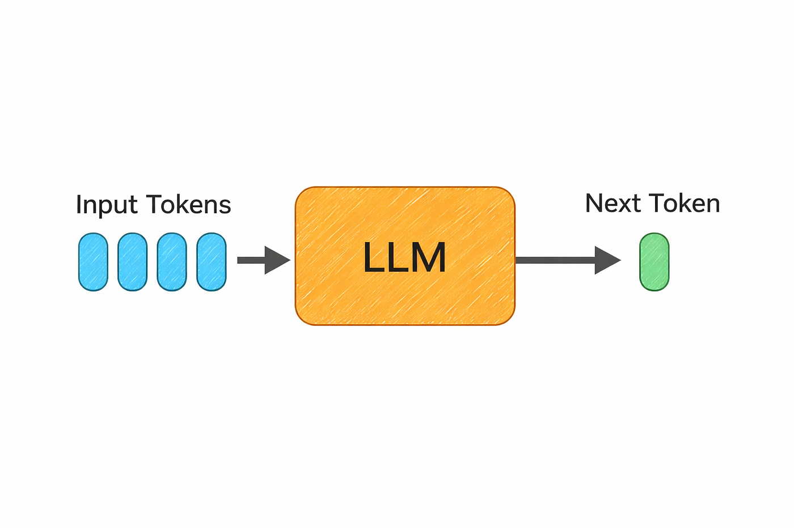

At a high level, an LLM is just a transformer trained on a massive amount of text. We’re talking about data from books, websites, code, and more often hundreds of billions or even trillions of tokens.

And the goal during training?

Surprisingly simple.

The model learns by trying to **predict the next token**.

That’s it.

It sounds almost too basic to be powerful.

But when you repeat this process across trillions of examples, something interesting happens.

The model starts picking up patterns in language. It learns how sentences are structured, how ideas connect, and even how reasoning flows. Over time, this begins to look a lot like understanding even though it’s really just pattern learning at a massive scale.

That’s why these models can do things like:  
writing code, answering questions, translating languages, or explaining complex topics even if they were never explicitly trained for those exact tasks.

The “large” in large language model refers to the number of parameters.

hese are the internal values the model learns during training and modern models have **hundreds of billions of them**.

Training something at that scale isn’t cheap. It takes massive compute and often costs millions of dollars.

But the result is a system that can generalize across a wide range of problems and generate surprisingly useful outputs.

So when you use tools like ChatGPT, Claude, or Gemini…

you’re really interacting with a model that learned language by doing one simple thing  
over and over again predicting what comes next.

### 8\. Context Window

Every AI model has a limit to how much it can “remember” at once.

This limit is called the **context window**.

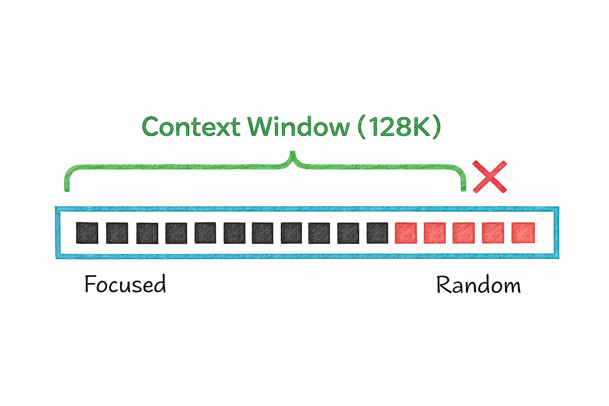

It refers to the maximum number of tokens the model can process in a single interaction including both what you write and what the model generates in response. In simple terms, it’s like the model’s short-term working memory.

In earlier models, this memory was pretty small.

For example, early versions of GPT could handle only a few thousand tokens at a time. That meant long conversations would quickly lose track of earlier details, and large documents had to be trimmed or split.

But things have changed a lot.

Modern models can handle much larger contexts. Some can process entire books, long conversations, or big chunks of code all at once. This makes them far more useful for real-world tasks where context actually matters.

But there’s a catch.

A larger context window comes at a cost.

It requires more memory, more compute, and often leads to slower responses. So while bigger is better in theory, it also makes the system heavier and more expensive to run.

And even with large context windows, there’s another subtle limitation.

Models don’t treat every part of the input equally.

They tend to focus more on the beginning and the end, while information buried in the middle can sometimes get overlooked. This is often referred to as the *“lost in the middle”* problem.

So while context windows are getting bigger and better…

they’re still not perfect.

And understanding this helps explain why sometimes a model “forgets” things you clearly mentioned earlier.

### 9\. Temperature

When a language model generates text, it’s not just picking the next word directly.

Behind the scenes, it calculates probabilities for every possible next token and then decides which one to choose.

This is where **temperature** comes in.

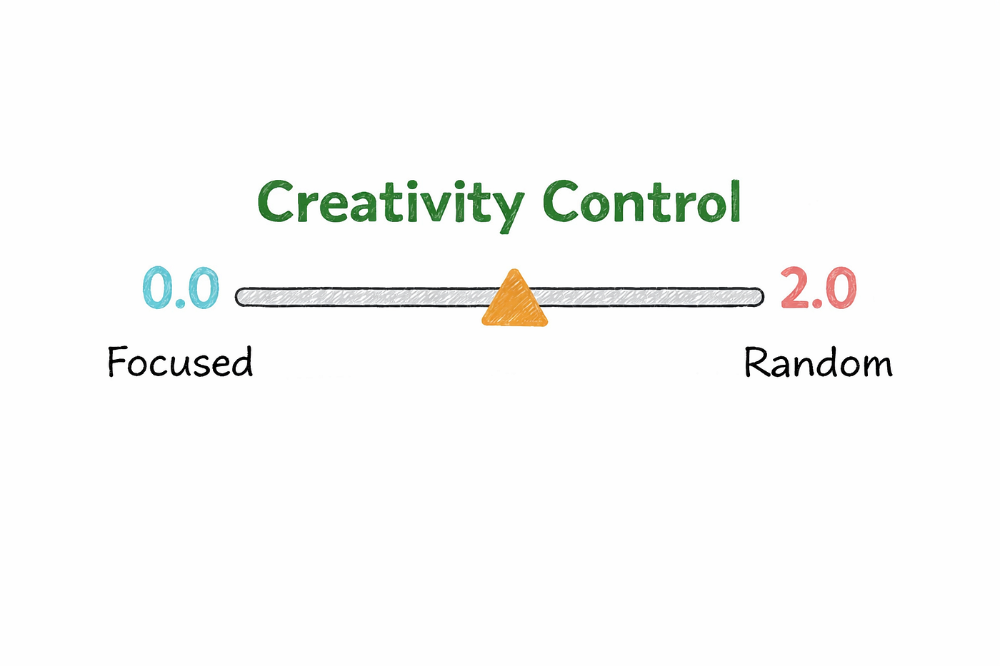

Temperature controls how “strict” or “creative” that choice is.

**At a very low temperature, the model plays it safe.**

It almost always picks the most likely next token, which makes the output more predictable, focused, and consistent. This is why low temperature works well for tasks like writing code, summarizing content, or anything where accuracy matters more than creativity.

**As you increase the temperature, the model becomes more flexible.**

Instead of always choosing the top option, it starts exploring other possibilities based on their probabilities. This adds variety and makes the output feel more natural or creative, which is useful for things like brainstorming ideas or writing different variations of the same content.

Push the temperature even higher, and things start to get unpredictable.

The model may generate more surprising or imaginative responses, but it can also lose coherence quickly, especially in longer outputs. At that point, it’s less about accuracy and more about experimentation.

So in practice, temperature is just a way of controlling the model’s behavior.

Lower values make it more precise and reliable.  
Higher values make it more creative and diverse.

And choosing the right balance depends entirely on what you’re trying to get out of it.

### 10\. Hallucination

This is one of the first things you notice when using AI seriously.

Sometimes, the model gives you an answer that sounds completely confident…  
but turns out to be wrong.

That’s called a **hallucination**.

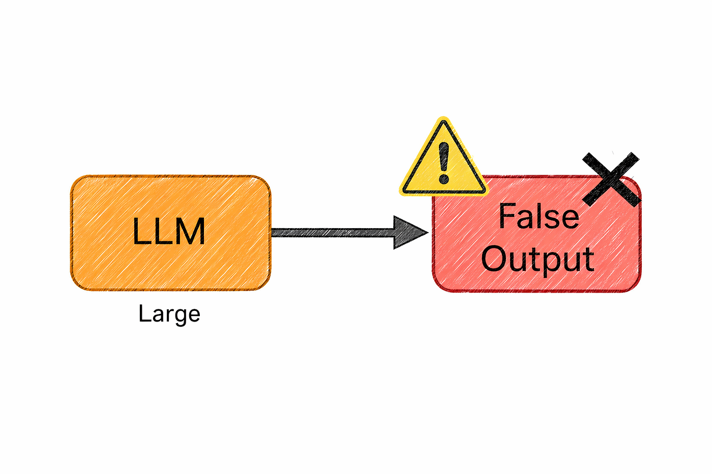

It might confidently mention a research study that doesn’t exist, suggest an API that was never created, or present a made-up fact as if it’s common knowledge. And the tricky part is it *sounds* right.

### **So why does this happen?**

Because at its core, a language model isn’t trying to tell the truth.

It’s trying to generate the most **probable next piece of text**.

It has learned patterns from massive amounts of data, and its job is to continue those patterns in a way that feels natural and coherent. But it doesn’t actually verify whether what it’s saying is correct.

So if a false statement *looks* like something that should come next,  
the model will generate it with full confidence.

And this is what makes hallucination such a big challenge in real-world use.

You can’t just trust the output blindly, especially for things like facts, code, or important decisions.

That’s why many systems today try to reduce this problem by grounding the model in real data for example, by connecting it to trusted documents or asking it to reference sources when possible.

At the end of the day, the model is incredibly good at sounding right.

But it still needs a human (you) to check if it actually *is* right.

## After LLMs now we talk about Training and Optimization

### 11\. Fine-Tuning

Fine-tuning is what happens after a model already knows the basics.

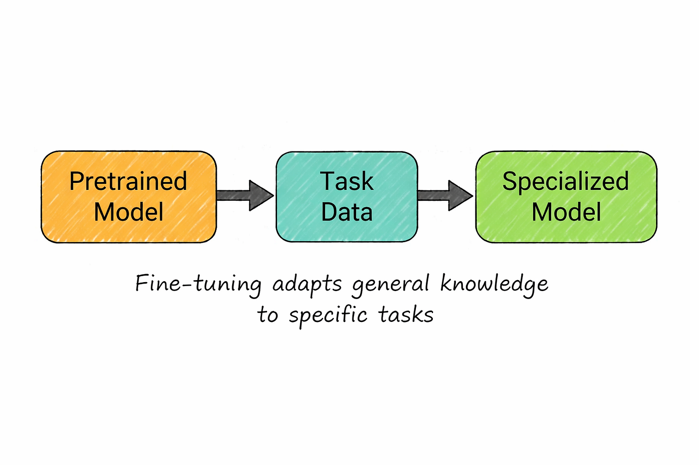

Instead of training from scratch, you take a pretrained model and continue training it on a smaller, more focused dataset. The model already understands general language, so you’re not teaching it from zero you’re just guiding it in a specific direction.

Think of it like specialization.

A general model might be good at answering all kinds of questions, but if you want it to perform really well in a specific area, you can fine-tune it with more targeted data.

For example, if you want a model that understands legal documents, you can train it further on contracts, case summaries, and legal explanations. Over time, it starts responding in a way that better fits that domain.

But this comes with a cost.

Fine-tuning usually involves updating a large portion of the model’s internal parameters. And since these models are huge, that process requires serious infrastructure.

You need enough memory to load the entire model, along with all the additional data needed during training. For very large models, this often means multiple high-end GPUs and significant compute resources.

So while fine-tuning is powerful, it’s not always lightweight or easy to set up.

It gives you control and customization but you pay for it in complexity and cost.

### 12\. RLHF (Reinforcement Learning from Human Feedback)

Up to this point, everything we’ve discussed explains how a model learns language.

But it doesn’t explain something important…

Why do modern AI models feel so **helpful, polite, and conversational**?

That’s where **RLHF** comes in.

At its core, RLHF is what turns a model from “just predicting the next token” into something that feels aligned with human expectations.

Without it, a model would still generate fluent text — but it wouldn’t necessarily be useful, safe, or even appropriate. It would simply continue whatever pattern seems most likely, regardless of whether it actually helps you.

So how does RLHF fix that?

It introduces human judgment into the training process.

Instead of relying only on raw data, the model is guided by what people actually prefer. For a given prompt, the model generates multiple possible responses, and humans compare them deciding which ones are more helpful, clearer, or safer.

Over time, the model learns to favor the kinds of answers that humans consistently choose.

What’s interesting is that the model isn’t directly memorizing those answers.

It’s learning a **sense of preference**.

It starts understanding things like:  
what a good answer looks like,  
how to follow instructions properly,  
and when to avoid harmful or misleading responses.

This is why modern chatbots feel very different from older systems.

They don’t just sound fluent  
they feel like they’re trying to *help you*.

Without RLHF (or similar alignment methods), the model would still be powerful…

but it would be far less reliable, less safe, and much harder to use in real-world applications.

### 13\. LoRA (Low-Rank Adaptation)

We just talked about fine-tuning and how powerful it is.

But there’s a problem.

Fine-tuning a huge model means updating billions of parameters, which quickly becomes expensive and hard to manage. Not everyone has access to that kind of infrastructure.

That’s where **LoRA** comes in.

Instead of modifying the entire model, LoRA takes a much lighter approach.

It keeps the original model frozen and adds small, trainable components on top of it. These extra pieces are tiny compared to the full model — often just a fraction of a percent of the total parameters.

So instead of rewriting the whole system, you’re just adding small adjustments where needed.

The idea behind this is surprisingly clever.

When you fine-tune a model, most of the changes don’t actually require full-sized updates. They can be approximated with much smaller transformations. LoRA takes advantage of that and captures those changes in a compact way.

Why does this matter?

Because it makes fine-tuning **far more accessible**.

What once required multiple high-end GPUs can now often be done on a single machine. And instead of saving multiple full versions of a model, you can store different LoRA adapters and switch between them depending on the task.

In simple terms, LoRA gives you the benefits of fine-tuning…

without the heavy cost that usually comes with it.

### 14\. Quantization

As models get bigger, running them becomes harder.

They need more memory, more compute, and more powerful hardware.

That’s where **quantization** comes in.

Quantization is basically a way to make models smaller and cheaper to run by storing their weights more efficiently.

In a full-precision model, each weight is stored using a large number of bits. Quantization reduces that size sometimes significantly which means the entire model takes up much less memory.

The idea is simple: use less precision, but keep most of the useful information.

When you reduce the size of each weight, the impact adds up quickly.

A model that would normally require huge amounts of memory can suddenly become small enough to run on more accessible hardware. And surprisingly, the drop in quality is often much smaller than you might expect, especially with moderate levels of quantization.

This is one of the key reasons large models are becoming more practical.

When you see people running powerful models on a desktop GPU or even a laptop, they’re usually not using the full version. They’re using a quantized version that’s been compressed to fit within real-world constraints.

In simple terms, quantization is what helps bring large AI models out of massive data centers…

and into everyday machines.

## Now we Understand Prompting and Reasoning

### 15\. Prompt Engineering

If you’ve used AI even a little, you’ve probably noticed this…

The way you ask something matters a lot.

That’s what **prompt engineering** is all about.

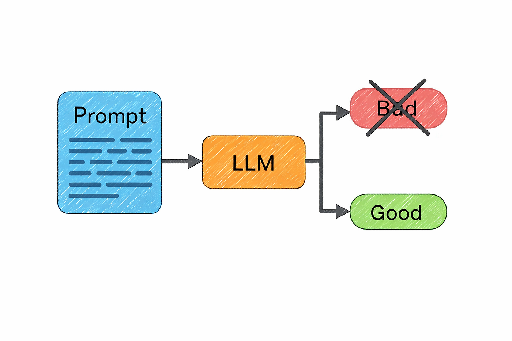

It’s the process of shaping your input so the model gives you better, more useful output.

The same question, asked in two different ways, can lead to completely different results.

If you say something like *“explain APIs”*, the model will usually give you a broad, surface-level answer. But if you ask *“explain how REST APIs handle authentication with a real example”*, you’re giving it direction and the output instantly becomes more focused and practical.

What makes a good prompt isn’t complexity it’s clarity.

When you clearly define what you want, the model has a much better chance of giving you exactly that. Sometimes that means setting a role, like asking it to respond as an experienced engineer. Other times it means showing examples, breaking the task into steps, or simply being specific about the format and tone.

Over time, you realize something important.

Prompt engineering isn’t just a trick or a workaround.

It’s the main way you communicate with the model.

And the difference it makes is huge.

A vague prompt gives you generic output.  
A well-crafted prompt can give you something structured, accurate, and actually usable.

### **Try these prompts i created after spending so much times 👇**

### 16\. Chain of Thought (CoT)

Sometimes a model gives a bad answer not because it knows nothing, but because it jumps to the answer too quickly.

That’s where **chain of thought** comes in.

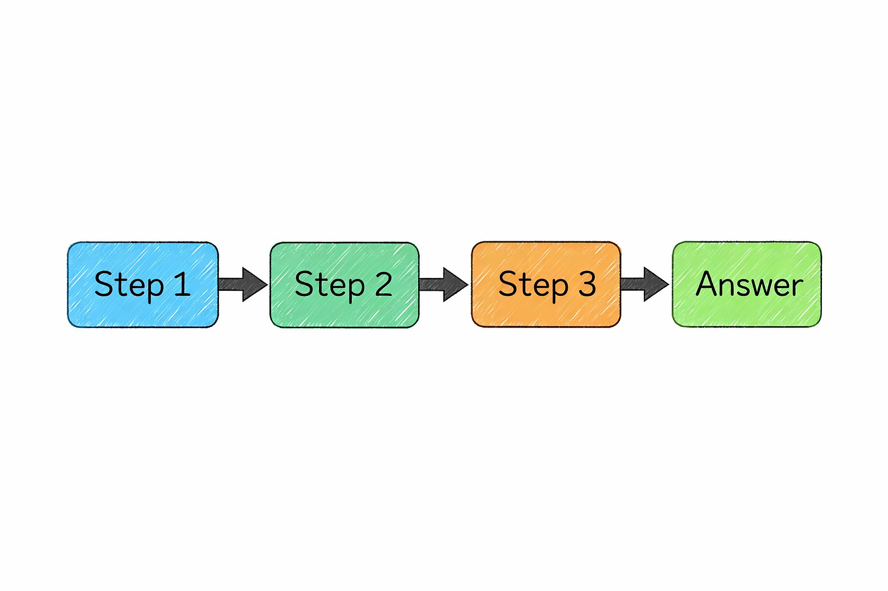

It’s a prompting approach where the model works through a problem in intermediate steps instead of rushing straight to the final result. This tends to help a lot with tasks that involve logic, math, or anything that requires multiple reasoning steps.

A simple way to understand it is this:

if you ask for only the final answer, the model may rely too much on pattern-matching. But if you encourage it to work through the problem more carefully, it has a better chance of arriving at something correct.

For example, if you ask a model to solve a multiplication problem directly, it may sometimes guess wrong. But if it first breaks the problem into smaller parts and then combines them, the answer becomes much more reliable.

That’s why chain of thought is often described as giving the model a kind of **scratch space**.

Instead of forcing an instant response, you allow it to process the task in smaller steps. And for many reasoning-heavy problems, that small change can make a big difference.

In simple terms, better results often come from giving the model room to reason through the task…

instead of asking it to leap straight to the conclusion.

## Now about Building AI Systems

### 17\. RAG (Retrieval-Augmented Generation)

Remember the hallucination problem we talked about earlier?

RAG is one of the most practical ways to deal with it.

The idea is simple.

Instead of relying only on what the model already knows, you give it access to **real, relevant information at the moment it’s answering**.

Before generating a response, the system first searches for useful documents from a knowledge source. Those documents are then passed into the model as context, and the model uses them to produce a more grounded answer.

Think of it like this.

Instead of answering from memory, the model is allowed to **look things up first**.

For example, imagine you’re building a support assistant. When someone asks about pricing or policies, the system doesn’t guess. It first pulls the latest information from your internal documents, and then the model explains it in a clear, natural way.

What makes this approach powerful is the separation of roles.

The model focuses on understanding the question and explaining the answer.  
The knowledge base provides the actual facts.

And this has a big advantage.

If your information changes, you don’t need to retrain the model. You just update your documents, and the system will start using the new data immediately.

In simple terms, RAG turns a model from something that *remembers*…

into something that can **read, verify, and respond with real context**.

And that’s what makes it far more reliable for real-world use.

### 18\. Vector Database

So if RAG is about fetching the right information…

how does the system actually *find* it?

That’s where **vector databases** come in.

Instead of storing text in a traditional way, a vector database stores **embeddings** the numerical representations of meaning we talked about earlier.

This allows the system to search based on **semantic similarity**, not just exact words.

Here’s what that looks like in practice.

Your documents are first broken into smaller chunks, and each chunk is converted into an embedding. These embeddings are then stored in the database.

When a user asks a question, that query is also turned into an embedding. The system then looks for stored vectors that are closest to it meaning the most similar in terms of meaning and returns those as context.

What’s powerful about this is how different it is from traditional search.

If you search using exact keywords, you might miss relevant information just because the wording is different. But with vector search, the system can still find the right content because it understands the **intent behind the words**, not just the words themselves.

This is what makes RAG work so well.

The model doesn’t just retrieve text  
it retrieves the *most relevant meaning*.

There are several tools that handle this kind of search, including systems like Pinecone, Weaviate, Qdrant, and even PostgreSQL with extensions that support vector-based queries.

In simple terms, a vector database is what allows AI systems to move beyond keyword matching…

and start searching the way humans think.

### 19\. AI Agents

So far, everything we’ve talked about focuses on models that generate text.

But what if the model could actually **do things**?

That’s where **AI agents** come in.

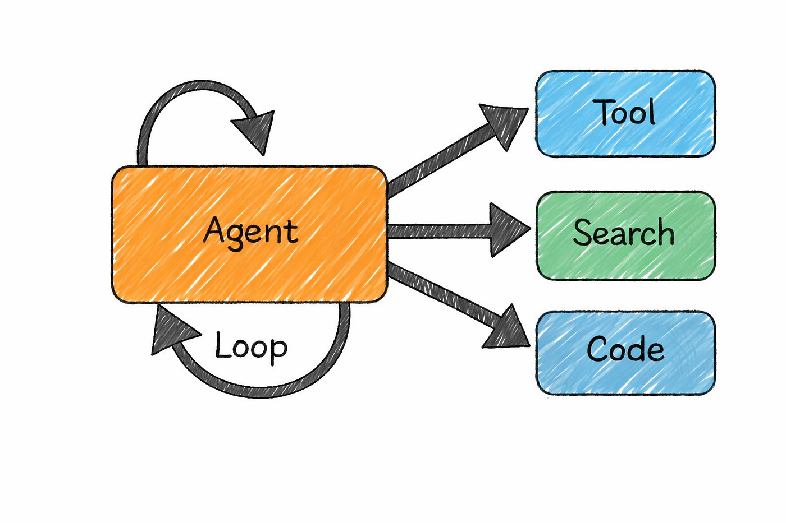

An AI agent is basically a language model that can take actions, not just respond. Instead of stopping at an answer, it can interact with tools, run code, search for information, call APIs, and combine these steps to complete a task.

In other words, it moves from *thinking* to *doing*.

Most agents operate in a simple loop.

They look at the current situation, decide what to do next, take an action, and then repeat the process based on what changed. The language model sits at the center of this loop, acting as the decision-maker at every step.

Imagine a coding assistant working on a bug.

It reads the issue, explores the codebase, identifies where things might be going wrong, writes a fix, runs tests, sees what fails, and then adjusts the solution until everything works. Each step depends on the previous one, and the model keeps adapting as new information comes in.

This is powerful but it’s also where things get tricky.

Every step has a chance of going wrong, and those small errors can add up. A task that looks simple can become unreliable when it involves multiple decisions in a row.

That’s why building good agents isn’t just about making them capable.

It’s about making them **reliable**.

Modern systems focus heavily on planning, validation, retries, and self-correction to keep these multi-step workflows on track.

In simple terms, AI agents are what turn language models into systems that can actually **take action in the real world**.

### 20\. Diffusion Models

So far, we’ve mostly talked about text.

But what about images?

That’s where **diffusion models** come in the technology behind many modern image generators.

The idea is surprisingly counterintuitive.

Instead of learning how to directly create images, the model first learns how to **destroy them**.

During training, real images are gradually corrupted by adding noise again and again until they turn into complete static. Then the model is trained to reverse that process step by step learning how to remove noise and recover the original image.

When it’s time to generate something new, the process flips.

You start with pure noise.

And then, little by little, the model cleans it up adding structure, shapes, and details until a full image emerges. Each step refines the result, guided by your prompt, turning randomness into something meaningful.

The name “diffusion” comes from physics, where particles spread out randomly over time, like ink dispersing in water.

Here, the model learns the opposite direction how to bring order back from that randomness.

What’s interesting is that this idea isn’t limited to images anymore.

The same approach is now being used for generating video, audio, 3D content, and even in scientific fields like designing molecules or predicting protein structures.

In simple terms, diffusion models are what allow AI to take pure noise…

and turn it into something you can actually see, hear, or use.

## Similar story

## I’m really glad you made it all the way here

Thanks for spending your time reading this.

If this story helped you understand AI a little better even one concept that means a lot to me.

And if you found it valuable,  
don’t forget to clap 👏 and share it with your friends or colleagues who are trying to learn AI too.

Also, follow me here I’ll be sharing more stories like this, simple, practical, and actually useful.

**See you again in the next one.**

> **Editor’s Note :** AI tools helped me refine and structure parts of this story and create images . However, the story, the conversations, and the opinions shared here are entirely my own. AI simply helped me communicate these ideas more clearly.  
> I believe in being transparent about the tools I use while writing. 😊
