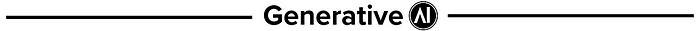
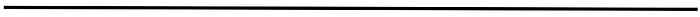

# Between what you need reality to be and what it is

## On Anomie, Exile, and Living Inside the Gap

Perhaps the most enjoyable thing about getting into a regular writing rhythm is that you get into a regular rhythm of thinking. Of practising to think. Of sitting down and looking at the world around you — what you read, see, hear, feel, imagine — and taking the time not to let the thought just pass, but to sit with it. And in sitting with it, let it change your opinion of itself. Let it evolve as other observations and bits of information come into your frame and pull on it.

I mention this because I’ve been asked, not often, but every now and then, how I decide what to write on. How I form an idea or get inspiration. Sometimes it is the most obvious thing in the world. You sit at the blank page, and nearly everything you want to say is ready to spill out of your fingertips. It’s inevitable. Other times, it is simply a feeling. A feeling of curiosity because a confluence of things has come to your attention and you know there’s something there, but you’re unsure what the there, there is.

The first of those feelings has carried throughout most of this past year when it comes to the onslaught of AI sensationalism. I’ve written extensively about it in other essays, so I don’t want to rehash the same point here, only to say that it feels like there is a genuinely existential shift happening in how we organise ourselves as a society.

Or is there?

Over the past year, perhaps more like two, it’s been genuinely difficult to know what exactly is going on. We’ve had our [Matt Shumer viral essays](https://x.com/mattshumer_/status/2021256989876109403). We’ve had the open letter from [Axios CEO Jim VandeHei to his family](https://www.axios.com/2026/01/23/ai-jim-vandehei-letter-kids). We’ve then had the likes of Marc Andreessen telling us not to worry about a thing. There are so many signals to follow, so many voices crowding the same tiny spaces, that the capacity for overwhelm is exceptional.

Just what exactly is going on, and who is the most right?

Let us take as the baseline confluence, then, this platform itself — my space to think and make sense of what is going on — and let that be the primary lens through which I look at everything else. The second confluence came when I stumbled across a Tatler post on Instagram that spoke of the concept of BANI. [An acronym coined by the futurist Jamais Cascio](https://medium.com/@cascio/facing-the-age-of-chaos-b00687b1f51d) that tries to capture the feeling most of us have been going through since 2020. It stands for Brittle. Anxious. Non-linear. Incomprehensible.

-   Brittle: systems and plans that seemed strong suddenly break under stress.
-   Anxious: pervasive anxiety caused by constant, unpredictable, and often negative information.
-   Non-linear: events no longer follow a straight, proportional, or logical cause-and-effect path.
-   Incomprehensible: situations are so complex that they are difficult to fully grasp, causing decision paralysis.

I saw that and thought, yes. A lot of that makes sense. There is a little BANI in the air. Whether it’s a high school student trying to decide what to study that won’t be obliterated by the next Claude update, or a university graduate watching entry-level positions shrivel up in real time as they try to embark on something resembling a career. All of us, I think, are feeling some level of BANI, because it is genuinely difficult to grasp the size and complexity of the moment we’re in.

Which led me to what I thought was the first thing I wanted to write about. Is BANI new? Or is it a tale as old as time? Has there ever really been a period when we knew exactly how society worked and the roles we were supposed to play? Or do we only create that illusion through hindsight? Do we think the past was simpler because it seems simpler to us — the end is known, and so it feels inevitable? Or is this simply a condition one has to go through, a rite of passage into adulthood, a permanent state one needs to get used to in order to make sense of a global narrative that is, in fact, not authored by anyone, and therefore cannot possibly make sense?

For this, I want to turn again to Émile Durkheim.

## It’s pronounced Anomie, not Amelie

I’ve written about Durkheim before. His concept of anomie is not dissimilar to Cascio’s BANI, and I introduced it earlier this year when I was trying to make sense of what was happening to young people entering a labour market that no longer knew how to hold them. You can read that essay below. But I want to return to him now, not just for the concept, but to get a feel for the world he was living in when he wrote it. To understand his context in relation to his term.

Durkheim was writing at the tail end of the nineteenth century in a France that had, within living memory, lost a war to Prussia, watched an emperor fall, endured the bloody collapse of the Paris Commune, and was staggering through the early years of the Third Republic with no settled sense of what it was supposed to be. The old Catholic social order had been significantly weakened. The industrial revolution had arrived late and unevenly, pulling people out of villages and into cities where nobody knew them and everything was new. The scientific worldview was displacing religious authority without necessarily offering a moral substitute for the meaning religion used to provide. Train timetables and factory shifts were rewriting the rhythm of ordinary life. A person living through it had every reason to feel that the ground was less stable than it used to be.

That sounds pretty BANI to me, no?

Durkheim’s project, across his career, was to understand what happens to a society when its regulating structures break down faster than new ones can take their place. Anomie was the name he gave to that in-between condition. His 1897 study, *Suicide*, made the argument at full force: he had noticed that suicide rates spiked not just in periods of economic collapse, which one might expect, but also in periods of economic boom. What the two had in common was not hardship but disorientation. Rapid change, in either direction, unmoored people from the expectations that had previously made their lives legible to themselves.

That, for our purposes, is the crucial insight. Anomie isn’t poverty. It isn’t even really suffering in the usual sense. It is the experience of living inside a gap between what you’ve been taught to expect from life and what life is actually delivering. The frameworks and signposts that were meant to tell you whether you were doing well or not stop working, and a kind of vertigo sets in.

Durkheim’s reception was mixed. He spent much of his later career trying to establish sociology as a legitimate discipline in the first place, and died in 1917, partly of grief, after his son André was killed on the Macedonian Front in the First World War in 1915. His thinking evolved, though not in the direction of optimism. In his later work, which focused on religion, he became more convinced that societies needed ritual, symbol, and collective effervescence to hold together. He was not advocating for any one religion or even religion as dogma, but something functionally equivalent to it. Something that regularly reminded people they were part of something bigger than themselves.

The question for me then naturally lent itself to something like this: Did the world “get out of” anomie? If you look at what happened next — the First World War, the interwar collapse, the rise of fascism across Europe, the Second World War — the vibe is certainly that the twentieth century did not resolve the condition Durkheim was describing. On the contrary, it intensified it. Arguably compounded it. And some of the attempts to close the gap were met with increasingly totalising projects. Nationalism. Communism. Mass politics. Some of the most catastrophic solutions to very real and complex problems. Others were less violent and less destructive. The postwar welfare state, for example, or the settled institutions of mid-century liberal democracy, did produce, for a few decades at least, something that looked a lot like a stable structure again. For a time, we had a framework that told people roughly what they were meant to expect from life. Work, home, progress — you know the drill.

But that framework has been fraying for a while now. And what we’re living through happens to coincide with the arrival of a technology that is rewriting cognitive labour itself.

The comparison between Durkheim’s France and our own moment is useful. But it isn’t the only one available, and I’d like to pull on another briefly before we go any further. Because while I was working my way through this essay, I also started working my way through Hilary Mantel’s *Wolf Hall* trilogy. I’ve just finished book one, which, whether you’ve come to it through the novels, the BBC adaptation, or the history itself, is a story about a very particular kind of anomie. Sixteenth-century England. A king trying to rewrite the rules of succession because he wanted a new wife. A church whose authority was suddenly negotiable. A legal and theological order that had held, more or less, for centuries, being improvised in real time by a blacksmith’s son from Putney (South West London represent!).

Thomas Cromwell is a useful figure to sit with for a moment, because what he was doing — dismantling the Catholic Church in England, redirecting its wealth, rewriting the relationship between the Crown and every institution that had previously stood alongside it — would not have been possible a century earlier. The technology simply didn’t exist. And I’m not just talking about the printing press, although obviously that is the catalyst, but the whole apparatus that sprang from it. Cheap pamphlets where political and theological thinking could be shared far and wide. Vernacular Bibles that translated the gospel into the language commoners understood. For the first time ever, ideas could travel faster than the Church’s capacity to police them. Tyndale translated the New Testament into English from a printshop on the continent. Luther’s theses spread across the continent within weeks. By the time Cromwell was in a position to remake the English state, the press had been on English soil for about sixty years. Long enough that its effects had saturated the culture. Long enough that the old order could no longer hold, even if most people hadn’t yet worked out what was replacing it.

All of this is to say that the Reformation wasn’t just a theological argument, but what happens when an information technology outruns the institutional frameworks that had previously regulated meaning, authority, and identity for a civilisation.

So we have two examples, pulled from different centuries and countries, of the same underlying pattern. And no doubt, now that your brain clocks are spinning, you can think of countless others the world over. But for now, we have France in the late nineteenth century, staggering through industrialisation and urbanisation, producing Durkheim’s diagnosis of anomie. And England in the sixteenth century, staggering through the print revolution and the political realignments it made possible, producing what we now romanticise as the birth of the modern state but which, at the time, was experienced by most people as a terrifying loss of the things they had most trusted, let alone things that were thought divine.

Different technologies, different countries, different times. Same old pattern.

A new technology arrives. It diffuses. The structures that previously organised life — work, faith, politics, community, all start to fray, because they were built for a world that no longer exists. A period of disorientation follows, which can last a long time and can get very ugly. Eventually, new structures form around the new technology. Life becomes legible again, and we call that period stability, until the next technology arrives and the cycle begins again.

Stability. Disruption. Anomie. Adaptation. New stability.

That’s the historical pattern. And every generation that has lived through one of these cycles has assumed theirs was uniquely catastrophic. I mean, for goodness’ sake, imagine a society that truly does believe in divinity and then all of a sudden the Pope is just a bishop in Rome. That is reality-bending stuff. Yet even then, and every generation before and since, has been proven wrong. The structures eventually re-form, the world becomes legible again, and for a time, things are what we like to refer to as “normal”.

So, are we simply in another one of these cycles, and some form of stability is still available to us just around the bend, or does the way technology has advanced and changed mean that the cycle itself can no longer hold?

## Bay Area Boom

*A pint across time*

Let us take a walk through 1820s England. If you and I were there and we were looking to go into a profession, we’d really only have a handful of options to go after. [Census data from the time essentially split it into four main buckets](https://www.history.ox.ac.uk/professions-nineteenth-century-britain-and-ireland#:~:text=The%20nineteenth%20century%20witnessed%20a,included%20manufacturers%2C%20merchants%20and%20entrepreneurs.). Agriculture, trade, manufacture, or handicraft. Those were our main and most easily accessible options. Most people worked the land, or worked with their hands in some type of cottage trade, or were in domestic service. Think of your weavers, blacksmiths, millers, and wheelwrights. You had a handful of clerks and professional men in the bigger towns, like London and Manchester, and an even greater number of women and girls in service, cooking, and cleaning, and laundering their way through lives that would have looked recognisable to their grandmothers, and with a bit of luck to their granddaughters too. Life was fairly predictable, and one decade from another looked much the same. You knew the world you were getting into.

[Fast forward a hundred years, and we’re in 1920s Britain](https://www.findmypast.co.uk/blog/history/jobs-in-1920s-britain). The picture has now significantly changed. In this century, over a million men were working in coal mining. There was factory work, office work, and transport had become the dominant occupations for most men. Clerks and typists were appearing in significant numbers, many of them for the first time, women. The 1921 census of England and Wales records the first female police officer and the first female racing car driver, which tells you something about just how quickly what a person was meant to or could be was changing. Domestic service was still the single largest occupation for women, but the numbers had started to fall. Education acts had pulled children out of the workforce, and professions were opening up in all sorts of new industries. A lot of what we’d now recognise as the modern world of work was, by the 1920s, starting to become visible.

So plenty had changed. But also take note of what hadn’t. Most of the jobs that existed in the 1820s still existed, in some form, in the 1920s. The blacksmith was still a blacksmith, the farmer was still farming, even if both were using updated machinery. The domestic servant, the dressmaker, the teacher, miller, coachman — all still there. Fewer in number, yes, and different in details, but the category of job was still recognisable. If a person in 1820 had trained as a tailor and one in the 1920s had done the same, they could probably have understood each other’s workdays well enough to share a pint at the end of the day.

The point I want to make here is that for most of modern history, jobs did change, but they did so at a pace that a human lifetime could absorb. Things moved. New trades appeared, and old ones shrank. But the rhythm of change was generational. Your grandfather’s work was probably recognisable as a version of your father’s, which was probably recognisable as a version of yours. You might have been born into a different set of tools, but you were not born into a different ontology of work. The rate at which the very categories of employment were being invented, saturated, and retired was slow enough that a person could plausibly build a career inside one of them and retire from it without ever needing to reinvent themselves halfway through.

That was the deal, more or less. And it was a fairly good deal at that. You picked a trade, you learned it, you mastered it, and by the time the world was changing enough to make your skills feel dated, you were already safely on your way to retirement. The disruption fell on your children or grandchildren, not you. They would go into something new, and for the most part, that something new would then last them a lifetime. The system worked because the technology under any given job was stable enough that a single working life could fit comfortably inside a single role.

Most jobs throughout history have been what we might want to call symbiotic. A human paired with a particular technology, at a particular moment in time, doing a particular kind of work that only makes sense in the presence of both. The switchboard operator, for instance, was a human whose value was legible only in the context of the switchboard. Equally, the lamplighter needed gas lamps that had to be lit by hand. When the technology changed, the role evolved with it, or it disappeared. But the half-life of these pairings used to be measured in decades or centuries. The blacksmith-and-forge arrangement, for example, lasted in various forms for roughly three thousand years. No anomie there, my blacksmith friends.

What that bought us, collectively, was time. Time to train, time to practise, time to develop mastery, to pass on what you’d learned to someone younger before the world moved on without you. It bought us the possibility of a career as a singular thing rather than a sequence of things. A noun rather than a verb. And it bought us, perhaps most importantly, a kind of legibility to ourselves. You knew what you were. Even if at times you didn’t know who you were, you could at least always fall back on your profession. I am a tailor. My father was a tailor. And tailor was so much more than just a job. It was a family connection as well as a lifeline to structure and stability. How you located yourself in the world, and how the world located you in return.

*\[Please note, fact-checking reader, that I am not a tailor, nor is my father. Took a little poetic licence there, if you don’t mind.\]*

Now take that same frame and place it in San Francisco, 1985. You’re a young person deciding what to do with your life, and you’ve heard about some new machines called personal computers, and there are companies in the area building them, and something called software is becoming a thing — oh, what a time to be alive. You take a punt on it, you learn to code, you go out there and build yourself a career. Good for you. You’ve just chosen one of the defining careers of the late twentieth century. Except that, unlike the blacksmith, twenty years into your working life, the ground has shifted underneath your feet several times. For one, the language you learned to code in is mostly obsolete. The desktop software business has given way to the internet, which has given way to mobile, and by the time you’re in your mid-forties, a thing called cloud computing has rewritten the economics of the entire industry you thought you were in. You’ve had to retrain more than once just to stay relevant. Your children, meanwhile, are being told to learn to code. Coding is the future; you can almost hear the jingle.

This period is what I like to call the Bay Area Boom, because it’s as good a shorthand as any for what begins to happen to the world of work once Silicon Valley stops being a place and starts becoming a way of being. From around the mid-1970s onward, and accelerating sharply through the 1990s and 2000s, entirely new job categories began appearing faster than people could complete careers in them. Web development was not a job before roughly 1993. The social media manager was not a thing before 2008, and twenty years on, many of those roles are already being absorbed by the technology that created them. App development as a profession only exists after 2008, when the App Store launched. SEO specialist, data scientist, and UX designer — all children of the last twenty to twenty-five years. Prompt engineer barely existed before 2022, and the people who hold that title now are already watching it get absorbed into broader AI roles that are themselves still being invented.

The symbiosis I wrote of earlier — the human paired with a technology, working a role that only makes sense in the presence of both — still might hold, but the difference is that the technology now changes faster than any human can keep up with. The pairing is broken because its half-life is collapsing. You don’t get three thousand years with the forge anymore. You get six months with the current model, if you’re lucky. And then the ground shifts under you, and you’re asked to do it all over again.

This brings us to the question this whole section has been driving at. If the historical pattern was stability, disruption, anomie, adaptation, new stability, what happens when the adaptation window collapses to the point where it’s shorter than the disruption cycle itself? What happens when the cycle can no longer close?

I’ve been circling this question all year without quite realising it. In all of my essays, it’s been there, and each time I’ve arrived at the edge of the question without being able to see the other side of it. Then came Stephen West’s essay on his *Philosophize This!* Substack, on Albert Camus and the concept of exile. I’m no stranger to Stephen’s work — his essay on Nishitani was one of the pieces that helped shape another essay of mine, *The Problem of the Gentleman* — and this new one arrived in my inbox in the middle of me trying to write what you’re currently reading. When I opened it, it didn’t feel like it was about Camus. It felt like it was exactly about this essay. About what happens when the structures that used to organise your relationship to reality stop matching the reality itself. Which is, you’ll notice, the question I’d been failing to answer.

So this is, if you’ll indulge me, the third confluence. The first being the general feeling of AI sensationalism. The second being the Tatler post that introduced me to BANI. And the third being Stephen’s essay, and what it did to the argument I thought I was making. See, once I read it, I realised that the cycle question I’d been asking — whether we’re still inside a pattern of stability, disruption, anomie, adaptation, new stability, or whether the pattern itself has broken — might not be the most useful. Or rather, it might be the right question to ask about the world, but the wrong question to ask about what to do next. The more useful question might be a much older one.

## Human Area Bust

*The cracks are starting to show*

Albert Camus was a writer who spent most of his life thinking about what it means to live without the consolations the world had historically provided. He grew up in French Algeria, wrote through the collapse of France under the Nazis, joined the Resistance, watched Europe rebuild itself on foundations everyone could feel were much shakier than they pretended to be, and died in a car accident in 1960 at the age of forty-six. I mention all this not to walk you through his biography, but to note the texture of the century he wrote from. It was a century that had promised stability and kept finding itself in the middle of collapse. He was, in other words, writing from inside the long shadow of exactly the kind of unresolved anomie we’ve been discussing.

What Camus noticed, across his essays and novels, is that there is a specific kind of human experience that doesn’t have a good name in English. It’s not exactly homesickness. It also isn’t alienation. It’s not quite grief, though it can sometimes feel a lot like it. The closest word he could find for it was exile. And by exile, he didn’t mean being sent away — like poor old Wolsey in *Wolf Hall* — but something stranger and more intimate. He meant the experience of standing inside a reality that has stopped matching the reality you thought you were inhabiting. The place hasn’t moved. You haven’t moved. But the relationship between you and the place has stopped working. You are, in a sense that has nothing to do with geography, no longer home.

This, I find, is where our current language fails us. Exile, in Camus’s sense, isn’t dissatisfaction. Dissatisfaction assumes something is wrong and that you could, in principle, fix it, leave it, or wait it out. Exile is the condition you’re in when none of those are on offer. And in a very real way, it is what’s happening now. Technology is rewriting the world in its own image, and the place we once occupied within it is disappearing underneath us. We haven’t gone anywhere. The ground has.

Map this onto a career, and you can see the exile most people are anticipating is about to come upon them. You no longer recognise the industry around you. You might still want to be the thing your profession used to mean, but it doesn’t mean that anymore.

Camus’s argument, across a lifetime of writing, is that this condition is not an anomaly. It is the default human situation once you stop pretending that the world comes with its frameworks built in. The rest of us live, most of the time, inside a comforting illusion that the structures we grew up inside of — the career, the institution, the narrative, the national story — are permanent features of reality. Exile is what happens when the illusion cracks. Which is why it can feel so violent when it arrives. It isn’t just that something has gone wrong. It’s that something you thought was part of the furniture of the universe turns out to have been a construction all along.

This is what Stephen’s essay gave me. A language for what Durkheim had been describing sociologically, what Cromwell’s England had been living through historically, and what the Bay Area Boom has been producing economically, but from the inside. Exile is what anomie feels like when you’re the one living through it. It is the interior texture of structural collapse. And the reason it’s worth naming with its own word is that the response to exile is not the same as the response to anomie. Anomie is a condition of society. You don’t, as an individual, fix it. Exile is a condition of a person. And how you live inside it — whether you live inside it well or badly — is the real question.

This is, incidentally, why the three voices I mentioned at the top of this essay — Shumer, VandeHei, Andreessen — all feel slightly off in the same way, even though they appear to be saying very different things. Shumer tells you to retool. VandeHei tells his family to lean in. Andreessen tells everyone to relax. All three are responding to disruption *inside* a cycle. None of them is responding to the possibility that the cycle itself has broken, and that what we are being asked to adapt to is not a new set of tools but a permanent condition of exile. You cannot retool your way out of a missing framework. You cannot lean into a structure that is dissolving underneath you. And you cannot relax your way through a moment that is asking something more fundamental of you than optimisation. The advice is internally coherent. The premise is wrong.

In a way, none of this is particularly new. It’s certainly older than Camus or Durkheim. It is the question every generation pretends it has answered and every generation discovers it hasn’t. What do you stand on when the ground keeps moving? What do you draw on when the frameworks stop holding? Who are you, if you are not the thing you used to be?

I don’t think I can answer all those questions here. Not for lack of wanting, but because I think they deserve more thought and their own essay. What I can say, for now, is that between what you need reality to be and what it is, there is always going to be a gap. The cycle may or may not close. New stability may or may not arrive. But the gap is, and always will be, the thing you have to learn to live inside of.

This is where I’ll pick up next time.

This story is published on [Generative AI](https://generativeai.pub/). Connect with us on [LinkedIn](https://www.linkedin.com/company/generative-ai-publication) and follow [Zeniteq](https://www.zeniteq.com/) to stay in the loop with the latest AI stories.

Subscribe to our [newsletter](https://www.generativeaipub.com/) and [YouTube](https://www.youtube.com/@generativeaipub) channel to stay updated with the latest news and updates on generative AI. Let’s shape the future of AI together!

