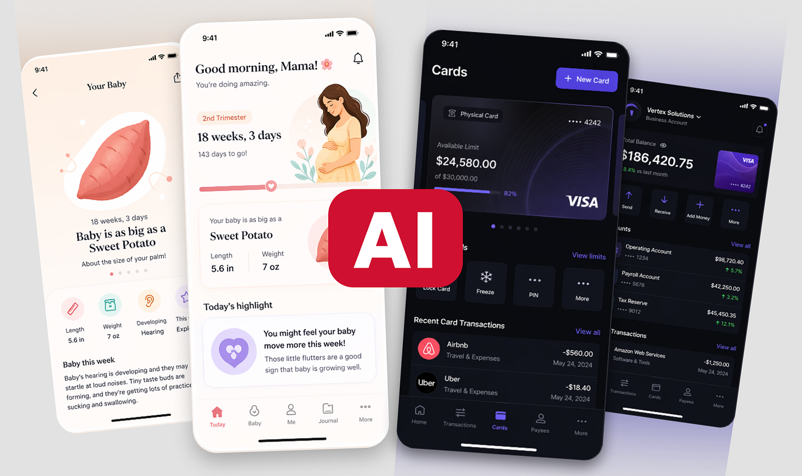
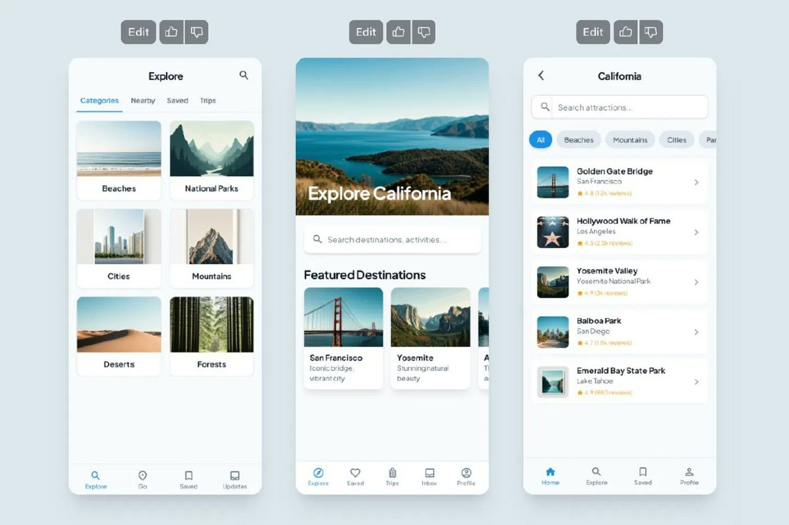
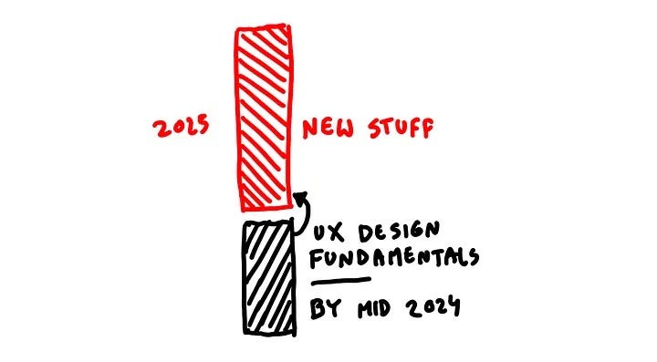
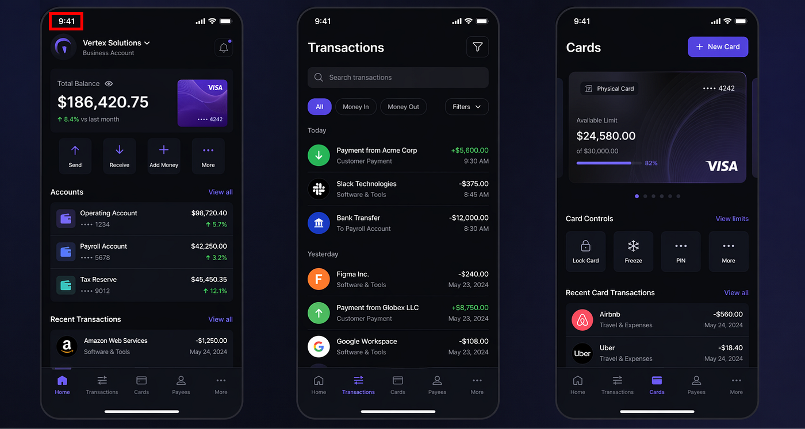
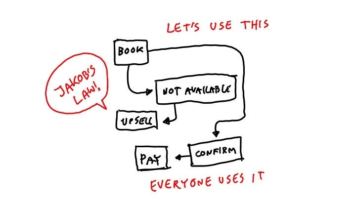
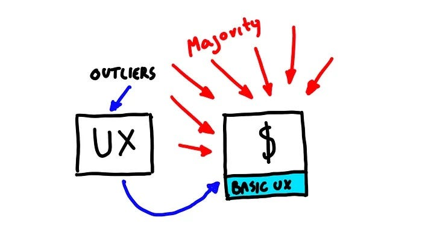
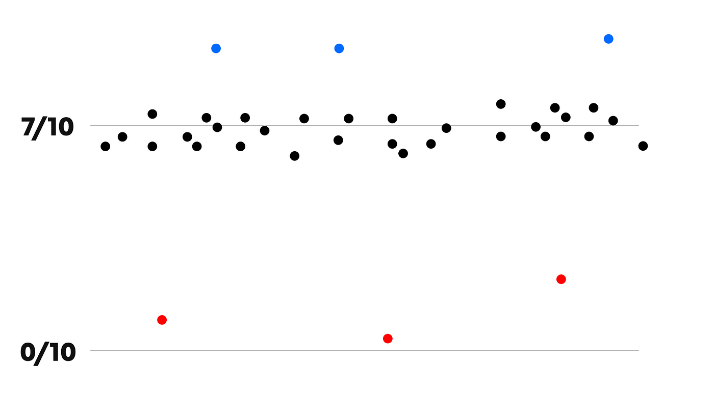
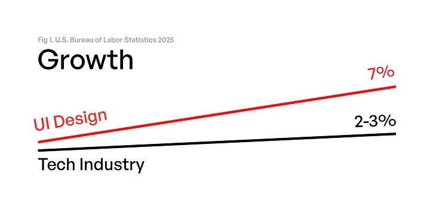

# AI generated UI design is now better than 80% of humans

## What does it mean for the future of the industry when UI assembly becomes much faster?

The AI wars for dominance seem to be in full swing. Just days after Anthropic announced Claude Design, OpenAI drops a brand new image model. This time, it’s also specifically tuned to UI design. I put it to the test and have to say the results are extremely impressive.

## Wait, What?

When ChatGPT first learned to make images two years ago, UI design was about similar quality as the now infamous Will Smith spaghetti video.

It was clear the model trained on Dribbble, as it was heavily trying to make creative presentation of screens, but the screens themselves were hilariously bad.

### Not anymore

I tested it on two simple prompts and generated a B2B finance app and a B2C pregnancy tracker.

That’s because I have worked on both those categories and made apps for them, so it’s a good way to evaluate.

Aside for some small padding issues and jumbled icons, these are 9/10 quality dribbble shots.

*AI generated UI design with Open AI Image 2 model*

Wait, weren’t they UI designs? Well kind of.

They’re technically UI design but in reality they’re dribbble shots.

There are some tropes typical to Dribbble shots in the text on those images, when names are used they’re the same few names designers have been copying from one another for over a decade.

> Now AI copies the copies.

That’s why most women are named Ava, because designers realised 3-letter names wrap better visually. Shots were made around looking good, not stuff like making sure long names will also look fine.

*This is Google Stitch UI design from a year ago. The progress from that to now is visible.*

## It will get better

It’s already better than manual work of around 80% of designers and will eventually get better. Probably closer to 90%.

> So are designers cooked? Are we done? Pack your bags and let AI do UI?

**It’s not that simple.**

The problem stems from a misconception that existed even before AI. If someone can very well replicate some Dribbble styles, are they a good enough designer to build a successful product?

Before, lots of designers kinda mindlessly copied patterns and ideas from Dribbble. The problem is that almost the entirety of projects there are not really apps. They’re artwork like showcases to sell a first impression.

*The pregnancy app is a little generic, similar to some popular dribbble examples, but nonetheless pretty good*

In that regard what OpenAI proposed in both my prompts makes more sense than many of these dribbble shots ever did.

## Taste is the moat?

AI outputs constantly get better. Does it mean AI will finally crack taste? The final mythical holy grail of design? Yes and no.

It will definitely get better at the outputs, it’s already happening.

But taste constantly grows in sophistication. It’s not set in stone and changes. Things get out of style through overuse and taste adjusts for that.

So the more AI generated design, the more taste will be needed to push away from them and differentiate. Then AI learns from that and the whole game restarts.

*In 2024 I created this diagram showing that by 2025 AI will grasp most of UX fundamentals (including UI) and we’ll be able to innovate on new stuff. I guess I was a year late.*

## What is design

The problem is we’re still treating design as pure assembly. Press a series of buttons in your design app of choice, drag & drop some rectangles and you’re done.

Since a lot of that UI work has been pattern based for years (and not very creative) AI didn’t become a designer replacement here.

It became a design tool that allows you to work faster.

Just like Photoshop gave way to Sketch for faster and better UI design, and then Figma came along, now we have tools that output concepts in minutes, not hours.

> Did you notice:  
> All shots have 9:41 at the top, as a nod to how Apple shows the hour the first iPhone was unveiled by Steve Jobs in their marketing materials.

*We were stuck in the sameness loop for a bit too long. UX needs innovation.*

## Who makes the choices

Most of the fear is of the unknown here. A lot of people think that designers are not needed, as AI will only get better at UI and UX.

But ultimately you do need to understand design to be able to say the images ChatGPT gave me are any good.

I can evaluate the hierarchy, information architecture, typography, clarity, contrasts.

Would I be happy with these designs? No. They’d be a starting point for sure, but there’s still a long way from here to an actually valuable product.

But knowing that I can quickly prompt for 20 specific ideas that I (myself) can come up with, and then merge the best ones consciously. That’s the main difference, it speeds up the discovery phase.

Previously you had to look at a lot of “inspiration” on sites like Dribbble and do all that by hand.

*The majority will now quickly make “basic UX” and outliers will be making NEW things that will in turn influence that basic UX.*

## What designers see?

Most non designers just see icons and rectangles and text. If you don’t have a budget for design, now you can definitely get much better results than even a year ago without a designer.

But a designer will still make MUCH better stuff in those same AI tools. Especially as the 7/10 UI quality inflates drastically.

## The good enough trap

When every product is „good design”, design will have to go into some new directions.

> Directions AI hasn’t had the opportunity to scrape and learn from yet.

We can save a lot of time with these tools. First drafts can now happen in minutes. Getting to a really good result can happen in hours not days.

So what are we going to do with all that extra time?

One approach is to fire most people and simply use these tools to MAKE MORE STUFF. Since it’s all in the 7–9/10 ballpark, that speed means good enough output at scale.

*When the entire industry sits on a similar level, there will be a need to differentiate and go above and beyond*

But everyone will do that. Good enough will stop being good enough. More and more patterns will become boring tropes. Some previously cool things will start „feeling AI”

And as long as product value is there it’s not the biggest deal. It becomes one where there’s similar value across similar products.

Just getting to good enough means accepting more even revenue splits with competitors. It’s giving up.

*It seems like developer jobs are on the rise again despite all the AI*

## AI ate coding first

AI „took over” coding by storm first. It’s been going on for almost a year now, everyone codes with AI.

Did it replace developers? Not really. If anything it created even more demand for hiring good devs than ever. The job market is growing.

Companies realized that just doing good enough faster is no longer a moat. You need to outdo competitors. So we’re now in another, different kind of race.

*Designer jobs are growing*

## Same with UX/UI

In fact, the UX/UI roles in the UX has been growing faster than the overall tech industry in 2025. And AI was already there.

I’ve been talking about this for a while now. Product design got stale since flat design happened. That means both UX and UI. Patterns, components and drag & dropping led to compartmentalization of design.

> You solve this issue THIS way and only this way, because we already know that. No time to try anything funny!

There’s some variety, but generally most apps and websites are copies of copies.

Why aren’t we getting our own „pull to refresh” kind of ideas anymore?

Because until recently, getting to that well known UI territory required time. Now it happens so much faster, it allows us to take a step back and think.

Do we REALLY need to solve that problem using the exact same cookie-cutter solution we used for the last decade?

**Or maybe there is a better way?**

*Current generation of designers just do the same couple of actions over and over. This SHOULD be AI automated.*

Instead of getting a box of blocks with instructions to assemble the exact thing on the cover, we get an infinite possibility canvas. Things can get prototyped so fast, we can come up with concepts that no AI has yet seen. And prompt an AI to show them to us, so we can test and iterate further. Or scrap the idea and jump to the next one.

## Assembly era is done

Good riddance! I hoped for this to happen since 2022. Now it’s time for true creativity. Owning design decisions. Knowing what works, what doesn’t and why. Testing new ideas, iterating.

Not being afraid to try something new. The time to try multiple solutions at the same time is now.

Design system based form assembly can be fully automated.

## Catch up

AI has caught up to our assembly based UI making. Good. We can do that faster now. Next step is going beyond assembly, into uncharted territories and make some new things.

New UI paradigms. New UX patterns. New flows. Merging UI with frontend again and adding delight.

This is a future I am excited for. And just like with developers it will require designers. Jobs will likely explode since we established a baseline to push design forward from.

*We really don’t need more of this boring stuff.*

Businesses will now hire creative designers to prompt AI tools for new concepts. To actually compete instead of imitating. People who will reprompt multiple times to get from 7/10 to 9/10 and beyond. And there’s got to be some really cool ideas happening in the process.

I don’t think manual work will be completely gone either. AI tools will get you most of the way, and then you can experiment manually, either via tools or in code directly. Tweak, break apart, dance around known patterns.

Taste and curiosity are the true skills here. Not how to assemble boxes.

Especially since [80-97% of websites](https://pageformance.com/categories) in our PF catalogue don’t even research, test or optimize. For MONTHS nothing changes on them.

*Launch and forget is the main strategy*

This is scary, as it shows we MASS produce things, but there’s no rhyme or reason behind it.

> Just more stuff.

The tools change, the person designing will not. It’s just a difference between decision making vs decision outsourcing. If you understand WHAT good design IS, you’ll be able to make good design into great design.

A tool will make an OK design for you, but without those skills you’re left not being sure what to improve and how.

The only achievable ceiling there is getting to the level of competitors. Becoming another 7/10 in a large set of 7/10s.

We can do better. And we will.

I’m excited to design NEW things!
