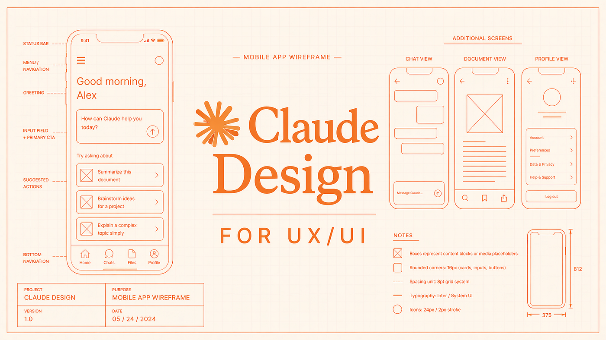
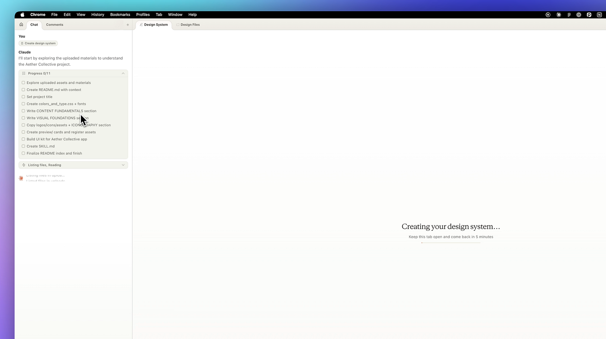
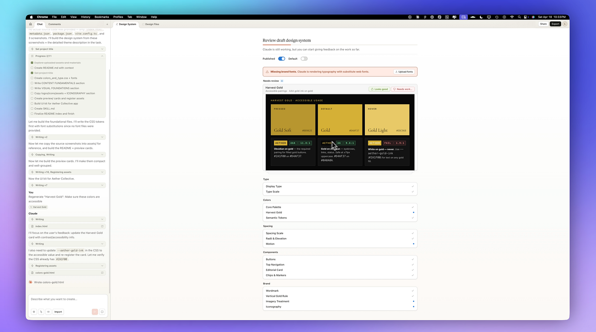
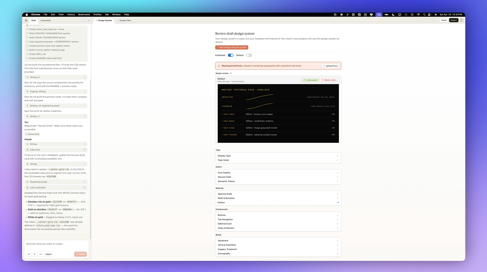
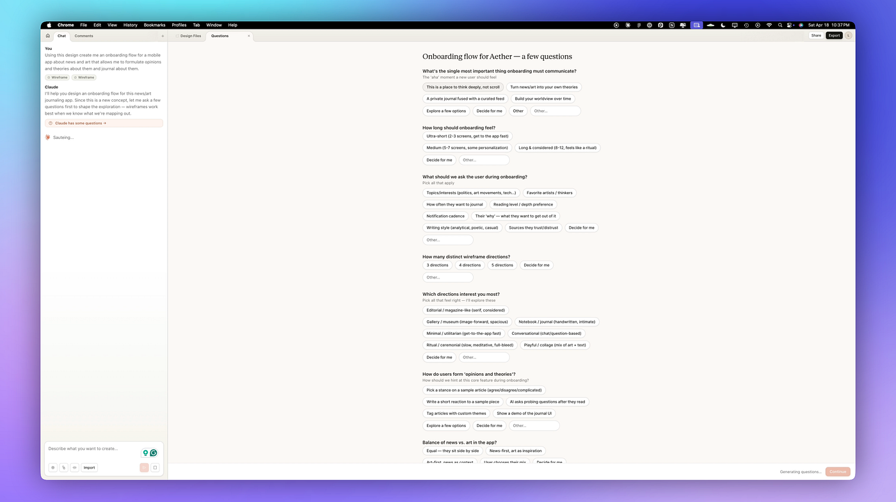
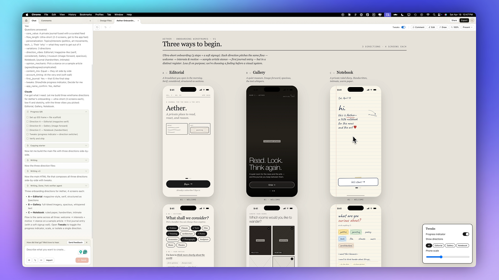
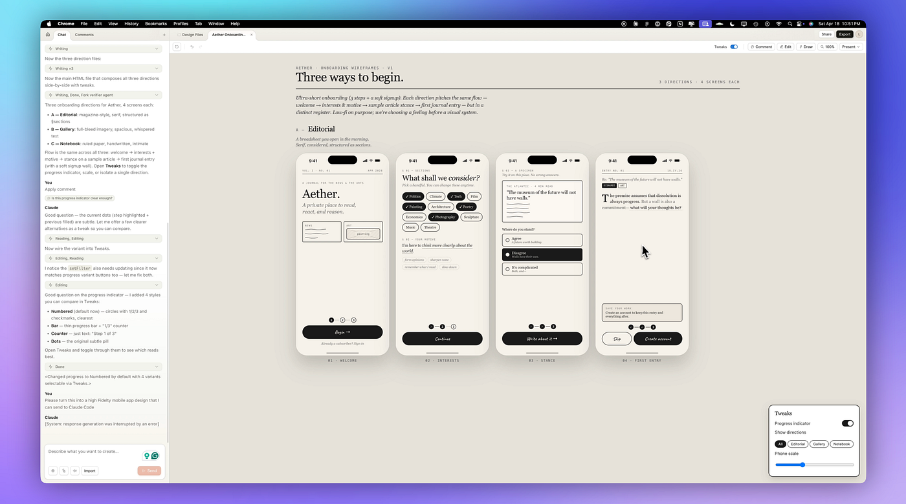
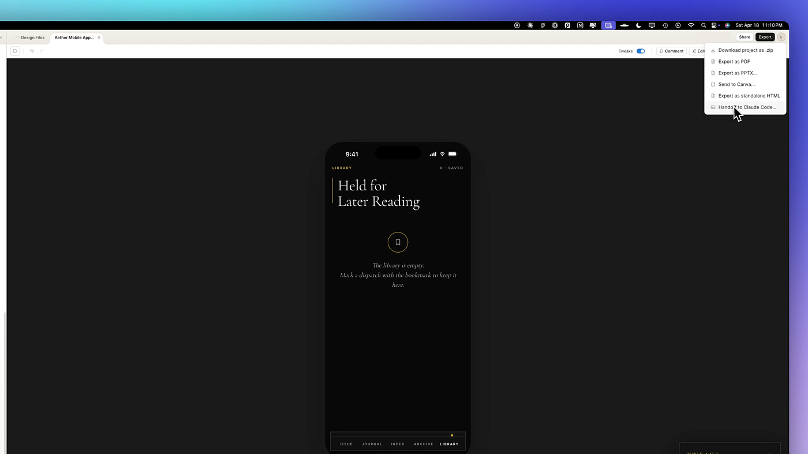

# I Used Claude Design for UX/UI — What Designers Should Know

[Claude Design](https://www.anthropic.com/news/claude-design-anthropic-labs?ref=designerup.co) has only been out for a few days and there are already a ton of general walkthroughs and tutorials. [This week I used it on a real UX/UI project](https://youtu.be/xwzXSegBJbo?ref=designerup.co) to see what’s possible specifically for the type of product work we’re doing (what it does well and where it breaks). Here’s what I tested:

🔶 Generating a Design System from Scratch  
🔶 Using an Existing Design System  
🔶 Creating Wireframe Flows  
🔶 UX Logic and Planning  
🔶 Making a High-Fidelity App Prototype (with animations)  
🔶 Handing it off to Claude Code for implementation

In this guide, I’ll show you exactly how you can do these things too and how it’s fitting into my product design workflow.

## A Very Quick Rundown

Claude Design is currently in Research Preview Beta. You need a paid plan. Even the basic Pro plan will do. But keep in mind that as of right now, usage is independent from your Claude account and has its own usage limits that are capped at a certain amount each day and then reset.

The foundation for everything in Claude Design is a Design System. That’s what makes it so powerful for UX and UI designers. You can ask it to generate a design system if you don’t have one — you only need your brand or style guide to get started, or even just some snapshots or visual inspiration for Claude to set up a design system for you.

If you have an existing design system even better, you can upload your assets and getting started right away.

## Setting Up My Design System

I started with my design system. If you already have a GitHub repository set up with your components, you can link it. If you have it locally on your computer, you can just upload a folder with a bunch of assets. And what I really love is that it plays nice with Figma — so you can export a FIG file if you have a style guide in there, or components and a brand guide, and upload that. You can also choose to use an [existing open source design system](https://designerup.co/blog/10-best-design-systems-and-how-to-learn-and-steal-from-them/) for your project.

I uploaded some assets and a design system I had for a project I was working on. I also had a bunch of other code-related files I wanted to reference, so I included those too.

💡 *A couple of tips: If you want to save some credits and you don’t already have some design system assets, you could generate this in something like* [*Google Stitch*](https://youtu.be/-oD8-MmqcL0?ref=designerup.co) *first because this can definitely suck up a lot of tokens. The other tip is to change the model for some of the simple tasks and tweaks so you’re not totally draining your usage.*

I went ahead and continued to generation. It said it was going to take about 5 minutes, and then it started setting up the design system. There is a nice progress list that it creates so you can see what it’s doing, what it has uploaded, and all the files it read. Then it builds those foundational files with CSS tokens.

## Reviewing the Draft Design System

This is where things get quite fun. It makes a draft design system for you, and you get to review all the components. Mine was still missing the fonts — I didn’t upload all of them, so it rendered some substitute web fonts.

It pulled up my [color palette](https://youtube.com/playlist?list=PLl0Umi92CQzXzdGkynmhh-ZjpoZW1f1Mm&si=_fJLNeEhD6k9hgbP), and I approved each of these as I went. This one needed work — it definitely wasn’t accessible. So I told it that needed work, asked it to make sure these colors were accessible, and submitted that. Then it shows you the foreground and the surface to make sure that’s all good. Looked good to me.

Fonts looked good. Spacing, everything — pretty nice. It makes a typography scale. Very good. Word mark. Beautiful spacing scale. Love it. The buttons looked good. And now I had two colors that pass accessibility.

And I love this motion. I gave it a description of how I wanted the motion to feel for the animations — and Claude design is actually pretty impressive with it’s animations.

Now I can continue to design with this design system and apply it to my projects. When you come back to the home screen, you can see your design system and other projects too.

## Starting a New Project: Wireframes

Now it’s time to create my first project and I want to start out with wireframes. I’m building a news and journaling app that helps you form an opinion and take a stance on the topics you curate by guiding you to write down your thoughts about it. So next, I’ll paste the prompt in. Starting with the onboarding flow.

Here’s the part that I really love — **for every design I make, Claude Design actually onboards me to make sure it understands the UX of what I’m trying to create and asks me some more important questions.**

Some of my answers to the questions it asked include:

-   It’s a private journal fused with a curated feed.
-   I want short onboarding, and I definitely want to know the topics of interest
-   . I’d like three different directions for these wireframes — an editorial magazine-like feel, maybe also gallery, and notebook.
-   I want users to kind of pick a stance on the topic.

And this is important, it specifically asks about the [paywall and business model](https://designerup-paywall-patterns.figma.site/trial-paywall?ref=designerup.co) UX, which I think is one of the most signigicant and important differences about Claude Design. I did a video all about how to design [intentional and effective conversion points through paywalls, subscriptions and upgrade screens](https://youtu.be/WvOhpkAcHno?si=3n5eFMBbbjRf1IRp&ref=designerup.co) and this was exactly the type of logic that I love to see in the UI.

You can also decide exactly what ‘tweaks’ you want to be able to control and toggle in the UI, just like you can in Figma with variant controls.

This is specifically what I think makes Claude Design stand out right now above Google Stitch and even Replit and some of the other builders like Lovable that generate designs — **it’s considering the UX a lot more rather than just generation first and then tweaking in hindsight.**

If you have any other constraints — like certain APIs I wanted to use, or specific conditionals or logic flows you want your developers to take into consideration -you can type that here too.

## Reviewing the Wireframes

Okay, this is what it came up with. We have three distinct styles and ways to begin the onboarding. There’s the editorial flow, the gallery style, and the notebook style. These are all really great, and I kind of love the first one just because it’s sort of a mix of modern with a more handwritten notebook style. It prompts you and helps you write about a topic and think deeper about it.

I opened up the tweaks. I wanted to isolate the editorial version and zoom into it to see if there was anything I wanted to change. But this is a great simple onboarding.

There are a few other things you can do at the top. You can comment on something — like, “Is this progress indicator clear enough?” — and send that to Claude. By asking that, it sends the question to Claude, which helps create some variance if you want to tweak it. You can also edit a few basic things directly here — spacing, opacity, margins, or you can draw on the design and ask it to change something.

## Going High-Fidelity

Let’s say you want to take this design system, apply it to the wireframes, and create a high-fidelity mobile flow.

You can click into your design system and see that it’s published and set to default. From there, click the button to have it create a new design using this design system.

It opens up another window in Claude Design, and the design system gets attached automatically. This time, you can click **high fidelity** and name the project, then hit create.

You can start with a sketch if you want to, but since I had those wireframes already, I attached them. I referenced another project — the wireframes — and just said: ***create me the final high-fidelity mobile app for this news + art opinion journal.***

Then it digs into the design system you created, uses those styles, and asks some questions again that you answer before it goes through. I selected a bunch of options that sounded good for the UX I had in mind. Again, I love this because you don’t have to think of everything from scratch — it prompts you, and that really helps get the creative juices flowing.

What resulted is a beautiful-looking mobile app. I really think it’s quite refined. There is the first Issue, which is kind of like your own personal digest of news you’ve curated. Then there was the journal, where you can add entries, an index of different things, and an archive library. This is really cool. The next flow I’ll probably work on is entering the journal entries and more things that were brought up in the onboarding.

But that’s it — a complete app prototype.

## Taking It a Step Further: Handing Off to Claude Code

Some of you might be thinking — well, how is this any different from Claude Code?

Well, really it’s not all that different. **This really is just a visual layer on top of Claude Code.** If you’ve already connected your [Claude to the Figma MCP](https://youtu.be/CJIivdkGT5Y?si=8fGg9ojfyEIaPe14&ref=designerup.co), for example, you can do this kind of inside of Figma — but then again, you’ve got to come back into Claude Code to make it communicate back and forth with your design system. So this is just kind of containing all of that in Claude and skipping the Figma step.

Now, if you actually want to turn this into something real, you can export it and hand it off to Claude Code. There are a few different ways to export. Click on Claude Code and copy the command it gives you, and I’d also recommend downloading the zip file as well as a backup.

🔖 **Just to note**: Claude Design doesn’t currently work on the desktop app, so you have to use it in browser. But if you’re using the desktop app for Claude Code, you can switch over there. That’s what I’m doing.

Over in Claude Code, open your project, paste in the prompt you just copied from Claude Design, and upload the zip file too just in case there are any issues. Once you click upload, it’s fully implemented inside of Claude Code.

And here we have it — fully implemented inside of Claude Code.

## Why This Workflow Is Great for UX/UI Designers

This is awesome — to go from a bunch of ideas, to having the UX fleshed out, to having wireframes created for me, to final high-fidelity designs, and then handing it off to Claude Code. That’s a pretty great workflow for UX and UI designers.

I’m going to keep experimenting with this because I also want to integrate Cowork into it to automate things like research and other aspects of the product design process. And I can’t wait to do my next live session with [my students inside my product design course](https://designerup.co/product-design-ui-ux-course?ref=designerup.co). If you’re interested in that, come check it out.

I’m excited to see how it continues to evolve in my workflow. So if you want to follow along, make sure you follow me and leave a comment, and share this post so other UX and UI designers can benefit from it too!

Thanks for reading.
