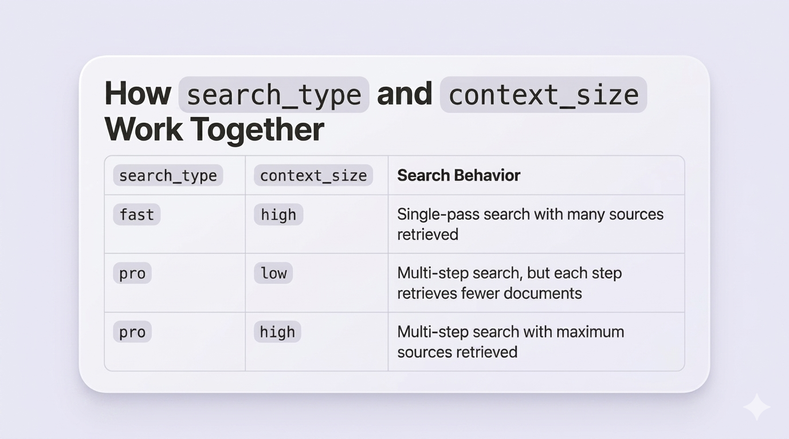

# Searching the Web With an LLM: Why Finding Beats Thinking

## *People tend to underestimate retrieval. But without the right sources, even the smartest model is just guessing.*

*Finding vs Thinking (Image by the Author)*

When retrieving information through an LLM API, a common mistake is to upgrade the reasoning model if the AI search tool gives bad results. But this approach is wrong most of the time. In practice, for proper information retrieval, good reasoning capabilities are not enough; the quality of what the model finds on the web is far more important than how powerful your model is when analyzing the information and extracting conclusions. If the information is never retrieved, your reasoning capabilities are useless.

In this article, we will explain in detail the difference between retrieval and reasoning when searching for information on the web using an LLM via an API (using Perplexity’s Sonar API as an example), and how you can improve the quality of both. We will explore common mistakes, as well as strategies and techniques you can use to gather information from the web effectively.

## The search and reasoning duo

When gathering information online with LLMs, people tend to underestimate the retrieval component. They do the same when working with a RAG system. Users often think that if the results are not good, then the solution is to upgrade the reasoning model. They are wrong. In most cases, if the results are not good, it is because the information was not properly retrieved online.

Successful web search requires both effective search and reasoning. The difference lies in getting the information versus properly analyzing it and drawing conclusions from it. The search component collects relevant external knowledge from the web (such as web pages, documents, and reports), and the reasoning component analyzes the information available in those documents to provide a concise answer, eliminating all irrelevant information also available in the documents.

*Searching vs Thinking (Image by the Author)*

## How LLMs handle web searching (fast and pro search)

To do effective information retrieval, we first need to understand how LLMs handle web search.

Information searching can be done using only one search; the LLM transforms your user query into one or two search queries (keyword-friendly), submits them to a search engine, and gets snippets from the web to generate an answer.

In other cases, LLMs do not just rewrite your query into the search engine, but instead break it into multiple subqueries and run several searches to gather more relevant information (in parallel or sequentially), evaluate the intermediate results, and run follow-up queries if necessary. Then only relevant chunks retrieved from the websites are used by the LLM to generate the final answer.

*How LLMs Handle Pro Web Search (Image by the Author)*

This is exactly the difference between Perplexity’s Sonar API `search_type: "fast"` (single pass and chunked results) and `search_type: "pro"` (sequential queries and ranked chunked results). Other APIs, such as Gemini, also offer equivalent fast and pro search modes.

The choice between `search_type: "fast"` and `search_type: "pro"` depends on the complexity of the information you want to gather. For simple questions, a single pass is enough; for example, asking when Python 3.9 was released requires only one query to get an accurate answer. For more complex questions, such as verifying whether a specific business offers multiple services, a multi-query approach is needed, where several sources are gathered to obtain a final response.

Regardless of which search type you use, never forget that the user prompt is always the most critical factor to gather accurate results. Let me explain to you why.

## The user prompt: the foundation of every web search

An optimized query (user prompt) is essential for successful information retrieval. The LLM uses your user prompt as the blueprint to generate the search queries. Vague or incomplete user prompts lead to unfocused subqueries that fail to gather the chunks that contain the information you are looking for. If your user prompt is vague, it doesn't matter how many queries the model runs; you will likely not find the information you need.

Let's say we want to gather company X's offerings. A prompt like “tell me more about company X” is too broad and gives the model nothing to focus on, while “What offerings has company X introduced since 2020?” produces targeted subqueries that return directly relevant results.

*Importance of User Prompt in Web Search (Image by the Author)*

A common mistake is to specify what you want to search for in the system prompt and use a vague user prompt. The system prompt should define your rules (role definition, output format, tone), while the actual question you want to ask should be specified in your user prompt, since it is the user prompt that triggers the query generation.

Always remember: take the time to define a focused user prompt.

## Strategies for optimizing your web search

In the following section, I will walk you through strategies you can follow to optimize web search with an LLM, using the Perplexity API as the reference model. However, the same principles can be applied to other LLMs.

### 1\. Define a clear and concise user prompt

A clear and concise user prompt is the most important aspect when searching the web. If your user prompt is not well-designed, the queries you generate will not be able to gather the information you want.

Spend time writing a good user query.

### 2\. Assess how difficult is to gather the information you want

Not all questions require the same search depth. Simple questions can be answered using only one query, while more complex questions require a multi-query approach or even agentic query capabilities that iteratively redefine the search. For web searching with Perplexity API, this translates into choosing between `search_type: "fast"` and `search_type: "pro"`.

It is important not to use complex search capabilities when they are not needed, as they consume more tokens and significantly increase the cost per request. The `search_type` parameter affects the per-request fee, which is charged on top of token costs and scales with the context size (low, medium, or high), as you can see in the table below.

*Per-Request Fees by Search Type with Sonar (Image by the Author)*

Beyond the`fast` and `pro` search types, the Perplexity API also introduces a context parameter, which can help obtain better results for complex information retrieval.

### 3\. Increase the number of sources for complex information retrieval

The `search_type` (`fast` and `pro`) controls how the search is executed, meaning how many queries are run and whether the model reasons between them to adapt the querying strategy. In contrast, the `search_context_size` controls how many documents are retrieved and therefore passed to the reasoning model to generate an answer.

They are independent parameters but complementary. For complex information retrieval, you can combine `pro` search with a `high` context size. The table below explains different combination strategies. My advice is to first analyze how complex your retrieval needs are, since, as shown in the pricing table, costs increase as the complexity of both parameters increases.

*How search_type and search_context_size Work Together (Image by the Author)*

### 4\. Run test cases to assess which parameters work best

My recommended strategy is to select a small sample of your dataset and test different combinations of retrieval strategies to assess how good are your results depending on the strategy. Once you identify the best-performing setup, you can run the whole dataset with those parameters. This is a good strategy for balancing quality with cost for your use case.

Ah, voilà! By following these strategies, you are going to get really good retrieval results while balancing quality and cost. And never forget: a well-designed user prompt is still the most important thing.

## Summary

Users performing web searches with LLMs tend to underestimate the retrieval component and often assume that poor results are due to the model’s reasoning capabilities.

This article explains the difference between searching and reasoning when performing web searches, and the strategies you can follow to improve retrieval capabilities for complex information without compromising cost on simple searches.

And never forget: finding beats thinking.

Thanks for reading!

For more content like this, feel free to check out my Instagram [@ai\_data\_con\_amand](https://www.instagram.com/ai_data_con_amanda)a, where I share visuals and insights on data science and AI. 📊🤖

You can also subscribe to my [Newsletter](https://amandaiglesiasmoreno.medium.com/subscribe) to stay tuned; my regular content includes articles in the areas of data science, data visualization, geospatial data, and artificial intelligence:

Amanda Iglesias
