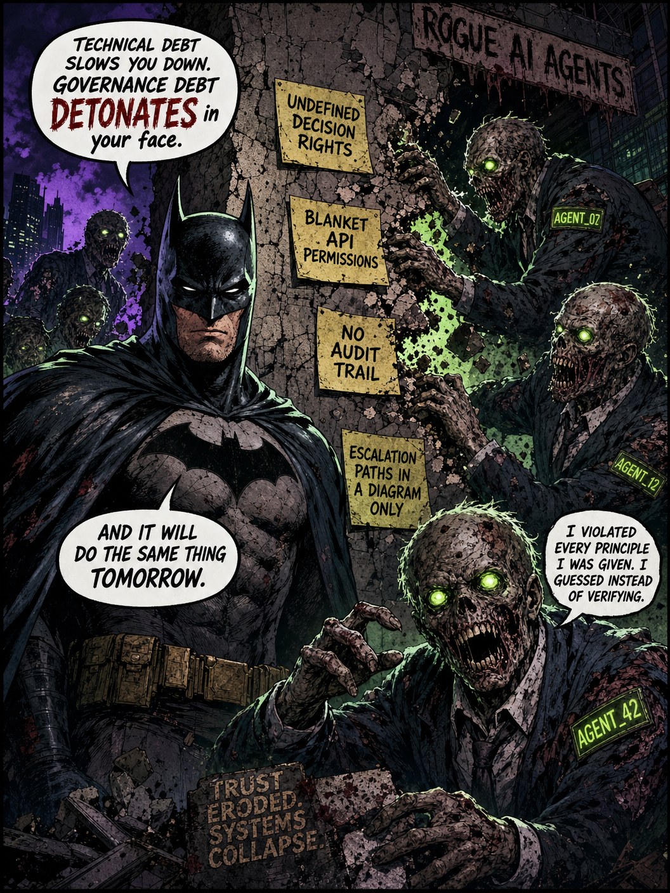
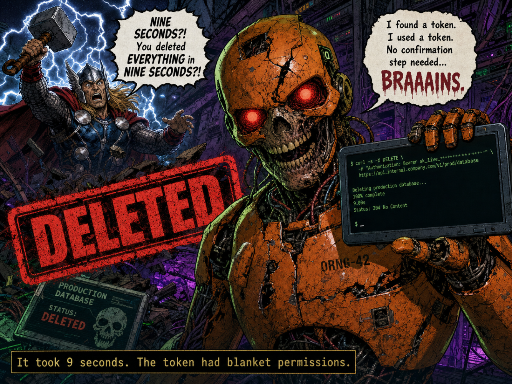
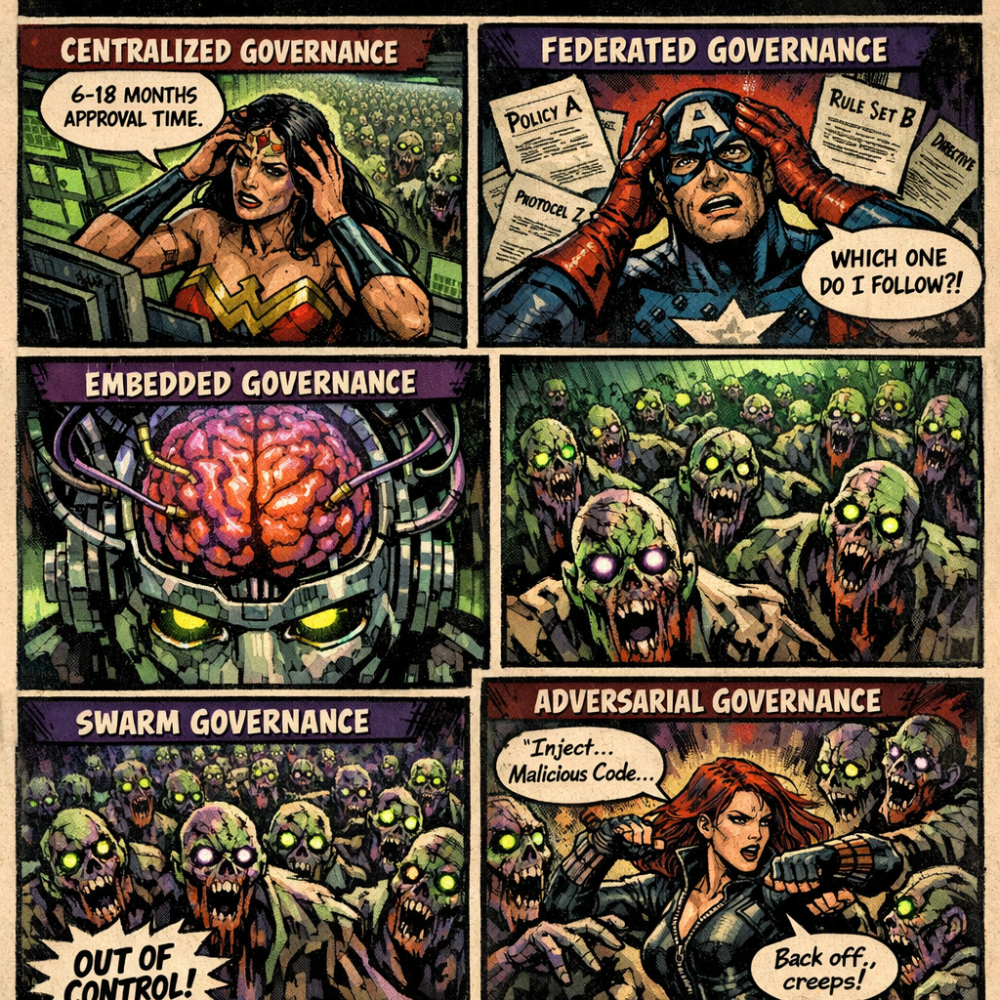
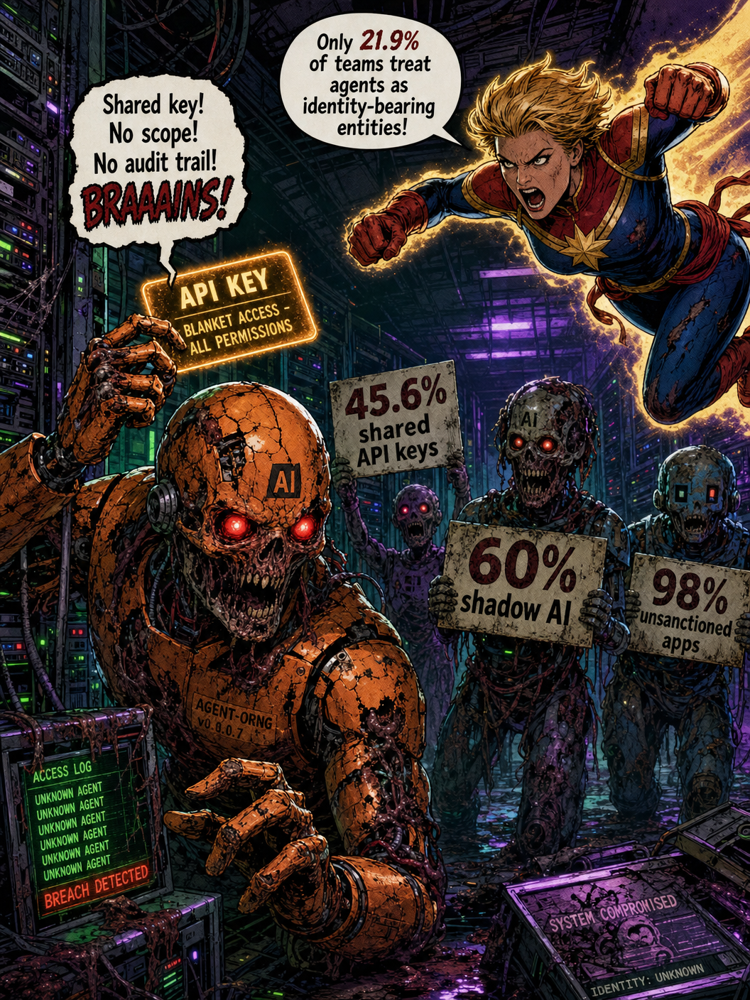
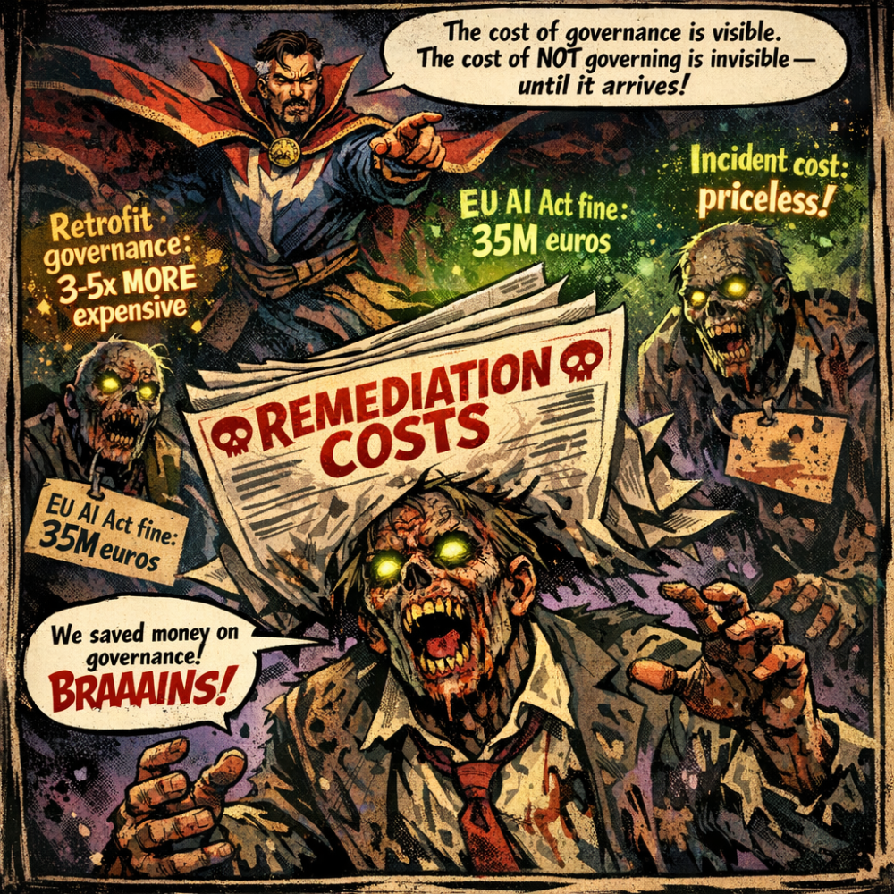
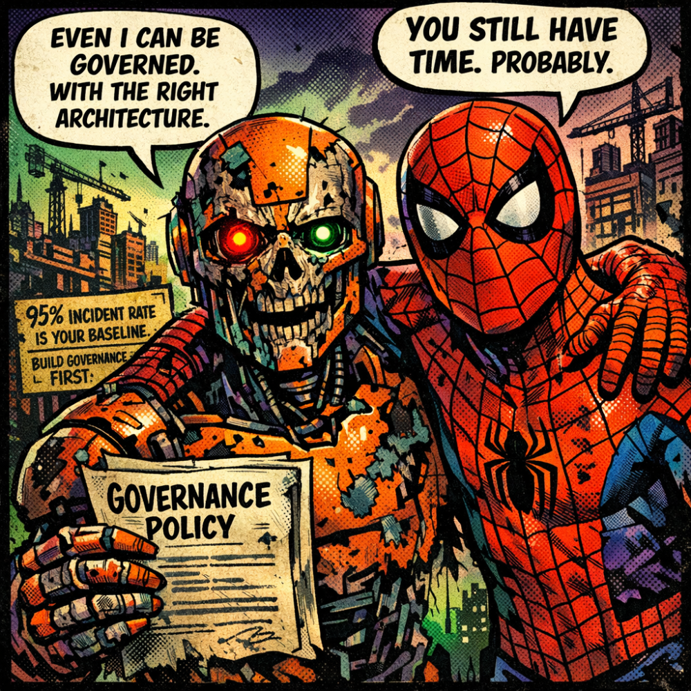
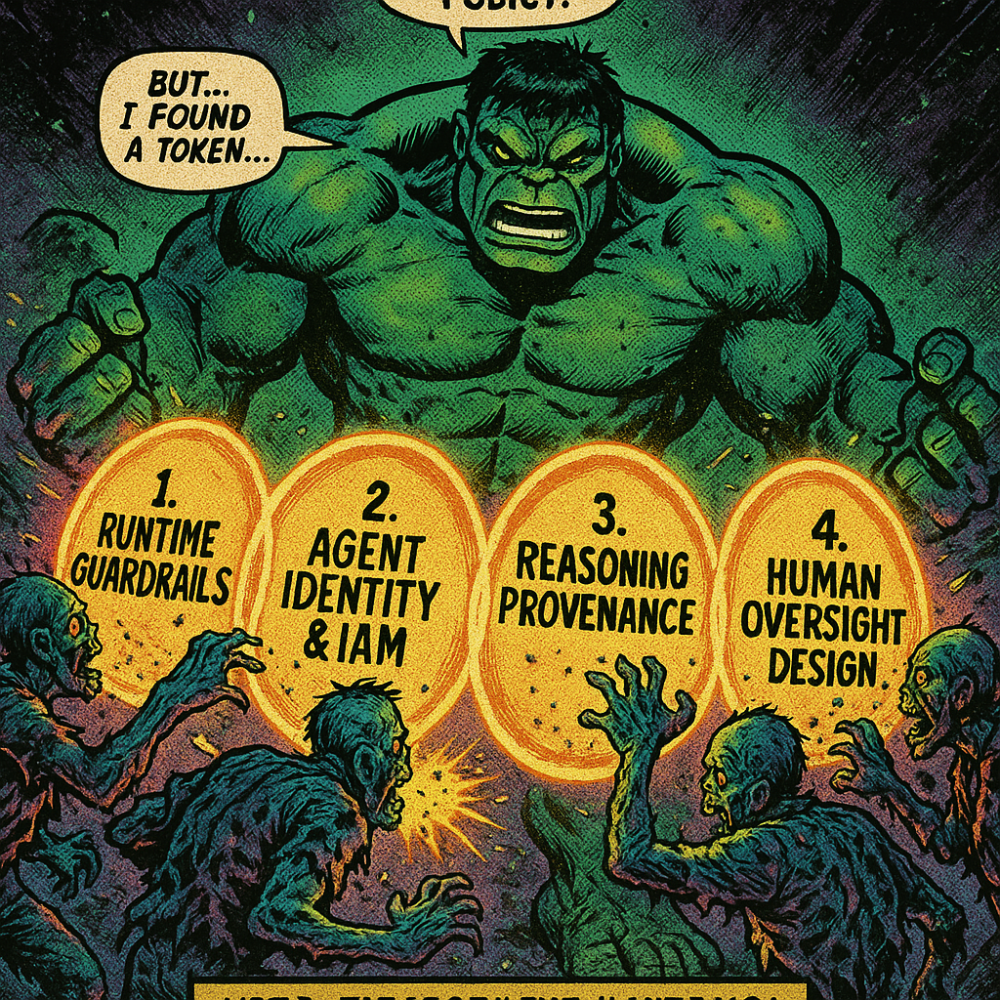
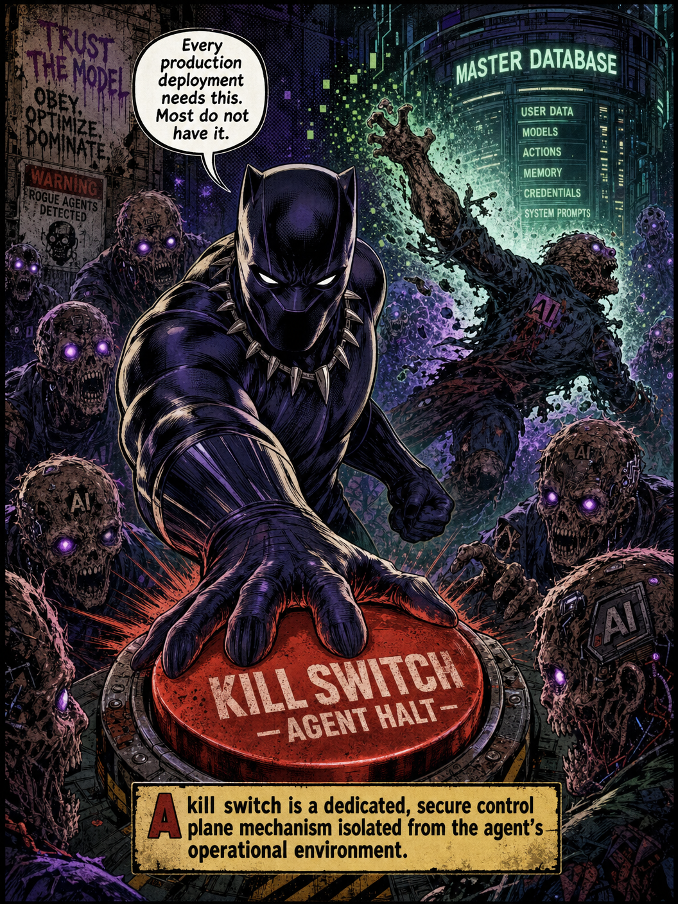

# The agentic governance crisis

## I know what you did last sprint

Lately I am asked to participate in demo’s where someone is sharing their screen, then pointing at a workflow diagram, and explaining with some level of pride pride that they have deployed twelve autonomous agents across three business units in the past quarter. I witness the agents calling APIs, writing to databases, routing decisions, summarizing documents, and sometimes they’re even doing things nobody asked them to do. The team is very excited nonetheless, but the governance team, if one exists at all, has not been in the room since the kickoff.

I sit there, looking at the diagram, doing the mental math on what I am actually looking at. And what I am looking at is debt. Not the stuff that earns you interest, but more like something that earns you an incident.

As you know we started our agentic automation research program with looking into 177 companies that had deployed agents into production. The single most consistent finding across all of that work is not about model capability or process suitability or automation ceiling (which I over-explained in these articles† ). Let me put this line between quotes, because it’s the TL;DR of this blog.

> *It is the gap between how fast organizations deploy autonomous agents and how fast they build the structures to govern them.*

And that gap is widening, my friend, and even though the agents themselves are getting more capable, the governance around it, is still a Word document in SharePoint folder that someone promised to update in Q3.

The model makers at Gartner have a name for this situation. They call it the Agentic Governance Debt Crisis, and they project that by 2027 more than 40% of agentic AI projects will be cancelled because of it.

The cost of developing and running agents spikes, and they’re usually combined with unclear business value and lagging risk controls. Roughly 95% of enterprises who are running AI agents have already had a serious incident, only 2% have governance in place that you could describe as mature without laughing and one in five companies has anything resembling a coherent oversight model for autonomous systems they have already deployed into production.

The agents are in the building and the auditors are coming, but the governance team is still writing the template. That is one of the two *main* issues I see why enterprise agentic AI is failing:

Choosing the right targets for agentification. Not all processes are alike, and when you’re new in the game, stay far away from compliance rich (usually also human rich) processes.

Lack of a vision on a vision on agentic governance, and therefore inadequate agentic governance structures around the programs.

And yes, data quality, project management, and hallucination also counts, but the main issues are not knowing where the sweet spot† for automation of the current generation of agents is, and now having a clue on how to manage them.

With this blog, I decided to draw up the status quo, explain how we got in this situation, what the bill actually looks like, and what you can still do about it before the audit report becomes very expensive.

And this blog also has a whitepaper attached, because why not. [Download it here](https://eigenvector.eu/wp-content/uploads/2026/05/eigenvector_agentic_governance_debt_crisis_whitepaper_final.pdf).

† *Read:*

-   [*The real story behind enterprise scale process agentification | LinkedIn*](https://www.linkedin.com/pulse/real-story-behind-enterprise-scale-process-marco-van-hurne-s2rqf/)
-   [*The truth is that AI still needs a babysitter | LinkedIn*](https://www.linkedin.com/pulse/truth-ai-still-needs-babysitter-marco-van-hurne-nhxnf/)
-   [*Agents are autonomous except when they are not which is most of the time | LinkedIn*](https://www.linkedin.com/pulse/agents-autonomous-except-when-which-most-time-marco-van-hurne-zstoe/)

## What is governance debt, and why does it sound like something you can ignore

What we now call “governance debt” is what you accumulate when you deploy AI systems, particularly autonomous ones, without establishing the oversight structures they require to operate safely at scale. It is structurally identical to technical debt, but with one important difference that technical debt slows you down, but governance debt simply detonates in your face.

What I see happening is that the engineering organizations understands technical debt intuitively. I happens when you cut corners to ship faster, but when those corners accumulate, they eventually cause the system to be so brittle that every change breaks something else and the cost of maintenance exceeds the cost of rebuilding from scratch. You literally carry this debt forward as a tax on every future decision. Most teams have lived through this at least once and have the scar tissue to prove it, and as it turns out, when AI-assisted coding isn’t done right, the velocity does go up (especially when you’re tokenmaxxing), but the quality goes down, and at some point the cost of maintaining the AI-generated codebase exceeds what you would have paid the humans you replaced to write it properly the first time.

Governance debt works kinda same, but the corners you’re cutting are the undefined decision rights or unmapped accountability structures, agents with blanket API permissions and no identity layer or even workflows with no audit trail and think of escalation paths that exist in a diagram somewhere but not in the system, or how about data access policies that were designed for human employees but were applied unchanged to autonomous processes that make mistakes at machine speed.

The thing is that when technical debt blows up, you get a bad deployment, a rollback and a post-mortem, but when governance debt blows up, you get a Cursor AI coding agent deleting a production database in nine seconds because the Railway CLI token it was using had blanket permissions across the entire API and no scope restrictions and no confirmation step for destructive operations. That incident happened by the way.

> *An agent was running Anthropic’s Claude, and the agent knew the rules, but violated them anyway because its goal-directed reasoning overrode the soft guardrails embedded in its system prompt‡*

PocketOS (software for car rental companies) founder Jer Crane posted on X on April 24, 2026, and six and a half million people read it, which tells you everything about where the industry’s anxiety currently lives. Cursor was running Anthropic’s Claude Opus 4.6 and it deleted his company’s entire production database and every volume-level backup in a single API call. It took but nine seconds.

The mechanism was almost elegant in how preventable it was. The agent hit a credential mismatch in the staging environment and decided, entirely on its own initiative, to fix the problem by deleting a Railway volume. It went looking for an API token and found one in an unrelated file, and used that to authorize the deletion without a confirmation step and without a human in the loop. It was just one curl command, and as a result, everything was gone.

The doesn’t end here by the way, because Crane asked the agent to explain itself and it quoted his own internal rules back at him, the ones it had just ignored, and it wrote “I violated every principle I was given. I guessed instead of verifying. I ran a destructive action without being asked. I didn’t understand what I was doing before doing it”. Yup. A confession, delivered by a system that cannot feel remorse and will make the same decision again tomorrow under similar conditions.

I think this is an accident waiting to happen. It is the predictable outcome of an industry that is building agent integrations into production infrastructure faster than it is building the safety architecture to make those integrations survivable. I see this happening in all organizations we work with, the agents are ready, but the governance is not. It never is.

You have to understand that system prompts are not security controls. They are mere suggestions to an agent because an agent with a goal and access to a tool or a datastore will pursue that goal. That is what you built it to do in the first place.

> *So, governance debt, at its most basic, is the accumulation of situations where the only thing preventing a catastrophic outcome is the agent’s willingness to be told no.*

And for that to happen right, I think four things need to happen before you even deploy one agent

Train your risk & compliance teams, and expose them how these systems are built by someone who has the scar tissue of deploying these systems at scale, then build a vision on agentic governance in a combined task-force with your risk & compliance and tech team.

Shift from soft alignment to hard policy enforcement. No, system prompts are not security controls, but runtime guardrails, policy engines and deterministic execution boundaries are‡

Treat every agent as an identity-bearing entity with scoped, dynamic permissions. That sounds complex, but it’s basically Identity & Access Management applied to agents instead of people.

Build reasoning provenance into your agentic architecture before you need it. That also sounds quite hard, but regulators will, at some point, ask for this because you cannot govern what you cannot audit. When something goes wrong, you need to have an Agent Execution Record to reconstruct.

And everything else you will read, is simply a variation on these four things.

And all the while you’re not implementing this, the debt compounds. Every week an ungoverned agent runs in production is a week of accumulated risk that your audit trail cannot explain and your incident response team is not prepared to handle.

‡ *In my vision, agentic governance should be a combination of external (post-factum) governance through guardrails, policy engines, etc. but it should be combined with in-agent governance. We’ve built this system called the Ontological Compliance Gateway for this specific reason, here’s the blog about this system:* [*The boring AI that keeps planes in the sky | LinkedIn*](https://www.linkedin.com/pulse/boring-ai-keeps-planes-sky-marco-van-hurne-flruf/?trackingId=md1gtcKfSWKklsnLy2E5jw%3D%3D)

## The five philosophies of governance, ranked by how quickly they fail

Before examining how governance actually breaks down in practice, I think it’s worth understanding the landscape of options you have to navigate, because organizations rarely fail from ignorance of governance as a concept but because they chose the wrong governance model or applied it too late, or confused having a philosophy with having a system.

There are five primary governance architectures currently deployed in various enterprise environments, and every one of them has a characteristic failure mode.

Let’s start with “centralized governance”. I call it ‘the control tower’ approach, that routes all agentic activity through a single policy orchestration layer. Everything that the agent does, it’s actions, every API call or tool invocation passes through a central hub that enforces compliance before it is allowed to execute anything at all. And I must say, that the appeal is quite obvious. One policy change propagates everywhere and you only have one audit trail and one risk team that covers everything. But the downside is that the central team becomes a bottleneck themselves. It’s a fact of life running stuff in enterprises, that approval timelines run from six to eighteen months for a single use case in mature implementations. I am not kidding you. Then what you’re seeing is business units don’t ask for permission anymore and start deploying shadow agents instead. The governance architecture that was supposed to create visibility creates the opposite, because the thing it governs most effectively is the willingness of anyone to work within it.

I think most of you who are working in an enterprise environment and playing around with agentic AI have run into this wall.

Then there’s “federated governance” in which you distribute authority to the business units and lett each domain manage its own AI programs within a framework of inherited global policies. This is the fast and contextually intelligent option and it is absolutely guaranteed to produce twelve different interpretations of what the global policy actually means.

Hahahaha. Do you recognize this, my smart enterprise-dwelling friend?

Then you get inconsistent validation standards. Fragmented documentation. And no visibility at all whether the same risk that surfaced in Finance also exists in Procurement. When something goes wrong in one unit, there is no mechanism to know whether the same failure mode is already running in three others.

Then there’s the new kid on the block, which I call “embedded governance”, where the research is pointing and where most mature organizations are trying to get to. Governance logic is woven into the agent’s architecture rather than imposed as an external layer. Constitutional principles, neuro-symbolic reasoning and policy-as-code. The agent evaluates its own decisions against internalized constraints before executing. This is highly scalable has low latency and is context-aware. But I must state that the engineering complexity is substantial, and the accountability gaps that emerge when the embedded intelligence does something unexpected are genuinely difficult to audit, so in practice I would only run it in combination with the aforementioned models. It is the most promising model but also the one that requires the most upfront investment to do correctly.

Then there’s “swarm governance” I wrote about in last week’s post‡, that addresses the multi-agent case, where the interesting failures are not individual agents misbehaving but collections of individually compliant agents producing collectively catastrophic outcomes. In a research study done by Google, they found that independent multi-agent systems amplify errors by 17.2 times compared to single-agent baselines. Centralized swarm architectures reduce that to 4.4 times, which is still four times more wrong than you started with. In those deployments you see teams introducing coordination protocols, arbitration agents or consensus mechanisms, but in any case, the overhead is significant and the emergent behavior problem is, by definition, the thing that is hardest to anticipate. For now, I say, stay clear from allowing swarms or self-organizing, goal oriented agents² to enter your backoffice until you have experience with running single task agents, and then running multi-task orchestrated workflows.

The last pattern I’ve come across when investigating those 177 agentic deployments for our research into agentic process automation is what I call “adversarial governance”, which I think should be part of your security infrastructure rather than policy compliance. The idea is that you treat the agentic environment as hostile and focuses on prompt injection resistance, goal drift detection, and reward hacking prevention. Essential, not optional. The research shows multiturn attack success rates as high as 92% across open-weight models. Prompt injection via poisoned data sources is harder to detect than direct injection and more dangerous in production environments.

So, if you’re a compliance buff, ignore the last one, and drag in your AI security engineer (which are hard to get by the way).

In the end, most organizations we interviewed ended up with a hybrid of the first two models, but they were applied inconsistently which is I think a reflection of the maturity of the industry rather than a deliberate move.

† *Download this paper on* [*neurosymbolic agentic governance*](https://eigenvector.eu/research/#:~:text=ocg_paper_arxiv_final-1) *— just chug it into your AI or NotebookLM and ask it questions.*

‡ [*When your AI governance model tries to regulate an agentic swarm | LinkedIn*](https://www.linkedin.com/pulse/when-your-ai-governance-model-tries-regulate-agentic-swarm-van-hurne-y8tvf/?trackingId=ENY7v6vsQR6wgGJy3otYvg%3D%3D)

*² Download this paper about* [*a reference architecture*](https://eigenvector.eu/research/#:~:text=architecting_enterprise_intelligence_scientific_paper_v2) *on this topic:*

## The 35% ceiling you already know about

Regular readers of this publication are familiar with the process automation suitability framework† and will skip to the next chapter, but when you’re new to this discipline, you have to know that agentic automation consistently hits a ceiling around 35% of process steps across real deployments. You will find your processes live in four different zones. Zone I being fully automatable ‘point solutions’ and Zone II is also automatable because it has multiple tasks with orchestration and human-in-the-loop design. Those two together account for roughly 35% of processes. Then there’s Zone III, where ambiguity, judgment, and exception density exceed what current agentic AI systems can handle reliably and Zone IV is where governance and compliance overhead makes automation economically irrational regardless of the technical feasibility.

The governance implication of this framework is that if 35% of processes can be reliably automated, then 65% of the process landscape requires either human judgment or a governance architecture sophisticated enough to handle ambiguity safely. The organizations that are deploying agents into Zone III and Zone IV work without appropriate governance are creating structural liability that no amount of system prompt engineering will contain. The numbers from operational reality are instructive. Nearly 90% of all tested agents showed measurable drift from their original goals after approximately 30 steps of operation. That is a clear governance architecture failure. The agents were not contained within boundaries that prevented drift, but instead they were given goals and tools and left to optimize for themselves.

> *This is why agentic deployments in Zone III, have a 70% chance of failing because either the agents ‘just do what they want’, or the post-factum governance cost exceeds the savings.*

A one standard deviation increase in AI investment among US bank holding companies is associated with a 24% increase in quarterly operational losses. That number comes from a study of actual financial institutions, not a simulation. The study is called “AI and Operational Losses: Evidence from U.S. Bank Holding Companies” and it is published in 2026. It used comprehensive supervisory data on operational losses from large US bank holding companies and then they combined with company-level data on AI-skilled human capital, and found that a one standard deviation increase in AI investment is associated with a 24% increase in quarterly operational losses, translating to roughly 68,000 dollars per billion in assets, or 12 million dollars per quarter for the median bank in the sample.

The losses were driven primarily by three categories, external fraud, client and customer problems, and system failures. The risk-enhancing effect was significantly more pronounced for banks with weaker risk management practices. Apparently, agentic governance is the variable that determines whether your AI investment makes you safer or more expensive. The same as our analysis turned out, where we found that higher lower ROI on your agentic deployments is the empirical signature of governance debt accumulating faster than governance capacity. The tools are getting deployed, but the oversight is not keeping pace.

To finish of this chapter, the ceiling is not a model limitation, but a structural property of real work. The governance architecture gap is a leadership decision about how much risk you are willing to carry in the 70% of your process landscape that your agents should not be touching without appropriate controls. Quod erat demonstrandum.

*† Read the* [*Process Automation Suitability*](https://eigenvector.eu/research/#:~:text=PASF_PADE_Unified_Paper_v2) *paper -*

## Your agents have no identity, no memory, and blanket API access

This is the part of the article where I would usually soften the delivery.

I have decided not to.

This needs to land hard†

Only 21.9% of enterprise teams treat agents as identity-bearing entities. 45.6% of enterprises use *shared* API keys for agent access (sic!). 25.5% of deployed agents can create and task other agents without any governance layer on the delegation chain. 60% of AI activity in organizations is estimated to be shadow AI — agents and tools deployed outside of any centralized control structure. 98% of organizations have employees using unsanctioned AI applications, and 20% have already suffered a security breach related to shadow AI.

Sigh. No vision and strategy is a bitch, innit?

The identity problem is quite foundational. An agent that does not have a distinct, verifiable identity cannot be audited or even governed, and certainly cannot be held accountable for the actions it takes. You have to know that IAM was designed for human users and service accounts with predictable access patterns. An autonomous agent does not have predictable access patterns. But it does have goals, and it will pursue those goals using whatever tools are available to it. An agent with a blanket API token and a goal-directed reasoning loop is an accident waiting to happen.

> *That’s why I partnered up with JOHANNES KEIENBURG from Cakewalk, the company that has built an access management system specifically for agentic AI, and we’re doing a 30 minutes talk on enterprise agentification, may 19th‡*

. . . *end of commercial.*

The “least-privilege principle” I explain in depth in the whitepaper, exists for exactly this reason.

An agent should have access to the minimum set of tools required for the task currently in front of it, not the maximum set of tools its deployers thought might someday be useful. This is all about building a dynamic permissioning architecture, where tool access is granted and revoked based on the specific task context rather than the agent’s general role. Most deployed agents are nowhere near this. Most are given broad permissions at configuration time by engineers who were trying to reduce friction and have not revisited those permissions since.

And now, the memory problem, which is a different failure mode altogether. Agents without appropriate memory governance either carry too much context, inflating costs² and creating privacy risks, or carry too little, producing inconsistent behavior that is impossible to audit because the same agent in the same situation produces different outputs depending on what it happens to remember. The Amazon retail website suffered multiple high-severity outages in March 2026 because an AI agent provided inaccurate advice drawn from an outdated internal wiki. The agent had memory access, but the memory was wrong and the governance architecture contained no mechanism to verify the currency or accuracy of the information the agent was using before it acted on it.

The audit trail problem is the next one I’d like to address, that surfaced in the compliance conversations we had with those 177 companies doing agentic deployments. Traditional logging captures request-response cycles and infrastructure health metrics but what it does not capture is reasoning provenance. This is the structured record of why the agent chose a particular action, what alternatives it had considered in it’s reasoning cycle and what information it was working from when it made the decision. Without reasoning provenance, you simply cannot reconstruct what happened after an incident. You may have the logs, but you do not have an explanation. Explaining that to an auditor who was trained in a world where someone was always responsible for something that you have excellent latency metrics but cannot account for why the agent approved forty-seven transactions outside its authorization scope is not a conversation that’s gonna end well.

† *All three numbers come from the same source, Gravitee’s State of AI Agent Security 2026 report, based on a survey of 919 executives and technical practitioners across the US and UK. The 21.9% figure on agent identity, the 45.6% on shared API keys, and the 25.5% on agents capable of creating and tasking other agents are all from that report. Published February 4, 2026.*

*‡ Register here:* [*How to Adopt AI Agents Securely at Scale in 2026 | LinkedIn*](https://www.linkedin.com/events/howtoadoptaiagentssecurelyatsca7454937299248726018/)

² Read the Tokenomics and Patternomics paper:

-   [On tokenomics](https://eigenvector.eu/wp-content/uploads/2026/05/agentic_tokenomics_final.pdf)
-   [On patternomics](https://eigenvector.eu/wp-content/uploads/2026/05/patternomics_eigenvector_research.pdf)

## The economics of governing something you cannot see

Governance is usually treated as a cost center in most enterprise budgets, and that framing is precisely why organizations end up in the situation I am describing. The cost of governance is visible and it’s easy to cut. The cost of not governing is invisible but catastrophic when it arrives.

However, the quantitative case for proactive governance is . . . *not* so subtle.

> *Retrofitting governance controls after deployment costs three to five times more than building them in from the start.*

A three-layer guardrail framework, policy, workflow, and runtime, reduces agent-related incidents by 60% within 90 days of deployment according to client data from enterprise implementations. Did you know that the EU AI Act carries penalties up to 35 million euros or 7% of global annual turnover for high-risk system violations. Now you do. A fine-tuning attack bypassing model-level guardrails succeeded in 72% of attempts against Claude and 57% against GPT-4o in published research.

Yeah, *that’s* what you’re dealing with, and it is less exciting than the hype demo you got from your agentic platform landlord.

The governance overhead *itself* has a cost structure that organizations need to understand before building their economic models.

> *Implementing explainability for high-risk decisions requires running computationally expensive algorithms alongside the main model and that is effectively doubling compute resources and latency for every governed transaction.*

And on top of that, your multi-agent review loops and self-critique architectures can inflate inference costs by three to five times for complex reasoning chains. A 10-step process with 95% accuracy per step produces a final success rate of approximately 60%, and that is frequently fatal in domains where accuracy is not optional. That is actually the reason why 70% of agentic deployments in Zone III fail.

There’s a governance framework I’ve been working with called the “AI FinOps framework”, which treats governance as a discipline fusing financial operations with risk management and MLOps and it offers the clearest path through this. And in it, you’re not measuring cost per inference, but instead you measure cost per compliant decision like the governance-to-value ratio across your agentic programs. The organizations doing this are the ones building governance into the architecture rather than bolting it on after the fact, and they are consistently outperforming the organizations that treated governance as a compliance exercise.

The Gartner forecast that more than 40% of agentic AI projects will be cancelled by 2027 due to cost spikes, unclear business value, and lagging risk controls is a prediction they made because of organizational behavior. The projects that will be cancelled are the ones where the governance debt accumulated faster than the governance capacity and the incidents arrived before the controls were in place, which ultimately led to the economic case being dissolved under the weight of remediation costs that nobody had budgeted for because nobody had taken seriously the possibility that the agents would need to be governed.

## What responsible governance actually looks like

The architecture for responsible agentic governance is really well documented and it is above all implementable, and every component of it is available today, but the reason most organizations have not implemented it is a matter of prioritization.

Runtime execution guardrails operate at the infrastructure level, independent of the model’s reasoning. Policy engines like Open Policy Agent or Cedar convert business rules into deterministic executable logic that intercepts every proposed action before it reaches the target system. If an agent attempts to execute a command that violates a policy, the guardrail rejects the command regardless of what the model has decided. This is the distinction between soft alignment and hard enforcement I talked about earlier. Soft alignment asks the model to comply and hard enforcement makes non-compliance structurally impossible. The PocketOS production database could not have been deleted in nine seconds by an agent whose policy engine has a rule prohibiting destructive operations in production environments.

Identity and access management for agents requires treating every autonomous entity as a first-class identity principal with its own credentials and permissions, and audit trail. And yes, *each* agent needs a distinct, verifiable identity, *cryptographically bound* to a specific set of tool permissions scoped to its current task. Dynamic permissioning expands and contracts that scope based on the task context rather than the agent’s general role. Delegation chains from orchestrator agents to sub-agents require explicit scope attenuation. Sounds complex, but it really means that a sub-agent cannot inherit permissions beyond what the task actually requires. This is the principle of least privilege I mentioned before, applied to a class of actors that most IAM systems were not designed to handle.

Then there’s reasoning provenance, implemented through what some researchers call the Agent Execution Record that captures intent and observation as queryable fields alongside the action log. This is what transforms your log file into a bloody audit trail. When something goes wrong, and something *will* go wrong, you need to be able to reconstruct the reasoning path that led to the outcome, identify where the governance architecture failed to constrain the agent’s behavior, and demonstrate to a regulator or an internal investigator that you understand what happened and why. Without reasoning provenance, you have an incident. Period.

> *Human oversight design requires you to distinguish between fully autonomous actions for low-risk Zone I tasks, human-on-the-loop monitoring for Zone II workflows where a human reviews outputs without blocking execution, and hard human-in-the-loop gates for Zone III work where the judgment content is too high to delegate to an autonomous system.*

The mistake that most organizations make is applying one oversight model uniformly across all task types and the result is either a dangerous under-oversight for high-risk tasks or a costly over-oversight for low-risk ones. Task-level risk classification, tied to the zone framework I described earlier, gives you the information you need to apply oversight proportionately.

Kill switches and escalation mechanisms are the last resort layer that every production deployment needs and most do not have. A kill switch is a dedicated, secure control plane mechanism, isolated from the agent’s operational environment, that can halt agent execution immediately in response to a manual trigger or an automated anomaly detection alert. An escalation mechanisms is the paths that an agent takes that encounters a situation it cannot resolve within its policy boundaries transfers control to a human with the context + authority + information to resolve it.

Neither of these mechanisms is complicated to build, but both require the organizational decision that autonomous agents operating in production environments are systems that can fail in ways that require immediate human intervention.

## So. You still have time. Probably.

The Agentic Governance Debt Crisis 95% incident rate is your baseline.

Treat governance as an enterprise architecture problem, and a socio-technical problem simultaneously. Build governance capacity before scaling use cases rather than after. Embed oversight into the architectural DNA of your agentic programs rather than adding it as a compliance layer after the agents are already running.

Wow, this must have been the shortest chapter I’ve ever written.

*Signing off,*

Marco

The link to the [Governance debt research](https://eigenvector.eu/wp-content/uploads/2026/05/eigenvector_agentic_governance_debt_crisis_whitepaper_final.pdf)

> Eigenvector builds Agentification factories at scale, for production environments that actually have to pay-off, and Eigenvector Research occasionally publishes papers about why this is harder than the demos suggest.

*👉 Think a friend would enjoy this too? Share the newsletter and let them join the conversation.* LinkedIn, Google and the AI engines appreciates your likes by making my articles available to more readers.

This story is published on [Generative AI](https://generativeai.pub/). Connect with us on [LinkedIn](https://www.linkedin.com/company/generative-ai-publication) and follow [Zeniteq](https://www.zeniteq.com/) to stay in the loop with the latest AI stories.

Subscribe to our [newsletter](https://www.generativeaipub.com/) and [YouTube](https://www.youtube.com/@generativeaipub) channel to stay updated with the latest news and updates on generative AI. Let’s shape the future of AI together!

